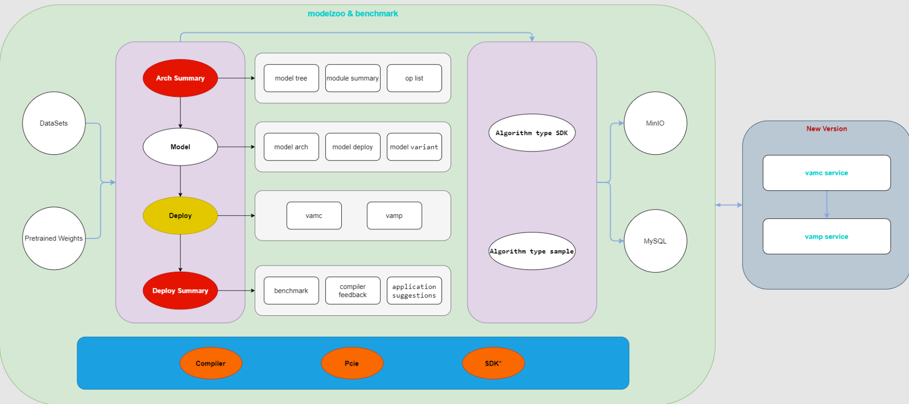

---

`VastModelZOO`是瀚博半导体维护的AI模型平台，提供了人工智能多个领域（CV、AUDIO、NLP、LLM、MLLM等）的开源模型在瀚博训推芯片上的部署、训练示例。

`VastModelZOO`旨在基于瀚博半导体的硬件产品和软件SDK，展示最佳的编程实践，以达成模型的快速移植和最优性能。

为方便大家使用`VastModelZOO`，我们将持续增加典型模型和基础插件。如果您有任何需求，请提交`issues`，我们会及时处理, 谢谢！

[TOC]

## 依赖软件
- 瀚博训推软件生态链：[vastai_software.md](docs/vastai_software.md)
- 瀚博推理引擎类型：
    - Build_In: 瀚博自研软件栈推理引擎
    - PyTorch: VACC Extension for PyTorch插件

## 模型列表

CV Models

- object detection

|  model |    codebase    |  model list |    model type | runtime |
| :------: | :------: | :------: | :------: | :-----: |
| [yolov10](./cv/detection/yolov10/README.md) | [yolov10](https://github.com/THU-MIG/yolov10.git) |  
 
model name
<ul><li align="left">YOLOv10-N</li><li align="left">YOLOv10-S</li><li align="left">YOLOv10-M</li><li align="left">YOLOv10-B</li><li align="left">YOLOv10-L</li><li align="left">YOLOv10-X</li></ul>
 |  object detection   |  Build_In | 
| [yolov8](./cv/detection/yolov8/README.md) | [yolov8](https://github.com/ultralytics/ultralytics) |  
 
model name
<ul><li align="left">YOLOv8n</li><li align="left">YOLOv8s</li><li align="left">YOLOv8m</li><li align="left">YOLOv8b</li><li align="left">YOLOv8l</li><li align="left">YOLOv8x</li></ul>
 |  object detection   |  Build_In | 
| [yolov7](./cv/detection/yolov7/README.md) | [yolov7](https://github.com/WongKinYiu/yolov7) |  
 
model name
<ul><li align="left">YOLOv7</li><li align="left">YOLOv7x</li><li align="left">YOLOv7-w6</li><li align="left">YOLOv7-e6</li><li align="left">YOLOv7-d6</li><li align="left">YOLOv7-e6e</li></ul>
 |  object detection   |  Build_In |
| [yolov6](./cv/detection/yolov6/README.md) | [yolov6](https://github.com/meituan/YOLOv6) |  
 
model name
<ul><li align="left">YOLOv6-n</li><li align="left">YOLOv6-tiny</li><li align="left">YOLOv6-s</li>
 |  object detection   |  Build_In |  
| [Yolov5](./cv/detection/yolov5/README.md)  |  [pytorch(u)](https://github.com/ultralytics/yolov5/tree/v6.1)   | 
 
model name
<ul><li align="left">yolov5n</li><li align="left">yolov5s</li><li align="left">yolov5m</li><li align="left">yolov5l</li><li align="left">yolov5x</li><li align="left">yolov5n6</li><li align="left">yolov5s6</li><li align="left">yolov5m6</li><li align="left">yolov5l6</li><li align="left">yolov5x6</li></ul>
 |   object detection   |   Build_In  |
| [Yolov5](./cv/detection/yolov5/README.md)  |  [mmyolo](https://github.com/open-mmlab/mmyolo/tree/v0.1.3/configs/yolov5)   | 
 
model name
<ul><li align="left">yolov5n</li><li align="left">yolov5s</li><li align="left">yolov5m</li><li align="left">yolov5l</li><li align="left">yolov5n6</li><li align="left">yolov5s6</li><li align="left">yolov5m6</li><li align="left">yolov5l6</li></ul>
  |   object detection   |  Build_In   |
|  [Yolov4](./cv/detection/yolov4/README.md)   | [darknet](https://github.com/AlexeyAB/darknet)  |  
 
model name
<ul><li align="left">yolov4</li><li align="left">yolov4_tiny</li><li align="left">yolov4_csp</li><li align="left">yolov4_csp_swish</li><li align="left">yolov4_csp_x_swish</li><li align="left">yolov4x_mish</li></ul>
  |   object detection   |  Buid_In    |
|  [Yolov4](./cv/detection/yolov4/README.md)   | [bubbliiiing](https://github.com/bubbliiiing/yolov4-pytorch)    |    
 
model name
<ul><li align="left">yolov4</li><li align="left">yolov4_tiny</li></ul>
    |   object detection   |  Buid_In   |
|  [Yolov4](./cv/detection/yolov4/README.md)   | [tianxiaomo](https://github.com/Tianxiaomo/pytorch-YOLOv4) | 
 
model name
<ul><li align="left">yolov4</li></ul>
  |   object detection   |   Buid_In    |
|  [Yolov3](./cv/detection/yolov3/README.md)   |  [pytorch(u)](https://github.com/ultralytics/yolov3/tree/v9.5.0)  | 
 
model name
<ul><li align="left">yolov3</li><li align="left">yolov3-spp</li><li align="left">yolov3-tiny</li></ul>
 |   object detection   |   Buid_In    |

Text2Vec Models

|  model |    codebase    |  model list |    model type | runtime |
| :------: | :------: | :------: | :------: | :-----: |
| [bge](./text2vec/bge/README.md) | [huggingface](https://huggingface.co/BAAI) |  
 
model name
<ul><li align="left">bge-m3</li><li align="left">bge-small-en-v1.5</li><li align="left">bge-base-en-v1.5</li><li align="left">bge-large-en-v1.5</li><li align="left">bge-small-zh-v1.5</li><li align="left">bge-base-zh-v1.5</li><li align="left">bge-large-zh-v1.5</li></ul>
 | Embedding model  |  Build_In | 
| [bce](./text2vec/bce/README.md) | [huggingface](https://huggingface.co/maidalun1020/bce-embedding-base_v1) |  
 
model name
<ul><li align="left">bce-embedding-base_v1</li></ul>
 | Embedding model  |  Build_In |

|  model |    codebase    |  model list |    model type | runtime |
| :------: | :------: | :------: | :------: | :-----: |
| [bge]((./text2vec/bge/README.md)) | [huggingface](https://huggingface.co/BAAI/) |  
 
model name
<ul><li align="left">bge-reranker-base</li><li align="left">bge-reranker-large</li><li align="left">bge-reranker-v2-m3</li></ul>
 | Reranker model  |  Build_In |
| [bce](./text2vec/bce/README.md) | [huggingface](https://huggingface.co/maidalun1020/bce-reranker-base_v1) |  
 
model name
<ul><li align="left">bce-reranker-base_v1</li></ul>
 | Reranker model  |  Build_In |

LLM Models

|  model |    codebase    |  model list |    model type | runtime |
| :------: | :------: | :------: | :------: | :-----: |
| [LLaMA](./llm/llama/README.md) |   [huggingface](https://huggingface.co/meta-llama)    |   
 
model name
<ul><li align="left">meta-llama-33b</li></ul>
   | large language model |   Build_In/PyTorch   |
| [LLaMA-2](./llm/llama2/README.md) |   [huggingface](https://huggingface.co/meta-llama)    |   
 
model name
<ul><li align="left">Llama-2-7b-hf</li><li align="left">Llama-2-7b-chat-hf</li><li align="left">Llama-2-13b-hf</li><li align="left">Llama-2-13b-chat-hf</li><li align="left">Llama-2-70b-hf</li><li align="left">Llama-2-70b-chat-hf</li></ul>
   | large language model |   Build_In/PyTorch   |
| [LLaMA-3](./llm/llama3/README.md) |   [huggingface](https://huggingface.co/meta-llama)    |   
 
model name
<ul><li align="left">Meta-Llama-3-8B</li><li align="left">Meta-Llama-3-8B-Instruct</li><li align="left">Meta-Llama-3-70B</li><li align="left">Meta-Llama-3-70B-Instruct</li></ul>
   | large language model |   Build_In/PyTorch   |
| [LLaMA-3.1](./llm/llama3/README.md) |   [huggingface](https://huggingface.co/meta-llama)    |   
 
model name
<ul><li align="left">Meta-Llama-3.1-8B</li><li align="left">Meta-Llama-3.1-8B-Instruct</li><li align="left">Meta-Llama-3.1-70B</li><li align="left">Meta-Llama-3.1-70B-Instruct</li></ul>
   | large language model |   Build_In/PyTorch   |
| [LLaMA-3.2](./llm/llama3/README.md) |   [huggingface](https://huggingface.co/meta-llama)    |   
 
model name
<ul><li align="left">Llama-3.2-1B</li><li align="left">Llama-3.2-1B-Instruct</li><li align="left">Llama-3.2-3B</li><li align="left">Llama-3.2-3B-Instruct</li>
   | large language model |   Build_In/PyTorch   |
| [LLaMA-3.3](./llm/llama3/README.md) |   [huggingface](https://huggingface.co/meta-llama)    |   
 
model name
<ul><li align="left">Llama-3.3-70B-Instruct</li></ul>
   | large language model |   Build_In/PyTorch   |
| [Qwen1.5](./llm/qwen1.5/README.md) |   [huggingface](https://huggingface.co/Qwen)    |   
 
model name
<ul><li align="left">Qwen1.5-0.5B</li><li align="left">Qwen1.5-0.5B-Chat</li><li align="left">Qwen1.5-1.8B</li><li align="left">Qwen1.5-1.8B-Chat</li><li align="left">Qwen1.5-4B</li><li align="left">Qwen1.5-4B-Chat</li><li align="left">Qwen1.5-7B</li><li align="left">Qwen1.5-7B-Chat</li><li align="left">Qwen1.5-14B</li><li align="left">Qwen1.5-14B-Chat</li><li align="left">Qwen1.5-32B</li><li align="left">Qwen1.5-32B-Chat</li><li align="left">Qwen1.5-72B</li><li align="left">Qwen1.5-72B-Chat</li><li align="left">Qwen1.5-110B-Chat</li></ul>
   | large language model |   Build_In/PyTorch   |
| [Qwen2](./llm/qwen2/README.md) |   [huggingface](https://huggingface.co/Qwen)    |   
 
model name
<ul><li align="left">Qwen2-0.5B</li><li align="left">Qwen2-0.5B-Instruct</li><li align="left">Qwen2-1.5B</li><li align="left">Qwen2-1.5B-Instruct</li><li align="left">Qwen2-7B</li><li align="left">Qwen2-7B-Instruct</li><li align="left">Qwen2-72B</li><li align="left">Qwen2-72B-Instruct</li></ul>
   | large language model |   Build_In/PyTorch   |
| [Qwen2.5](./llm/qwen2/README.md) |   [huggingface](https://huggingface.co/Qwen)    |   
 
model name
<ul><li align="left">Qwen2.5-0.5B</li><li align="left">Qwen2.5-0.5B-Instruct</li><li align="left">Qwen2.5-1.5B</li><li align="left">Qwen2.5-1.5B-Instruct</li><li align="left">Qwen2.5-3B</li><li align="left">Qwen2.5-3B-Instruct</li><li align="left">Qwen2.5-7B</li><li align="left">Qwen2.5-7B-Instruct</li><li align="left">Qwen2.5-14B</li><li align="left">Qwen2.5-14B-Instruct</li><li align="left">Qwen2.5-32B</li><li align="left">Qwen2.5-32B-Instruct</li><li align="left">Qwen2.5-72B</li><li align="left">Qwen2.5-72B-Instruct</li></ul>
   | large language model |   Build_In/PyTorch   |
| [QWQ](./llm/qwq/README.md) |   [huggingface](https://huggingface.co/Qwen)    |   
 
model name
<ul><li align="left">QwQ-32B-Preview</li><li align="left">QwQ-32B</li></ul>
   | large language model |   Build_In/PyTorch   |
| [DeepSeek-R1-Distill](./llm/deepseek_r1/README.md) |   [huggingface](https://huggingface.co/deepseek-ai)    |   
 
model name
<ul><li align="left">DeepSeek-R1-Distill-Qwen-1.5B</li><li align="left">DeepSeek-R1-Distill-Qwen-7B</li><li align="left">DeepSeek-R1-Distill-Qwen-14B</li><li align="left">DeepSeek-R1-Distill-Qwen-32B</li><li align="left">DeepSeek-R1-Distill-Llama-8B</li><li align="left">DeepSeek-R1-Distill-Llama-70B</li></ul>
   | large language model |   Build_In/PyTorch   |
| [DeepSeek-V3](./llm/deepseek_v3/README.md) |   [huggingface](https://huggingface.co/deepseek-ai)    |   
 
model name
<ul><li align="left">DeepSeek-V3-Base</li><li align="left">DeepSeek-V3</li><li align="left">DeepSeek-V3-0324</li></ul>
   | large language model |   PyTorch   |
| [DeepSeek-R1](./llm/deepseek_r1/README.md) |   [huggingface](https://huggingface.co/deepseek-ai)    |   
 
model name
<ul><li align="left">DeepSeek-R1</li></ul>
   | large language model |   PyTorch   |

## 免责声明
- `VastModelZOO`提供的模型仅供您用于非商业目的，请参考原始模型来源许可证进行使用
- `VastModelZOO`描述的数据集均为开源数据集，如您使用这些数据集，请参考原始数据集来源许可证进行使用
- 如您不希望您的数据集或模型公布在`VastModelZOO`上，请您提交issue，我们将尽快处理

## 使用许可
- `VastModelZOO`提供的模型，如原始模型有许可证描述，请以该许可证为准
- `VastModelZOO`遵循[Apache 2.0](LICENSE)许可证许可
