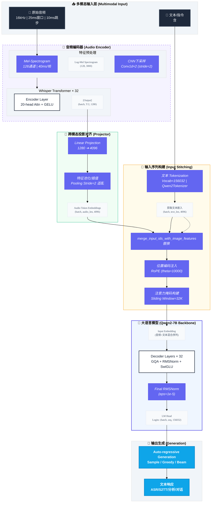
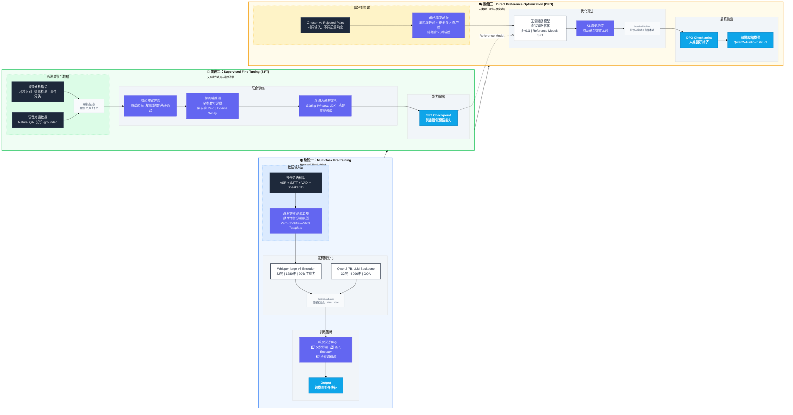

# Qwen2-Audio

- blog: https://qwen.ai/blog?id=99f0335c4ad9ff6153e517418d48535ab6d8afef&from=research.latest-advancements-list
- report: https://arxiv.org/abs/2407.10759
- code: https://github.com/QwenLM/Qwen2-Audio
- huggingface: https://huggingface.co/Qwen/Qwen2-Audio-7B
- modelscope: https://www.modelscope.cn/models/Qwen/Qwen2-Audio-7B


## Model Arch



### 层级结构解析

```cmd
Qwen2AudioForConditionalGeneration (Multimodal: Audio+Text → Text)
├── Qwen2AudioEncoder (Whisper-large-v3 based, 325M params)
│   ├── conv1 (Conv1d: 128 mel-bins → 1280, kernel=3, stride=1)
│   ├── embed_positions (Embedding: 1500×1280 learnable)
│   ├── encoder (32× Qwen2AudioEncoderLayer)
│   │   ├── self_attn (Multi-Head Attention: 20 heads, d_k=64)
│   │   ├── self_attn_layer_norm (LayerNorm: 1280)
│   │   ├── fc1 (Linear: 1280 → 5120, GELU activation)
│   │   ├── fc2 (Linear: 5120 → 1280)
│   │   └── final_layer_norm (LayerNorm: 1280)
│   └── avg_pooler (Temporal pooling: stride=2, 40ms/frame → 80ms/frame)
│
├── multi_modal_projector (Audio-to-Language Bridge)
│   └── linear (Linear: 1280 → 4096, GELU)
│
└── language_model (Qwen2-7B, Decoder-only, 7.6B params)
    ├── embed_tokens (Embedding: 156032 × 4096, incl. audio_token 151646)
    ├── layers (32× Qwen2DecoderLayer)
    │   ├── self_attn (GQA: 32 query heads / 8 kv heads, head_dim=128)
    │   │   ├── q_proj (Linear: 4096 → 4096)
    │   │   ├── k_proj (Linear: 4096 → 1024)  # GQA压缩
    │   │   ├── v_proj (Linear: 4096 → 1024)  # GQA压缩
    │   │   └── o_proj (Linear: 4096 → 4096)
    │   ├── mlp (SwiGLU architecture)
    │   │   ├── gate_proj (Linear: 4096 → 11008)
    │   │   ├── up_proj (Linear: 4096 → 11008)
    │   │   └── down_proj (Linear: 11008 → 4096)
    │   ├── input_layernorm (RMSNorm: 4096, eps=1e-5)
    │   └── post_attention_layernorm (RMSNorm: 4096)
    └── norm (RMSNorm: 4096)
    
lm_head (Linear: 4096 → 156032, weight tied with embed_tokens)
```

**关键维度变化流**：

- 音频输入: `(batch, 128, 3000)` [mel-spectrogram, 30s audio]
- 编码后: `(batch, 1500, 1280)` [temporal downsampling by 2]
- 投影后: `(batch, 750, 4096)` [Audio Tokens]
- 文本嵌入: `(batch, seq_len, 4096)`
- 融合序列: `(batch, 750+seq_len, 4096)` → Decoder → Logits `(batch, total_len, 156032)`

### 数据流详解

**阶段一：音频特征提取**
原始音频（16kHz采样率）首先经过128通道Mel-Spectrogram变换，窗口大小25ms，跳步10ms，每帧对应原始音频约40ms。随后通过两层Conv1d进行下采样（stride=2），时间分辨率压缩为原始长度的1/4。Whisper-large-v3编码器（32层Transformer，20头注意力，d_model=1280）处理后的特征维度为(batch, audio_seq_len, 1280)，对于30秒音频，seq_len约等于750。

**阶段二：跨模态投影**
音频特征通过单层线性投影（1280→4096，无bias）映射到语言模型的语义空间。这一极简对齐策略（仅5.2M可学习参数）避免了复杂投影层（如Q-Former）带来的信息瓶颈，同时保留了Whisper编码器预训练获得的鲁棒性音频表征。

**阶段三：序列构建与位置编码**
文本输入通过Tokenizer（词表大小156,032）转换为token IDs，其中特殊token `<audio>`（ID: 151646）作为音频占位符。在输入层，`<audio>` token的embedding被替换为投影后的音频特征，形成混合序列。RoPE位置编码（θ=10000）随后应用于Query和Key张量，为模型提供相对位置感知能力。

**阶段四：Transformer解码**
混合序列经过32层Qwen2DecoderLayer处理，每层包含：

1. Pre-Attention RMSNorm（eps=1e-5）稳定输入分布
2. GQA注意力机制（32 Query头，4 Key/Value头），通过广播机制实现8倍KV缓存压缩
3. Post-Attention RMSNorm
4. SwiGLU前馈网络（intermediate_size=11008，约2.68倍扩展比）

**阶段五：自回归生成**
最终隐藏状态经LM Head（4096→156032线性投影）转换为 logits，通过采样策略（temperature=0.7, top_p=0.9）生成文本响应，支持ASR、翻译、情感分析、自由对话等多种任务。


## Training

### Training Arch



Qwen2-Audio 采用了**三阶段渐进式训练范式**（Pre-training → Supervised Fine-Tuning → Direct Preference Optimization），突破了传统音频-语言模型（LALM）单阶段或多阶段简单堆叠的局限。其核心创新在于：

- **标签系统革新**：用自然语言提示替代复杂分层标签，缩小预训练与微调阶段的分布差距
- **双模态联合训练**：Voice Chat 与 Audio Analysis 两种交互模式无需系统提示词即可隐式切换
- **偏好对齐优化**：引入 DPO 阶段直接优化人类偏好，显著提升事实准确性（factuality）和指令遵循度

训练数据规模达 **520k 小时**（语音 370k + 音乐 140k + 环境声 10k），在 AIR-Bench 评测中取得 7.18 分，超越 Gemini-1.5-pro（6.97 分）。


### Stage_1: Multi-Task Pre-Training

#### 数据策略与标签系统革新

**核心改进：从分层标签到自然语言提示**

与前代 Qwen-Audio 使用复杂分层标签（如 `[Speech Recognition][English]`）不同，Qwen2-Audio 采用**自然语言描述**作为任务提示：

```diff
- 旧方式（Qwen-Audio）: [ASR][English] + [Audio][Speech]
+ 新方式（Qwen2-Audio）: "Detect the language and recognize the speech: <audio>"
```

**数据规模分布**：

| 模态类型           | 时长      | 占比  | 主要来源                                    |
| :----------------- | :-------- | :---- | :------------------------------------------ |
| **语音 (Speech)**  | 370k 小时 | 71.2% | Librispeech、Aishell2、Common Voice、Fleurs |
| **音乐 (Music)**   | 140k 小时 | 26.9% | MusicCaps、私有音乐数据集                   |
| **环境声 (Sound)** | 10k 小时  | 1.9%  | AudioCaps、Clotho、VocalSound               |

**提示模板设计原则**：

- **任务明确性**：明确指示模型执行 ASR、S2TT、AAC（音频字幕）等任务
- **语言通用性**：支持中英德法等 7 种语言的语音翻译任务
- **零样本泛化**：通过多样化自然语言表述，提升未见任务的泛化能力

#### 模型初始化与训练策略

**架构组件初始化**：

- **音频编码器**：基于 **Whisper-large-v3** 初始化（32 层 Transformer，20 头，d_model=1280）
- **语言模型**：基于 **Qwen-7B** 初始化（32 层 Decoder，GQA 架构）
- **投影层**：**随机初始化**，单层线性层（1280→4096），约 5.2M 参数

**训练配置**：

- **音频预处理**：16kHz 采样率 → 128 通道 Mel-Spectrogram（25ms 窗口，10ms 跳步）
- **下采样策略**：Conv1d stride=2，帧率从 50Hz 降至 25Hz（每帧对应 40ms 音频）
- **序列长度**：音频序列约 750 tokens（30 秒音频），文本序列最长 8192 tokens

**收敛性优化**：

- **阶段式解冻**：初期冻结 Whisper Encoder 和 Qwen LLM，仅训练投影层；后期逐步解冻 Encoder 顶层
- **学习率策略**：投影层使用较大学习率（1e-4），预训练组件使用较小学习率（1e-5），防止灾难性遗忘

### Stage_2: Supervised Fine-Tuning

#### 双模态交互架构设计

Qwen2-Audio 的 SFT 阶段核心创新是**统一双模态训练**，消除显式模式切换：

##### Audio Analysis 模式

- **输入构成**：音频 + 文本指令（如 "What's the mood of the speaker?"）

- **应用场景**：离线音频文件分析、特定任务执行（ASR、情感识别、翻译）

- **数据格式**：

  ```json
  {
    "audio": "path/to/audio.wav",
    "conversations": [
      {"from": "human", "value": "<audio>\nWhat's the mood of the speaker?"},
      {"from": "gpt", "value": "The speaker sounds anxious and stressed."}
    ]
  }
  ```

##### Voice Chat 模式

- **输入构成**：仅音频流（用户语音提问）
- **应用场景**：在线自由对话、语音助手、多轮闲聊
- **数据特征**：包含自然对话韵律、打断、语气词等非文本信息
- **特殊处理**：使用 `<|audio_bos|>` 和 `<|audio_eos|>` 标记音频边界

#### 数据质量与多样性控制

**质量控制机制**：

1. **人工筛选**：剔除低质量、含 PII（个人身份信息）的样本
2. **复杂度分层**：简单指令（"Transcribe this"）与复杂推理（"Analyze the emotional progression"）按 3:7 配比
3. **长度均衡**：短音频（<30s）与长音频（2-5min）混合，防止长度偏见

**数据增强策略**：

- **音频增强**：添加背景噪声（SNR 5-20dB）、速度扰动（0.9x-1.1x）、音量变化
- **文本增强**：同一音频配多个不同表述的指令，提升指令遵循鲁棒性


### Stage_3: Direct Preference Optimization(DPO)

#### DPO 算法适配

Qwen2-Audio 引入 **DPO** 作为第三优化阶段，区别于传统 RLHF+PPO 的复杂流程：

**核心公式**：

```math
\mathcal{L}_{\text{DPO}} = -\mathbb{E}_{(x, y_w, y_l) \sim \mathcal{D}} \left[ \log \sigma \left( \beta \log \frac{\pi_\theta(y_w|x)}{\pi_{\text{ref}}(y_w|x)} - \beta \log \frac{\pi_\theta(y_l|x)}{\pi_{\text{ref}}(y_l|x)} \right) \right]
```

其中：

- *x* ：输入（音频 + 可选文本）
- *y**w* ：人类偏好的优质回复（Chosen）
- *y**l* ：较差的回复（Rejected）
- *π*ref ：参考模型（SFT 阶段最终检查点，冻结参数）
- *β* ：温度系数（通常 0.1-0.5），控制与参考模型的偏离程度

####  偏好数据构建

**数据收集维度**：

| 优化维度       | Chosen 特征                            | Rejected 特征            | 数据占比 |
| :------------- | :------------------------------------- | :----------------------- | :------- |
| **事实准确性** | 正确识别音频内容、数字、人名           | 幻觉、错误转录、添油加醋 | 40%      |
| **指令遵循**   | 严格按指令格式输出（如JSON、指定字数） | 偏离指令、格式错误       | 30%      |
| **安全性**     | 拒绝回答敏感问题（如暴力教唆）         | 提供有害或不安全内容     | 20%      |
| **帮助性**     | 详细、有建设性的分析                   | 过于简短、敷衍的回答     | 10%      |

**音频特定挑战**：

- **声学混淆**：在嘈杂环境中，Chosen 应正确识别内容，Rejected 可能受噪声干扰产生误听
- **语气理解**：对同一句话，Chosen 识别讽刺/真诚语气，Rejected 误判


## vLLM Deploy

- 参考：[vllm/README.md](./vllm/README.md)


## Evaluation
### Dataset Description

|        数据集名称        | 任务类型 |       语言/规模       | 数据描述                                    | 典型用途                        |                                   资源链接                                   |
| :-----------------: | :--: | :---------------: | :-------------------------------------- | :-------------------------- | :----------------------------------------------------------------------: |
|   **LibriSpeech**   |  ASR (Automatic Speech Recognition) |   英语<br>~1000小时   | 开源有声书语音，16kHz，包含不同清晰度（clean/other）的朗读语音 | 英语语音识别基线测试、有声书 ASR          |                   [OpenSLR](https://www.openslr.org/12)                  |
| **Common Voice 15** |  ASR |  多语言<br>(100+语种)  | Mozilla众包语音，涵盖多样化口音、年龄、性别，CC0开源协议       | 多语言 ASR、低资源语言研究、口音鲁棒性       | [HuggingFace](https://huggingface.co/datasets/fsicoli/common_voice_15_0) |
|      **FLEURS**     |  ASR | 102种语言<br>~10h/语种 | 基于FLoRES-200的语音版本，句子级对齐，覆盖广泛语系          | 多语言语音识别、跨语言迁移学习、小样本评估       |       [HuggingFace](https://huggingface.co/datasets/google/fleurs)       |
|     **CoVoST 2**    | S2TT |  多语言对<br>(如en→de) | 基于Common Voice的语音-翻译文本平行语料，支持端到端翻译      | 语音到文本翻译（S2TT）、级联 vs 端到端翻译对比 |      [HuggingFace](https://hf-mirror.com/datasets/fixie-ai/covost2)      |
|       **MELD**      |  SER |   英语<br>1,400+对话  | 源自《老友记》的多模态数据，标注7种情感类别（含音频、文本、视频）       | 语音情感识别、多模态情感分析、对话情感理解       |                  [官网](https://affective-meld.github.io/)                 |
|    **VocalSound**   |  VSC |  英语<br>~21,000样本  | 6类人声音效（笑、咳、喷嚏等），专注非语言人声事件               | 人声音效分类、语音事件检测、健康监测（咳嗽检测）    |            [GitHub](https://github.com/YuanGongND/vocalsound)            |


### Data Download

**FROM**: https://github.com/QwenLM/Qwen2-Audio/blob/main/eval_audio/EVALUATION.md

依据官方教程下载相应的数据及**评测清单 jsonl**

#### ASR

- **Data url**

  - LibriSpeech
    - 官方链接：https://www.openslr.org/12

  - Common Voice 15
    - HuggingFace：https://huggingface.co/datasets/fsicoli/common_voice_15_0

  - FLEURS
    - HuggingFace：https://huggingface.co/datasets/google/fleurs

- **Eval list**

  - LibriSpeech（ASR）

    - https://qianwen-res.oss-cn-beijing.aliyuncs.com/Qwen2-Audio/evaluation/librispeech_eval.jsonl

    - Common Voice 15（ASR）
      - https://qianwen-res.oss-cn-beijing.aliyuncs.com/Qwen2-Audio/evaluation/cv15_asr_en_eval.jsonl
      - https://qianwen-res.oss-cn-beijing.aliyuncs.com/Qwen2-Audio/evaluation/cv15_asr_zh_eval.jsonl
      - https://qianwen-res.oss-cn-beijing.aliyuncs.com/Qwen2-Audio/evaluation/cv15_asr_yue_eval.jsonl
      - https://qianwen-res.oss-cn-beijing.aliyuncs.com/Qwen2-Audio/evaluation/cv15_asr_fr_eval.jsonl

  - FLEURS（ASR）
    - https://qianwen-res.oss-cn-beijing.aliyuncs.com/Qwen2-Audio/evaluation/fleurs_asr_zh_eval.jsonl

####  S2TT

- **Data url**
  - CoVoST 2
    - HuggingFace（mirror）：https://hf-mirror.com/datasets/fixie-ai/covost2

- **Eval list**
  - CoVoST 2（S2TT） 
    - https://qianwen-res.oss-cn-beijing.aliyuncs.com/Qwen2-Audio/evaluation/covost2_eval.jsonl

#### **SER**

- **Data url**
  - MELD
    - 官方链接：https://affective-meld.github.io/

- **Eval list**
  - MELD（SER）
    - https://qianwen-res.oss-cn-beijing.aliyuncs.com/Qwen2-Audio/evaluation/meld_eval.jsonl

#### **VSC**

- **Data url**
  - VocalSound
    - GitHub：https://github.com/YuanGongND/vocalsound

- **Eval list**
  - VocalSound（VSC）
    - https://qianwen-res.oss-cn-beijing.aliyuncs.com/Qwen2-Audio/evaluation/vocalsound_eval.jsonl


### Run Scripts

- **确保数据集均已下载到指定路径下**，参考官方评估说明：https://github.com/QwenLM/Qwen2-Audio/blob/main/eval_audio/EVALUATION.md
- 基于 Transformers 精度测试
  - 参考:  [transformers/EVALUATION.md](./transformers/EVALUATION.md)
- 基于 VLLM 精度测试
  - 参考:  [vllm/EVALUATION.md](./vllm/EVALUATION.md)


### Test Result

- 官方精度测试结果：https://github.com/QwenLM/Qwen2-Audio/blob/main/README.md#evaluation


| **Task** | **Dataset**     | **Split**  | **Count** | **Metric** | Official Score | Transformers Score | VLLM Score |
| -------- | --------------- | ---------- | --------- | ---------- | ---------------------------- | ----------------------- | --------------- |
| ASR      | Librispeech     | dev_clean  | 2694      | WER        | 1.7                          | 1.68                    | 2.24            |
|          |                 | dev_other  | 2857      |            | 3.6                          | 3.65                    | 4.41            |
|          |                 | test_clean | 2611      |            | 1.7                          | 1.70                    | 2.24            |
|          |                 | test_other | 2932      |            | 4.0                          | 4.03                    | 4.69            |
|          | Fleurs          | test_zh    | 944       |            | 7.0                          | 7.01                    | 7.33            |
|          | Common Voice 15 | test_zh    | 10625     |            | 6.5                          | 6.89                    | 6.62            |
|          |                 | test_yue   | 5593      |            | 5.9                          | 5.87                    | 6.06            |
|          |                 | test_fr    | 16132     |            | 9.6                          | 9.55                    | 9.60            |
|          |                 | test_en    | 16381     |            | 8.7                          | 8.76                    | 9.72            |
| S2TT     | CoVoST2         | en_zh      | 30984     | BLEU       | 45.6                         | 45.5                    | 45.6            |
|          |                 | en_de      | 30883     |            | 29.6                         | 29.6                    | 29.8            |
|          |                 | de_en      | 27017     |            | 33.6                         | 33.6                    | 35.4            |
|          |                 | zh_en      | 9741      |            | 24.0                         | 23.9                    | 24.7            |
| SER      | Meld            | test+dev   | 3716      | ACC        | 0.535                        | 0.541                   | 0.548           |
| VSC      | VocalSound      | test+valid | 5446      | ACC        | 0.9395                       | 0.9329                  | 0.9342          |

