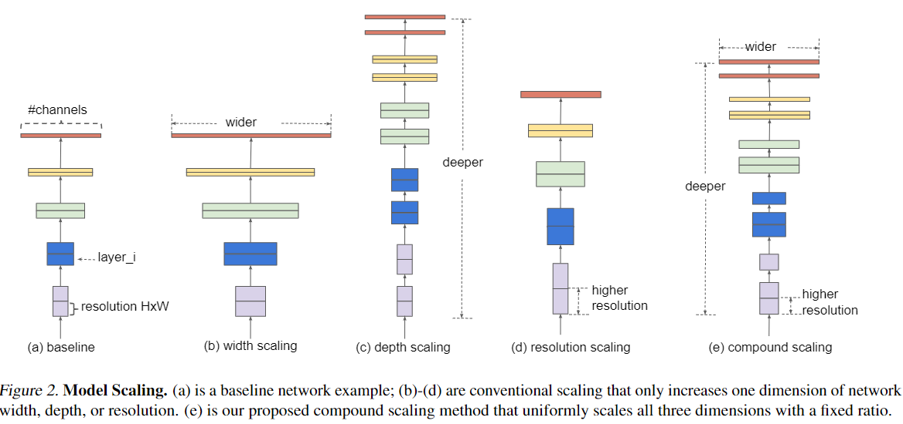
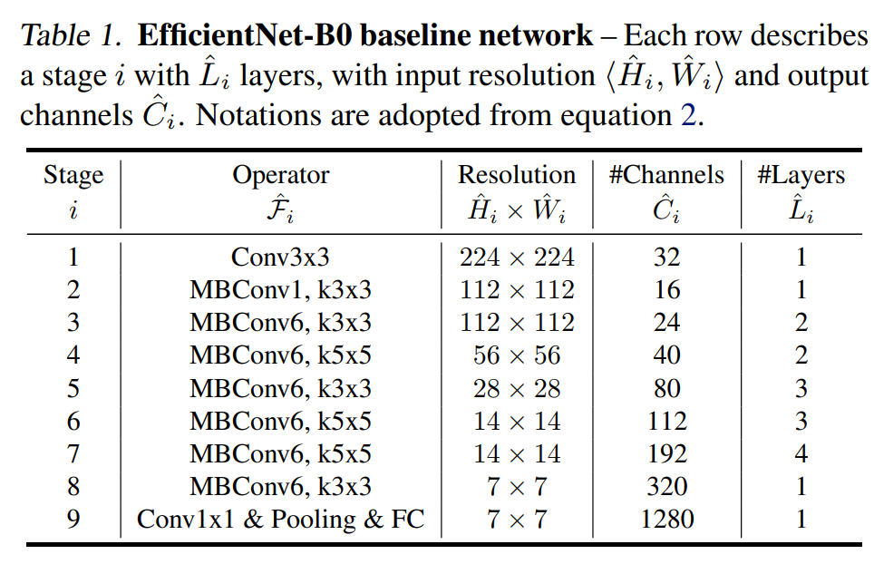
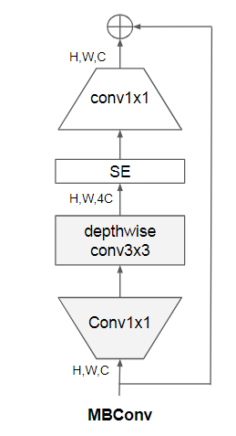

# EfficientNet

- [EfficientNet: Rethinking Model Scaling for Convolutional Neural Networks](https://arxiv.org/abs/1905.11946?context=stat.ML)
- [offical code](https://github.com/tensorflow/tpu/tree/master/models/official/efficientnet)

## Model Arch

<div align=center></div>

### pre-processing

EfficientNet系列网络的预处理操作和常见分类算法一致，`mmcls`系列在均值和方差设置上有别于常规设置，除此之外，每个子模型的输入大小均不一样

```python
[
    torchvision.transforms.Resize(),
    torchvision.transforms.CenterCrop(),
    torchvision.transforms.ToTensor(),
    torchvision.transforms.Normalize(mean, std),
]
```

### post-processing

EfficientNet系列网络的后处理操作是对网络输出进行`softmax`作为每个类别的预测值，然后根据预测值进行排序，选择`topk`作为输入图片的预测分数以及类别

### backbone
论文中通过一个多目标的NAS来得到baseline模型（借鉴MnasNet），这里优化的目标是模型的ACC和FLOPS，其中target FLOPS是400M，最终得到了EfficientNet-B0模型，其模型架构如下表所示：
<div align=center></div>
可以看到EfficientNet-B0的输入大小为224x224，首先是一个stride=2的3x3卷积层，最后是一个1x1卷积+global pooling+FC分类层，其余的stage主体是MBConv，这个指的是MobileNetV2中提出的mobile inverted bottleneck block（conv1x1-> depthwise conv3x3->conv1x1+shortcut），唯一的区别是增加了SE结构来进行优化，表中的MBConv后面的数字表示的是expand_ratio（第一个1x1卷积要扩大channels的系数）。
<div align=center></div>

### head

EfficientNet系列网络的head层由`AdaptiveAvgPool2d`层和`Linear`组成

### common

- SE
- depthwise
- ReLU/SiLU


## Model Info

### 模型性能

|        模型        |                                               源码                                                |  top1  |  top5  | FLOPs (G) | Params(M) | input size |
| :----------------: | :-----------------------------------------------------------------------------------------------: | :----: | :----: | :-------: | :-------: | :--------: |
|  efficientnet_b0   | [timm](https://github.com/rwightman/pytorch-image-models/blob/v0.6.5/timm/models/efficientnet.py) | 77.690 | 93.530 |   0.858   |   5.29    |    224     |
|  efficientnet_b1   | [timm](https://github.com/rwightman/pytorch-image-models/blob/v0.6.5/timm/models/efficientnet.py) | 78.796 | 94.342 |   1.266   |   7.79    |    256     |
|  efficientnet_b2   | [timm](https://github.com/rwightman/pytorch-image-models/blob/v0.6.5/timm/models/efficientnet.py) | 80.614 | 95.316 |   2.417   |   9.11    |    288     |
|  efficientnet_b3   | [timm](https://github.com/rwightman/pytorch-image-models/blob/v0.6.5/timm/models/efficientnet.py) | 82.240 | 96.114 |   4.359   |   12.23   |    320     |
|  efficientnet_b4   | [timm](https://github.com/rwightman/pytorch-image-models/blob/v0.6.5/timm/models/efficientnet.py) | 83.424 | 96.596 |   9.800   |   19.34   |    384     |
| tf_efficientnet_b5 | [timm](https://github.com/rwightman/pytorch-image-models/blob/v0.6.5/timm/models/efficientnet.py) | 83.812 | 96.748 |  22.565   |   30.39   |    456     |
| tf_efficientnet_b6 | [timm](https://github.com/rwightman/pytorch-image-models/blob/v0.6.5/timm/models/efficientnet.py) | 84.110 | 96.888 |  41.986   |   43.04   |    528     |
| tf_efficientnet_b7 | [timm](https://github.com/rwightman/pytorch-image-models/blob/v0.6.5/timm/models/efficientnet.py) | 84.936 | 97.204 |  83.319   |   66.35   |    600     |
| tf_efficientnet_b8 | [timm](https://github.com/rwightman/pytorch-image-models/blob/v0.6.5/timm/models/efficientnet.py) | 85.368 | 97.390 |  138.325  |   87.41   |    672     |


### 测评数据集说明

<div align=center></div>

[ImageNet](https://image-net.org) 是一个计算机视觉系统识别项目，是目前世界上图像识别最大的数据库。是美国斯坦福的计算机科学家，模拟人类的识别系统建立的。能够从图片中识别物体。ImageNet是一个非常有前景的研究项目，未来用在机器人身上，就可以直接辨认物品和人了。超过1400万的图像URL被ImageNet手动注释，以指示图片中的对象;在至少一百万张图像中，还提供了边界框。ImageNet包含2万多个类别; 一个典型的类别，如“气球”或“草莓”，每个类包含数百张图像。

ImageNet数据是CV领域非常出名的数据集，ISLVRC竞赛使用的数据集是轻量版的ImageNet数据集。ISLVRC2012是非常出名的一个数据集，在很多CV领域的论文，都会使用这个数据集对自己的模型进行测试，在该项目中分类算法用到的测评数据集就是ISLVRC2012数据集的验证集。在一些论文中，也会称这个数据叫成ImageNet 1K或者ISLVRC2012，两者是一样的。`1K`代表的是1000个类别。

### 评价指标说明

- top1准确率: 测试图片中最佳得分所对应的标签是正确标注类别的样本数除以总的样本数
- top5准确率: 测试图片中正确标签包含在前五个分类概率中的个数除以总的样本数

## Deploy
### step.1 获取模型
1. timm
    ```bash
    pip install timm==0.6.5
    python ../common/utils/export_timm_torchvision_model.py --model_library timm  --model_name efficientnet_b0 --save_dir ./onnx  --size 224 --pretrained_weights xxx.pth
    ```


### step.2 获取数据集
- 本模型使用ImageNet官网ILSVRC2012的5万张验证集进行测试，针对`int8`校准数据可从该数据集中任选1000张，为了保证量化精度，请保证每个类别都有数据，请用户自行获取该数据集，[ILSVRC2012](https://image-net.org/challenges/LSVRC/2012/index.php)

    ```
    ├── ImageNet
    |   ├── val
    |   |    ├── ILSVRC2012_val_00000001.JPEG
    │   |    ├── ILSVRC2012_val_00000002.JPEG
    │   |    ├── ......
    |   ├── val_label.txt
    ```

    ```bash
    sh ./data_prep_sh_files/valprep.sh
    ```

    ```bash
    # label.txt
    tench, Tinca tinca
    goldfish, Carassius auratus
    ...
    ```

### step.3 模型转换

1. 使用模型转换工具vamc，根据具体模型修改模型转换配置文件

   ```bash
   vamc build ./vacc_code/build/timm_efficientnet.yaml
   ```
   - [timm](./vacc_code/build/timm_efficientnet.yaml)


### step.4 benchmark

1. 生成推理数据`npz`以及对应的`datalist.txt`
    ```bash
    python ../common/utils/image2npz.py --dataset_path /path/to/ILSVRC2012_img_val --target_path  /path/to/input_npz  --text_path npz_datalist.txt
    ```
2. 性能测试
    ```bash
    ./vamp -m efficientnet-int8-percentile-3_256_256-vacc/efficientnet --vdsp_params ./vacc_code/vdsp_params/timm-efficientnet_b0-vdsp_params.json  -i 16 -p 1 -b 20
    ```
    
3. 获取精度信息
    ```bash
    ./vamp -m efficientnet-int8-kl_divergence-3_224_224-vacc/efficientnet --vdsp_params ./vacc_code/vdsp_params/timm-efficientnet_b0-vdsp_params.json  -i 16 -p 1 -b 20  --datalist npz_datalist.txt --path_output output
    ```
4. 结果解析及精度评估
   ```bash
   python ../common/eval/eval_imagenet.py --result_path output  --datalist npz_datalist.txt --label data/label/imagenet.txt
   ```

