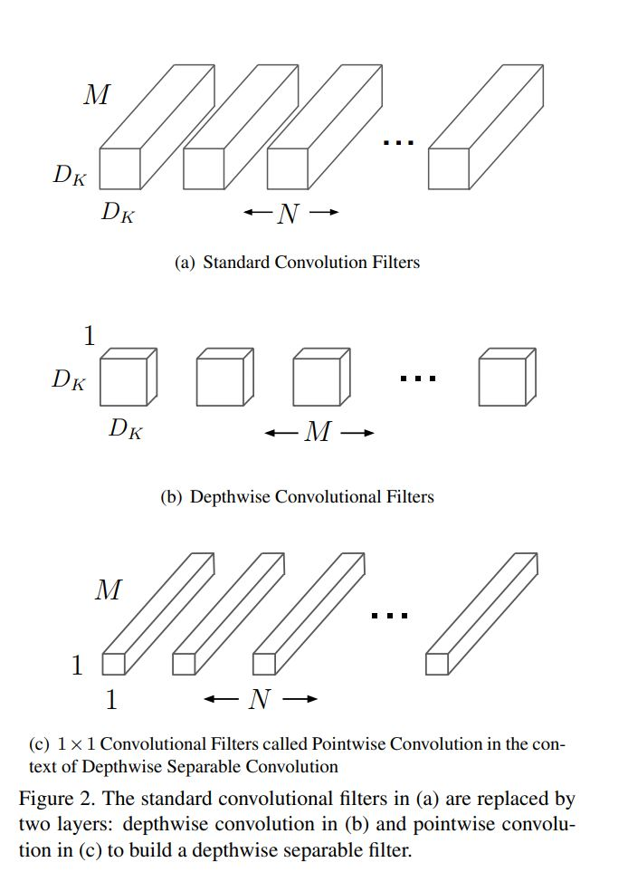

# MobileNetV1

[MobileNets: Efficient Convolutional Neural Networks for Mobile Vision Applications](https://arxiv.org/abs/1704.04861)


## Model Arch

<div align=center></div>

### pre-processing

MobileNetV1网络的预处理操作可以按照如下步骤进行，即先对图片进行resize至256的尺寸，然后利用`CenterCrop`算子crop出224的图片对其进行归一化、减均值除方差等操作

```python
[
    torchvision.transforms.Resize(256),
    torchvision.transforms.CenterCrop(224),
    torchvision.transforms.ToTensor(),
    torchvision.transforms.Normalize(mean=[0.485, 0.456, 0.406], std=[0.229, 0.224, 0.225],),
]
```

### post-processing

MobileNetV1网络的后处理操作是对网络输出进行softmax作为每个类别的预测值，然后根据预测值进行排序，选择topk作为输入图片的预测分数以及类别

### backbone

MobileNetV1的基本单元是深度级可分离卷积，其可以分解为两个更小的操作：depthwise convolution和pointwise convolution。

Depthwise convolution和标准卷积不同，对于标准卷积其卷积核是用在所有的输入通道上（input channels），而depthwise针对每个输入通道采用不同的卷积核，就是说一个卷积核对应一个输入通道。一般由M个n*n*1的卷积核构成，M是输入数据的深度。

而pointwise convolution其由N个1*1*M个卷积核构成，其中N是输出数据的深度。


### head

MobileNetV1网络的head层由global-average-pooling层和一层全连接层组成

### common

- depthwise conv


## Model Info

### 模型性能


|       模型        |                                                         源码                                                         | top1  | top5  | flops(M) | params(M) | input size |
| :---------------: | :------------------------------------------------------------------------------------------------------------------: | :---: | :---: | :------: | :-------: | :--------: |
|    mobilenetv1    |        [keras](https://github.com/keras-team/keras-applications/blob/master/keras_applications/mobilenet.py)         | 70.40 | 89.50 |  529.00  |   4.30    |    224     |
| MobileNetV1_x0_25 | [ppcls](https://github.com/PaddlePaddle/PaddleClas/blob/v2.4.0/ppcls/arch/backbone/legendary_models/mobilenet_v1.py) | 51.43 | 75.46 |  43.56   |   0.48    |    224     |
| MobileNetV1_x0_5  | [ppcls](https://github.com/PaddlePaddle/PaddleClas/blob/v2.4.0/ppcls/arch/backbone/legendary_models/mobilenet_v1.py) | 63.52 | 84.73 |  154.57  |   1.34    |    224     |
| MobileNetV1_x0_75 | [ppcls](https://github.com/PaddlePaddle/PaddleClas/blob/v2.4.0/ppcls/arch/backbone/legendary_models/mobilenet_v1.py) | 68.81 | 88.23 |  333.00  |   2.60    |    224     |
|    MobileNetV1    | [ppcls](https://github.com/PaddlePaddle/PaddleClas/blob/v2.4.0/ppcls/arch/backbone/legendary_models/mobilenet_v1.py) | 70.99 | 89.68 |  578.88  |   4.25    |    224     |
| mobilenetv1_ssld  | [ppcls](https://github.com/PaddlePaddle/PaddleClas/blob/v2.4.0/ppcls/arch/backbone/legendary_models/mobilenet_v1.py) | 77.89 | 93.94 |  578.88  |   4.25    |    224     |

### 测评数据集说明

<div align=center></div>

[ImageNet](https://image-net.org) 是一个计算机视觉系统识别项目，是目前世界上图像识别最大的数据库。是美国斯坦福的计算机科学家，模拟人类的识别系统建立的。能够从图片中识别物体。ImageNet是一个非常有前景的研究项目，未来用在机器人身上，就可以直接辨认物品和人了。超过1400万的图像URL被ImageNet手动注释，以指示图片中的对象;在至少一百万张图像中，还提供了边界框。ImageNet包含2万多个类别; 一个典型的类别，如“气球”或“草莓”，每个类包含数百张图像。

ImageNet数据是CV领域非常出名的数据集，ISLVRC竞赛使用的数据集是轻量版的ImageNet数据集。ISLVRC2012是非常出名的一个数据集，在很多CV领域的论文，都会使用这个数据集对自己的模型进行测试，在该项目中分类算法用到的测评数据集就是ISLVRC2012数据集的验证集。在一些论文中，也会称这个数据叫成ImageNet 1K或者ISLVRC2012，两者是一样的。“1 K”代表的是1000个类别。

### 评价指标说明

- top1准确率: 测试图片中最佳得分所对应的标签是正确标注类别的样本数除以总的样本数
- top5准确率: 测试图片中正确标签包含在前五个分类概率中的个数除以总的样本数

## Deploy

### step.1 获取模型


1. ppcls
    ```bash
    pip install PaddlePaddle==2.3.2  Paddle2ONNX==1.0.0

    paddle2onnx  --model_dir /path/to/paddle_model/ \
                --model_filename model.pdmodel \
                --params_filename model.pdiparams \
                --save_file model.onnx \
                --enable_dev_version False \
                --opset_version 10
    ```

2. keras

    ⚠️ keras h5 is directly supported formats!

### step.2 获取数据集
- 本模型使用ImageNet官网ILSVRC2012的5万张验证集进行测试，针对`int8`校准数据可从该数据集中任选1000张，为了保证量化精度，请保证每个类别都有数据，请用户自行获取该数据集，[ILSVRC2012](https://image-net.org/challenges/LSVRC/2012/index.php)

    ```
    ├── ImageNet
    |   ├── val
    |   |    ├── ILSVRC2012_val_00000001.JPEG
    │   |    ├── ILSVRC2012_val_00000002.JPEG
    │   |    ├── ......
    |   ├── val_label.txt
    ```

    ```bash
    sh ./data_prep_sh_files/valprep.sh
    ```

    ```bash
    # label.txt
    tench, Tinca tinca
    goldfish, Carassius auratus
    ...
    ```

### step.3 模型转换

1. 使用模型转换工具vamc，根据具体模型修改模型转换配置文件, 此处以`ppcls` 为例
    ```bash
    vamc build ./vacc_code/build/ppcls_mobilenetv1.yaml
    ```
    - [ppcls](./vacc_code/build/ppcls_mobilenetv1.yaml)
    - [keras](./vacc_code/build/keras_mobilenetv1.yaml)


### step.4 benchmark
1. 生成推理数据`npz`以及对应的`datalist.txt`
    ```bash
    python ../common/utils/image2npz.py --dataset_path /path/to/ILSVRC2012_img_val --target_path  /path/to/input_npz  --text_path npz_datalist.txt
    ```
3. 性能测试
    ```bash
    ./vamp -m mobilenet_v1-int8-percentile-3_224_224-vacc/mobilenet_v1 --vdsp_params ./vacc_code/vdsp_params/ppcls-mobilenet_v1-vdsp_params.json  -i 8 -p 1 -b 22
    ```
    
4. 获取精度信息
    ```bash
    ./vamp -m mobilenet_v1-int8-percentile-3_224_224-vacc/mobilenet_v1 --vdsp_params ./vacc_code/vdsp_params/ppcls-mobilenet_v1-vdsp_params.json  -i 8 -p 1 -b 22 --datalist npz_datalist.txt --path_output output
    ```
5. 结果解析及精度评估
    ```bash
    python ../common/eval/vamp_eval.py --result_path output  --datalist npz_datalist.txt --label data/label/imagenet.txt
    ```