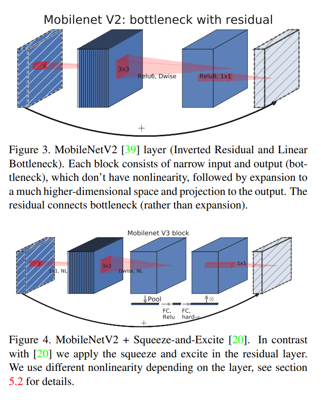
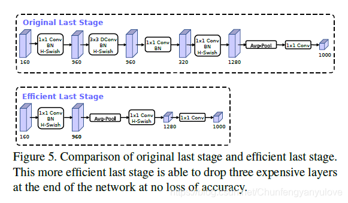

# MobileNetV3

[Searching for MobileNetV3](https://arxiv.org/abs/1905.02244)

## Model Arch

<div align=center></div>

### pre-processing

MobileNetV3网络的预处理操作可以按照如下步骤进行，即先对图片进行resize至256的尺寸，然后利用`CenterCrop`算子crop出224的图片对其进行归一化、减均值除方差等操作

```python
[
    torchvision.transforms.Resize(256),
    torchvision.transforms.CenterCrop(224),
    torchvision.transforms.ToTensor(),
    torchvision.transforms.Normalize(mean=[0.485, 0.456, 0.406], std=[0.229, 0.224, 0.225],),
]
```

### post-processing

MobileNetV3网络的后处理操作是对网络输出进行softmax作为每个类别的预测值，然后根据预测值进行排序，选择topk作为输入图片的预测分数以及类别

### backbone

MobileNetV3版本结合了v1的深度可分离卷积、v2的Inverted Residuals和Linear Bottleneck、SE模块，利用NAS（神经结构搜索）来搜索网络的配置和参数。

MobileNetV3提供了两个版本，分别为MobileNetV3 large 以及MobileNetV3 small，分别适用于对资源不同要求的情况

MobileNetV3 首先使用 MnasNet 进行粗略结构的搜索，然后使用强化学习从一组离散的选择中选择最优配置。之后，MobileNetV3 再使用 NetAdapt 对体系结构进行微调，这体现了 NetAdapt 的补充功能，它能够以较小的降幅对未充分利用的激活通道进行调整。

MobileNetV3 在bottlenet结构中加入了SE结构，并且放在了depthwise filter之后

### head

MobileNetV3网络的head层由global-average-pooling层和1x1的卷积层及全连接层组成。

在MobilenetV2中，在avg pooling之前，存在一个1x1的卷积层，目的是提高特征图的维度，更有利于结构的预测，但是这其实带来了一定的计算量了。

MobileNetV3进行了修改，将其放在avg pooling的后面，首先利用avg pooling将特征图大小由7x7降到了1x1，降到1x1后，然后再利用1x1提高维度，这样就减少了7x7=49倍的计算量。为了进一步的降低计算量，作者直接去掉了前面纺锤型卷积的3x3以及1x1卷积，进一步减少了计算量，就变成了如下图第二行所示的结构，作者将其中的3x3以及1x1去掉后，精度并没有得到损失。
<div align=center></div>


### common

- inverted residual structure
- depthwise conv
- linear bottleneck
- se module
- NAS search

## Model Info

### 模型性能


|             模型             |                                                         源码                                                         |  top1  |  top5  | flops(M) | params(M) | input size |
| :--------------------------: | :------------------------------------------------------------------------------------------------------------------: | :----: | :----: | :------: | :-------: | :--------: |
|   MobileNetV3_small_x0_35    | [ppcls](https://github.com/PaddlePaddle/PaddleClas/blob/v2.4.0/ppcls/arch/backbone/legendary_models/mobilenet_v3.py) | 53.030 | 76.370 |  14.560  |   1.670   |    224     |
| MobileNetV3_small_x0_35_ssld | [ppcls](https://github.com/PaddlePaddle/PaddleClas/blob/v2.4.0/ppcls/arch/backbone/legendary_models/mobilenet_v3.py) | 55.550 | 77.710 |  14.560  |   1.670   |    224     |
|    MobileNetV3_small_x0_5    | [ppcls](https://github.com/PaddlePaddle/PaddleClas/blob/v2.4.0/ppcls/arch/backbone/legendary_models/mobilenet_v3.py) | 59.210 | 81.520 |  22.600  |   1.910   |    224     |
|   MobileNetV3_small_x0_75    | [ppcls](https://github.com/PaddlePaddle/PaddleClas/blob/v2.4.0/ppcls/arch/backbone/legendary_models/mobilenet_v3.py) | 66.020 | 86.330 |  46.020  |   2.380   |    224     |
|    MobileNetV3_small_x1_0    | [ppcls](https://github.com/PaddlePaddle/PaddleClas/blob/v2.4.0/ppcls/arch/backbone/legendary_models/mobilenet_v3.py) | 68.240 | 88.060 |  63.670  |   2.950   |    224     |
| MobileNetV3_small_x1_0_ssld  | [ppcls](https://github.com/PaddlePaddle/PaddleClas/blob/v2.4.0/ppcls/arch/backbone/legendary_models/mobilenet_v3.py) | 71.290 | 90.100 |  63.670  |   2.950   |    224     |
|   MobileNetV3_small_x1_25    | [ppcls](https://github.com/PaddlePaddle/PaddleClas/blob/v2.4.0/ppcls/arch/backbone/legendary_models/mobilenet_v3.py) | 70.670 | 89.510 | 100.070  |   3.640   |    224     |
|   MobileNetV3_large_x0_35    | [ppcls](https://github.com/PaddlePaddle/PaddleClas/blob/v2.4.0/ppcls/arch/backbone/legendary_models/mobilenet_v3.py) | 64.320 | 85.460 |  40.900  |   2.110   |    224     |
|    MobileNetV3_large_x0_5    | [ppcls](https://github.com/PaddlePaddle/PaddleClas/blob/v2.4.0/ppcls/arch/backbone/legendary_models/mobilenet_v3.py) | 69.240 | 88.520 |  71.830  |   2.690   |    224     |
|   MobileNetV3_large_x0_75    | [ppcls](https://github.com/PaddlePaddle/PaddleClas/blob/v2.4.0/ppcls/arch/backbone/legendary_models/mobilenet_v3.py) | 73.140 | 91.080 | 151.700  |   3.930   |    224     |
|    MobileNetV3_large_x1_0    | [ppcls](https://github.com/PaddlePaddle/PaddleClas/blob/v2.4.0/ppcls/arch/backbone/legendary_models/mobilenet_v3.py) | 75.320 | 92.310 | 229.660  |   5.500   |    224     |
| MobileNetV3_large_x1_0_ssld  | [ppcls](https://github.com/PaddlePaddle/PaddleClas/blob/v2.4.0/ppcls/arch/backbone/legendary_models/mobilenet_v3.py) | 78.960 | 94.480 | 229.660  |   5.500   |    224     |
|   MobileNetV3_large_x1_25    | [ppcls](https://github.com/PaddlePaddle/PaddleClas/blob/v2.4.0/ppcls/arch/backbone/legendary_models/mobilenet_v3.py) | 76.410 | 92.950 | 362.700  |   7.470   |    224     |
|      MobileNetV3_small       |            [torchvision](https://github.com/pytorch/vision/blob/v0.9.0/torchvision/models/mobilenetv3.py)            | 67.668 | 87.402 |  63.670  |   2.500   |    224     |
|      MobileNetV3_large       |            [torchvision](https://github.com/pytorch/vision/blob/v0.9.0/torchvision/models/mobilenetv3.py)            | 74.042 | 91.340 | 229.660  |   5.500   |    224     |
|        mobilenetv3_rw        |           [timm](https://github.com/rwightman/pytorch-image-models/blob/v0.6.5/timm/models/mobilenetv3.py)           | 75.632 | 92.708 | 100.660  |   5.480   |    224     |
|    mobilenetv3_large_100     |           [timm](https://github.com/rwightman/pytorch-image-models/blob/v0.6.5/timm/models/mobilenetv3.py)           | 75.766 | 92.544 | 229.660  |   5.480   |    224     |
|    mobilenetv3_small_050     |           [timm](https://github.com/rwightman/pytorch-image-models/blob/v0.6.5/timm/models/mobilenetv3.py)           | 57.890 | 80.194 |  22.600  |   1.590   |    224     |
|    mobilenetv3_small_075     |           [timm](https://github.com/rwightman/pytorch-image-models/blob/v0.6.5/timm/models/mobilenetv3.py)           | 65.242 | 85.438 |  46.020  |   2.040   |    224     |
|    mobilenetv3_small_100     |           [timm](https://github.com/rwightman/pytorch-image-models/blob/v0.6.5/timm/models/mobilenetv3.py)           | 67.656 | 87.634 |  63.670  |   2.540   |    224     |
|    mobilenetv3_small     |           [showlo](https://github.com/ShowLo/MobileNetV3)           | 67.52 | 87.58 |  62.47  |   2.533   |    224     |

### 测评数据集说明

<div align=center></div>

[ImageNet](https://image-net.org) 是一个计算机视觉系统识别项目，是目前世界上图像识别最大的数据库。是美国斯坦福的计算机科学家，模拟人类的识别系统建立的。能够从图片中识别物体。ImageNet是一个非常有前景的研究项目，未来用在机器人身上，就可以直接辨认物品和人了。超过1400万的图像URL被ImageNet手动注释，以指示图片中的对象;在至少一百万张图像中，还提供了边界框。ImageNet包含2万多个类别; 一个典型的类别，如“气球”或“草莓”，每个类包含数百张图像。

ImageNet数据是CV领域非常出名的数据集，ISLVRC竞赛使用的数据集是轻量版的ImageNet数据集。ISLVRC2012是非常出名的一个数据集，在很多CV领域的论文，都会使用这个数据集对自己的模型进行测试，在该项目中分类算法用到的测评数据集就是ISLVRC2012数据集的验证集。在一些论文中，也会称这个数据叫成ImageNet 1K或者ISLVRC2012，两者是一样的。“1 K”代表的是1000个类别。

### 评价指标说明

- top1准确率: 测试图片中最佳得分所对应的标签是正确标注类别的样本数除以总的样本数
- top5准确率: 测试图片中正确标签包含在前五个分类概率中的个数除以总的样本数

## Deploy

### step.1 获取模型

1. timm

    ```bash
    pip install timm==0.6.5
    python ../common/utils/export_timm_torchvision_model.py --model_library timm  --model_name mobilenetv3_rw --save_dir ./onnx  --size 224 --pretrained_weights xxx.pth
    ```

2. torchvision
    ```bash
    python ../common/utils/export_timm_torchvision_model.py --model_library torchvision  --model_name mobilenet_v3_small --save_dir ./onnx  --size 224 --pretrained_weights xxx.pth
    ```

3. ppcls
    ```bash
    pip install PaddlePaddle==2.3.2  Paddle2ONNX==1.0.0

    paddle2onnx  --model_dir /path/to/paddle_model/ \
                --model_filename model.pdmodel \
                --params_filename model.pdiparams \
                --save_file model.onnx \
                --enable_dev_version False \
                --opset_version 10
    ```
4. showlo
    ```bash
    git clone https://github.com/ShowLo/MobileNetV3.git
    mv source_code/export_onnx.py MobileNetV3 & cd MobileNetV3
    python export_onnx.py
    ```
### step.2 获取数据集
- 本模型使用ImageNet官网ILSVRC2012的5万张验证集进行测试，针对`int8`校准数据可从该数据集中任选1000张，为了保证量化精度，请保证每个类别都有数据，请用户自行获取该数据集，[ILSVRC2012](https://image-net.org/challenges/LSVRC/2012/index.php)

    ```
    ├── ImageNet
    |   ├── val
    |   |    ├── ILSVRC2012_val_00000001.JPEG
    │   |    ├── ILSVRC2012_val_00000002.JPEG
    │   |    ├── ......
    |   ├── val_label.txt
    ```

    ```bash
    sh ./data_prep_sh_files/valprep.sh
    ```

    ```bash
    # label.txt
    tench, Tinca tinca
    goldfish, Carassius auratus
    ...
    ```

### step.3 模型转换

1. 使用模型转换工具vamc，根据具体模型修改模型转换配置文件, 此处以`timm` 为例

   ```bash
   vamc build ./vacc_code/build/timm_mobilenetv3.yaml
   ```
   - [timm](./vacc_code/build/timm_mobilenetv3.yaml)
   - [torchvision](./vacc_code/build/torchvision_mobilenetv3.yaml)
   - [ppcls](./vacc_code/build/ppcls_mobilenetv3.yaml)
   - [showlo](./vacc_code/build/showlo_mobilenetv3.yaml)


### step.4 模型推理

1. 根据step.3配置模型三件套信息，[model_info](./vacc_code/model_info/model_info_mobilenet_v3.json)
2. 配置python版数据预处理流程vdsp_params参数
   - [ppcls](./vacc_code/vdsp_params/sdk1.0/ppcls-mobilenet_v3_small_x1.0-vdsp_params.json)
   - 其它来源vdsp_params参数一致
3. 执行推理，参考[runstream](../common/sdk1.0/sample_cls.py)
    ```bash
    python ../common/sdk1.0/sample_cls.py --save_dir output/mobilenet_v3_result.txt
    ```

4. 精度评估
   ```bash
    python ../common/eval/eval_topk.py output/mobilenet_v3_result.txt
   ```

### step.5 benchmark
1. 生成推理数据`npz`以及对应的`datalist.txt`
    ```bash
    python ../common/utils/image2npz.py --dataset_path /path/to/ILSVRC2012_img_val --target_path  /path/to/input_npz  --text_path npz_datalist.txt
    ```
2. 性能测试
    ```bash
    ./vamp -m mobilenetv3_rw-int8-percentile-3_224_224-vacc/mobilenetv3_rw --vdsp_params ./vacc_code/vdsp_params/vamp/timm-mobilenetv3_rw-vdsp_params.json  -i 8 -p 1 -b 22
    ```
    
3. 获取精度信息
    ```bash
    ./vamp -m mobilenetv3_rw-int8-percentile-3_224_224-vacc/mobilenetv3_rw --vdsp_params ./vacc_code/vdsp_params/vamp/timm-mobilenetv3_rw-vdsp_params.json  -i 8 -p 1 -b 22 --datalist npz_datalist.txt --path_output output
    ```
4. 结果解析及精度评估
   ```bash
   python ../common/eval/eval_imagenet.py --result_path output  --datalist npz_datalist.txt --label data/label/imagenet.txt
   ```
