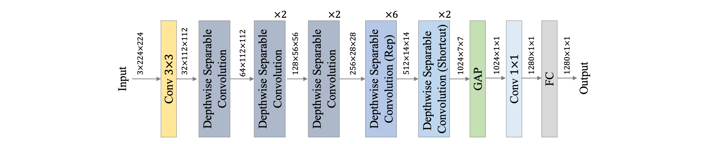
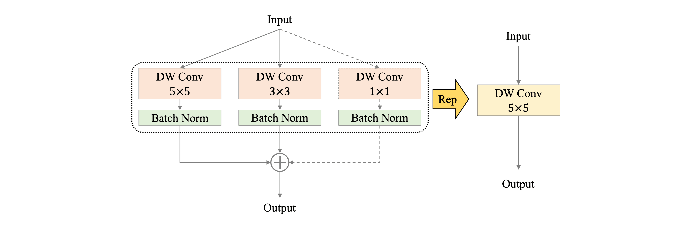

# PPLCNet_V2

[PP-LCNet: A Lightweight CPU Convolutional Neural Network](https://arxiv.org/abs/2109.15099)

PP-LCNetV2 是在 PP-LCNetV1 的改进版。

## Model Arch

<div align=center></div>

### pre-processing

PPLCNet_V2网络的预处理操作可以按照如下步骤进行，即先对图片进行resize至256的尺寸，然后利用`CenterCrop`算子crop出224的图片对其进行归一化、减均值除方差等操作：

```python
[
    torchvision.transforms.Resize(256),
    torchvision.transforms.CenterCrop(224),
    torchvision.transforms.ToTensor(),
    torchvision.transforms.Normalize(mean=[0.485, 0.456, 0.406], std=[0.229, 0.224, 0.225],),
]
```

### post-processing

PPLCNet_V2系列网络的后处理操作是对网络输出进行softmax作为每个类别的预测值，然后根据预测值进行排序，选择topk作为输入图片的预测分数以及类别。

### backbone

PP-LCNetV2 模型的网络整体结构如上图所示。PP-LCNetV2 模型是在 PP-LCNetV1 的基础上优化而来，主要使用重参数化策略组合了不同大小卷积核的深度卷积，并优化了点卷积、Shortcut等。

主要有以下几个优化策略：

- Rep 策略，卷积核的大小决定了卷积层感受野的大小，通过组合使用不同大小的卷积核，能够获取不同尺度的特征，因此 PPLCNetV2 在 Stage4、Stage5 中，在同一层组合使用 kernel size 分别为 5、3、1 的 DW 卷积，同时为了避免对模型效率的影响，使用重参数化（Re parameterization，Rep）策略对同层的 DW 卷积进行融合，如下图所示。

<div align=center></div>

- PW 卷积，深度可分离卷积通常由一层 DW 卷积和一层 PW 卷积组成，用以替换标准卷积，为了使深度可分离卷积具有更强的拟合能力，我们尝试使用两层 PW 卷积，同时为了控制模型效率不受影响，两层 PW 卷积设置为：第一个在通道维度对特征图压缩，第二个再通过放大还原特征图通道，如下图所示。通过实验发现，该策略能够显著提高模型性能，同时为了平衡对模型效率带来的影响，PPLCNetV2 仅在 Stage4 中使用了该策略。

<div align=center></div>

- Shortcut，残差结构（residual）自提出以来，被诸多模型广泛使用，但在轻量级卷积神经网络中，由于残差结构所带来的元素级（element-wise）加法操作，会对模型的速度造成影响，我们在 PP-LCNetV2 中，以 Stage 为单位实验了残差结构对模型的影响，发现残差结构的使用并非一定会带来性能的提高，因此 PPLCNetV2 仅在最后一个 Stage 中的使用了残差结构：在 Block 中增加 Shortcut，如下图所示。

<div align=center></div>

- 激活函数，在目前的轻量级卷积神经网络中，ReLU、Hard-Swish 激活函数最为常用，虽然在模型性能方面，Hard-Swish 通常更为优秀，然而我们发现部分推理平台对于 Hard-Swish 激活函数的效率优化并不理想，因此为了兼顾通用性，PP-LCNetV2 默认使用了 ReLU 激活函数，并且我们测试发现，ReLU 激活函数对于较大模型的性能影响较小。


- SE 模块，虽然 SE 模块能够显著提高模型性能，但其对模型速度的影响同样不可忽视，在 PP-LCNetV1 中，我们发现在模型中后部使用 SE 模块能够获得最大化的收益。在 PP-LCNetV2 的优化过程中，我们以 Stage 为单位对 SE 模块的位置做了进一步实验，并发现在 Stage4 中使用能够取得更好的平衡。


### head

PPLCNet_V2系列网络的head层由global-average-pooling层和一层 1x1 卷积层（等同于 FC 层），GAP 后的特征便不会直接经过分类层，而是先进行了融合，并将融合的特征进行分类。

### common

- SE Module
- Re parameterization
- Depthwise separable convolution

## Model Info

### 模型性能

|        模型         |                                                        源码                                                         |  top1  |  top5  | flops(M) | params(M) | input size |
| :-----------------: | :-----------------------------------------------------------------------------------------------------------------: | :----: | :----: | :------: | :-------: | :--------: |
|   PPLCNetV2_base    | [ppcls](https://github.com/PaddlePaddle/PaddleClas/blob/v2.4.0/ppcls/arch/backbone/legendary_models/pp_lcnet_v2.py) | 77.040 | 93.270 | 604.000  |   6.600   |    224     |
| PPLCNetV2_base_ssld | [ppcls](https://github.com/PaddlePaddle/PaddleClas/blob/v2.4.0/ppcls/arch/backbone/legendary_models/pp_lcnet_v2.py) | 80.070 | 94.870 | 604.000  |   6.600   |    224     |


### 测评数据集说明

<div align=center></div>

[ImageNet](https://image-net.org) 是一个计算机视觉系统识别项目，是目前世界上图像识别最大的数据库。是美国斯坦福的计算机科学家，模拟人类的识别系统建立的。能够从图片中识别物体。ImageNet是一个非常有前景的研究项目，未来用在机器人身上，就可以直接辨认物品和人了。超过1400万的图像URL被ImageNet手动注释，以指示图片中的对象;在至少一百万张图像中，还提供了边界框。ImageNet包含2万多个类别; 一个典型的类别，如“气球”或“草莓”，每个类包含数百张图像。

ImageNet数据是CV领域非常出名的数据集，ISLVRC竞赛使用的数据集是轻量版的ImageNet数据集。ISLVRC2012是非常出名的一个数据集，在很多CV领域的论文，都会使用这个数据集对自己的模型进行测试，在该项目中分类算法用到的测评数据集就是ISLVRC2012数据集的验证集。在一些论文中，也会称这个数据叫成ImageNet 1K或者ISLVRC2012，两者是一样的。“1 K”代表的是1000个类别。

### 评价指标说明

- top1准确率: 测试图片中最佳得分所对应的标签是正确标注类别的样本数除以总的样本数
- top5准确率: 测试图片中正确标签包含在前五个分类概率中的个数除以总的样本数

## Deploy

### step.1 获取模型


1. ppcls
    ```bash
    pip install PaddlePaddle==2.3.2  Paddle2ONNX==1.0.0

    paddle2onnx  --model_dir /path/to/paddle_model/ \
                --model_filename model.pdmodel \
                --params_filename model.pdiparams \
                --save_file model.onnx \
                --enable_dev_version False \
                --opset_version 10
    ```

### step.2 获取数据集
- 本模型使用ImageNet官网ILSVRC2012的5万张验证集进行测试，针对`int8`校准数据可从该数据集中任选1000张，为了保证量化精度，请保证每个类别都有数据，请用户自行获取该数据集，[ILSVRC2012](https://image-net.org/challenges/LSVRC/2012/index.php)

    ```
    ├── ImageNet
    |   ├── val
    |   |    ├── ILSVRC2012_val_00000001.JPEG
    │   |    ├── ILSVRC2012_val_00000002.JPEG
    │   |    ├── ......
    |   ├── val_label.txt
    ```

    ```bash
    sh ./data_prep_sh_files/valprep.sh
    ```

    ```bash
    # label.txt
    tench, Tinca tinca
    goldfish, Carassius auratus
    ...
    ```
### step.3 模型转换

1. 使用模型转换工具vamc，根据具体模型修改模型转换配置文件, 以下为示例
    ```bash
    vamc build ./vacc_code/build/ppcls_pplcnet_v2.yaml
    ```
    - [ppcls](./vacc_code/build/ppcls_pplcnet_v2.yaml)


### step.4 benchmark
1. 生成推理数据`npz`以及对应的`datalist.txt`
    ```bash
    python ../common/utils/image2npz.py --dataset_path /path/to/ILSVRC2012_img_val --target_path  /path/to/input_npz  --text_path npz_datalist.txt
    ```
2. 性能测试
    ```bash
    ./vamp -m pplcnet_v2_base-int8-percentile-3_224_224-vacc/pplcnet_v2_base --vdsp_params ./vacc_code/vdsp_params/ppcls-pplcnet_v2_base-vdsp_params.json  -i 8 -p 1 -b 22
    ```
    
3. 获取精度信息
    ```bash
    ./vamp -m pplcnet_v2_base-int8-percentile-3_224_224-vacc/pplcnet_v2_base --vdsp_params ./vacc_code/vdsp_params/ppcls-pplcnet_v2_base-vdsp_params.json  -i 8 -p 1 -b 22 --datalist npz_datalist.txt --path_output output
    ```
4. 结果解析及精度评估
   ```bash
   python ../common/eval/eval_imagenet.py --result_path output  --datalist npz_datalist.txt --label data/label/imagenet.txt
   ```