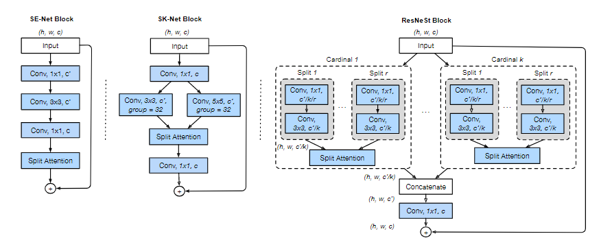
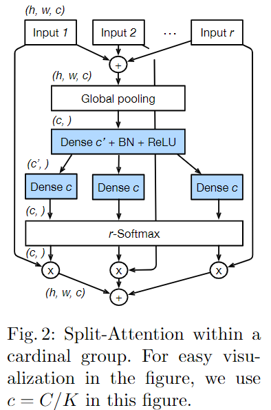
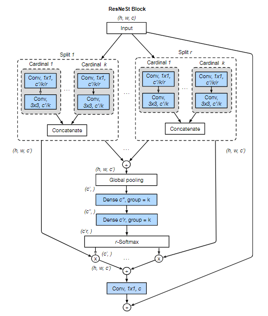

# ResNeSt
[ResNeSt: Split-Attention Networks](https://arxiv.org/abs/2004.08955)

## Model Arch

### pre-processing

ResNeSt系列网络的预处理操作可以按照如下步骤进行:

```python
transform_val = transforms.Compose([
      ECenterCrop(args.crop_size),
      transforms.ToTensor(),
      transforms.Normalize(mean=[0.485, 0.456, 0.406],
                           std=[0.229, 0.224, 0.225]),
   ])

class ECenterCrop:
   """Crop the given PIL Image and resize it to desired size.
   Args:
      img (PIL Image): Image to be cropped. (0,0) denotes the top left corner of the image.
      output_size (sequence or int): (height, width) of the crop box. If int,
         it is used for both directions
   Returns:
      PIL Image: Cropped image.
   """
   def __init__(self, imgsize):
      self.imgsize = imgsize
      self.resize_method = transforms.Resize((imgsize, imgsize), interpolation=PIL.Image.BICUBIC)

   def __call__(self, img):
      image_width, image_height = img.size
      image_short = min(image_width, image_height)

      crop_size = float(self.imgsize) / (self.imgsize + 32) * image_short

      crop_height, crop_width = crop_size, crop_size
      crop_top = int(round((image_height - crop_height) / 2.))
      crop_left = int(round((image_width - crop_width) / 2.))
      img = img.crop((crop_left, crop_top, crop_left + crop_width, crop_top + crop_height))
      return self.resize_method(img)
```

### post-processing

ResNeSt系列网络的后处理操作是对网络输出进行softmax作为每个类别的预测值，然后根据预测值进行排序，选择topk作为输入图片的预测分数以及类别

### backbone
> 本网络主要受ResNeXt、SENet和SKNet。ResNeXt采用统一的多路径group卷积操作；SENet通过自适应地重新校正各个特征响应，引入了通道维度的注意力机制；SKNet则是利用两个分支实现了特征图内部(空间维度)注意力机制。ResNeSt将通道维度的注意力机制扩展到特征图组表示，可以使用统一的CNN操作符进行模块化和加速

ResNeSt系列网络的backbone结构是由`Split-Attention Block`堆叠而成，此处借鉴了[SENet](../senet/README.md)和`SKNet`
<div align=center></div>

- 首先是借鉴了ResNeXt网络的思想，将输入分为K个，每一个记为Cardinal1-k ，然后又将每个Cardinal拆分成R个，每一个记为Split1-r，所以总共有G=KR个组
- 然后是对于每一个Cardinal中的`split attention`具体是什么样的：
   <div align=center></div>
- 接着将每一个Cardinal的输出拼接起来`V = Concat{v1, v2，…vk}`

📝 上述结构很难使用标准CNN操作符进行模块化和加速。为此，我们引入一个等价的基数主要实现：
<div align=center></div>

### head

ResNeSt系列网络的head层由`AvgPool2d`层和`Flatten`组成

### common

- AvgPool2d
- SEBlock & SKBlock
- ReLU
- Channel Split
- softmax

## Model Info

### 模型性能

|    模型    |                         源码                         | top1  | top5  | flops(G) | params(M) | input size | dataset  |
| :--------: | :--------------------------------------------------: | :---: | :---: | :------: | :-------: | :--------: | :------: |
| resnest50  | [official](https://github.com/zhanghang1989/ResNeSt) | 81.04 |   -   |  12.065  |  27.483   |    224     | imagenet |
| resnest101 | [official](https://github.com/zhanghang1989/ResNeSt) | 82.83 |   -   |  29.861  |  48.275   |    256     | imagenet |
| resnest200 | [official](https://github.com/zhanghang1989/ResNeSt) | 83.84 |   -   |  79.762  |  70.202   |    320     | imagenet |
| resnest269 | [official](https://github.com/zhanghang1989/ResNeSt) | 84.54 |   -   | 173.421  |  110.929  |    416     | imagenet |

### 测评数据集说明

<div align=center></div>

[ImageNet](https://image-net.org) 是一个计算机视觉系统识别项目，是目前世界上图像识别最大的数据库。是美国斯坦福的计算机科学家，模拟人类的识别系统建立的。能够从图片中识别物体。ImageNet是一个非常有前景的研究项目，未来用在机器人身上，就可以直接辨认物品和人了。超过1400万的图像URL被ImageNet手动注释，以指示图片中的对象;在至少一百万张图像中，还提供了边界框。ImageNet包含2万多个类别; 一个典型的类别，如“气球”或“草莓”，每个类包含数百张图像。

ImageNet数据是CV领域非常出名的数据集，ISLVRC竞赛使用的数据集是轻量版的ImageNet数据集。ISLVRC2012是非常出名的一个数据集，在很多CV领域的论文，都会使用这个数据集对自己的模型进行测试，在该项目中分类算法用到的测评数据集就是ISLVRC2012数据集的验证集。在一些论文中，也会称这个数据叫成ImageNet 1K或者ISLVRC2012，两者是一样的。“1 K”代表的是1000个类别。

### 评价指标说明

- top1准确率: 测试图片中最佳得分所对应的标签是正确标注类别的样本数除以总的样本数
- top5准确率: 测试图片中正确标签包含在前五个分类概率中的个数除以总的样本数

## Deploy

### step.1 获取模型

1. official

   ```bash
   python ./source_code/official_export.py --model_name resnest50  --size 224
   ```

### step.2 获取数据集
- 本模型使用ImageNet官网ILSVRC2012的5万张验证集进行测试，针对`int8`校准数据可从该数据集中任选1000张，为了保证量化精度，请保证每个类别都有数据，请用户自行获取该数据集，[ILSVRC2012](https://image-net.org/challenges/LSVRC/2012/index.php)

    ```
    ├── ImageNet
    |   ├── val
    |   |    ├── ILSVRC2012_val_00000001.JPEG
    │   |    ├── ILSVRC2012_val_00000002.JPEG
    │   |    ├── ......
    |   ├── val_label.txt
    ```

    ```bash
    sh ./data_prep_sh_files/valprep.sh
    ```

    ```bash
    # label.txt
    tench, Tinca tinca
    goldfish, Carassius auratus
    ...
    ```

### step.3 模型转换

1. 使用模型转换工具vamc，根据具体模型修改模型转换配置文件, 以下为示例

   ```bash
   vamc build ./vacc_code/build/official_resnest.yaml
   ```
   - [official](./vacc_code/build/official_resnest.yaml)

### step.4 模型推理

1. 根据step.3配置模型三件套信息，[model_info](./vacc_code/model_info/model_info_resnest.json)
2. 配置python版数据预处理流程vdsp_params参数
   - [official](./vacc_code/vdsp_params/sdk1.0/official-resnest50-vdsp_params.json)
3. 执行推理，参考[runstream](../common/sdk1.0/sample_cls.py)
    ```bash
    python ../common/sdk1.0/sample_cls.py --save_dir output/resnest_result.txt
    ```

4. 精度评估
   ```bash
    python ../common/eval/eval_topk.py output/resnest_result.txt
   ```


### step.5 benchmark
1. 生成推理数据`npz`以及对应的`datalist.txt`
    ```bash
    python ../common/utils/image2npz.py --dataset_path /path/to/ILSVRC2012_img_val --target_path  /path/to/input_npz  --text_path npz_datalist.txt
    ```
2. 性能测试
    ```bash
    ./vamp -m resnest50-int8-percentile-3_256_256-vacc/resnest50 --vdsp_params ./vacc_code/vdsp_params/vamp/official-resnest50-vdsp_params.json  -i 8 -p 1 -b 16
    ```
    
3. 获取精度信息
    ```bash
    ./vamp -m resnest50-int8-percentile-3_256_256-vacc/resnest50 --vdsp_params ./vacc_code/vdsp_params/vamp/official-resnest50-vdsp_params.json  -i 8 -p 1 -b 16 --datalist npz_datalist.txt --path_output output
    ```
4. 结果解析及精度评估
   ```bash
   python ../common/eval/eval_imagenet.py --result_path output  --datalist npz_datalist.txt --label data/label/imagenet.txt
   ```