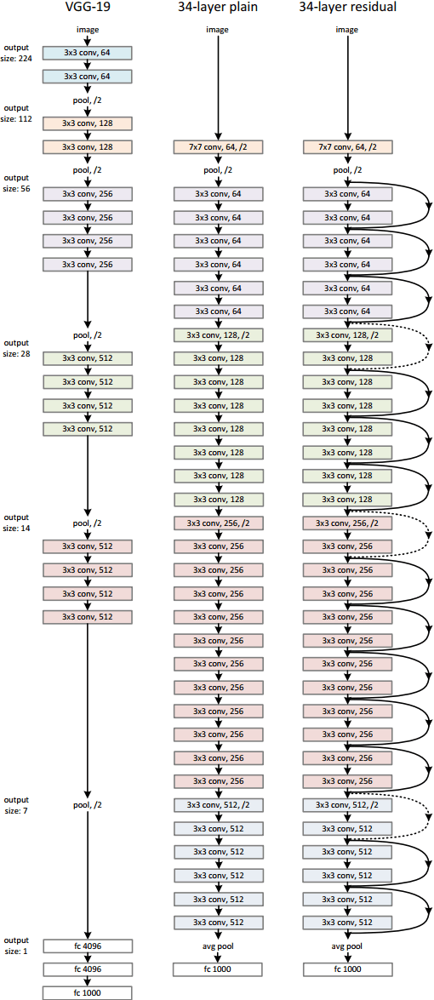
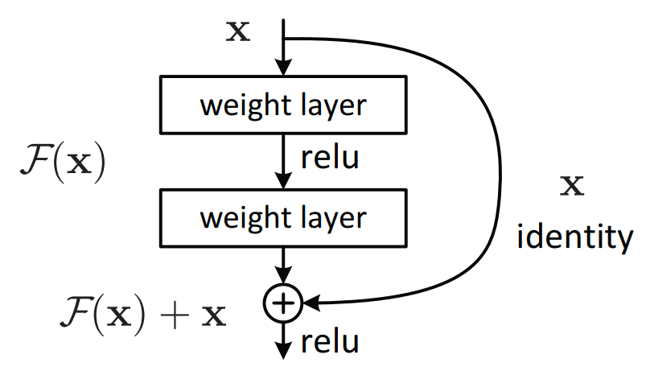

# ResNet

[Deep Residual Learning for Image Recognition](https://arxiv.org/abs/1512.03385)

## Model Arch

<div align=center></div>

### pre-processing

ResNet系列网络的预处理操作可以按照如下步骤进行，即先对图片进行resize至256的尺寸，然后利用`CenterCrop`算子crop出224的图片对其进行归一化、减均值除方差等操作：

```python
[
    torchvision.transforms.Resize(256),
    torchvision.transforms.CenterCrop(224),
    torchvision.transforms.ToTensor(),
    torchvision.transforms.Normalize(mean=[0.485, 0.456, 0.406], std=[0.229, 0.224, 0.225])
]
```

### post-processing

ResNet系列网络的后处理操作是对网络输出进行softmax作为每个类别的预测值，然后根据预测值进行排序，选择topk作为输入图片的预测分数以及类别。

### backbone

ResNet系列网络的backbone结构是由BasicBlock或Bottleneck搭成。ResNet网络名称后面的数字表示整个网络中包含参数层的数量。

<div align=center></div>

### head

ResNet系列网络的head层由global-average-pooling层和一层全连接fc层组成。

### common

- residual layer

## Model Info

### 模型性能

> 以下数据为模型来源官方数值指标
>
|     model name      |                                                    codebase                                                    |  top1  |  top5  | flops(G) | params(M) | input size |
| :-----------------: | :------------------------------------------------------------------------------------------------------------: | :----: | :----: | :------: | :-------: | :--------: |
|      resnet18       |          [timm](https://github.com/rwightman/pytorch-image-models/blob/v0.6.5/timm/models/resnet.py)           | 69.744 | 89.082 |  3.648   |  11.690   |    224     |
|      resnet26       |          [timm](https://github.com/rwightman/pytorch-image-models/blob/v0.6.5/timm/models/resnet.py)           | 75.300 | 92.578 |  4.744   |  15.995   |    224     |
|      resnet34       |          [timm](https://github.com/rwightman/pytorch-image-models/blob/v0.6.5/timm/models/resnet.py)           | 75.114 | 92.284 |  7.358   |  21.798   |    224     |
|      resnet50       |          [timm](https://github.com/rwightman/pytorch-image-models/blob/v0.6.5/timm/models/resnet.py)           | 80.376 | 94.616 |  8.268   |  25.557   |    224     |
|      resnet101      |          [timm](https://github.com/rwightman/pytorch-image-models/blob/v0.6.5/timm/models/resnet.py)           | 81.932 | 95.770 |  15.732  |  44.549   |    224     |
|      resnet152      |          [timm](https://github.com/rwightman/pytorch-image-models/blob/v0.6.5/timm/models/resnet.py)           | 82.820 | 96.130 |  23.208  |  60.193   |    224     |
| gluon_resnet18_v1b  |       [timm](https://github.com/rwightman/pytorch-image-models/blob/v0.6.5/timm/models/gluon_resnet.py)        | 70.834 | 89.762 |  4.053   |  11.690   |    224     |
| gluon_resnet34_v1b  |       [timm](https://github.com/rwightman/pytorch-image-models/blob/v0.6.5/timm/models/gluon_resnet.py)        | 74.588 | 91.988 |  8.175   |  21.798   |    224     |
| gluon_resnet50_v1b  |       [timm](https://github.com/rwightman/pytorch-image-models/blob/v0.6.5/timm/models/gluon_resnet.py)        | 77.580 | 93.722 |  9.186   |  25.557   |    224     |
| gluon_resnet50_v1c  |       [timm](https://github.com/rwightman/pytorch-image-models/blob/v0.6.5/timm/models/gluon_resnet.py)        | 78.012 | 93.990 |  9.726   |  26.576   |    224     |
| gluon_resnet50_v1d  |       [timm](https://github.com/rwightman/pytorch-image-models/blob/v0.6.5/timm/models/gluon_resnet.py)        | 79.076 | 94.472 |  9.727   |  25.576   |    224     |
| gluon_resnet50_v1s  |       [timm](https://github.com/rwightman/pytorch-image-models/blob/v0.6.5/timm/models/gluon_resnet.py)        | 78.712 | 94.240 |  12.219  |  25.681   |    224     |
| gluon_resnet101_v1b |       [timm](https://github.com/rwightman/pytorch-image-models/blob/v0.6.5/timm/models/gluon_resnet.py)        | 79.302 | 94.520 |  17.481  |  44.549   |    224     |
| gluon_resnet101_v1c |       [timm](https://github.com/rwightman/pytorch-image-models/blob/v0.6.5/timm/models/gluon_resnet.py)        | 79.534 | 94.580 |  18.021  |  44.568   |    224     |
| gluon_resnet101_v1d |       [timm](https://github.com/rwightman/pytorch-image-models/blob/v0.6.5/timm/models/gluon_resnet.py)        | 80.420 | 95.016 |  18.021  |  44.568   |    224     | 1072 | 1.17 | 8 | 10 | 3996 | 0.55 | 27 | 27 | percentile |
| gluon_resnet101_v1s |       [timm](https://github.com/rwightman/pytorch-image-models/blob/v0.6.5/timm/models/gluon_resnet.py)        | 80.298 | 95.164 |  20.514  |  44.673   |    224     |
| gluon_resnet152_v1b |       [timm](https://github.com/rwightman/pytorch-image-models/blob/v0.6.5/timm/models/gluon_resnet.py)        | 79.680 | 94.738 |  25.787  |  60.193   |    224     |
| gluon_resnet152_v1c |       [timm](https://github.com/rwightman/pytorch-image-models/blob/v0.6.5/timm/models/gluon_resnet.py)        | 79.908 | 94.848 |  26.326  |  60.212   |    224     |
| gluon_resnet152_v1d |       [timm](https://github.com/rwightman/pytorch-image-models/blob/v0.6.5/timm/models/gluon_resnet.py)        | 80.476 | 95.204 |  26.327  |  60.212   |    224     |
| gluon_resnet152_v1s |       [timm](https://github.com/rwightman/pytorch-image-models/blob/v0.6.5/timm/models/gluon_resnet.py)        | 81.016 | 95.412 |  28.819  |  60.317   |    224     |
|      resnet18       |           [torchvision](https://github.com/pytorch/vision/blob/v0.9.0/torchvision/models/resnet.py)            | 69.758 | 89.078 |  3.648   |  11.690   |    224     |
|      resnet34       |           [torchvision](https://github.com/pytorch/vision/blob/v0.9.0/torchvision/models/resnet.py)            | 73.314 | 91.42  |  7.358   |  21.798   |    224     |
|      resnet50       |           [torchvision](https://github.com/pytorch/vision/blob/v0.9.0/torchvision/models/resnet.py)            | 76.130 | 92.862 |  8.268   |  25.557   |    224     |
|      resnet101      |           [torchvision](https://github.com/pytorch/vision/blob/v0.9.0/torchvision/models/resnet.py)            | 77.374 | 93.546 |  15.732  |  44.549   |    224     |
|      resnet152      |           [torchvision](https://github.com/pytorch/vision/blob/v0.9.0/torchvision/models/resnet.py)            | 78.312 | 94.046 |  23.208  |  60.193   |    224     |
|      resnet18       | [mmcls](https://github.com/open-mmlab/mmclassification/blob/master/configs/resnet/resnet18_b32x8_imagenet.py)  | 69.90  | 89.43  |   3.64   |   11.69   |    224     |
|      resnet34       | [mmcls](https://github.com/open-mmlab/mmclassification/blob/master/configs/resnet/resnet34_b32x8_imagenet.py)  | 73.62  | 91.59  |   7.36   |   21.8    |    224     |
|      resnet50       | [mmcls](https://github.com/open-mmlab/mmclassification/blob/master/configs/resnet/resnet50_b32x8_imagenet.py)  | 76.55  | 93.06  |   8.24   |   25.56   |    224     |
|      resnet101      | [mmcls](https://github.com/open-mmlab/mmclassification/blob/master/configs/resnet/resnet101_b32x8_imagenet.py) | 77.97  | 94.06  |   15.7   |   44.55   |    224     |
|      resnet152      | [mmcls](https://github.com/open-mmlab/mmclassification/blob/master/configs/resnet/resnet152_b32x8_imagenet.py) | 78.48  | 94.13  |  23.16   |   60.19   |    224     |
|      resnet18       |          [ppclas](https://github.com/PaddlePaddle/PaddleClas/blob/v2.4.0/docs/zh_CN/models/ResNet.md)           |  71.0  |  89.9  |   3.66   |   11.69   |    224     |
|     resnet18_vd     |          [ppclas](https://github.com/PaddlePaddle/PaddleClas/blob/v2.4.0/docs/zh_CN/models/ResNet.md)           |  72.3  |  90.8  |   4.14   |   11.71   |    224     |
|      resnet34       |          [ppclas](https://github.com/PaddlePaddle/PaddleClas/blob/v2.4.0/docs/zh_CN/models/ResNet.md)           |  74.6  |  92.1  |   7.36   |   21.8    |    224     |
|     resnet34_vd     |          [ppclas](https://github.com/PaddlePaddle/PaddleClas/blob/v2.4.0/docs/zh_CN/models/ResNet.md)           |  76.0  |  93.0  |   7.39   |   21.82   |    224     |
|  resnet34_vd_ssld   |          [ppclas](https://github.com/PaddlePaddle/PaddleClas/blob/v2.4.0/docs/zh_CN/models/ResNet.md)           |  79.7  |  94.9  |   7.39   |   21.82   |    224     |
|      resnet50       |          [ppclas](https://github.com/PaddlePaddle/PaddleClas/blob/v2.4.0/docs/zh_CN/models/ResNet.md)           |  76.5  |  93.0  |   8.19   |   25.56   |    224     |
|     resnet50_vc     |          [ppclas](https://github.com/PaddlePaddle/PaddleClas/blob/v2.4.0/docs/zh_CN/models/ResNet.md)           |  78.4  |  94.0  |   8.67   |   25.58   |    224     |
|     resnet50_vd     |          [ppclas](https://github.com/PaddlePaddle/PaddleClas/blob/v2.4.0/docs/zh_CN/models/ResNet.md)           |  79.1  |  94.4  |   8.67   |   25.58   |    224     |
|  resnet50_vd_ssld   |          [ppclas](https://github.com/PaddlePaddle/PaddleClas/blob/v2.4.0/docs/zh_CN/models/ResNet.md)           |  83.0  |  96.4  |   8.67   |   25.58   |    224     |
|      resnet101      |          [ppclas](https://github.com/PaddlePaddle/PaddleClas/blob/v2.4.0/docs/zh_CN/models/ResNet.md)           |  77.6  |  93.6  |  15.52   |   44.55   |    224     |
|    resnet101_vd     |          [ppclas](https://github.com/PaddlePaddle/PaddleClas/blob/v2.4.0/docs/zh_CN/models/ResNet.md)           |  80.2  |  95.0  |   16.1   |   44.57   |    224     |
|  resnet101_vd_ssld  |          [ppclas](https://github.com/PaddlePaddle/PaddleClas/blob/v2.4.0/docs/zh_CN/models/ResNet.md)           |  83.7  |  96.7  |   16.1   |   44.57   |    224     |
|      resnet152      |          [ppclas](https://github.com/PaddlePaddle/PaddleClas/blob/v2.4.0/docs/zh_CN/models/ResNet.md)           |  78.3  |  94.0  |  23.05   |   60.19   |    224     |
|    resnet152_vd     |          [ppclas](https://github.com/PaddlePaddle/PaddleClas/blob/v2.4.0/docs/zh_CN/models/ResNet.md)           |  80.6  |  95.3  |  23.53   |   60.21   |    224     |
|    resnet200_vd     |          [ppclas](https://github.com/PaddlePaddle/PaddleClas/blob/v2.4.0/docs/zh_CN/models/ResNet.md)           |  80.9  |  95.3  |  30.53   |   74.74   |    224     |

### 数据集

<div align=center></div>

[ImageNet](https://image-net.org) 是一个计算机视觉系统识别项目，是目前世界上图像识别最大的数据库。是美国斯坦福的计算机科学家，模拟人类的识别系统建立的。能够从图片中识别物体。ImageNet是一个非常有前景的研究项目，未来用在机器人身上，就可以直接辨认物品和人了。超过1400万的图像URL被ImageNet手动注释，以指示图片中的对象;在至少一百万张图像中，还提供了边界框。ImageNet包含2万多个类别; 一个典型的类别，如“气球”或“草莓”，每个类包含数百张图像。

ImageNet数据是CV领域非常出名的数据集，ISLVRC竞赛使用的数据集是轻量版的ImageNet数据集。ISLVRC2012是非常出名的一个数据集，在很多CV领域的论文，都会使用这个数据集对自己的模型进行测试，在该项目中分类算法用到的测评数据集就是ISLVRC2012数据集的验证集。在一些论文中，也会称这个数据叫成ImageNet 1K或者ISLVRC2012，两者是一样的。“1 K”代表的是1000个类别。

### 评价指标说明

- top1准确率: 测试图片中最佳得分所对应的标签是正确标注类别的样本数除以总的样本数
- top5准确率: 测试图片中正确标签包含在前五个分类概率中的个数除以总的样本数

## Deploy
> 不同codebase的模型仅在模型转换部分有区别

### step.1 准备预训练模型
- 预训练模型导出onnx或torchscript，参考[README.md](./source_code/README.md)

### step.2 准备数据集
本模型使用ImageNet官网ILSVRC2012的5万张验证集进行测试，针对`int8`校准数据可从该数据集中任选1000张，为了保证量化精度，请保证每个类别都有数据，请用户自行获取该数据集，[ILSVRC2012](https://image-net.org/challenges/LSVRC/2012/index.php)
```
├── ImageNet
|   ├── val
|   |    ├── ILSVRC2012_val_00000001.JPEG
│   |    ├── ILSVRC2012_val_00000002.JPEG
│   |    ├── ......
|   ├── val_label.txt
````

```bash
sh ./data_prep_sh_files/valprep.sh
```

```bash
# label.txt
tench, Tinca tinca
goldfish, Carassius auratus
...
```

### step.3 模型转换

1. 使用模型转换工具vamc，根据具体模型修改模型转换配置文件
   - [torchvision/timm/oneflow](./vacc_code/build/torch_resnet.yaml)
   - [mmcls](./vacc_code/build/mmcls_resnet.yaml)
   - [ppcls](./vacc_code/build/ppcls_resnet.yaml)
   - [keras](./vacc_code/build/keras.yaml)

2. 命令行执行转换

   ```bash
   vamc build ./vacc_code/build/xxx.yaml
   ```

### step.4 模型推理
1. 根据step.3配置模型三件套信息，[model_info](./vacc_code/model_info/model_info_resnet.json)
2. 配置数据预处理流程vdsp_params参数
   - [torchvision/timm/oneflow](./vacc_code/vdsp_params/sdk1.0/torch_vdsp_params_resnet_rgb.json)
   - [mmcls](./vacc_code/vdsp_params/sdk1.0/mmcls_vdsp_params_resnet_rgb.json)
   - [ppcls](./vacc_code/vdsp_params/sdk1.0/ppclas_vdsp_params_resnet_rgb.json)
   - [keras](./vacc_code/vdsp_params/sdk1.0/keras_vdsp_params_resnet_rgb.json)

3. 执行推理，参考[runstream](../common/sdk1.0/sample_cls.py)
    ```bash
    python ../common/sdk1.0/sample_cls.py --save_dir output/resnet_result.txt
    ```

4. 精度评估
   ```bash
    python ../common/eval/eval_topk.py output/resnet_result.txt
   ```

### step.5 benchmark
1. 生成推理数据`npz`以及对应的`datalist.txt`
    ```bash
    python ../common/utils/image2npz.py --dataset_path /path/to/ILSVRC2012_img_val --target_path  /path/to/input_npz  --text_path npz_datalist.txt
    ```
2. 性能测试

    ```bash
    ./vamp -m deploy_weights/resnet50-int8-percentile-3_224_224-vacc/resnet50 --vdsp_params vacc_code/vdsp_params/vamp/timm-resnet18-vdsp_params.json -i 2 p 2 -b 1
    ```
    
3. 获取精度信息
   ```bash
    ./vamp -m deploy_weights/resnet50-int8-percentile-3_224_224-vacc/resnet50 --vdsp_params vacc_code/vdsp_params/vamp/timm-resnet18-vdsp_params.json -i 2 p 2 -b 1 --datalist npz_datalist.txt --path_output output
    ```

4. 结果解析及精度评估
    ```bash
    python ../common/eval/eval_imagenet.py --result_path output  --datalist npz_datalist.txt --label data/label/imagenet.txt
    ```


## appending
- mmcls、ppcls及keras来源模型，已自带softmax层后处理，注意build配置
    ```yaml
    add_extra_ops_to_graph:
        type: null
    ```
- 在keras来源模型中，有v2版本参数不太一样，注意修改[resnet_keras.yaml](./vacc_code/build/keras_resnet.yaml) 
  - resnet50、resnet101、resnet152所需的输入尺寸为224，input_name应设置为`input_1`;
  - resnet50v2、resnet101v2、resnet152v2所需的输入尺寸为299，input_name应设置为`input_4`；
  - 同时，也可使用函数脚本式预处理[keras_preprocess.py](./vacc_code/build/keras_preprocess.py)，注意，v2模型应采用下述代码中的`get_image_data_v2`函数
    <details><summary>keras.yaml</summary>

    ```yaml
    model:
        name: resnet50
        inputs:
            input_1: [1, 3, 224, 224]
        checkpoint: weights/keras/resnet50.h5

    engine:
        type: vacc
        common:
            do_quantization: true
        add_extra_ops_to_graph:
            type: null
        calibration:
            quant_mode: percentile
            per_channel: true

    dataset:
        path: eval/ILSVRC2012_img_calib
        sampler:
            suffix: JPEG
            get_data_num: 1000
        transform_ops:
        - type: CustomFunc
          module_path: classification/resnet/vacc_code/build/keras_preprocess.py
          func_name: get_image_data
          input_shape: [1, 3, 224, 224]

    workspace:
        work_dir: ./deploy_weights/
        enable_ir: false
        save_log: true
    ```
    </details>
