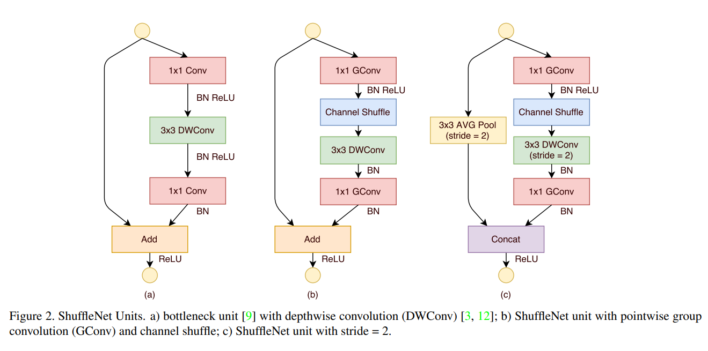

# ShuffleNetV1

[ShuffleNet: An Extremely Efficient Convolutional Neural Network for Mobile Devices](https://openaccess.thecvf.com/content_cvpr_2018/html/Zhang_ShuffleNet_An_Extremely_CVPR_2018_paper.html)


## Model Arch

<div align=center></div>

### pre-processing

ShuffleNetV1系列网络的预处理操作可以按照如下步骤进行，即先对图片进行resize至256的尺寸，然后利用`CenterCrop`算子crop出224的图片对其进行归一化、减均值除方差等操作

```python
[
    torchvision.transforms.Resize(256),
    torchvision.transforms.CenterCrop(224),
    torchvision.transforms.ToTensor(),
    torchvision.transforms.Normalize(mean=[0.485, 0.456, 0.406], std=[0.229, 0.224, 0.225],),
]
```

### post-processing

ShuffleNetV1系列网络的后处理操作是对网络输出进行softmax作为每个类别的预测值，然后根据预测值进行排序，选择topk作为输入图片的预测分数以及类别

### backbone

shufflenet v1主要提出了pointwise group convolution 和 channel shuffle 结构，在保持模型精度的前提下，进一步减小了网络的计算量

### head

ShuffleNetV1系列网络的head层由global-average-pooling层和一层全连接层组成

### common

- pointwise group convolution
- channel shuffle

## Model Info

### 模型性能

| 模型  | 源码 | top1 | top5 | MACs(G) | params(M) | input size |
| :---: | :--: | :--: | :--: | :---: | :----: | :--------: |
| shufflenet_v1_x1.0 |[mmcls](https://github.com/open-mmlab/mmclassification/blob/master/mmcls/models/backbones/shufflenet_v1.py)|  68.13   |   87.81   |   0.146    |    1.87    |        224    |

### 测评数据集说明

<div align=center></div>

[ImageNet](https://image-net.org) 是一个计算机视觉系统识别项目，是目前世界上图像识别最大的数据库。是美国斯坦福的计算机科学家，模拟人类的识别系统建立的。能够从图片中识别物体。ImageNet是一个非常有前景的研究项目，未来用在机器人身上，就可以直接辨认物品和人了。超过1400万的图像URL被ImageNet手动注释，以指示图片中的对象;在至少一百万张图像中，还提供了边界框。ImageNet包含2万多个类别; 一个典型的类别，如“气球”或“草莓”，每个类包含数百张图像。

ImageNet数据是CV领域非常出名的数据集，ISLVRC竞赛使用的数据集是轻量版的ImageNet数据集。ISLVRC2012是非常出名的一个数据集，在很多CV领域的论文，都会使用这个数据集对自己的模型进行测试，在该项目中分类算法用到的测评数据集就是ISLVRC2012数据集的验证集。在一些论文中，也会称这个数据叫成ImageNet 1K或者ISLVRC2012，两者是一样的。“1 K”代表的是1000个类别。

### 评价指标说明

- top1准确率: 测试图片中最佳得分所对应的标签是正确标注类别的样本数除以总的样本数
- top5准确率: 测试图片中正确标签包含在前五个分类概率中的个数除以总的样本数

## Deploy

### step.1 获取模型


1. mmclassification

    mmcls框架参考 [mmclassification](https://github.com/open-mmlab/mmclassification),可使用如下位置的pytorch2onnx.py或pytorch2torchscript.py转成相应的模型
    ```bash
    git clone https://github.com/open-mmlab/mmclassification.gitcd mmclassification

    python tools/deployment/pytorch2onnx.py \
        --config configs/shufflenet_v1/shufflenet-v1-1x_16xb64_in1k.py \
        --checkpoint weights/shufflenet_v1.pth \
        --output-file output/shufflenet_v1.onnx \
    ```


### step.2 准备数据集
本模型使用ImageNet官网ILSVRC2012的5万张验证集进行测试，针对`int8`校准数据可从该数据集中任选1000张，为了保证量化精度，请保证每个类别都有数据，请用户自行获取该数据集，[ILSVRC2012](https://image-net.org/challenges/LSVRC/2012/index.php)
```
├── ImageNet
|   ├── val
|   |    ├── ILSVRC2012_val_00000001.JPEG
│   |    ├── ILSVRC2012_val_00000002.JPEG
│   |    ├── ......
|   ├── val_label.txt
````

```bash
sh ./data_prep_sh_files/valprep.sh
```

```bash
# label.txt
tench, Tinca tinca
goldfish, Carassius auratus
...
```

### step.3 模型转换

1. 使用模型转换工具vamc，根据具体模型修改配置文件
体模型修改模型转换配置文件

   - [mmcls](./vacc_code/build/mmcls_shufflenet_v1.yaml)

2. 命令行执行转换

   ```bash
   vamc build ./vacc_code/build/xxx.yaml
   ```

### step.4 模型推理
1. 根据step.3配置模型三件套信息，[model_info](./vacc_code/model_info/model_info_shufflenet_v1.json)
2. 配置数据预处理流程vdsp_params参数
   - [mmcls](./vacc_code/vdsp_params/sdk1.0/mmcls-shufflenet_v1-vdsp_params.json)

3. 执行推理，参考[runstream](../common/sdk1.0/sample_cls.py)
    ```bash
    python ../common/sdk1.0/sample_cls.py --save_dir output/shufflenet_v1_result.txt
    ```

4. 精度评估
   ```bash
    python ../common/eval/eval_topk.py output/shufflenet_v1_result.txt
   ```


### step.5 benchmark
1. 生成推理数据`npz`以及对应的`datalist.txt`
    ```bash
    python ../common/utils/image2npz.py --dataset_path /path/to/ILSVRC2012_img_val --target_path  /path/to/input_npz  --text_path npz_datalist.txt
    ```
2. 性能测试
    ```bash
    ./vamp -m shufflenet_v1-int8-percentile-3_256_256-vacc/shufflenet_v1 --vdsp_params ./vacc_code/vdsp_params/vamp/timm-shufflenet_v1-vdsp_params.json  -i 8 -p 1 -b 22
    ```
    
3. 获取精度信息
    ```bash
    ./vamp -m shufflenet_v1-int8-percentile-3_256_256-vacc/shufflenet_v1 --vdsp_params ./vacc_code/vdsp_params/vamp/timm-shufflenet_v1-vdsp_params.json  -i 8 -p 1 -b 22 --datalist npz_datalist.txt --path_output output
    ```
4. 结果解析及精度评估
    ```bash
    python ../common/eval/eval_imagenet.py --result_path output  --datalist npz_datalist.txt --label data/label/imagenet.txt
    ```


## appending
注意：`mmcls`实现，转onnx时,opset需设置为11，设为10时报错：
```
torch.onnx.CheckerError: Node (Pad_11) has input size 2 not in range [min=1, max=1].

==> Context: Bad node spec for node. Name: Pad_11 OpType: Pad
```