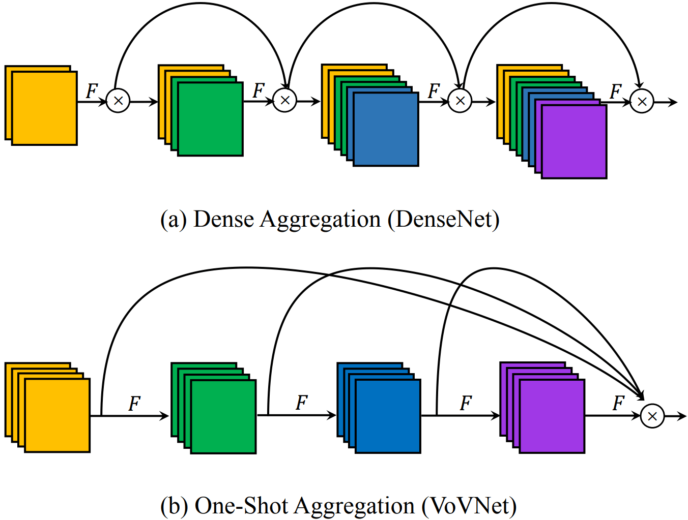
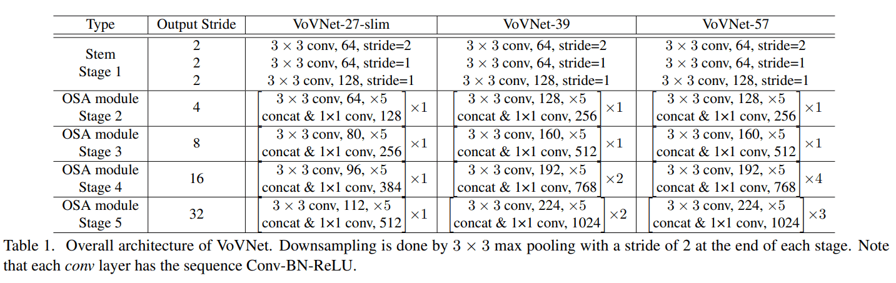

# VOVNet

- [An Energy and GPU-Computation Efficient Backbone Network for Real-Time Object Detection](https://arxiv.org/abs/1904.09730)

## Model Arch

### pre-processing

VOVNet系列网络的预处理操作可以按照如下步骤进行，即先对图片进行resize至256的尺寸，然后利用`CenterCrop`算子crop出224的图片对其进行归一化、减均值除方差等操作

```python
[
    torchvision.transforms.Resize(256),
    torchvision.transforms.CenterCrop(224),
    torchvision.transforms.ToTensor(),
    torchvision.transforms.Normalize(mean=[0.485, 0.456, 0.406], std=[0.229, 0.224, 0.225],),
]
```

### post-processing

VOVNet系列网络的后处理操作是对网络输出进行softmax作为每个类别的预测值，然后根据预测值进行排序，选择topk作为输入图片的预测分数以及类别

### backbone

ResNet是目标检测模型最常用的backbone，DenseNet其实比ResNet提取特征能力更强，而且其参数更少，计算量（FLOPs）也更少，用于目标检测虽然效果好，但是速度较慢，这主要是因为DenseNet中密集连接所导致的高内存访问成本和能耗。VoVNet就是为了解决DenseNet这一问题，基于VoVNet的目标检测模型性能超越基于DenseNet的模型，速度也更快，相比ResNet也是性能更好。

对于DenseNet来说，其核心模块就是Dense Block，如下图a所示，这种密集连接会聚合前面所有的layer，这导致每个layer的输入channel数线性增长。受限于FLOPs和模型参数，每层layer的输出channel数是固定大小，这带来的问题就是输入和输出channel数不一致，如前面所述，此时的MAC不是最优的。另外，由于输入channel数较大，DenseNet采用了1x1卷积层先压缩特征，这个额外层的引入对GPU高效计算不利。所以，虽然DenseNet的FLOPs和模型参数都不大，但是推理却并不高效，当输入较大时往往需要更多的显存和推理时间。

DenseNet的一大问题就是密集连接太重了，而且每个layer都会聚合前面层的特征，其实造成的是特征冗余，而且从模型weights的L1范数会发现中间层对最后的分类层贡献较少，这不难理解，因为后面的特征其实已经学习到了这些中间层的核心信息。这种信息冗余反而是可以优化的方向，据此这里提出了OSA（One-Shot Aggregation）模块，如图b所示，简单来说，就是只在最后一次性聚合前面所有的layer。这一改动将会解决DenseNet前面所述的问题，因为每个layer的输入channel数是固定的，这里可以让输出channel数和输入一致而取得最小的MAC，而且也不再需要1x1卷积层来压缩特征，所以OSA模块是GPU计算高效的。那么OSA模块效果如何，论文中拿DenseNet-40来做对比，Dense Block层数是12，OSA模块也设计为12层，但是保持和Dense Block类似的参数大小和计算量，此时OSA模块的输出将更大。最终发现在CIFAR-10数据集上acc仅比DenseNet下降了1.2%。但是如果将OSA模块的层数降至5，而提升layer的通道数为43，会发现与DenseNet-40模型效果相当。这说明DenseNet中很多中间特征可能是冗余的。尽管OSA模块性能没有提升，但是MAC低且计算更高效，这对于目标检测非常重要，因为检测模型一般的输入都是较大的。

<div align=center></div>

VoVNet由OSA模块构成，主要有三种不同的配置，如下表所示。VoVNet首先是一个由3个3x3卷积层构成的stem block，然后4个阶段的OSA模块，每个stage的最后会采用一个stride为2的3x3 max pooling层进行降采样，模型最终的output stride是32。与其他网络类似，每次降采样后都会提升特征的channel数。VoVNet-27-slim是一个轻量级模型，而VoVNet-39/57在stage4和stage5包含更多的OSA模块，所以模型更大。


<div align=center></div>


### head

VOVNet系列网络的head层由`AdaptiveAvgPool2d`层和`Linear`组成

### common

- AdaptiveAvgPool2d
- concat layer
- maxpooling
- 3x3 Conv
- 1x1 Conv
- ReLU


## Model Info

### 模型性能

| 模型  | 源码 | top1  | top5 | FLOPs (G) | Params(M) | input size |
| :---: | :--: | :--: | :--: | :---: | :----: | :--------: |
| ese_vovnet19b_dw |[timm](https://github.com/rwightman/pytorch-image-models/blob/v0.6.5/timm/models/vovnet.py)| 76.802   |  93.272   | 2.963 |    6.532    |    224    |
|  ese_vovnet39b  | [timm](https://github.com/rwightman/pytorch-image-models/blob/v0.6.5/timm/models/vovnet.py)| 79.312 | 94.714 |    15.721   |   24.549   |    224     |


### 测评数据集说明

<div align=center></div>

[ImageNet](https://image-net.org) 是一个计算机视觉系统识别项目，是目前世界上图像识别最大的数据库。是美国斯坦福的计算机科学家，模拟人类的识别系统建立的。能够从图片中识别物体。ImageNet是一个非常有前景的研究项目，未来用在机器人身上，就可以直接辨认物品和人了。超过1400万的图像URL被ImageNet手动注释，以指示图片中的对象;在至少一百万张图像中，还提供了边界框。ImageNet包含2万多个类别; 一个典型的类别，如“气球”或“草莓”，每个类包含数百张图像。

ImageNet数据是CV领域非常出名的数据集，ISLVRC竞赛使用的数据集是轻量版的ImageNet数据集。ISLVRC2012是非常出名的一个数据集，在很多CV领域的论文，都会使用这个数据集对自己的模型进行测试，在该项目中分类算法用到的测评数据集就是ISLVRC2012数据集的验证集。在一些论文中，也会称这个数据叫成ImageNet 1K或者ISLVRC2012，两者是一样的。`1K`代表的是1000个类别。

### 评价指标说明

- top1准确率: 测试图片中最佳得分所对应的标签是正确标注类别的样本数除以总的样本数
- top5准确率: 测试图片中正确标签包含在前五个分类概率中的个数除以总的样本数

## Deploy

### step.1 获取模型
1. timm

    ```bash
    pip install timm==0.6.5
    python ../common/utils/export_timm_torchvision_model.py --model_library timm  --model_name ese_vovnet39b --save_dir ./onnx  --size 256 --pretrained_weights xxx.pth
    ```

### step.2 准备数据集
- 本模型使用ImageNet官网ILSVRC2012的5万张验证集进行测试，针对`int8`校准数据可从该数据集中任选1000张，为了保证量化精度，请保证每个类别都有数据，请用户自行获取该数据集，[ILSVRC2012](https://image-net.org/challenges/LSVRC/2012/index.php)

    ```
    ├── ImageNet
    |   ├── val
    |   |    ├── ILSVRC2012_val_00000001.JPEG
    │   |    ├── ILSVRC2012_val_00000002.JPEG
    │   |    ├── ......
    |   ├── val_label.txt
    ```

    ```bash
    sh ./data_prep_sh_files/valprep.sh
    ```

    ```bash
    # label.txt
    tench, Tinca tinca
    goldfish, Carassius auratus
    ...
    ```

### step.3 模型转换

1. 使用模型转换工具vamc，根据具体模型修改模型转换配置文件

   ```bash
   vamc build ./vacc_code/build/timm_vovnet.yaml
   ```
   - [timm](./vacc_code/build/timm_vovnet.yaml)


### step.4 benchmark
1. 生成推理数据`npz`以及对应的`datalist.txt`
    ```bash
    python ../common/utils/image2npz.py --dataset_path /path/to/ILSVRC2012_img_val --target_path  /path/to/input_npz  --text_path npz_datalist.txt
    ```
2. 性能测试
    ```bash
    ./vamp -m ese_vovnet39b-int8-percentile-3_256_256-vacc/ese_vovnet39b --vdsp_params ./vacc_code/vdsp_params/timm-ese_vovnet39b-vdsp_params.json  -i 8 -p 1 -b 22
    ```
    
3. 获取精度信息
    ```bash
    ./vamp -m ese_vovnet39b-int8-percentile-3_256_256-vacc/ese_vovnet39b --vdsp_params ./vacc_code/vdsp_params/timm-ese_vovnet39b-vdsp_params.json  -i 8 -p 1 -b 22 --datalist npz_datalist.txt --path_output output
    ```
4. 结果解析及精度评估
    ```bash
    python ../common/eval/eval_imagenet.py --result_path output  --datalist npz_datalist.txt --label data/label/imagenet.txt
    ```
