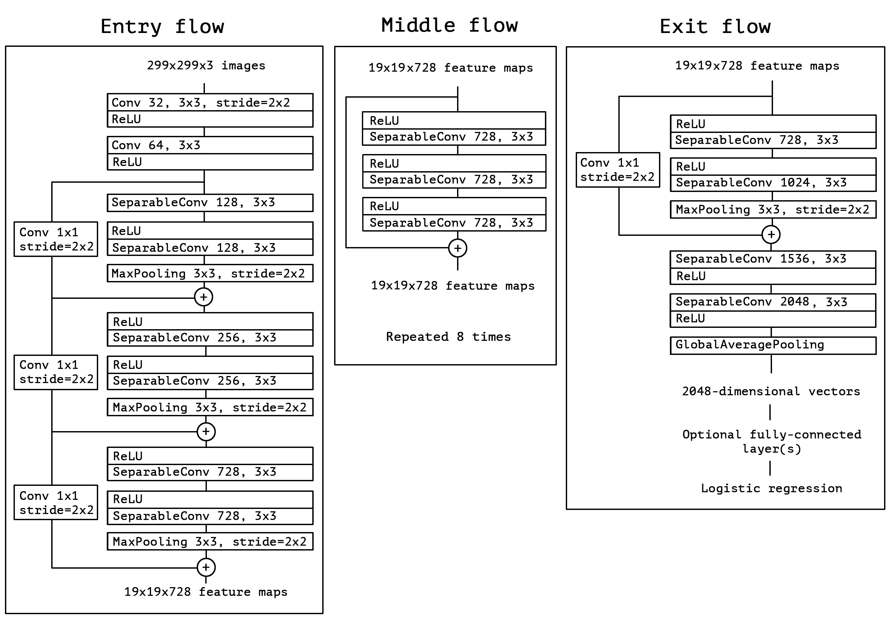
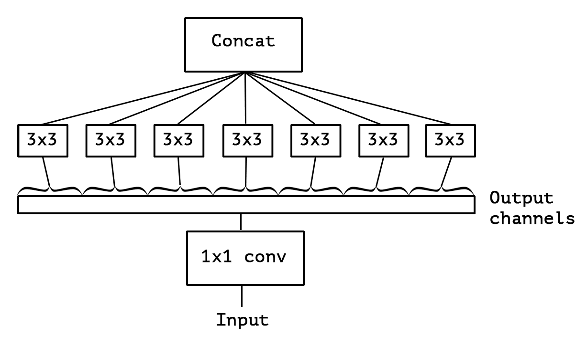

# Xception

[Xception: Deep Learning with Depthwise Separable Convolutions](https://arxiv.org/abs/1610.02357)


## Model Arch

<div align=center></div>

### pre-processing

Xception系列网络的预处理操作可以按照如下步骤进行，即先对图片进行resize至342的尺寸，然后利用`CenterCrop`算子crop出299的图片对其进行归一化、减均值除方差等操作。需要注意的是，Xception系列所用到的均值方差与其他resnet、vgg等网络所用的均值方差有所不同

```python
[
    torchvision.transforms.Resize(342),
    torchvision.transforms.CenterCrop(299),
    torchvision.transforms.ToTensor(),
    torchvision.transforms.Normalize(mean=[0.5, 0.5, 0.5], std=[0.5, 0.5, 0.5],),
]
```

### post-processing

Xception系列网络的后处理操作是对网络输出进行softmax作为每个类别的预测值，然后根据预测值进行排序，选择topk作为输入图片的预测分数以及类别

### backbone

Xception算法主要从Inception的角度出发，探讨了Inception和深度可分离卷积的关系，从一个全新的角度解释了深度可分离卷积。再结合残差网络，组成了Xception。Xception取义自Extreme Inception，即Xception是一种极端的Inception。

Inception网络是将3*3卷积分成3组，那么考虑一种极端的情况，如果将Inception的得到的k个通道的Feature Map完全分开，也就是使用k个不同的卷积分别在每个通道上进行卷积，这就是Xception的核心思想，这样可以极大地减少参数量和计算量。

<div align=center></div>

### head

Xception系列网络的head层由global-average-pooling层和一层全连接层组成

### common

- Inception架构
- extreme inception

## Model Info

### 模型性能

| 模型  | 源码 | top1 | top5 | flops(G) | params(M) | input size |
| :---: | :--: | :--: | :--: | :---: | :----: | :--------: |
| xception |[timm](https://github.com/rwightman/pytorch-image-models/blob/v0.6.5/timm/models/xception.py)|   79.050   |   94.392   |   9.198    |    22.856    |        299    |
| xception41 |[timm](https://github.com/rwightman/pytorch-image-models/blob/v0.6.5/timm/models/xception_aligned.py)   |   78.510   |   94.278  | 10.112      |  26.965      |      299     |
| xception41p |[timm](https://github.com/rwightman/pytorch-image-models/blob/v0.6.5/timm/models/xception_aligned.py)   |   81.960   |   95.794  | 9.952      |  26.854      |      299      |
| xception65 |[timm](https://github.com/rwightman/pytorch-image-models/blob/v0.6.5/timm/models/xception_aligned.py)   |   83.180   |   96.592  | 15.241     |  39.912      |      299      |
| xception65p |[timm](https://github.com/rwightman/pytorch-image-models/blob/v0.6.5/timm/models/xception_aligned.py)    | 83.126   |   96.478  | 15.000      |  39.731     |      299      |
| xception71 |[timm](https://github.com/rwightman/pytorch-image-models/blob/v0.6.5/timm/models/xception_aligned.py)  |   79.876   |   94.922  | 19.764      | 42.332       |      299      |
| xception |[keras](https://github.com/keras-team/keras/blob/2.3.1/keras/applications/xception.py)|   79.000   |   94.500   |   9.200    |    22.900    |        299    |
| xception41 |[ppcls](https://github.com/PaddlePaddle/PaddleClas/blob/release/2.3/docs/zh_CN/models/Inception.md)|   79.300   |   94.530   |   8.570    |    23.020    |        299    |
| xception41_deeplab |[ppcls](https://github.com/PaddlePaddle/PaddleClas/blob/release/2.3/docs/zh_CN/models/Inception.md)|   79.550   |   94.380   |   9.280    |    27.080    |        299    |
| xception65 |[ppcls](https://github.com/PaddlePaddle/PaddleClas/blob/release/2.3/docs/zh_CN/models/Inception.md)|   81.000   |   95.490   |   13.250    |    36.040    |        299    |
| xception65_deeplab |[ppcls](https://github.com/PaddlePaddle/PaddleClas/blob/release/2.3/docs/zh_CN/models/Inception.md)|   80.320   |   94.490   |   13.960    |    40.100    |        299    |
| xception71 |[ppcls](https://github.com/PaddlePaddle/PaddleClas/blob/release/2.3/docs/zh_CN/models/Inception.md)|   81.110   |   95.450   |   16.210    |    37.860    |        299    |

### 测评数据集说明

<div align=center></div>

[ImageNet](https://image-net.org) 是一个计算机视觉系统识别项目，是目前世界上图像识别最大的数据库。是美国斯坦福的计算机科学家，模拟人类的识别系统建立的。能够从图片中识别物体。ImageNet是一个非常有前景的研究项目，未来用在机器人身上，就可以直接辨认物品和人了。超过1400万的图像URL被ImageNet手动注释，以指示图片中的对象;在至少一百万张图像中，还提供了边界框。ImageNet包含2万多个类别; 一个典型的类别，如“气球”或“草莓”，每个类包含数百张图像。

ImageNet数据是CV领域非常出名的数据集，ISLVRC竞赛使用的数据集是轻量版的ImageNet数据集。ISLVRC2012是非常出名的一个数据集，在很多CV领域的论文，都会使用这个数据集对自己的模型进行测试，在该项目中分类算法用到的测评数据集就是ISLVRC2012数据集的验证集。在一些论文中，也会称这个数据叫成ImageNet 1K或者ISLVRC2012，两者是一样的。“1 K”代表的是1000个类别。

### 评价指标说明

- top1准确率: 测试图片中最佳得分所对应的标签是正确标注类别的样本数除以总的样本数
- top5准确率: 测试图片中正确标签包含在前五个分类概率中的个数除以总的样本数

## Deploy

### step.1 获取模型

1. timm

    ```bash
    pip install timm==0.6.5
    python ../common/utils/export_timm_torchvision_model.py --model_library timm  --model_name xception --save_dir ./onnx  --size 299 --pretrained_weights xxx.pth
    ```

2. ppcls

    mmcls框架参考 [mmclassification](https://github.com/open-mmlab/mmclassification),可使用如下位置的pytorch2onnx.py或pytorch2torchscript.py转成相应的模型
    ```bash
    git clone https://github.com/open-mmlab/mmclassification.git
    cd mmclassification

    python tools/deployment/pytorch2onnx.py \
            --config configs/xception/xception41_b32x8_imagenet.py \
            --checkpoint weights/xception41.pth \
            --output-file output/xception41.onnx \
    ```
3. keras

    ⚠️ keras h5 is directly supported formats!

### step.2 准备数据集
本模型使用ImageNet官网ILSVRC2012的5万张验证集进行测试，针对`int8`校准数据可从该数据集中任选1000张，为了保证量化精度，请保证每个类别都有数据，请用户自行获取该数据集，[ILSVRC2012](https://image-net.org/challenges/LSVRC/2012/index.php)
```
├── ImageNet
|   ├── val
|   |    ├── ILSVRC2012_val_00000001.JPEG
│   |    ├── ILSVRC2012_val_00000002.JPEG
│   |    ├── ......
|   ├── val_label.txt
````

```bash
sh ./data_prep_sh_files/valprep.sh
```

```bash
# label.txt
tench, Tinca tinca
goldfish, Carassius auratus
...
```

### step.3 模型转换

1. 使用模型转换工具vamc，根据具体模型修改模型转换配置文件
    ```bash
    vamc build ./vacc_code/build/timm_xception.yaml
    ```
    - [timm](./vacc_code/build/timm_xception.yaml)
    - [ppcls](./vacc_code/build/ppcls_xception.yaml)
    - [keras](./vacc_code/build/keras_xception.yaml)

### step.4 模型推理
1. 根据step.3配置模型三件套信息，[model_info](./vacc_code/model_info/model_info_xception.json)
2. 配置数据预处理流程vdsp_params参数
   - [timm](./vacc_code/vdsp_params/sdk1.0/timm-xception-vdsp_params.json)
   - [ppcls](./vacc_code/vdsp_params/sdk1.0/ppcls-xception41_deeplab-vdsp_params.json)
   - [keras](./vacc_code/vdsp_params/sdk1.0/keras-xception-vdsp_params.json)
   

3. 执行推理，参考[runstream](../common/sdk1.0/sample_cls.py)
    ```bash
    python ../common/sdk1.0/sample_cls.py --save_dir output/xception_result.txt

4. 精度评估
   ```bash
    python ../common/eval/eval_topk.py output/xception_result.txt
   ```

### step.5 benchmark
1. 生成推理数据`npz`以及对应的`datalist.txt`
    ```bash
    python ../common/utils/image2npz.py --dataset_path /path/to/ILSVRC2012_img_val --target_path  /path/to/input_npz  --text_path npz_datalist.txt
    ```
2. 性能测试
    ```bash
    ./vamp -m xception-int8-percentile-3_299_299-vacc/xception --vdsp_params ./vacc_code/vdsp_params/vamp/timm-xception-vdsp_params.json  -i 1 -p 1 -b 1
    ```
    
3. 获取精度信息
    ```bash
    ./vamp -m xception-int8-percentile-3_299_299-vacc/xception --vdsp_params ./vacc_code/vdsp_params/vamp/timm-xception-vdsp_params.json  -i 1 -p 1 -b 1  --datalist npz_datalist.txt --path_output output
    ```
4. 结果解析及精度评估
   ```bash
   python ../common/eval/eval_imagenet.py --result_path output  --datalist npz_datalist.txt --label data/label/imagenet.txt
   ```
