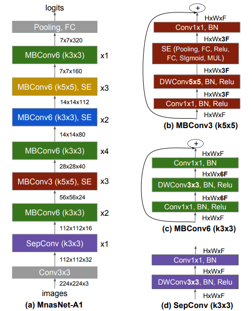

# MNasNet

- [MnasNet: Platform-Aware Neural Architecture Search for Mobile](https://arxiv.org/abs/1807.11626)


## Model Arch

### pre-processing

MnasNet系列网络的预处理操作可以按照如下步骤进行，即先对图片进行resize至256的尺寸，然后利用`CenterCrop`算子crop出224的图片对其进行归一化、减均值除方差等操作

```python
[
    torchvision.transforms.Resize(256),
    torchvision.transforms.CenterCrop(224),
    torchvision.transforms.ToTensor(),
    torchvision.transforms.Normalize(mean=[0.485, 0.456, 0.406], std=[0.229, 0.224, 0.225],),
]
```

### post-processing

MnasNet系列网络的后处理操作是对网络输出进行softmax作为每个类别的预测值，然后根据预测值进行排序，选择topk作为输入图片的预测分数以及类别

### backbone

MNasNet算法是Google团队使用强化学习的思路，提出一种资源约束的终端CNN模型的自动神经结构搜索方法。论文将实时性显式地结合到主要目标中，这样搜索空间就可以识别出一个在准确性和实时性实现良好平衡的模型，即实时性和准确率作为reward，并且直接使用手机平台（Pixel phones等）运行模型，直接测量实时性和准确率。为了进一步在灵活性和搜索空间大小之间取得适当的平衡，论文还提出一种新的分解层次搜索空间，该空间允许整个网络的分层多样性。

论文使用层级搜索空间，即划分CNN layers成多个groups，对每个group搜索卷积和连接，相比其他算法只搜索几个复杂的单元，然后重复叠加相同的单元，论文简化了每个单元格的搜索空间，但允许各个单元不同。

如图所示，论文划分CNN模型为一系列预定义的Block序列，逐渐降低输入分辨率和增加滤波器尺寸。每一个Block内含有一系列identical layers，其卷积操作和连接由每一个Block搜索空间确定。对第i个Block，由以下参数决定：

- 卷积类型（Convolutional ops ConvOp）: regular conv (conv), depthwise conv (dconv), and mobile inverted bottleneck conv with various expansion ratios
- 卷积内核 Convolutional kernel size KernelSize: 3x3, 5x5.
- 跳跃层连接方式 Skip operations SkipOp: max or average pooling, identity residual skip, or no skip path.
- 输出滤波器尺寸 Output filter size Fi

<div align=center></div>


下图显示了MnasNet算法的神经网络架构，包含一系列线性连接blocks，每个block虽然包含不同类别的卷积层，每一卷积层都包含depthwise convolution卷积操作，最大化模型的计算效率。但是和MobileNet V1&V2等算法有明显不同：

- 模型使用更多5x5 depthwise convolutions。对于depthwise separable convolution， 一个5x5卷积核比两个3x3卷积核更高效：
- 层分级的重要性。很多轻量化模型重复 block 架构，只改变滤波器尺寸和空间维度。论文提出的层级搜索空间允许模型的各个block包括不同的卷积层。轮的ablation study比较了MnasNet的各种变体（即单独重复使用各个block），在准确率和实时性方面难以达到平衡，验证了层分级的重要性。

<div align=center></div>


### head

MnasNet系列网络的head层由`AdaptiveAvgPool2d`层和`Linear`组成

### common

- AdaptiveAvgPool2d
- 5x5 depthwise convolutions
- 3x3 Conv
- ReLU


## Model Info

### 模型性能

| 模型  | 源码 | top1  | top5 | FLOPs (G) | Params(M) | input size |
| :---: | :--: | :--: | :--: | :---: | :----: | :--------: |
| mnasnet0_5 |[torchvision](https://github.com/pytorch/vision/blob/v0.9.0/torchvision/models/mnasnet.py)| 	67.734   |  87.49   | 0.259 |    2.219    |    224    |
|  mnasnet1_0  | [torchvision](https://github.com/pytorch/vision/blob/v0.9.0/torchvision/models/mnasnet.py)| 	73.456 | 91.51|    0.747   |   4.383   |    224     |


### 测评数据集说明

<div align=center></div>

ImageNet是一个计算机视觉系统识别项目，是目前世界上图像识别最大的数据库。是美国斯坦福的计算机科学家，模拟人类的识别系统建立的。能够从图片中识别物体。ImageNet是一个非常有前景的研究项目，未来用在机器人身上，就可以直接辨认物品和人了。超过1400万的图像URL被ImageNet手动注释，以指示图片中的对象;在至少一百万张图像中，还提供了边界框。ImageNet包含2万多个类别; 一个典型的类别，如“气球”或“草莓”，每个类包含数百张图像。

ImageNet数据是CV领域非常出名的数据集，ISLVRC竞赛使用的数据集是轻量版的ImageNet数据集。ISLVRC2012是非常出名的一个数据集，在很多CV领域的论文，都会使用这个数据集对自己的模型进行测试，在该项目中分类算法用到的测评数据集就是ISLVRC2012数据集的验证集。在一些论文中，也会称这个数据叫成ImageNet 1K或者ISLVRC2012，两者是一样的。`1K`代表的是1000个类别。

### 评价指标说明

- top1准确率: 测试图片中最佳得分所对应的标签是正确标注类别的样本数除以总的样本数
- top5准确率: 测试图片中正确标签包含在前五个分类概率中的个数除以总的样本数

## Build_In Deploy

- [torchvision_mnasnet.md](./source_code/torchvision_mnasnet.md)
