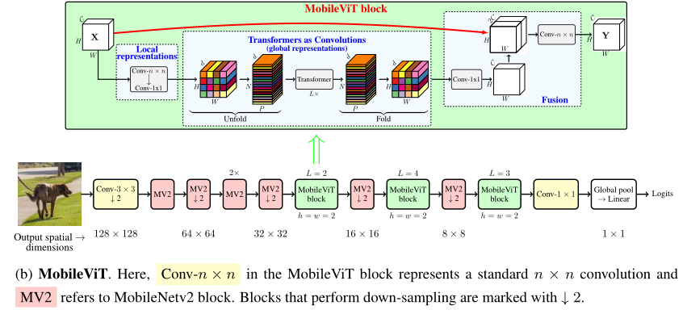
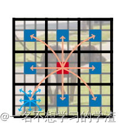
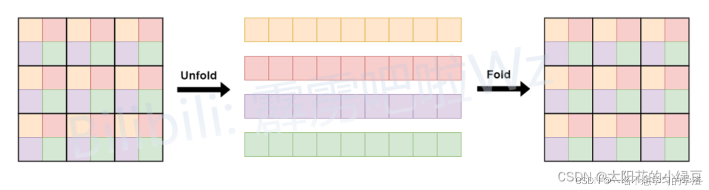

# MobileVit

[MobileViT: Light-weight, General-purpose, and Mobile-friendly Vision Transformer](https://arxiv.org/abs/2110.02178)

## Model Arch

### pre-processing

MobileVit网络的预处理操作可以按照如下步骤进行，即先对图片进行resize至224的尺寸，然后对其进行归一化、减均值除方差等操作：

### post-processing

MobileVit网络的后处理操作是对网络输出进行softmax作为每个类别的预测值，然后根据预测值进行排序，选择topk作为输入图片的预测分数以及类别。

### backbone

MobileViT引入了MobileViT块，它可以有效地将局部和全局信息进行编码。与ViT及其变体不同，MobileViT从不同的角度学习全局表示。标准卷积涉及三个操作：展开（unfloading） 、局部处理（local processing） 和展开（folding） 。MobileViT块使用Transformer将卷积中的局部建模替换为全局建模。这使得MobileViT块具有CNN和ViT的性质，有助于它用更少的参数和简单的训练方式学习更好的表示。

网络结构如上所示，我们可以看出该网络结构就是通过MV2模块和MobileViT 模块所组成，其中MV2块就是MobileNetv2的block，它是一种倒残差结构，即特征图的维度是先升后降，据相关论文中描述说，更高的维度经过激活函数后，它损失的信息就会少一些。
MobileViT 模块相比较就有些复杂，如下图所示，这也是这篇论文的重点，首先将特征图通过一个卷积核大小为nxn（代码中是3x3）的卷积层进行局部的特征建模，然后通过一个卷积核大小为1x1的卷积层调整通道数。接着通过Unfold -> Transformer -> Fold结构进行全局的特征建模，然后再通过一个卷积核大小为1x1的卷积层将通道数调整回原始大小。接着通过shortcut捷径分支（在V2版本中将该捷径分支取消了）与原始输入特征图进行Concat拼接（沿通道channel方向拼接），最后再通过一个卷积核大小为nxn（代码中是3x3）的卷积层做特征融合得到输出。
由于为了减少参数量，Unfold -> Transformer -> Fold，在本次的自注意力机制中，只选择了位置相同的像素点进行点积操作。这样做的原因大概就是因为和所有的像素点都进行自注意力操作会带来信息冗余，毕竟不是所有的像素都是有用的。具体的做法如下图所示。

### head

MobileViT网络的head层由global-average-pooling层和一层全连接层组成

### common

- MobileViT

## Model Info

### 模型性能

|       模型        |                                                       源码                                                       |  top1  |  top5  | flops(M) | params(M) | input size |
| :---------------: | :--------------------------------------------------------------------------------------------------------------: | :----: | :----: | :------: | :-------: | :--------: |
|   MobileViT   | [pytorch](https://github.com/wilile26811249/MobileViT) | 61.918 | 8.05.7 |  9.010  |   22.50   |    224     |

### 测评数据集说明

ImageNet是一个计算机视觉系统识别项目，是目前世界上图像识别最大的数据库。是美国斯坦福的计算机科学家，模拟人类的识别系统建立的。能够从图片中识别物体。ImageNet是一个非常有前景的研究项目，未来用在机器人身上，就可以直接辨认物品和人了。超过1400万的图像URL被ImageNet手动注释，以指示图片中的对象;在至少一百万张图像中，还提供了边界框。ImageNet包含2万多个类别; 一个典型的类别，如“气球”或“草莓”，每个类包含数百张图像。

ImageNet数据是CV领域非常出名的数据集，ISLVRC竞赛使用的数据集是轻量版的ImageNet数据集。ISLVRC2012是非常出名的一个数据集，在很多CV领域的论文，都会使用这个数据集对自己的模型进行测试，在该项目中分类算法用到的测评数据集就是ISLVRC2012数据集的验证集。在一些论文中，也会称这个数据叫成ImageNet 1K或者ISLVRC2012，两者是一样的。“1 K”代表的是1000个类别。

### 评价指标说明

- top1准确率: 测试图片中最佳得分所对应的标签是正确标注类别的样本数除以总的样本数
- top5准确率: 测试图片中正确标签包含在前五个分类概率中的个数除以总的样本数

## Build_In Deploy
- [apple_deploy](./source_code/apple_deploy.md)