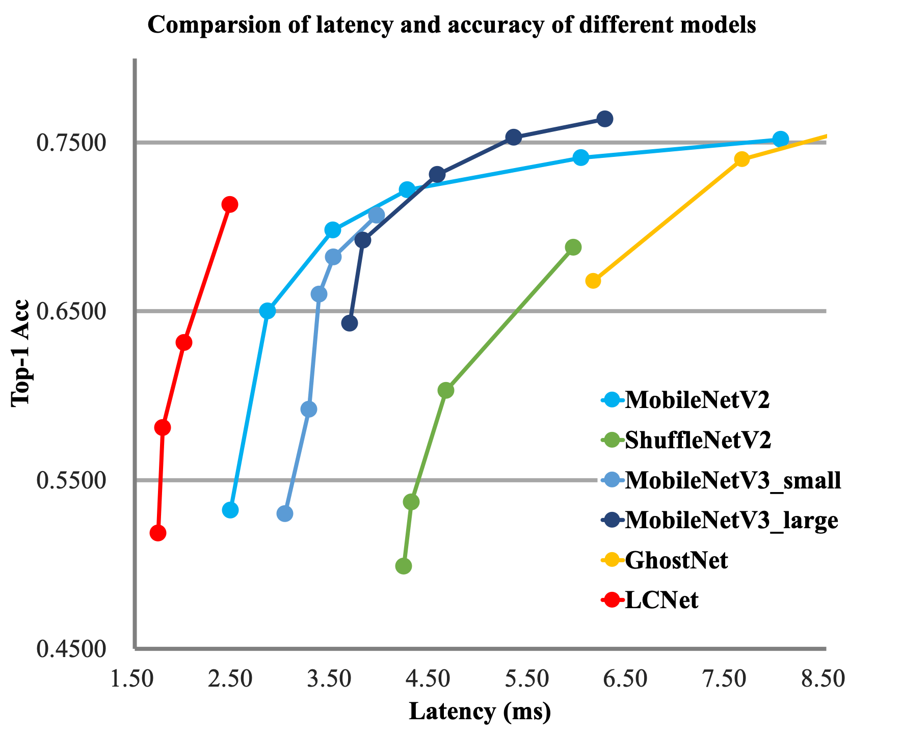

# PPLCNet

[PP-LCNet: A Lightweight CPU Convolutional Neural Network](https://arxiv.org/abs/2109.15099)


## Model Arch

<div align=center></div>

### pre-processing

PPLCNet网络的预处理操作可以按照如下步骤进行，即先对图片进行resize至256的尺寸，然后利用`CenterCrop`算子crop出224的图片对其进行归一化、减均值除方差等操作：

```python
[
    torchvision.transforms.Resize(256),
    torchvision.transforms.CenterCrop(224),
    torchvision.transforms.ToTensor(),
    torchvision.transforms.Normalize(mean=[0.485, 0.456, 0.406], std=[0.229, 0.224, 0.225],),
]
```

### post-processing

PPLCNet系列网络的后处理操作是对网络输出进行softmax作为每个类别的预测值，然后根据预测值进行排序，选择topk作为输入图片的预测分数以及类别。

### backbone

近年来，有很多轻量级的骨干网络问世，尤其最近两年，各种 NAS 搜索出的网络层出不穷，这些网络要么主打 FLOPs 或者 Params 上的优势，要么主打 ARM 设备上的推理速度的优势，很少有网络专门针对 Intel CPU 做特定的优化，导致这些网络在 Intel CPU 端的推理速度并不是很完美。基于此，PaddleClas针对 Intel CPU 设备以及其加速库 MKLDNN 设计了特定的骨干网络 PP-LCNet，比起其他的轻量级的 SOTA 模型，该骨干网络可以在不增加推理时间的情况下，进一步提升模型的性能，最终大幅度超越现有的 SOTA 模型。与其他模型的对比图如下。

<div align=center></div>

针对骨架网络的优化，PaddleClas引入了以下几种改进策略：

- 更好的激活函数，H-Swish，该激活函数去除了指数运算，速度更快，网络精度几乎不受影响
- 合适的位置添加 SE 模块，SE 模块是 SENet 提出的一种通道注意力机制，可以有效提升模型的精度。但是在 Intel CPU 端，该模块同样会带来较大的延时，如何平衡精度和速度是我们要解决的一个问题。虽然在 MobileNetV3 等基于 NAS 搜索的网络中对 SE 模块的位置进行了搜索，但是并没有得出一般的结论，通过实验发现，SE 模块越靠近网络的尾部对模型精度的提升越大
- 合适的位置添加更大的卷积核，在 MixNet 的论文中，作者分析了卷积核大小对模型性能的影响，结论是在一定范围内大的卷积核可以提升模型的性能，但是超过这个范围会有损模型的性能，所以作者组合了一种 split-concat 范式的 MixConv，这种组合虽然可以提升模型的性能，但是不利于推理。我们通过实验总结了一些更大的卷积核在不同位置的作用，类似 SE 模块的位置，更大的卷积核在网络的中后部作用更明显
- GAP 后使用更大的 1x1 卷积层，在 GoogLeNet 之后，GAP（Global-Average-Pooling）后往往直接接分类层，但是在轻量级网络中，这样会导致 GAP 后提取的特征没有得到进一步的融合和加工。如果在此后使用一个更大的 1x1 卷积层（等同于 FC 层），GAP 后的特征便不会直接经过分类层，而是先进行了融合，并将融合的特征进行分类。这样可以在不影响模型推理速度的同时大大提升准确率。 BaseNet 经过以上四个方面的改进，得到了 PP-LCNet

### head

PPLCNet系列网络的head层由global-average-pooling层和一层 1x1 卷积层（等同于 FC 层），GAP 后的特征便不会直接经过分类层，而是先进行了融合，并将融合的特征进行分类。

### common

- SE Module
- H-Swish
- Depthwise separable convolution
- 1x1 convolution

## Model Info

### 模型性能

|       模型        |                                                       源码                                                       |  top1  |  top5  | flops(M) | params(M) | input size |
| :---------------: | :--------------------------------------------------------------------------------------------------------------: | :----: | :----: | :------: | :-------: | :--------: |
|   PPLCNet_x0_25   | [ppcls](https://github.com/PaddlePaddle/PaddleClas/blob/v2.4.0/ppcls/arch/backbone/legendary_models/pp_lcnet.py) | 51.860 | 75.650 |  18.000  |   1.500   |    224     |
|   PPLCNet_x0_35   | [ppcls](https://github.com/PaddlePaddle/PaddleClas/blob/v2.4.0/ppcls/arch/backbone/legendary_models/pp_lcnet.py) | 58.090 | 80.830 |  29.000  |   1.600   |    224     |
|   PPLCNet_x0_5    | [ppcls](https://github.com/PaddlePaddle/PaddleClas/blob/v2.4.0/ppcls/arch/backbone/legendary_models/pp_lcnet.py) | 63.140 | 84.660 |  47.000  |   1.900   |    224     |
|   PPLCNet_x0_75   | [ppcls](https://github.com/PaddlePaddle/PaddleClas/blob/v2.4.0/ppcls/arch/backbone/legendary_models/pp_lcnet.py) | 68.180 | 88.300 |  99.000  |   2.400   |    224     |
|   PPLCNet_x1_0    | [ppcls](https://github.com/PaddlePaddle/PaddleClas/blob/v2.4.0/ppcls/arch/backbone/legendary_models/pp_lcnet.py) | 71.320 | 90.030 | 161.000  |   3.000   |    224     |
|   PPLCNet_x1_5    | [ppcls](https://github.com/PaddlePaddle/PaddleClas/blob/v2.4.0/ppcls/arch/backbone/legendary_models/pp_lcnet.py) | 73.710 | 91.530 | 342.000  |   4.500   |    224     |
|   PPLCNet_x2_0    | [ppcls](https://github.com/PaddlePaddle/PaddleClas/blob/v2.4.0/ppcls/arch/backbone/legendary_models/pp_lcnet.py) | 75.180 | 92.270 | 590.000  |   6.500   |    224     |
|   PPLCNet_x2_5    | [ppcls](https://github.com/PaddlePaddle/PaddleClas/blob/v2.4.0/ppcls/arch/backbone/legendary_models/pp_lcnet.py) | 76.600 | 93.000 | 906.000  |   9.000   |    224     |
| PPLCNet_x0_5_ssld | [ppcls](https://github.com/PaddlePaddle/PaddleClas/blob/v2.4.0/ppcls/arch/backbone/legendary_models/pp_lcnet.py) | 66.100 | 86.460 |  47.000  |   1.900   |    224     |
| PPLCNet_x1_0_ssld | [ppcls](https://github.com/PaddlePaddle/PaddleClas/blob/v2.4.0/ppcls/arch/backbone/legendary_models/pp_lcnet.py) | 74.390 | 92.090 | 161.000  |   3.000   |    224     |
| PPLCNet_x2_5_ssld | [ppcls](https://github.com/PaddlePaddle/PaddleClas/blob/v2.4.0/ppcls/arch/backbone/legendary_models/pp_lcnet.py) | 80.820 | 95.330 | 906.000  |   9.000   |    224     |

### 测评数据集说明

<div align=center></div>

ImageNet是一个计算机视觉系统识别项目，是目前世界上图像识别最大的数据库。是美国斯坦福的计算机科学家，模拟人类的识别系统建立的。能够从图片中识别物体。ImageNet是一个非常有前景的研究项目，未来用在机器人身上，就可以直接辨认物品和人了。超过1400万的图像URL被ImageNet手动注释，以指示图片中的对象;在至少一百万张图像中，还提供了边界框。ImageNet包含2万多个类别; 一个典型的类别，如“气球”或“草莓”，每个类包含数百张图像。

ImageNet数据是CV领域非常出名的数据集，ISLVRC竞赛使用的数据集是轻量版的ImageNet数据集。ISLVRC2012是非常出名的一个数据集，在很多CV领域的论文，都会使用这个数据集对自己的模型进行测试，在该项目中分类算法用到的测评数据集就是ISLVRC2012数据集的验证集。在一些论文中，也会称这个数据叫成ImageNet 1K或者ISLVRC2012，两者是一样的。“1 K”代表的是1000个类别。

### 评价指标说明

- top1准确率: 测试图片中最佳得分所对应的标签是正确标注类别的样本数除以总的样本数
- top5准确率: 测试图片中正确标签包含在前五个分类概率中的个数除以总的样本数

## Build_In Deploy
- [ppcls_pplcnet.md](./source_code/ppcls_pplcnet.md)