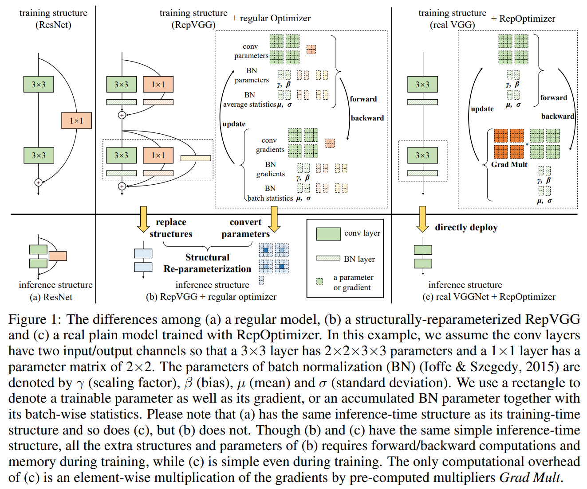

# RepOpt

[Re-parameterizing Your Optimizers rather than Architectures](https://arxiv.org/abs/2205.15242)

## Code Source
```
link: https://github.com/DingXiaoH/RepOptimizers
branch: main
commit: 2e45ff5388e9d7aabf112d7e2973df8183e6c6d9
```

## Model Arch

### pre-processing

RepOpt系列网络的预处理操作可以按照如下步骤进行，即先对图片进行resize至256的尺寸，然后利用`CenterCrop`算子crop出224的图片对其进行归一化、减均值除方差等操作

```python
[
    torchvision.transforms.Resize(256),
    torchvision.transforms.CenterCrop(224),
    torchvision.transforms.ToTensor(),
    torchvision.transforms.Normalize(mean=[0.485, 0.456, 0.406], std=[0.229, 0.224, 0.225],),
]
```

### post-processing

RepOpt系列网络的后处理操作是对网络输出进行softmax作为每个类别的预测值，然后根据预测值进行排序，选择topk作为输入图片的预测分数以及类别

### backbone

RepOpt系列网络的backbone结构可由`RealVGGBlock`或`RepVGGBlock`堆叠而成。

结构化模型重参化，如RepVGG，将模型训练和模型预测的网络结构分离，在模型训练时设计更加复杂的网络结构以获取更高的模型精度，而在模型推理阶段则将训练时的网络结构进行等价转换以在模型精度不变的情况下提高模型的推理效率。很明显，结构化模型重参化训练效率和资源消耗方面表现都比较弱，而且网络进行变换后对模型量化不友好，这限制了结构化模型重参化技术的应用与推广。为了解决这些问题，RepOptimizer提出了一种新的重参化技术，即梯度重参化。在RepOptimizer中，训练时的网络结构和推理时的网络结构一致，无需网络结构等价变换，这就解决了RepVGG等结构重参化技术存在的问题。同时，RepOptimizer通过构造RepVGG训练时网络结构的梯度去重参化网络节点梯度，使得RepOptimizer获得了和结构化模型重参化一样的训练效果（更高的准确率），即RepVGG+regular optimizer = real VGGNet +RepOptimizer。

- 直桶型网络VGG+模型相关的优化器：VGG结构简单，少有人为先验；模型相关优化器与模型的结构紧密相关，训练的过程根据特定模型的方式而变化
- 提出一种针对SGD的特定优化器：利用特定于模型的超参数作用在梯度上，使得优化器成为`model-specific`，称之为梯度重参数化(Gradient Re-parameterization, GR)。如何获取这组超参数：提出一种超参数搜索的方法

<div align=center></div>

### head

RepOpt系列网络的head层由`AdaptiveAvgPool2d`层和`Linear`组成

### common

- AdaptiveAvgPool2d
- all 3x3 Conv
- SEBlock
- BatchNorm2d


## Model Info

### 模型性能

| 模型  | 源码 | top1  | top5 | FLOPs (G) | Params(M) | input size |
| :---: | :--: | :--: | :--: | :---: | :----: | :--------: |
| RepOpt-VGG-B1 |[official](https://github.com/DingXiaoH/RepOptimizers) |   78.620   |   -  | 26.281 |    51.842    |    224    |
| RepOpt-VGG-B2 |[official](https://github.com/DingXiaoH/RepOptimizers) |   79.680   |   -  | 40.866 |    80.331    |    224    |
| RepOpt-VGG-L1 |[official](https://github.com/DingXiaoH/RepOptimizers) |   79.820   |   -  | 46.850 |    76.038    |    224    |
| RepOpt-VGG-L2 |[official](https://github.com/DingXiaoH/RepOptimizers) |   80.470   |   -  | 73.001 |    118.133   |    224    |


### 测评数据集说明

<div align=center></div>

[ImageNet](https://image-net.org/)是一个计算机视觉系统识别项目，是目前世界上图像识别最大的数据库。是美国斯坦福的计算机科学家，模拟人类的识别系统建立的。能够从图片中识别物体。ImageNet是一个非常有前景的研究项目，未来用在机器人身上，就可以直接辨认物品和人了。超过1400万的图像URL被ImageNet手动注释，以指示图片中的对象;在至少一百万张图像中，还提供了边界框。ImageNet包含2万多个类别; 一个典型的类别，如“气球”或“草莓”，每个类包含数百张图像。

ImageNet数据是CV领域非常出名的数据集，ISLVRC竞赛使用的数据集是轻量版的ImageNet数据集。ISLVRC2012是非常出名的一个数据集，在很多CV领域的论文，都会使用这个数据集对自己的模型进行测试，在该项目中分类算法用到的测评数据集就是ISLVRC2012数据集的验证集。在一些论文中，也会称这个数据叫成ImageNet 1K或者ISLVRC2012，两者是一样的。`1K`代表的是1000个类别。

### 评价指标说明

- top1准确率: 测试图片中最佳得分所对应的标签是正确标注类别的样本数除以总的样本数
- top5准确率: 测试图片中正确标签包含在前五个分类概率中的个数除以总的样本数

## Build_In Deploy

### step.1 获取模型
- 将[export.py](./source_code/export.py)文件放置于`{RepOptimizers}`工程目录类，执行以下脚本导出onnx和torchscript
    ```bash
    python export.py --arch RepOpt-VGG-B1-target --tag test --eval --resume weights/RepOpt-VGG-B1-acc78.62.pth --data-path /path/to/imagenet --batch-size 32 --opts DATA.DATASET imagenet
    ```

### step.2 获取数据集
- [校准数据集](https://image-net.org/challenges/LSVRC/2012/index.php)
- [评估数据集](https://image-net.org/challenges/LSVRC/2012/index.php)
- [label_list](../../common/label/imagenet.txt)
- [label_dict](../../common/label/imagenet1000_clsid_to_human.txt)

### step.3 模型转换
1. 根据具体模型，修改编译配置
    - [official_repopt.yaml](./build_in/build/official_repopt.yaml)
    
    > - 编译参数`backend.type: tvm_vacc`
    > - fp16精度: 编译参数`backend.dtype: fp16`
    > - int8精度: 编译参数`backend.dtype: int8`，需要配置量化数据集和预处理算子

2. 模型编译

    ```bash
    cd repopt
    mkdir workspace
    cd workspace
    vamc compile ../build_in/build/official_repopt.yaml
    ```

### step.4 模型推理
 - 参考：[classification.py](../common/vsx/classification.py)
    ```bash
    python ../../common/vsx/classification.py \
        --infer_mode sync \
        --file_path path/to/ILSVRC2012_img_val \
        --model_prefix_path deploy_weights/official_repopt_fp16/mod \
        --vdsp_params_info ../build_in/vdsp_params/official-repopt_vgg_b1-vdsp_params.json \
        --label_txt path/to/imagenet.txt \
        --save_dir ./infer_output \
        --save_result_txt result.txt \
        --device 0
    ```

    - 精度评估
    ```
    python ../../common/eval/eval_topk.py ./infer_output/result.txt
    ```

    ```
    # fp16
    top1_rate: 78.136 top5_rate: 93.946

    # int8
    top1_rate: 75.718 top5_rate: 92.768
    ```

### step.5 性能精度测试
1. 性能测试
    - 配置[official-repopt_vgg_b1-vdsp_params.json](./build_in/vdsp_params/official-repopt_vgg_b1-vdsp_params.json)
    ```bash
    vamp -m deploy_weights/official_repopt_int8/mod --vdsp_params ../build_in/vdsp_params/official-repopt_vgg_b1-vdsp_params.json  -i 8 -p 1 -b 2 -s [3,224,224]
    ```

2. 精度测试
    > **可选步骤**，通过vamp推理方式获得推理结果，然后解析及评估精度；
    
    - 数据准备，生成推理数据`npz`以及对应的`dataset.txt`
    ```bash
    python ../../common/utils/image2npz.py --dataset_path ILSVRC2012_img_val --target_path  input_npz  --text_path imagenet_npz.txt
    ```

    - vamp推理获取npz文件
    ```
    vamp -m deploy_weights/keras_densenet_int8/mod --vdsp_params ../build_in/vdsp_params/keras-densenet121-vdsp_params.json  -i 8 -p 1 -b 22 -s [3,224,224] --datalist imagenet_npz.txt --path_output output
    ```

    - 解析输出结果用于精度评估，参考：[vamp_npz_decode.p](../common/eval/vamp_npz_decode.py)
    ```bash
    python  ../../common/eval/vamp_npz_decode.py imagenet_npz.txt output imagenet_result.txt imagenet.txt
    ```
    
    - 精度评估，参考：[eval_topk.py](../common/eval/eval_topk.py)
    ```bash
    python ../../common/eval/eval_topk.py imagenet_result.txt
    ```