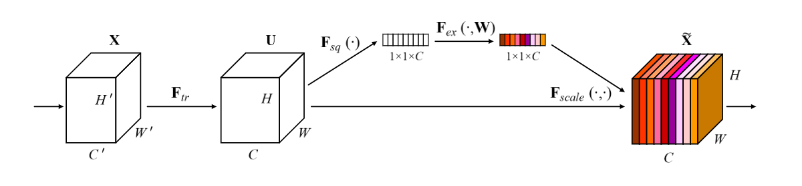

# RepVGG

[RepVGG: Making VGG-style ConvNets Great Again](https://arxiv.org/abs/2101.03697)

## Code Source
```
link: https://github.com/DingXiaoH/RepVGG
branch: main
commit: eae7c5204001eaf195bbe2ee72fb6a37855cce33

link: https://github.com/open-mmlab/mmpretrain/
tag: v0.23.2

link: https://github.com/PaddlePaddle/PaddleClas/blob/release/2.5/docs/zh_CN/models/ImageNet1k/RepVGG.md
tag: v2.5.1

```

## Model Arch

### pre-processing

RepVGG系列网络的预处理操作可以按照如下步骤进行，即先对图片进行resize至256的尺寸，然后利用`CenterCrop`算子crop出224的图片对其进行归一化、减均值除方差等操作

```python
[
    torchvision.transforms.Resize(256),
    torchvision.transforms.CenterCrop(224),
    torchvision.transforms.ToTensor(),
    torchvision.transforms.Normalize(mean=[0.485, 0.456, 0.406], std=[0.229, 0.224, 0.225],),
]
```

### post-processing

RepVGG系列网络的后处理操作是对网络输出进行softmax作为每个类别的预测值，然后根据预测值进行排序，选择topk作为输入图片的预测分数以及类别

### backbone

RepVGG系列网络的backbone结构是由`RepVGGBlock`堆叠而成，用结构重参数化（structural re-parameterization）实现VGG式单路极简架构，一路3x3卷到底，在速度和性能上达到SOTA水平，在ImageNet上超过80%正确率
<div align=center></div>

同时，也可以选择是否加载[SEBlock](https://arxiv.org/abs/1709.01507), 其结构如下：
<div align=center></div>


### head

RepVGG系列网络的head层由`AdaptiveAvgPool2d`层和`Linear`组成

### common

- AdaptiveAvgPool2d
- Linear
- all 3x3 Conv
- SEBlock
- ReLU


### deploy
- 训练完成后，我们对模型做等价转换，得到部署模型。这一转换也非常简单，因为1x1卷积是一个特殊（卷积核中有很多0）的3x3卷积，而恒等映射是一个特殊（以单位矩阵为卷积核）的1x1卷积！根据卷积的线性（具体来说是可加性），每个RepVGG Block的三个分支可以合并为一个3x3卷积；
- 假设输入和输出通道都是2，故3x3卷积的参数是4个3x3矩阵，1x1卷积的参数是一个2x2矩阵。注意三个分支都有BN（batch normalization）层，其参数包括累积得到的均值及标准差和学得的缩放因子及bias。这并不会妨碍转换的可行性，因为推理时的卷积层和其后的BN层可以等价转换为一个带bias的卷积层（也就是通常所谓的**吸BN**）
- 对三分支分别**吸BN**之后（注意恒等映射可以看成一个“卷积层”，其参数是一个2x2单位矩阵！），将得到的1x1卷积核用0给pad成3x3。最后，三分支得到的卷积核和bias分别相加即可。这样，每个RepVGG Block转换前后的输出完全相同，因而训练好的模型可以等价转换为只有3x3卷积的单路模型
<div align=center></div>


## Model Info

### 模型性能

| 模型  | 源码 | top1  | top5 | FLOPs (B) | Params(M) | input size |
| :---: | :--: | :--: | :--: | :---: | :----: | :--------: |
| RepVGG-A0 |[official](https://github.com/DingXiaoH/RepVGG) <br>[mmcls](https://github.com/open-mmlab/mmclassification/tree/v0.23.2/configs/repvgg)</br>|   72.41   |   90.50   | 1.4 |    8.30    |    224    |
|  RepVGG-A1  | [official](https://github.com/DingXiaoH/RepVGG)<br/>[mmcls](https://github.com/open-mmlab/mmclassification/tree/v0.23.2/configs/repvgg)</br> | 74.47 | 91.85 |    2.4    |   12.78   |    224     |
|  RepVGG-A2  | [official](https://github.com/DingXiaoH/RepVGG)<br>[mmcls](https://github.com/open-mmlab/mmclassification/tree/v0.23.2/configs/repvgg)</br> | 76.48 | 93.01 |    5.1    |   25.49   |    224     |
|  RepVGG-B0  | [official](https://github.com/DingXiaoH/RepVGG)<br>[mmcls](https://github.com/open-mmlab/mmclassification/tree/v0.23.2/configs/repvgg)</br> | 75.14 | 92.42 |    3.1    |   14.33   |    224     |
|  RepVGG-B1  | [official](https://github.com/DingXiaoH/RepVGG)<br/>[mmcls](https://github.com/open-mmlab/mmclassification/tree/v0.23.2/configs/repvgg)</br> | 78.37 | 94.11 |   11.8    |   51.82   |    224     |
| RepVGG-B1g2 | [official](https://github.com/DingXiaoH/RepVGG)<br>[mmcls](https://github.com/open-mmlab/mmclassification/tree/v0.23.2/configs/repvgg)</br> | 77.79 | 93.88 |   8.82    |   41.36   |    224     |
| RepVGG-B1g4 | [official](https://github.com/DingXiaoH/RepVGG)<br/>[mmcls](https://github.com/open-mmlab/mmclassification/tree/v0.23.2/configs/repvgg)</br> | 77.58 | 93.84 |   7.32    |   36.13   |    224     |
|  RepVGG-B2  | [official](https://github.com/DingXiaoH/RepVGG)<br/>[mmcls](https://github.com/open-mmlab/mmclassification/tree/v0.23.2/configs/repvgg)</br> | 78.78 | 94.42 |   18.39   |   80.32   |    224     |
| RepVGG-B2g4 | [official](https://github.com/DingXiaoH/RepVGG)<br/>[mmcls](https://github.com/open-mmlab/mmclassification/tree/v0.23.2/configs/repvgg)</br> | 79.38 | 94.68 |   11.34   |   55.78   |    224     |
|  RepVGG-B3  | [official](https://github.com/DingXiaoH/RepVGG)<br/>[mmcls](https://github.com/open-mmlab/mmclassification/tree/v0.23.2/configs/repvgg)</br> | 80.52 | 95.26 |   26.22   |  110.96   |    224     |
| RepVGG-B3g4 | [official](https://github.com/DingXiaoH/RepVGG)<br/>[mmcls](https://github.com/open-mmlab/mmclassification/tree/v0.23.2/configs/repvgg)</br> | 80.22 | 95.10 |   16.08   |   75.63   |    224     |

### 测评数据集说明

<div align=center></div>

ImageNet是一个计算机视觉系统识别项目，是目前世界上图像识别最大的数据库。是美国斯坦福的计算机科学家，模拟人类的识别系统建立的。能够从图片中识别物体。ImageNet是一个非常有前景的研究项目，未来用在机器人身上，就可以直接辨认物品和人了。超过1400万的图像URL被ImageNet手动注释，以指示图片中的对象;在至少一百万张图像中，还提供了边界框。ImageNet包含2万多个类别; 一个典型的类别，如“气球”或“草莓”，每个类包含数百张图像。

ImageNet数据是CV领域非常出名的数据集，ISLVRC竞赛使用的数据集是轻量版的ImageNet数据集。ISLVRC2012是非常出名的一个数据集，在很多CV领域的论文，都会使用这个数据集对自己的模型进行测试，在该项目中分类算法用到的测评数据集就是ISLVRC2012数据集的验证集。在一些论文中，也会称这个数据叫成ImageNet 1K或者ISLVRC2012，两者是一样的。`1K`代表的是1000个类别。

### 评价指标说明

- top1准确率: 测试图片中最佳得分所对应的标签是正确标注类别的样本数除以总的样本数
- top5准确率: 测试图片中正确标签包含在前五个分类概率中的个数除以总的样本数

## Build_In Deploy

### step.1 获取模型
- 预训练模型导出参考[README](./source_code/README.md)

### step.2 获取数据集
- [校准数据集](https://image-net.org/challenges/LSVRC/2012/index.php)
- [评估数据集](https://image-net.org/challenges/LSVRC/2012/index.php)
- [label_list](../common/label/imagenet.txt)
- [label_dict](../common/label/imagenet1000_clsid_to_human.txt)

### step.3 模型转换
1. 根据具体模型，修改编译配置
    - [official_repvgg.yaml](./build_in/build/official_repvgg.yaml)
    
    > - 编译参数`backend.type: tvm_vacc`
    > - fp16精度: 编译参数`backend.dtype: fp16`
    > - int8精度: 编译参数`backend.dtype: int8`，需要配置量化数据集和预处理算子

2. 模型编译

    ```bash
    cd repvgg
    mkdir workspace
    cd workspace
    vamc compile ../build_in/build/official_repvgg.yaml
    ```

### step.4 模型推理
 - 参考：[classification.py](../common/vsx/classification.py)
    ```bash
    python ../../common/vsx/classification.py \
        --infer_mode sync \
        --file_path path/to/ILSVRC2012_img_val \
        --model_prefix_path deploy_weights/official_repvgg_fp16/mod \
        --vdsp_params_info ../build_in/vdsp_params/official-repvgg_a0-vdsp_params.json \
        --label_txt path/to/imagenet.txt \
        --save_dir ./infer_output \
        --save_result_txt result.txt \
        --device 0
    ```

    - 精度评估
    ```
    python ../../common/eval/eval_topk.py ./infer_output/result.txt
    ```

    ```
    # fp16
    top1_rate: 70.628 top5_rate: 89.742

    # int8
    top1_rate: 0.602 top5_rate: 2.446
    ```

### step.5 性能精度测试
1. 性能测试
    - 配置[official-repvgg_a0-vdsp_params.json](./build_in/vdsp_params/official-repvgg_a0-vdsp_params.json)
    ```bash
    vamp -m deploy_weights/official_repvgg_fp16/mod --vdsp_params ../build_in/vdsp_params/official-repvgg_a0-vdsp_params.json  -i 8 -p 1 -b 2 -s [3,224,224]
    ```

2. 精度测试
    > **可选步骤**，通过vamp推理方式获得推理结果，然后解析及评估精度；
    
    - 数据准备，生成推理数据`npz`以及对应的`dataset.txt`
    ```bash
    python ../../common/utils/image2npz.py --dataset_path ILSVRC2012_img_val --target_path  input_npz  --text_path imagenet_npz.txt
    ```

    - vamp推理获取npz文件
    ```
    vamp -m deploy_weights/official_repvgg_fp16/mod --vdsp_params ../build_in/vdsp_params/official-repvgg_a0-vdsp_params.json  -i 8 -p 1 -b 22 -s [3,224,224] --datalist imagenet_npz.txt --path_output output
    ```

    - 解析输出结果用于精度评估，参考：[vamp_npz_decode.py](../common/eval/vamp_npz_decode.py)
    ```bash
    python  ../../common/eval/vamp_npz_decode.py imagenet_npz.txt output imagenet_result.txt imagenet.txt
    ```
    
    - 精度评估，参考：[eval_topk](../common/eval/eval_topk.py)
    ```bash
    python ../../common/eval/eval_topk.py imagenet_result.txt
    ```
