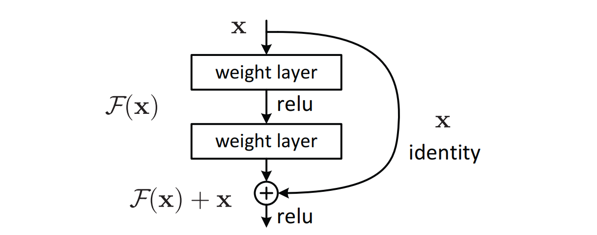

<div align=center></div>

# ResNet

[Deep Residual Learning for Image Recognition](https://arxiv.org/abs/1512.03385)

## Code Source
```
link: https://github.com/pytorch/vision
tag: v0.9.0

link: https://github.com/rwightman/pytorch-image-models
tag: v0.6.5

link: https://github.com/open-mmlab/mmclassification
tag: v0.23.1

link: https://github.com/PaddlePaddle/PaddleClas
tag: v2.4.0

link: https://github.com/keras-team/keras
tag: 2.3.1

link: https://github.com/Oneflow-Inc/vision
tag: v0.2.1
```

## Model Arch

<div align=center></div>

### pre-processing

ResNet系列网络的预处理操作可以按照如下步骤进行，即先对图片进行resize至256的尺寸，然后利用`CenterCrop`算子crop出224的图片对其进行归一化、减均值除方差等操作

```python
[
    torchvision.transforms.Resize(256),
    torchvision.transforms.CenterCrop(224),
    torchvision.transforms.ToTensor(),
    torchvision.transforms.Normalize(mean=[0.485, 0.456, 0.406], std=[0.229, 0.224, 0.225],),
]
```

### post-processing

ResNet系列网络的后处理操作是对网络输出进行softmax作为每个类别的预测值，然后根据预测值进行排序，选择topk作为输入图片的预测分数以及类别

### backbone

ResNet系列网络的backbone结构是由BasicBlock或Bottleneck搭成。ResNet网络名称后面的数字表示整个网络中包含参数层的数量

### head

ResNet系列网络的head层由global-average-pooling层和一层全连接层组成

### common

- residual layer

## Model Info

### 模型性能

| 模型  | 源码 | top1 | top5 | flops(G) | params(M) | input size |
| :---: | :--: | :--: | :--: | :---: | :----: | :--------: |
| resnet18 |[timm](https://github.com/rwightman/pytorch-image-models/blob/v0.6.5/timm/models/resnet.py)|   69.744   |   89.082   |   3.648    |    11.690    |        224    |
| resnet26 |[timm](https://github.com/rwightman/pytorch-image-models/blob/v0.6.5/timm/models/resnet.py)   |   75.300   |   92.578  | 4.744      |  15.995      |      224     |
| resnet34 |[timm](https://github.com/rwightman/pytorch-image-models/blob/v0.6.5/timm/models/resnet.py)   |   75.114   |   92.284  | 7.358      |  21.798      |      224      |
| resnet50 |[timm](https://github.com/rwightman/pytorch-image-models/blob/v0.6.5/timm/models/resnet.py)   |   80.376   |   94.616  | 8.268      |  25.557      |      224      |
| resnet101 |[timm](https://github.com/rwightman/pytorch-image-models/blob/v0.6.5/timm/models/resnet.py)    | 81.932   |   95.770  | 15.732      |  44.549      |      224      |
| resnet152 |[timm](https://github.com/rwightman/pytorch-image-models/blob/v0.6.5/timm/models/resnet.py)  |   82.820   |   96.130  | 23.208      | 60.193       |      224      |
| gluon_resnet18_v1b |[timm](https://github.com/rwightman/pytorch-image-models/blob/v0.6.5/timm/models/gluon_resnet.py)|   70.834   |   89.762   |   4.053    |    11.690    |        224    |
| gluon_resnet34_v1b |[timm](https://github.com/rwightman/pytorch-image-models/blob/v0.6.5/timm/models/gluon_resnet.py)|   74.588   |   91.988   |   8.175    |    21.798    |        224    |
| gluon_resnet50_v1b |[timm](https://github.com/rwightman/pytorch-image-models/blob/v0.6.5/timm/models/gluon_resnet.py)|   77.580   |   93.722   |   9.186    |    25.557    |        224    |
| gluon_resnet50_v1c |[timm](https://github.com/rwightman/pytorch-image-models/blob/v0.6.5/timm/models/gluon_resnet.py)|   78.012   |   93.990  |   9.726    |    26.576    |        224    |
| gluon_resnet50_v1d |[timm](https://github.com/rwightman/pytorch-image-models/blob/v0.6.5/timm/models/gluon_resnet.py)|   79.076   |   94.472   |   9.727    |    25.576    |        224    |
| gluon_resnet50_v1s |[timm](https://github.com/rwightman/pytorch-image-models/blob/v0.6.5/timm/models/gluon_resnet.py)|   	78.712   |   94.240   |   12.219    |    25.681    |        224    |
| gluon_resnet101_v1b |[timm](https://github.com/rwightman/pytorch-image-models/blob/v0.6.5/timm/models/gluon_resnet.py)|   79.302   |   94.520   |   17.481   |    44.549    |        224    |
| gluon_resnet101_v1c |[timm](https://github.com/rwightman/pytorch-image-models/blob/v0.6.5/timm/models/gluon_resnet.py)|   79.534   |   94.580   |   18.021    |    44.568    |        224    |
| gluon_resnet101_v1d |[timm](https://github.com/rwightman/pytorch-image-models/blob/v0.6.5/timm/models/gluon_resnet.py)|   80.420   |   95.016   |   18.021   |    44.568   |        224    |
| gluon_resnet101_v1s |[timm](https://github.com/rwightman/pytorch-image-models/blob/v0.6.5/timm/models/gluon_resnet.py)|   80.298   |   95.164   |   20.514    |    44.673    |        224    |
| gluon_resnet152_v1b |[timm](https://github.com/rwightman/pytorch-image-models/blob/v0.6.5/timm/models/gluon_resnet.py)|   79.680   |   94.738   |   25.787    |   60.193    |        224    |
| gluon_resnet152_v1c |[timm](https://github.com/rwightman/pytorch-image-models/blob/v0.6.5/timm/models/gluon_resnet.py)|   79.908   |   94.848   |   26.326    |    60.212    |        224    |
| gluon_resnet152_v1d |[timm](https://github.com/rwightman/pytorch-image-models/blob/v0.6.5/timm/models/gluon_resnet.py)|   80.476   |   95.204   |   26.327    |    60.212   |        224    |
| gluon_resnet152_v1s |[timm](https://github.com/rwightman/pytorch-image-models/blob/v0.6.5/timm/models/gluon_resnet.py)|   81.016   |   95.412   |   28.819    |    60.317    |        224    |
| resnet18 |[torchvision](https://github.com/pytorch/vision/blob/v0.9.0/torchvision/models/resnet.py)|   69.758   |   89.078   |   3.648    |   11.690     |     224       |
| resnet34 |[torchvision](https://github.com/pytorch/vision/blob/v0.9.0/torchvision/models/resnet.py)   |   73.314   |   91.42  |  7.358     |  21.798      |    224        |
| resnet50 |[torchvision](https://github.com/pytorch/vision/blob/v0.9.0/torchvision/models/resnet.py)   |   76.130   |   92.862 |   8.268    |  25.557      |    224        |
| resnet101 |[torchvision](https://github.com/pytorch/vision/blob/v0.9.0/torchvision/models/resnet.py)    | 77.374   |   93.546  |   15.732    |  44.549      |    224        |
| resnet152 |[torchvision](https://github.com/pytorch/vision/blob/v0.9.0/torchvision/models/resnet.py)  |   78.312   |   94.046  |  23.208     |  60.193      |   224        |
| resnet18 |[mmcls](https://github.com/open-mmlab/mmclassification/blob/master/configs/resnet/resnet18_b32x8_imagenet.py)|   69.90   |   89.43   |   3.64    |  11.69      |     224       |
| resnet34 |[mmcls](https://github.com/open-mmlab/mmclassification/blob/master/configs/resnet/resnet34_b32x8_imagenet.py)   |   73.62  |   91.59  |  7.36     | 21.8       |    224        |
| resnet50 |[mmcls](https://github.com/open-mmlab/mmclassification/blob/master/configs/resnet/resnet50_b32x8_imagenet.py)   |   76.55  |   93.06 |   8.24    |  25.56      |    224        |
| resnet101 |[mmcls](https://github.com/open-mmlab/mmclassification/blob/master/configs/resnet/resnet101_b32x8_imagenet.py)    | 77.97   |   94.06  | 15.7      | 44.55       |    224        |
| resnet152 |[mmcls](https://github.com/open-mmlab/mmclassification/blob/master/configs/resnet/resnet152_b32x8_imagenet.py)  |   78.48   |   94.13  | 23.16      | 60.19       |   224        |
| resnet18 |[ppcls](https://github.com/PaddlePaddle/PaddleClas/blob/v2.4.0/docs/zh_CN/models/ResNet.md)  |   71.0   |   89.9  | 3.66      | 11.69       |   224        |
| resnet18_vd |[ppcls](https://github.com/PaddlePaddle/PaddleClas/blob/v2.4.0/docs/zh_CN/models/ResNet.md)  |   72.3   |   90.8  | 4.14      | 11.71      |   224        |
| resnet34 |[ppcls](https://github.com/PaddlePaddle/PaddleClas/blob/v2.4.0/docs/zh_CN/models/ResNet.md)  |   74.6   |   92.1  | 7.36     | 21.8       |   224        |
| resnet34_vd |[ppcls](https://github.com/PaddlePaddle/PaddleClas/blob/v2.4.0/docs/zh_CN/models/ResNet.md)  |   76.0   |   93.0  | 7.39      | 21.82       |   224        |
| resnet34_vd_ssld |[ppcls](https://github.com/PaddlePaddle/PaddleClas/blob/v2.4.0/docs/zh_CN/models/ResNet.md)  |   79.7   |  94.9  | 7.39      | 21.82       |   224        |
| resnet50 |[ppcls](https://github.com/PaddlePaddle/PaddleClas/blob/v2.4.0/docs/zh_CN/models/ResNet.md)  |   76.5   |   93.0  | 8.19      | 25.56       |   224        |
| resnet50_vc |[ppcls](https://github.com/PaddlePaddle/PaddleClas/blob/v2.4.0/docs/zh_CN/models/ResNet.md)  |   78.4   |  94.0  | 8.67      | 25.58       |   224        |
| resnet50_vd |[ppcls](https://github.com/PaddlePaddle/PaddleClas/blob/v2.4.0/docs/zh_CN/models/ResNet.md)  |   79.1   |  94.4  | 8.67      | 25.58       |   224        |
| resnet50_vd_ssld |[ppcls](https://github.com/PaddlePaddle/PaddleClas/blob/v2.4.0/docs/zh_CN/models/ResNet.md)  |   83.0   |   96.4  | 8.67      | 25.58       |   224        |
| resnet101 |[ppcls](https://github.com/PaddlePaddle/PaddleClas/blob/v2.4.0/docs/zh_CN/models/ResNet.md)  |   77.6   |   93.6  | 15.52      | 44.55       |   224        |
| resnet101_vd |[ppcls](https://github.com/PaddlePaddle/PaddleClas/blob/v2.4.0/docs/zh_CN/models/ResNet.md)  |   80.2   |   95.0  | 16.1      | 44.57       |   224        |
| resnet101_vd_ssld |[ppcls](https://github.com/PaddlePaddle/PaddleClas/blob/v2.4.0/docs/zh_CN/models/ResNet.md)  |   83.7   |   96.7  | 16.1      | 44.57       |   224        |
| resnet152 |[ppcls](https://github.com/PaddlePaddle/PaddleClas/blob/v2.4.0/docs/zh_CN/models/ResNet.md)  |   78.3   |   94.0  | 23.05      | 60.19       |   224        |
| resnet152_vd |[ppcls](https://github.com/PaddlePaddle/PaddleClas/blob/v2.4.0/docs/zh_CN/models/ResNet.md)  |   80.6   |   95.3  | 23.53      | 60.21       |   224        |
| resnet200_vd |[ppcls](https://github.com/PaddlePaddle/PaddleClas/blob/v2.4.0/docs/zh_CN/models/ResNet.md)  |   80.9   |   95.3  | 30.53      | 74.74       |   224        |
| resnet50 |[keras](https://github.com/keras-team/keras/blob/2.3.1/keras/applications/resnet.py)  |   74.86   |   92.038  | 7.76      | 25.6       |   224        |
| resnet101 |[keras](https://github.com/keras-team/keras/blob/2.3.1/keras/applications/resnet.py)  |   76.418   |   92.792  | 15.2      | 44.7       |   224        |
| resnet152 |[keras](https://github.com/keras-team/keras/blob/2.3.1/keras/applications/resnet.py)  |   76.598   |   93.124  | 22.6      | 60.4       |   224        |
| resnet50v2 |[keras](https://github.com/keras-team/keras/blob/2.3.1/keras/applications/resnet_v2.py)  |   69.404   |   89.736  | 13.1      | 25.7       |   299        |
| resnet101v2 |[keras](https://github.com/keras-team/keras/blob/2.3.1/keras/applications/resnet_v2.py)  |   70.658   |   90.742  | 26.8      | 44.7      |   299        |
| resnet152v2 |[keras](https://github.com/keras-team/keras/blob/2.3.1/keras/applications/resnet_v2.py)  |   71.502   |   91.124  | 40.5      | 60.4       |   299        |
| resnet18 |[oneflow](https://github.com/Oneflow-Inc/vision/blob/main/flowvision/models/resnet.py)  |   69.760   |   89.082  | 1.8      | 11.7       |   224        |
| resnet34 |[oneflow](https://github.com/Oneflow-Inc/vision/blob/main/flowvision/models/resnet.py)  |   73.302   |   91.420  | 3.7      | 21.8       |   224        |
| resnet50 |[oneflow](https://github.com/Oneflow-Inc/vision/blob/main/flowvision/models/resnet.py)  |   76.146   |   92.872  | 4.2      | 25.6       |   224        |
| resnet101 |[oneflow](https://github.com/Oneflow-Inc/vision/blob/main/flowvision/models/resnet.py)  |   77.366   |   93.5628  | 7.9      | 44.6       |   224        |
| resnet152 |[oneflow](https://github.com/Oneflow-Inc/vision/blob/main/flowvision/models/resnet.py)  |   78.314   |   94.060  | 11.6      | 60.2       |   224        |


### 测评数据集说明

<div align=center></div>

[ImageNet](https://image-net.org/challenges/LSVRC/2012/index.php)是一个计算机视觉系统识别项目，是目前世界上图像识别最大的数据库。是美国斯坦福的计算机科学家，模拟人类的识别系统建立的。能够从图片中识别物体。ImageNet是一个非常有前景的研究项目，未来用在机器人身上，就可以直接辨认物品和人了。超过1400万的图像URL被ImageNet手动注释，以指示图片中的对象;在至少一百万张图像中，还提供了边界框。ImageNet包含2万多个类别; 一个典型的类别，如“气球”或“草莓”，每个类包含数百张图像。

ImageNet数据是CV领域非常出名的数据集，ISLVRC竞赛使用的数据集是轻量版的ImageNet数据集。ISLVRC2012是非常出名的一个数据集，在很多CV领域的论文，都会使用这个数据集对自己的模型进行测试，在该项目中分类算法用到的测评数据集就是ISLVRC2012数据集的验证集。在一些论文中，也会称这个数据叫成ImageNet 1K或者ISLVRC2012，两者是一样的。“1 K”代表的是1000个类别。

### 评价指标说明

- top1准确率: 测试图片中最佳得分所对应的标签是正确标注类别的样本数除以总的样本数
- top5准确率: 测试图片中正确标签包含在前五个分类概率中的个数除以总的样本数

## Build_In Deploy

- [keras_deploy.md](source_code/keras_deploy.md)
- [mmcls_deploy.md](source_code/mmcls_deploy.md)
- [ppcls_deploy.md](source_code/ppcls_deploy.md)
- [torch_deploy.md](source_code/torch_deploy.md)