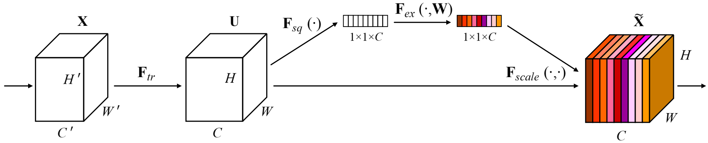
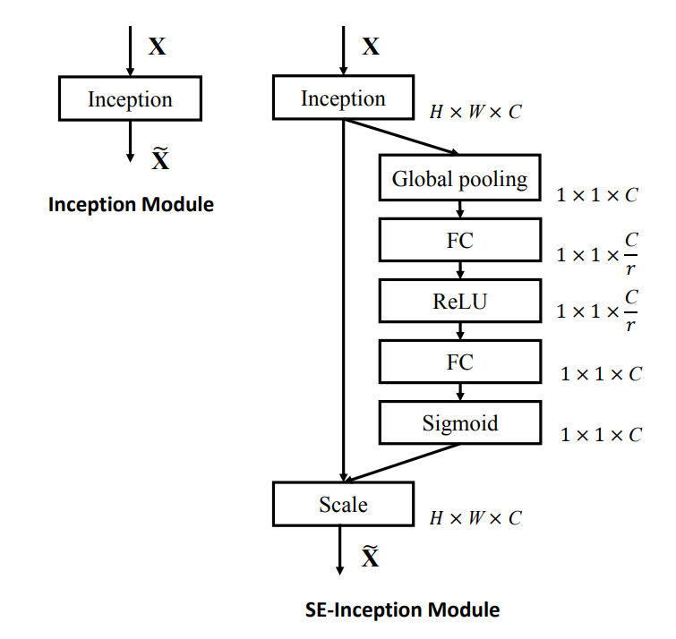

# SENet

- [Squeeze-and-Excitation Networks](https://arxiv.org/abs/1709.01507)

## Model Arch

### pre-processing

SENet系列网络的预处理操作可以按照如下步骤进行，即先对图片进行resize至256的尺寸，然后利用`CenterCrop`算子crop出224的图片对其进行归一化、减均值除方差等操作

```python
[
    torchvision.transforms.Resize(256),
    torchvision.transforms.CenterCrop(224),
    torchvision.transforms.ToTensor(),
    torchvision.transforms.Normalize(mean=[0.485, 0.456, 0.406], std=[0.229, 0.224, 0.225],),
]
```

### post-processing

SENet系列网络的后处理操作是对网络输出进行softmax作为每个类别的预测值，然后根据预测值进行排序，选择topk作为输入图片的预测分数以及类别

### backbone

Squeeze-and-Excitation Networks（SENet）是由自动驾驶公司Momenta在2017年公布的一种全新的图像识别结构，它通过对特征通道间的相关性进行建模，把重要的特征进行强化来提升准确率。

下图是SENet的Block单元，其中X和U是普通卷积层的输入（C'xH'xW'）和输出（CxHxW），这些都是以往结构中已存在的。SENet增加的部分是U后的结构：对U先做一个Global Average Pooling（作者称为Squeeze过程），输出的1x1xC数据再经过两级全连接（作者称为Excitation过程），最后用sigmoid（论文中的self-gating mechanism）限制到[0，1]的范围，把这个值作为scale乘到U的C个通道上， 作为下一级的输入数据。这种结构的原理是想通过控制scale的大小，把重要的特征增强，不重要的特征减弱，从而让提取的特征指向性更强。

<div align=center></div>

下图是两个SENet实际应用的例子，左侧是SE-Inception的结构，即Inception模块和SENet组和在一起；右侧是SE-ResNet，ResNet和SENet的组合，这种结构scale放到了直连相加之前。

<center class="half">
    
</center>

### head

SENet系列网络的head层由`AdaptiveAvgPool2d`层和`Linear`组成

### common

- Global Average Pooling
- 1x1 Conv
- sigmoid


## Model Info

### 模型性能

| 模型  | 源码 | top1  | top5 | FLOPs (G) | Params(M) | input size |
| :---: | :--: | :--: | :--: | :---: | :----: | :--------: |
| seresnet50 |[timm](https://github.com/rwightman/pytorch-image-models/blob/v0.6.5/timm/models/resnet.py)| 80.264 | 95.072| 9.192 |  28.088   |    224    |
| seresnet152d |[timm](https://github.com/rwightman/pytorch-image-models/blob/v0.6.5/timm/models/resnet.py)| 84.360 | 97.040| 53.738 |  66.841   |    320    |
| seresnext26d_32x4d |[timm](https://github.com/rwightman/pytorch-image-models/blob/v0.6.5/timm/models/resnet.py)| 	77.604 | 93.608| 6.118 |  16.810   |    224    |
| seresnext26t_32x4d |[timm](https://github.com/rwightman/pytorch-image-models/blob/v0.6.5/timm/models/resnet.py)| 77.976 | 93.746| 6.046 |  16.807   |    224    |
| seresnext50_32x4d |[timm](https://github.com/rwightman/pytorch-image-models/blob/v0.6.5/timm/models/resnet.py)| 81.258 | 95.630| 9.535 |  27.560   |    224    |
| seresnext101_32x8d |[timm](https://github.com/rwightman/pytorch-image-models/blob/v0.6.5/timm/models/resnet.py)| 84.204 | 96.876| 60.763 |  93.569   |    288    |
| seresnext101d_32x8d |[timm](https://github.com/rwightman/pytorch-image-models/blob/v0.6.5/timm/models/resnet.py)| 84.362 | 96.918| 61.656 |  93.588   |    288    |
| legacy_senet154 |[timm](https://github.com/rwightman/pytorch-image-models/blob/v0.6.5/timm/models/senet.py)| 81.310 | 95.496| 46.318 |  115.089   |    224    |
| legacy_seresnet18 |[timm](https://github.com/rwightman/pytorch-image-models/blob/v0.6.5/timm/models/senet.py)| 71.742 | 90.332| 4.054 |  11.779   |    224    |
| legacy_seresnet34 |[timm](https://github.com/rwightman/pytorch-image-models/blob/v0.6.5/timm/models/senet.py)| 74.808 | 92.126| 8.175 |  21.959   |    224    |
| legacy_seresnet50 |[timm](https://github.com/rwightman/pytorch-image-models/blob/v0.6.5/timm/models/senet.py)| 77.630 | 93.750| 8.673 |  28.088   |    224    |
| legacy_seresnet101 |[timm](https://github.com/rwightman/pytorch-image-models/blob/v0.6.5/timm/models/senet.py)| 78.388 | 94.264| 16.973 |  49.327   |    224    |
| legacy_seresnet152 |[timm](https://github.com/rwightman/pytorch-image-models/blob/v0.6.5/timm/models/senet.py)| 78.652 | 	94.370| 25.283 |  66.822   |    224    |
| legacy_seresnext26_32x4d |[timm](https://github.com/rwightman/pytorch-image-models/blob/v0.6.5/timm/models/senet.py)| 77.106 | 93.318| 5.577 |  16.790   |    224    |
| legacy_seresnext50_32x4d |[timm](https://github.com/rwightman/pytorch-image-models/blob/v0.6.5/timm/models/senet.py)| 79.068 | 94.434| 9.535 |  27.560   |    224    |
| legacy_seresnext101_32x4d |[timm](https://github.com/rwightman/pytorch-image-models/blob/v0.6.5/timm/models/senet.py)| 80.224 | 95.010| 17.911 |  48.955   |    224    |


### 测评数据集说明

<div align=center></div>

ImageNet是一个计算机视觉系统识别项目，是目前世界上图像识别最大的数据库。是美国斯坦福的计算机科学家，模拟人类的识别系统建立的。能够从图片中识别物体。ImageNet是一个非常有前景的研究项目，未来用在机器人身上，就可以直接辨认物品和人了。超过1400万的图像URL被ImageNet手动注释，以指示图片中的对象;在至少一百万张图像中，还提供了边界框。ImageNet包含2万多个类别; 一个典型的类别，如“气球”或“草莓”，每个类包含数百张图像。

ImageNet数据是CV领域非常出名的数据集，ISLVRC竞赛使用的数据集是轻量版的ImageNet数据集。ISLVRC2012是非常出名的一个数据集，在很多CV领域的论文，都会使用这个数据集对自己的模型进行测试，在该项目中分类算法用到的测评数据集就是ISLVRC2012数据集的验证集。在一些论文中，也会称这个数据叫成ImageNet 1K或者ISLVRC2012，两者是一样的。`1K`代表的是1000个类别。

### 评价指标说明

- top1准确率: 测试图片中最佳得分所对应的标签是正确标注类别的样本数除以总的样本数
- top5准确率: 测试图片中正确标签包含在前五个分类概率中的个数除以总的样本数

## Build_In Deploy

### step.1 获取模型
```bash
python ../common/utils/export_timm_torchvision_model.py \
        --model_library timm \
        --model_name seresnet50 \
        --save_dir output/ \
        --pretrained_weights weights/seresnet50.pth \
        --convert_mode pt \
```

### step.2 准备数据集
- [校准数据集](https://image-net.org/challenges/LSVRC/2012/index.php)
- [评估数据集](https://image-net.org/challenges/LSVRC/2012/index.php)
- [label_list](../common/label/imagenet.txt)
- [label_dict](../common/label/imagenet1000_clsid_to_human.txt)

### step.3 模型转换
1. 根据具体模型，修改编译配置
    - [timm_senet.yaml](./build_in/build/timm_senet.yaml)
    
    > - 编译参数`backend.type: tvm_vacc`
    > - fp16精度: 编译参数`backend.dtype: fp16`
    > - int8精度: 编译参数`backend.dtype: int8`，需要配置量化数据集和预处理算子

2. 模型编译

    ```bash
    cd senet
    mkdir workspace
    cd workspace
    vamc compile ../build_in/build/timm_senet.yaml
    ```

### step.4 模型推理
 - 参考：[classification.py](../common/vsx/python/classification.py)
    ```bash
    python ../../common/vsx/python/classification.py \
        --file_path path/to/ILSVRC2012_img_val \
        --model_prefix_path deploy_weights/timm_senet_fp16/mod \
        --vdsp_params_info ../build_in/vdsp_params/timm-legacy_seresnet18-vdsp_params.json \
        --label_txt path/to/imagenet.txt \
        --save_dir ./infer_output \
        --save_result_txt result.txt \
        --device 0
    ```

    - 精度评估
    ```
    python ../../common/eval/eval_topk.py ./infer_output/result.txt
    ```

    <details><summary>点击查看精度测试结果</summary>

    ```
    # fp16
    top1_rate: 70.508 top5_rate: 89.824

    # int8
    top1_rate: 70.172 top5_rate: 89.58
    ```

### step.5 性能精度测试
1. 性能测试
    - 配置[timm-legacy_seresnet18-vdsp_params.json](./build_in/vdsp_params/timm-legacy_seresnet18-vdsp_params.json)
    ```bash
    vamp -m deploy_weights/timm_senet_fp16/mod --vdsp_params ../build_in/vdsp_params/timm-legacy_seresnet18-vdsp_params.json  -i 8 -p 1 -b 2 -s [3,224,224]
    ```

2. 精度测试
    > **可选步骤**，通过vamp推理方式获得推理结果，然后解析及评估精度；
    
    - 数据准备，生成推理数据`npz`以及对应的`dataset.txt`
    ```bash
    python ../../common/utils/image2npz.py --dataset_path ILSVRC2012_img_val --target_path  input_npz  --text_path imagenet_npz.txt
    ```

    - vamp推理获取npz文件
    ```
    vamp -m deploy_weights/timm_senet_fp16/mod --vdsp_params ../build_in/vdsp_params/timm-legacy_seresnet18-vdsp_params.json  -i 8 -p 1 -b 22 -s [3,224,224] --datalist imagenet_npz.txt --path_output output
    ```

    - 解析输出结果用于精度评估，参考[vamp_npz_decode](../common/eval/vamp_npz_decode.py)
    ```bash
    python  ../../common/eval/vamp_npz_decode.py imagenet_npz.txt output imagenet_result.txt imagenet.txt
    ```
    
    - 精度评估，参考：[eval_topk.py](../common/eval/eval_topk.py)
    ```bash
    python ../../common/eval/eval_topk.py imagenet_result.txt
    ```