# Swin-Transformer

> [paper](https://arxiv.org/abs/2103.14030)
>
> [code](https://github.com/microsoft/Swin-Transformer)

## Model Arch
### 1 背景

目前Transformer应用到图像领域主要有两大挑战：

- 视觉实体变化大，在不同场景下视觉Transformer性能未必很好
- 图像分辨率高，像素点多，Transformer基于全局自注意力的计算导致计算量较大

针对上述两个问题，我们提出了一种**包含滑窗操作，具有层级设计**的Swin Transformer。

其中滑窗操作包括**不重叠的local window，和重叠的cross-window**。将注意力计算限制在一个窗口中，**一方面能引入CNN卷积操作的局部性，另一方面能节省计算量**。

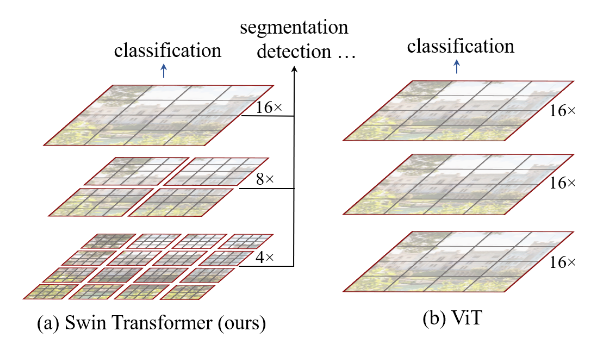

### 2 模块

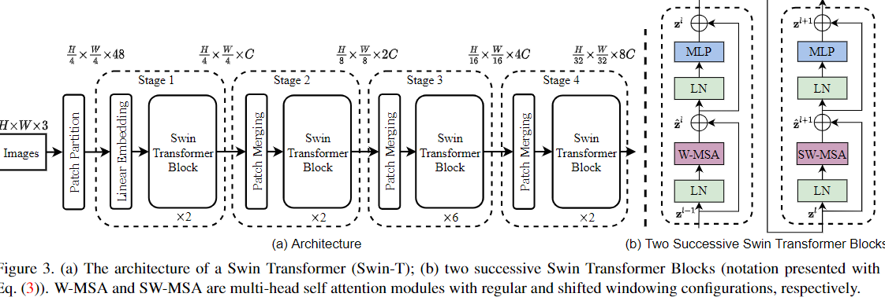

整个模型采取层次化的设计，一共包含4个Stage，每个stage都会缩小输入特征图的分辨率，像CNN一样逐层扩大感受野。

- 在输入开始的时候，做了一个`Patch Embedding`，将图片切成一个个图块，并嵌入到`Embedding`。
- 在每个Stage里，由`Patch Merging`和多个Block组成。
- 其中`Patch Merging`模块主要在每个Stage一开始降低图片分辨率。
- 而Block具体结构如右图所示，主要是`LayerNorm`，`MLP`，`Window Attention` 和 `Shifted Window Attention`组成

```python
class SwinTransformer(nn.Module):
    def __init__(...):
        super().__init__()
        ...
        # absolute position embedding
        if self.ape:
            self.absolute_pos_embed = nn.Parameter(torch.zeros(1, num_patches, embed_dim))

        self.pos_drop = nn.Dropout(p=drop_rate)

        # build layers
        self.layers = nn.ModuleList()
        for i_layer in range(self.num_layers):
            layer = BasicLayer(...)
            self.layers.append(layer)

        self.norm = norm_layer(self.num_features)
        self.avgpool = nn.AdaptiveAvgPool1d(1)
        self.head = nn.Linear(self.num_features, num_classes) if num_classes > 0 else nn.Identity()

    def forward_features(self, x):
        x = self.patch_embed(x)
        if self.ape:
            x = x + self.absolute_pos_embed
        x = self.pos_drop(x)

        for layer in self.layers:
            x = layer(x)

        x = self.norm(x)  # B L C
        x = self.avgpool(x.transpose(1, 2))  # B C 1
        x = torch.flatten(x, 1)
        return x

    def forward(self, x):
        x = self.forward_features(x)
        x = self.head(x)
        return x
```

其中有几个地方处理方法与ViT不同：

- ViT在输入会给embedding进行位置编码。而Swin-T这里则是作为一个**可选项**（`self.ape`），Swin-T是在计算Attention的时候做了一个`相对位置编码`
- ViT会单独加上一个可学习参数，作为分类的token。而Swin-T则是**直接做平均**，输出分类，有点类似CNN最后的全局平均池化层

#### 2.1 PE

在输入进Block前，我们需要将图片切成一个个patch，然后嵌入向量。具体做法是对原始图片裁成一个个 `window_size * window_size`的窗口大小，然后进行嵌入。这里可以通过二维卷积层，**将stride，kernelsize设置为window_size大小**。设定输出通道来确定嵌入向量的大小。最后将H,W维度展开，并移动到第一维度

```python
import torch
import torch.nn as nn


class PatchEmbed(nn.Module):
    def __init__(self, img_size=224, patch_size=4, in_chans=3, embed_dim=96, norm_layer=None):
        super().__init__()
        img_size = to_2tuple(img_size) # -> (img_size, img_size)
        patch_size = to_2tuple(patch_size) # -> (patch_size, patch_size)
        patches_resolution = [img_size[0] // patch_size[0], img_size[1] // patch_size[1]]
        self.img_size = img_size
        self.patch_size = patch_size
        self.patches_resolution = patches_resolution
        self.num_patches = patches_resolution[0] * patches_resolution[1]

        self.in_chans = in_chans
        self.embed_dim = embed_dim

        self.proj = nn.Conv2d(in_chans, embed_dim, kernel_size=patch_size, stride=patch_size)
        if norm_layer is not None:
            self.norm = norm_layer(embed_dim)
        else:
            self.norm = None

    def forward(self, x):
        # 假设采取默认参数
        x = self.proj(x) # 出来的是(N, 96, 224/4, 224/4)
        x = torch.flatten(x, 2) # 把HW维展开，(N, 96, 56*56)
        x = torch.transpose(x, 1, 2)  # 把通道维放到最后 (N, 56*56, 96)
        if self.norm is not None:
            x = self.norm(x)
        return x
```

1. 需要注意的是：此处 Conv2d的 `kernel_size=patch_size == 4`

#### 2.2 Patch Merging

该模块的作用是在每个Stage开始前做降采样，用于缩小分辨率，调整通道数 进而形成层次化的设计，同时也能节省一定运算量。

> 在CNN中，则是在每个Stage开始前用`stride=2`的卷积/池化层来降低分辨率。

每次降采样是两倍，因此**在行方向和列方向上，间隔2选取元素**。然后拼接在一起作为一整个张量，最后展开。**此时通道维度会变成原先的4倍**（因为H,W各缩小2倍），此时再通过一个**全连接层再调整通道维度为原来的两倍**

```python
class PatchMerging(nn.Module):
    def __init__(self, input_resolution, dim, norm_layer=nn.LayerNorm):
        super().__init__()
        self.input_resolution = input_resolution
        self.dim = dim
        self.reduction = nn.Linear(4 * dim, 2 * dim, bias=False)
        self.norm = norm_layer(4 * dim)

    def forward(self, x):
        """
        x: B, H*W, C
        """
        H, W = self.input_resolution
        B, L, C = x.shape
        assert L == H * W, "input feature has wrong size"
        assert H % 2 == 0 and W % 2 == 0, f"x size ({H}*{W}) are not even."

        x = x.view(B, H, W, C)

        x0 = x[:, 0::2, 0::2, :]  # B H/2 W/2 C
        x1 = x[:, 1::2, 0::2, :]  # B H/2 W/2 C
        x2 = x[:, 0::2, 1::2, :]  # B H/2 W/2 C
        x3 = x[:, 1::2, 1::2, :]  # B H/2 W/2 C
        x = torch.cat([x0, x1, x2, x3], -1)  # B H/2 W/2 4*C
        x = x.view(B, -1, 4 * C)  # B H/2*W/2 4*C

        x = self.norm(x)
        x = self.reduction(x)

        return x
```

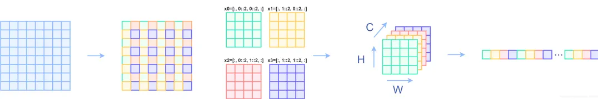

#### 2.3 Window Partition/Reverse

`window partition`函数是用于对张量划分窗口，指定窗口大小。将原本的张量从 `N H W C`, 划分成 `num_windows*B, window_size, window_size, C`，其中 `num_windows = H*W / window_size`，即窗口的个数。而`window reverse`函数则是对应的逆过程。这两个函数会在后面的`Window Attention`用到。

```python
def window_partition(x, window_size):
    B, H, W, C = x.shape
    x = x.view(B, H // window_size, window_size, W // window_size, window_size, C)
    windows = x.permute(0, 1, 3, 2, 4, 5).contiguous().view(-1, window_size, window_size, C)
    return windows

def window_reverse(windows, window_size, H, W):
    B = int(windows.shape[0] / (H * W / window_size / window_size))
    x = windows.view(B, H // window_size, W // window_size, window_size, window_size, -1)
    x = x.permute(0, 1, 3, 2, 4, 5).contiguous().view(B, H, W, -1)
    return x
```

#### 2.4 Window Attention

传统的Transformer都是**基于全局来计算注意力的**，因此计算复杂度十分高。而Swin Transformer则将**注意力的计算限制在每个窗口内**，进而减少了计算量。

主要区别是在原始计算Attention的公式中的Q,K时**加入了相对位置编码**。后续实验有证明相对位置编码的加入提升了模型性能。
$$
Attention(Q,K,V) = Softmax(\frac{QK^T}{\sqrt d} + B) V
$$

```PYTHON
class WindowAttention(nn.Module):
    r""" Window based multi-head self attention (W-MSA) module with relative position bias.
    It supports both of shifted and non-shifted window.

    Args:
        dim (int): Number of input channels.
        window_size (tuple[int]): The height and width of the window.
        num_heads (int): Number of attention heads.
        qkv_bias (bool, optional):  If True, add a learnable bias to query, key, value. Default: True
        qk_scale (float | None, optional): Override default qk scale of head_dim ** -0.5 if set
        attn_drop (float, optional): Dropout ratio of attention weight. Default: 0.0
        proj_drop (float, optional): Dropout ratio of output. Default: 0.0
    """

    def __init__(self, dim, window_size, num_heads, qkv_bias=True, qk_scale=None, attn_drop=0., proj_drop=0.):

        super().__init__()
        self.dim = dim
        self.window_size = window_size  # Wh, Ww
        self.num_heads = num_heads # nH
        head_dim = dim // num_heads # 每个注意力头对应的通道数
        self.scale = qk_scale or head_dim ** -0.5

        # define a parameter table of relative position bias
        self.relative_position_bias_table = nn.Parameter(
            torch.zeros((2 * window_size[0] - 1) * (2 * window_size[1] - 1), num_heads))  # 设置一个形状为（2*(Wh-1) * 2*(Ww-1), nH）的可学习变量，用于后续的位置编码

        self.qkv = nn.Linear(dim, dim * 3, bias=qkv_bias)
        self.attn_drop = nn.Dropout(attn_drop)
        self.proj = nn.Linear(dim, dim)
        self.proj_drop = nn.Dropout(proj_drop)

        trunc_normal_(self.relative_position_bias_table, std=.02)
        self.softmax = nn.Softmax(dim=-1)
     # 相关位置编码...
```

### relative position encoding

1. 首先`QK`计算出来的Attention张量形状为`(numWindows*B, num_heads, window_size*window_size, window_size*window_size)`。而对于Attention张量来说，**以不同元素为原点，其他元素的坐标也是不同的**，以`window_size=2`为例，其相对位置编码如下图所示:

   

   ```python
   coords_h = torch.arange(self.window_size[0])
   coords_w = torch.arange(self.window_size[1])
   coords = torch.meshgrid([coords_h, coords_w]) # -> 2*(wh, ww)
   """
     (tensor([[0, 0],
              [1, 1]]),
      tensor([[0, 1],
              [0, 1]]))
   """
   ```

2. 然后堆叠起来，展开为一个二维向量

   ```python
   coords = torch.stack(coords)  # 2, Wh, Ww
   coords_flatten = torch.flatten(coords, 1)  # 2, Wh*Ww
   """
   tensor([[0, 0, 1, 1],
           [0, 1, 0, 1]])
   """
   ```

3. 利用广播机制，分别在第一维，第二维，插入一个维度，进行广播相减，得到 `2, wh*ww, wh*ww`的张量

   ```python
   relative_coords_first = coords_flatten[:, :, None]  # 2, wh*ww, 1
   relative_coords_second = coords_flatten[:, None, :] # 2, 1, wh*ww
   relative_coords = relative_coords_first - relative_coords_second # 最终得到 2, wh*ww, wh*ww 形状的张量
   ```

4. 因为采取的是相减，所以得到的索引是从负数开始的，**我们加上偏移量，让其从0开始**

   ```PYTHON
   relative_coords = relative_coords.permute(1, 2, 0).contiguous() # Wh*Ww, Wh*Ww, 2
   relative_coords[:, :, 0] += self.window_size[0] - 1
   relative_coords[:, :, 1] += self.window_size[1] - 1
   ```

​	后续我们需要将其展开成一维偏移量。而对于(1, 2)和(2, 1)这两个坐标。在二维上是不同的，**但是通过将x,y坐标相加转换为一维偏移的时候，他的   偏移量是相等的**。

​	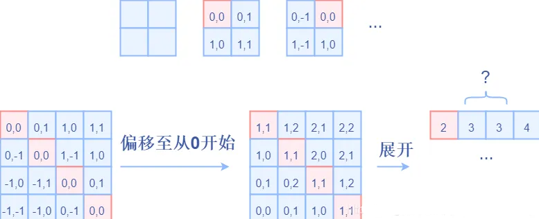

5. 对其中做了个乘法操作，以进行区分

   ```python
   relative_coords[:, :, 0] *= 2 * self.window_size[1] - 1
   ```

   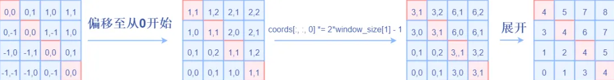

6. 再最后一维上进行求和，展开成一个一维坐标，并注册为一个不参与网络学习的变量

   ```python
   relative_position_index = relative_coords.sum(-1)  # Wh*Ww, Wh*Ww
   self.register_buffer("relative_position_index", relative_position_index)
   ```

### forward

```python
def forward(self, x, mask=None):
    	"""
        Args:
            x: input features with shape of (num_windows*B, N, C)
            mask: (0/-inf) mask with shape of (num_windows, Wh*Ww, Wh*Ww) or None
        """
    B_, N, C = x.shape

    qkv = self.qkv(x).reshape(B_, N, 3, self.num_heads, C // self.num_heads).permute(2, 0, 3, 1, 4)
    q, k, v = qkv[0], qkv[1], qkv[2]  # make torchscript happy (cannot use tensor as tuple)

    q = q * self.scale
    attn = (q @ k.transpose(-2, -1))

    relative_position_bias = self.relative_position_bias_table[self.relative_position_index.view(-1)].view(
        self.window_size[0] * self.window_size[1], self.window_size[0] * self.window_size[1], -1)  # Wh*Ww,Wh*Ww,nH
    relative_position_bias = relative_position_bias.permute(2, 0, 1).contiguous()  # nH, Wh*Ww, Wh*Ww
    attn = attn + relative_position_bias.unsqueeze(0) # (1, num_heads, windowsize, windowsize)

    if mask is not None: # 下文会分析到
        ...
        else:
            attn = self.softmax(attn)

            attn = self.attn_drop(attn)

            x = (attn @ v).transpose(1, 2).reshape(B_, N, C)
            x = self.proj(x)
            x = self.proj_drop(x)
            return x
```

1. 首先输入张量形状为 `numWindows*B, window_size * window_size, C`
2. 然后经过`self.qkv`这个全连接层后，进行reshape，调整轴的顺序，得到形状为`3, numWindows*B, num_heads, window_size*window_size, c//num_heads`，并分配给`q,k,v`。
3. 根据公式，我们对`q`乘以一个`scale`缩放系数，然后与`k`（为了满足矩阵乘要求，需要将最后两个维度调换）进行相乘。得到形状为`(numWindows*B, num_heads, window_size*window_size, window_size*window_size)`的`attn`张量
4. 之前我们针对位置编码设置了个形状为`(2*window_size-1*2*window_size-1, numHeads)`的可学习变量。我们用计算得到的相对编码位置索引`self.relative_position_index`选取，得到形状为`(window_size*window_size, window_size*window_size, numHeads)`的编码，加到`attn`张量上

5. 暂不考虑mask的情况，剩下就是跟transformer一样的softmax，dropout，与`V`矩阵乘，再经过一层全连接层和dropout

### Shared Key

在一个window内部，所有的patch共享一组Key。咱们可以看一下示意图：

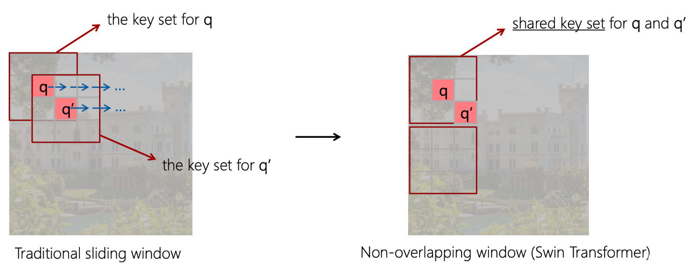

`This strategy is also efficient in regards to real-world latency: all query patches within a window share the same key set, which facilitates memory access in hardware.`

#### 2.5 Shifted Window Attention

前面的Window Attention是在每个窗口下计算注意力的，为了更好的和其他window进行信息交互，Swin Transformer还引入了shifted window操作。

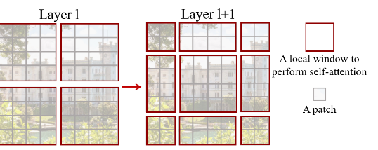

左边是没有重叠的Window Attention，而右边则是将窗口进行移位的Shift Window Attention。可以看到移位后的窗口包含了原本相邻窗口的元素。但这也引入了一个新问题，即**window的个数翻倍了**，由原本四个窗口变成了9个窗口。

在实际代码里，我们是**通过对特征图移位，并给Attention设置mask来间接实现的**。能在**保持原有的window个数下**，最后的计算结果等价。

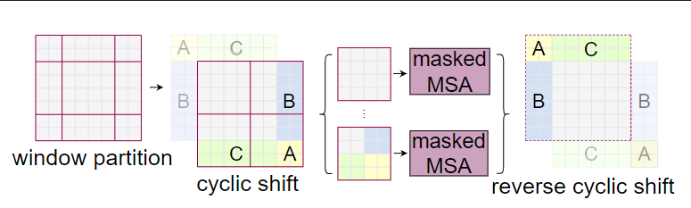

代码里对特征图移位是通过`torch.roll`来实现的，下面是示意图

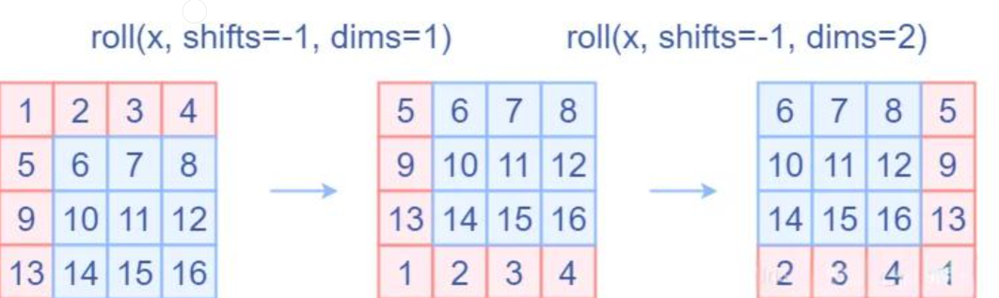

> 如果需要`reverse cyclic shift`的话只需把参数`shifts`设置为对应的正数值。

#### 2.6 Attention Mask

我认为这是Swin Transformer的精华，通过设置合理的mask，让`Shifted Window Attention`在与`Window Attention`相同的窗口个数下，达到等价的计算结果。

1. 对Shift Window后的每个窗口都给上index，并且做一个`roll`操作（window_size=2, shift_size=1）

   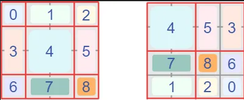

2. 我们希望在计算Attention的时候，**让具有相同index QK进行计算，而忽略不同index QK计算结果**。

   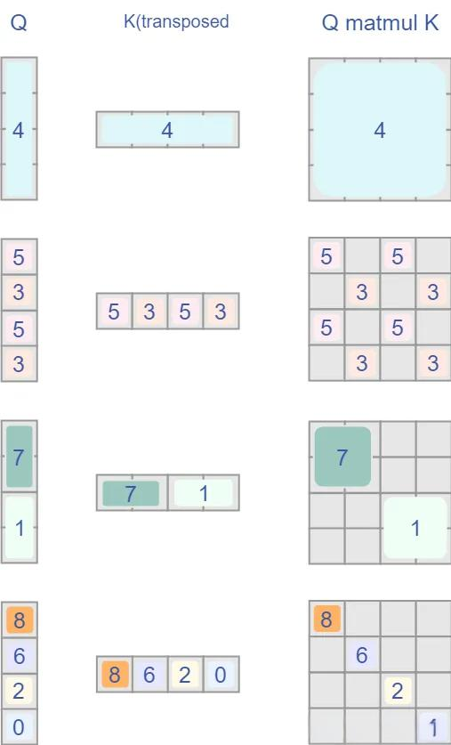

而要想在原始四个窗口下得到正确的结果，我们就必须给Attention的结果加入一个mask（如上图最右边所示）

```python
if self.shift_size > 0:
    # calculate attention mask for SW-MSA
    H, W = self.input_resolution
    img_mask = torch.zeros((1, H, W, 1))  # 1 H W 1
    h_slices = (slice(0, -self.window_size),
                slice(-self.window_size, -self.shift_size),
                slice(-self.shift_size, None))
    w_slices = (slice(0, -self.window_size),
                slice(-self.window_size, -self.shift_size),
                slice(-self.shift_size, None))
    cnt = 0
    for h in h_slices:
        for w in w_slices:
            img_mask[:, h, w, :] = cnt
            cnt += 1

            mask_windows = window_partition(img_mask, self.window_size)  # nW, window_size, window_size, 1
            mask_windows = mask_windows.view(-1, self.window_size * self.window_size)
            attn_mask = mask_windows.unsqueeze(1) - mask_windows.unsqueeze(2)
            attn_mask = attn_mask.masked_fill(attn_mask != 0, float(-100.0)).masked_fill(attn_mask == 0, float(0.0))
```

以上图的设置，我们用这段代码会得到这样的一个mask

```PYTHON
tensor([[[[[   0.,    0.,    0.,    0.],
           [   0.,    0.,    0.,    0.],
           [   0.,    0.,    0.,    0.],
           [   0.,    0.,    0.,    0.]]],


         [[[   0., -100.,    0., -100.],
           [-100.,    0., -100.,    0.],
           [   0., -100.,    0., -100.],
           [-100.,    0., -100.,    0.]]],


         [[[   0.,    0., -100., -100.],
           [   0.,    0., -100., -100.],
           [-100., -100.,    0.,    0.],
           [-100., -100.,    0.,    0.]]],


         [[[   0., -100., -100., -100.],
           [-100.,    0., -100., -100.],
           [-100., -100.,    0., -100.],
           [-100., -100., -100.,    0.]]]]])
```

在之前的window attention模块的前向代码里，包含这么一段

```python
        if mask is not None:
            nW = mask.shape[0]
            attn = attn.view(B_ // nW, nW, self.num_heads, N, N) + mask.unsqueeze(1).unsqueeze(0)
            attn = attn.view(-1, self.num_heads, N, N)
            attn = self.softmax(attn)
```

将mask加到attention的计算结果，并进行softmax。mask的值设置为-100，softmax后就会忽略掉对应的值

### 3 架构

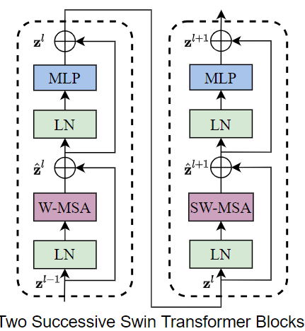

两个连续的Block架构如上图所示，需要注意的是一个Stage包含的Block个数必须是偶数，因为需要交替包含一个含有`Window Attention`的Layer和含有`Shifted Window Attention`的Layer。

```python
	def forward(self, x):
        H, W = self.input_resolution
        B, L, C = x.shape
        assert L == H * W, "input feature has wrong size"

        shortcut = x
        x = self.norm1(x)
        x = x.view(B, H, W, C)

        # cyclic shift
        if self.shift_size > 0:
            shifted_x = torch.roll(x, shifts=(-self.shift_size, -self.shift_size), dims=(1, 2))
        else:
            shifted_x = x

        # partition windows
        x_windows = window_partition(shifted_x, self.window_size)  # nW*B, window_size, window_size, C
        x_windows = x_windows.view(-1, self.window_size * self.window_size, C)  # nW*B, window_size*window_size, C

        # W-MSA/SW-MSA
        attn_windows = self.attn(x_windows, mask=self.attn_mask)  # nW*B, window_size*window_size, C

        # merge windows
        attn_windows = attn_windows.view(-1, self.window_size, self.window_size, C)
        shifted_x = window_reverse(attn_windows, self.window_size, H, W)  # B H' W' C

        # reverse cyclic shift
        if self.shift_size > 0:
            x = torch.roll(shifted_x, shifts=(self.shift_size, self.shift_size), dims=(1, 2))
        else:
            x = shifted_x
        x = x.view(B, H * W, C)

        # FFN
        x = shortcut + self.drop_path(x)
        x = x + self.drop_path(self.mlp(self.norm2(x)))

        return x
```

- 先对特征图进行`LayerNorm`
- 通过`self.shift_size`决定是否需要对特征图进行shift
- 然后将特征图切成一个个窗口
- 计算Attention，通过`self.attn_mask`来区分`Window Attention`还是`Shift Window Attention`
- 将各个窗口合并回来
- 如果之前有做shift操作，此时进行`reverse shift`，把之前的shift操作恢复
- 做dropout和残差连接
- 再通过一层LayerNorm+全连接层，以及dropout和残差连接

### 4 结果

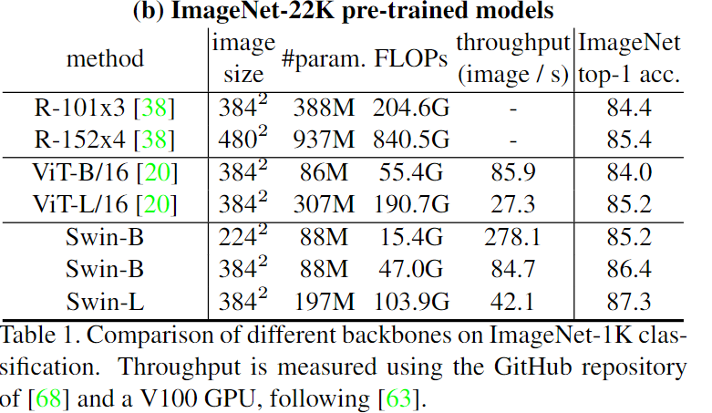


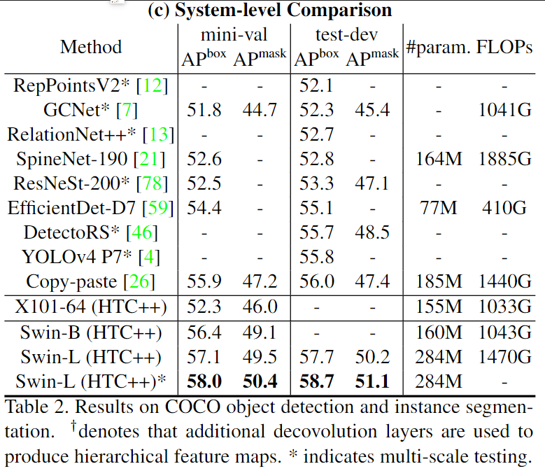

### 5 model analysis

#### 5.1 pre-processing

```python
# swin_small_patch4_window7_224
Compose(
    Resize(size=248, interpolation=bicubic, max_size=None, antialias=True)
    CenterCrop(size=(224, 224))
    ToTensor()
    Normalize(mean=tensor([0.4850, 0.4560, 0.4060]), std=tensor([0.2290, 0.2240, 0.2250]))
)
```

#### 5.2 model info

|  name  |  pretrain   | resolution | acc@1 | acc@5 | #params | FLOPs |
| :----: | :---------: | :--------: | :---: | :---: | :-----: | :---: |
| Swin-T | ImageNet-1K |  224x224   | 81.2  | 95.5  |   28M   | 4.5G  |
| Swin-S | ImageNet-1K |  224x224   | 83.2  | 96.2  |   50M   | 8.7G  |
| Swin-B | ImageNet-1K |  224x224   | 83.5  | 96.5  |   88M   | 15.4G |
| Swin-B | ImageNet-1K |  384x384   | 84.5  | 97.0  |   88M   | 47.1G |

```bash
====================================================================================================
Layer (type:depth-idx)                             Output Shape              Param #
====================================================================================================
SwinTransformer                                    [1, 1000]                 --
├─PatchEmbed: 1-1                                  [1, 56, 56, 96]           --
│    └─Conv2d: 2-1                                 [1, 96, 56, 56]           4,704
│    └─LayerNorm: 2-2                              [1, 56, 56, 96]           192
├─Sequential: 1-2                                  [1, 7, 7, 768]            --
│    └─SwinTransformerStage: 2-3                   [1, 56, 56, 96]           --
│    │    └─Identity: 3-1                          [1, 56, 56, 96]           --
│    │    └─Sequential: 3-2                        [1, 56, 56, 96]           224,694
│    └─SwinTransformerStage: 2-4                   [1, 28, 28, 192]          --
│    │    └─PatchMerging: 3-3                      [1, 28, 28, 192]          74,496
│    │    └─Sequential: 3-4                        [1, 28, 28, 192]          891,756
│    └─SwinTransformerStage: 2-5                   [1, 14, 14, 384]          --
│    │    └─PatchMerging: 3-5                      [1, 14, 14, 384]          296,448
│    │    └─Sequential: 3-6                        [1, 14, 14, 384]          31,976,856
│    └─SwinTransformerStage: 2-6                   [1, 7, 7, 768]            --
│    │    └─PatchMerging: 3-7                      [1, 7, 7, 768]            1,182,720
│    │    └─Sequential: 3-8                        [1, 7, 7, 768]            14,183,856
├─LayerNorm: 1-3                                   [1, 7, 7, 768]            1,536
├─ClassifierHead: 1-4                              [1, 1000]                 --
│    └─SelectAdaptivePool2d: 2-7                   [1, 768]                  --
│    │    └─FastAdaptiveAvgPool: 3-9               [1, 768]                  --
│    │    └─Identity: 3-10                         [1, 768]                  --
│    └─Dropout: 2-8                                [1, 768]                  --
│    └─Linear: 2-9                                 [1, 1000]                 769,000
│    └─Identity: 2-10                              [1, 1000]                 --
====================================================================================================
Total params: 49,606,258
Trainable params: 49,606,258
Non-trainable params: 0
Total mult-adds (M): 105.38
====================================================================================================
Input size (MB): 0.60
Forward/backward pass size (MB): 216.77
Params size (MB): 198.23
Estimated Total Size (MB): 415.60
====================================================================================================
```

|  Aten Operations  |    NN Operations    |
| :---------------: | :-----------------: |
| aten::__getitem__ |       Conv2d        |
|     aten::add     |      DropPath       |
| aten::contiguous  |       Dropout       |
|     aten::eq      | FastAdaptiveAvgPool |
|   aten::flatten   |        GELU         |
|  aten::floordiv   |      Identity       |
|   aten::format    |      LayerNorm      |
|    aten::gelu     |       Linear        |
| aten::layer_norm  |       Softmax       |
|   aten::matmul    |                     |
|    aten::mean     |                     |
|     aten::mul     |                     |
|     aten::pad     |                     |
|   aten::permute   |                     |
|  aten::remainder  |                     |
|   aten::reshape   |                     |
|    aten::roll     |                     |
|    aten::size     |                     |
|    aten::slice    |                     |
|   aten::softmax   |                     |
|     aten::sub     |                     |
|  aten::to_dense   |                     |
|  aten::to_mkldnn  |                     |
|  aten::transpose  |                     |
|   aten::unbind    |                     |
|    aten::view     |                     |

|    NN Operations    |                            Params                            |
| :-----------------: | :----------------------------------------------------------: |
|       Conv2d        |          (3, 96, kernel_size=(4, 4), stride=(4, 4))          |
|      LayerNorm      | ((96,), eps=1e-05, elementwise_affine=True)<br />((384,), eps=1e-05, elementwise_affine=True)<br />((192,), eps=1e-05, elementwise_affine=True)<br />((768,), eps=1e-05, elementwise_affine=True)<br />((1536,), eps=1e-05, elementwise_affine=True) |
|      Identity       |                              /                               |
|       Linear        | (in_features=96, out_features=288, bias=True)<br />(in_features=96, out_features=96, bias=True)<br />(in_features=96, out_features=384, bias=True)<br />(in_features=384, out_features=96, bias=True)<br />(in_features=384, out_features=192, bias=False)<br />(in_features=192, out_features=576, bias=True)<br />(in_features=192, out_features=192, bias=True)<br />(in_features=192, out_features=768, bias=True)<br />(in_features=768, out_features=192, bias=True)<br />(in_features=768, out_features=384, bias=False)<br />(in_features=384, out_features=1152, bias=True)<br />(in_features=384, out_features=384, bias=True)<br />(in_features=384, out_features=1536, bias=True)<br />(in_features=1536, out_features=384, bias=True)<br />(in_features=1536, out_features=768, bias=False)<br />(in_features=768, out_features=2304, bias=True)<br />(in_features=768, out_features=768, bias=True)<br />(in_features=768, out_features=3072, bias=True)<br />(in_features=3072, out_features=768, bias=True)<br />(in_features=768, out_features=1000, bias=True) |
|       Dropout       |                    (p=0.0, inplace=False)                    |
|       Softmax       |                           (dim=-1)                           |
|        GELU         |                     (approximate='none')                     |
|      DropPath       | (drop_prob=0.004)<br />(drop_prob=0.009)<br />(drop_prob=0.013)<br />(drop_prob=0.017)<br />(drop_prob=0.022)<br />(drop_prob=0.026)<br />(drop_prob=0.030)<br />(drop_prob=0.035)<br />(drop_prob=0.039)<br />(drop_prob=0.043)<br />(drop_prob=0.048)<br />(drop_prob=0.052)<br />(drop_prob=0.057)<br />(drop_prob=0.061)<br />(drop_prob=0.065)<br />(drop_prob=0.070)<br />(drop_prob=0.074)<br />(drop_prob=0.078)<br />(drop_prob=0.083)<br />(drop_prob=0.087)<br />(drop_prob=0.091)<br />(drop_prob=0.096)<br />(drop_prob=0.100) |
| FastAdaptiveAvgPool |                              /                               |

#### 5.3 post-processing

```python
torch.topk(probabilities, 1)
```

## v2

> [paper](https://arxiv.org/abs/2111.09883)
>
> To better scale up model capacity and window resolution

### 1 优化方向

1. 训练中的不稳定性问题。在大型模型中，跨层激活函数输出的幅值的差异变得更大。激活值是逐层累积的，因此深层的幅值明显大于浅层的幅值。 *当我们将原来的 Swin Transformer 模型从小模型放大到大模型时，深层的 activation 值急剧增加。最高和最低幅值之间的差异达到了104。当我们进一步扩展到一个巨大的规模 (658M 参数) 时，它不能完成训练*
2. 许多下游视觉任务需要**高分辨率**的图像或窗口，预训练模型时是在低分辨率下进行的，而 fine-tuning 是在高分辨率下进行的。针对分辨率不同的问题传统的做法是把位置编码进行双线性插值 (bi-cubic interpolation)，这种做法是次优的。当我们**直接在较大的图像分辨率和窗口大小测试**预训练的 Imagenet-1k 模型 (分辨率256×256，window siez=8×8) 时，发现精度显著下降, 当图像分辨率较高时，GPU 内存消耗也是一个问题

### 2 训练稳定性

#### 2.1 post normalization

把 Layer Normalization 层放在 Attention 或者 MLP 的后面。这样每个残差块的输出变化不至于太大，因为主分支和残差分支都是 LN 层的输出，有 LN 归一化作用的限制。如上图1所示，这种做法使得每一层的输出值基本上相差不大。在最大的模型训练中，作者每经过6个 Transformer Block，就在主支路上增加了一层 LN，以进一步稳定训练和输出幅值。

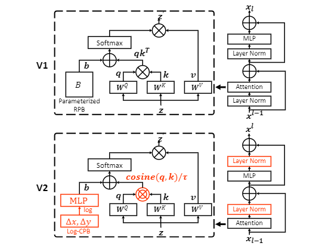

```python
    def forward(self, x):
        H, W = self.input_resolution
        B, L, C = x.shape
        assert L == H * W, "input feature has wrong size"

        shortcut = x
        x = x.view(B, H, W, C)

        # cyclic shift
        if self.shift_size > 0:
            shifted_x = torch.roll(x, shifts=(-self.shift_size, -self.shift_size), dims=(1, 2))
        else:
            shifted_x = x

        # partition windows
        x_windows = window_partition(shifted_x, self.window_size)  # nW*B, window_size, window_size, C
        x_windows = x_windows.view(-1, self.window_size * self.window_size, C)  # nW*B, window_size*window_size, C

        # W-MSA/SW-MSA
        attn_windows = self.attn(x_windows, mask=self.attn_mask)  # nW*B, window_size*window_size, C

        # merge windows
        attn_windows = attn_windows.view(-1, self.window_size, self.window_size, C)
        shifted_x = window_reverse(attn_windows, self.window_size, H, W)  # B H' W' C

        # reverse cyclic shift
        if self.shift_size > 0:
            x = torch.roll(shifted_x, shifts=(self.shift_size, self.shift_size), dims=(1, 2))
        else:
            x = shifted_x
        x = x.view(B, H * W, C)
        #  Attention或者FFN的输出经过LayerNorm之后才和shortcut相加，这样就尽量减少网络加深后的激活值积累
        x = shortcut + self.drop_path(self.norm1(x))

        # FFN
        x = x + self.drop_path(self.norm2(self.mlp(x)))

        return x
```

#### 2.2 scaled cosine attention

原来的 self-attention 计算中，query 和 key 之间的相似性通过 dot-product 来衡量，作者发现这样学习到的 attention map 往往被少数像素对所支配。所以把 dot-product 改成了 cosine 函数，通过它来衡量 query 和 key 之间的相似性：即计算两个token的余弦相似度，然后除以一个可学习的标量
$$
Sim(q_i,k_j) = cos(q_i,k_j)/ \tau +B_{ij}
$$

```python
# v1
q = q * self.scale
attn = (q @ k.transpose(-2, -1)

# v2
# 初始化\tau
self.logit_scale = nn.Parameter(torch.log(10 * torch.ones((num_heads, 1, 1))), requires_grad=True)

# cosine attention
attn = (F.normalize(q, dim=-1) @ F.normalize(k, dim=-1).transpose(-2, -1))
logit_scale = torch.clamp(self.logit_scale, max=torch.log(torch.tensor(1. / 0.01))).exp()
attn = attn * logit_scale
```

- $\tau$: 训练参数, 不同层和attention head不共享，并且限制大于0.01
- $B_{ij}$: relative position bias

由于余弦相似度范围在0～1，所以它使得不同的token间的相似度分布在同样的尺度下，从而减少attention map的过于集中的问题。下表为不同的模型使用scaled cosine attention后的对比实验，可以看到，在使用res-post-norm之后再使用scaled cosine attention可以进一步提升模型的分类准确度。

### 3 增大分辨率

#### 3.1 Log-spaced continuous position bias

分类模型的图像分辨率低，但是对于下游任务如检测和分割往往要采用更大的分辨率。由于Swin采用window attention和relative position bias，当采用分类预训练模型迁移到下游任务时如果要采用更大的window size，那么就需要对relative position bias进行插值。

大的视觉模型往往同时需要提升图像的分辨率，那么此时也最好同时增大`window`来提升感受野。

作者发现**直接插值的话往往效果会下降**，如下表所示，采用8x8的window和256x256分辨率的Swin-T模型在ImageNet1K上能达到81.7，但如果将这个预训练模型在12x12的window和384x384分辨率下，效果只有79.4，但是finetune之后能达到82.7%。论文提出了一种新的策略**log-spaced continuous position bias**（记为**Log-CPB**）来解决这个问题，如下表所示，基于**Log-CPB**的模型直接在同样的场景下迁移效果能达到82.4%，超过原来的81.8%，而且finetune之后可以达到83.2%，在COCO和ADE20k数据集上也表现更好

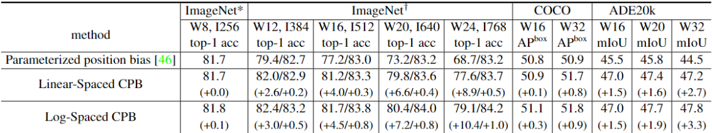

```python
# define a parameter table of relative position bias
self.relative_position_bias_table = nn.Parameter(
    torch.zeros((2 * window_size[0] - 1) * (2 * window_size[1] - 1), num_heads))  # 2*Wh-1 * 2*Ww-1, nH
```


如本文[公式（2）](###2.4 Window Attention)的$B$就是 `relative position bias`，它用来编码window中的各个tokens间的相对位置，当$M$ 为window大小时候，那么token在每个维度上的相对位置分布在$[-M+1,M-1]$ 范围内，总共有$2M-1$个值，那么通过定义矩阵$B\in R^{(2M-1)*(2M-1)}$，就能通过索引的方式得到$B$, 这样处理的好处是参数量比较小。当改变window大小时，就需要对$B$ 进行插值，而SwinT-V2的改进策略时**采用连续的 relative position bias**，不再定义一个固定大小的$B$，而是采用一个小网络来预测relative position bias，这里：
$$
B(\Delta x,\Delta y) = G(\Delta x,\Delta y)
$$
这里的G是一个**包含2层的MLP模型**，中间采用ReLU激活，采用网络G的好处是它可以生成任意相对位置的来得到relative position bias，这样在迁移到更大的window时就不需要任何更改。

```python
# mlp to generate continuous relative position bias
self.cpb_mlp = nn.Sequential(nn.Linear(2, 512, bias=True),
                             nn.ReLU(inplace=True),
                             nn.Linear(512, num_heads, bias=False))
```

虽然网络G可以适应不同大小的window，但是当window size变化时，相对位置范围也发生了变化，这意味着网络G要接受和预训练模型不一样的输入范围，为了尽量减少输入范围的变化, 论文进一步提出采用log空间下的坐标来替换原来的线性坐标：**采用对数坐标的好处是可以减少范围的变化，这对网络G的泛化要求就变低了**。比如要将8x8大小的window迁移到16x16大小，对于线性坐标，其范围从原来的[-7, 7]到[-15, 15]，此时相当于额外增加了(15 - 7)/7=1.14倍原来的坐标范围。如果采用对数坐标，其范围从原来的[-2.079, 2.079]到[-2.773, 2.773]，此时只额外增加了(2.773 - 2.079)/2.079=0.33倍原来的范围。

```python
# 网络G来生成连续的relative position bias
self.cpb_mlp = nn.Sequential(nn.Linear(2, 512, bias=True),
                             nn.ReLU(inplace=True),
                             nn.Linear(512, num_heads, bias=False))

# 获取relative_coords_table: (2M-1)x(2M-1)作为网络G的输入
relative_coords_h = torch.arange(-(self.window_size[0] - 1), self.window_size[0], dtype=torch.float32)
relative_coords_w = torch.arange(-(self.window_size[1] - 1), self.window_size[1], dtype=torch.float32)
relative_coords_table = torch.stack(
            torch.meshgrid([relative_coords_h,
                            relative_coords_w])).permute(1, 2, 0).contiguous().unsqueeze(0)  # 1, 2*Wh-1, 2*Ww-1, 2
# 归一化，迁移预训练模型时用原来的window size
if pretrained_window_size[0] > 0:
    relative_coords_table[:, :, :, 0] /= (pretrained_window_size[0] - 1)
    relative_coords_table[:, :, :, 1] /= (pretrained_window_size[1] - 1)
else:
    relative_coords_table[:, :, :, 0] /= (self.window_size[0] - 1)
    relative_coords_table[:, :, :, 1] /= (self.window_size[1] - 1)
relative_coords_table *= 8  # 归一化到 -8, 8
relative_coords_table = torch.sign(relative_coords_table) * torch.log2(
            torch.abs(relative_coords_table) + 1.0) / np.log2(8) # 这里也同时除以np.log2(8)

self.register_buffer("relative_coords_table", relative_coords_table)

# 得到相对位置索引: 此处逻辑同 v1, 不再赘述
coords_h = torch.arange(self.window_size[0])
coords_w = torch.arange(self.window_size[1])
coords = torch.stack(torch.meshgrid([coords_h, coords_w]))  # 2, Wh, Ww
coords_flatten = torch.flatten(coords, 1)  # 2, Wh*Ww
relative_coords = coords_flatten[:, :, None] - coords_flatten[:, None, :]  # 2, Wh*Ww, Wh*Ww
relative_coords = relative_coords.permute(1, 2, 0).contiguous()  # Wh*Ww, Wh*Ww, 2
relative_coords[:, :, 0] += self.window_size[0] - 1  # shift to start from 0
relative_coords[:, :, 1] += self.window_size[1] - 1
relative_coords[:, :, 0] *= 2 * self.window_size[1] - 1
relative_position_index = relative_coords.sum(-1)  # Wh*Ww, Wh*Ww
self.register_buffer("relative_position_index", relative_position_index)

# 预测时先用网络G产生B，然后根据相对位置索引生成B
relative_position_bias_table = self.cpb_mlp(self.relative_coords_table).view(-1, self.num_heads)
relative_position_bias = relative_position_bias_table[self.relative_position_index.view(-1)].view(
            self.window_size[0] * self.window_size[1], self.window_size[0] * self.window_size[1], -1)  # Wh*Ww,Wh*Ww,nH
relative_position_bias = relative_position_bias.permute(2, 0, 1).contiguous()  # nH, Wh*Ww, Wh*Ww
relative_position_bias = 16 * torch.sigmoid(relative_position_bias) # 限制bias的大小范围？
attn = attn + relative_position_bias.unsqueeze(0)
```

### 4 显存消耗

1. **ZeRO优化器**：ZeRO是将模型参数和优化器状态参数均分到不同的GPU上，这样就可以降低显存使用，这里采用DeepSpeed库的ZeRO-1，它可以降低显存消耗但是几乎不影响训练速度
2. **Activation check-pointing**：模型的中间特征也会消耗大量的GPU，可以采用**activation check-pointing**来缓解这个问题，目前PyTorch已经支持，具体见https://pytorch.org/docs/stable/checkpoint.html。这个优化虽然降低了显存消耗，但是也将训练速度降低了30%
3. Sequential self-attention computation：不再对self-attention进行batch运算，而是序列地逐个执行，从而降低显存使用，不过这个优化只在前两个stages使用，对训练速度只有少量的影响

# Build_In Deploy
- [microsoft_deploy](./source_code/microsoft_deploy.md)