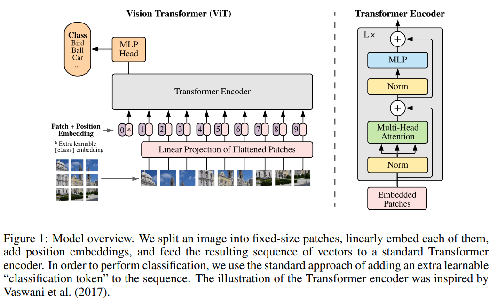

# Vision Trasformer

[An Image is Worth 16x16 Words: Transformers for Image Recognition at Scale](https://arxiv.org/abs/2010.11929)

## Model Arch

<div align=center></div>

Vision Transformer (ViT) 是一种基于Transformer架构的计算机视觉模型，由Google Research团队在2020年提出，它将自然语言处理中成功的Transformer模型应用于图像识别任务。

ViT的核心创新是将图像处理为一系列"图像块"(patches)的序列，然后使用标准的Transformer编码器来处理这些图像块，类似于处理NLP中的词令牌(token)。

主要构成：

- 图像分块(Image Patching)
    - 将输入图像(H×W×C)划分为N个固定大小的patches (通常16×16或32×32像素)
    - 每个patch被展平为一个向量，形成patch嵌入序列

- 线性投影(Linear Projection)
    - 每个patch通过可学习的线性层映射到模型维度D

- 位置嵌入(Position Embedding)
    - 添加可学习的位置嵌入以保留空间信息
    - 因为Transformer本身不包含位置信息

- 分类令牌(Class Token)
    - 类似于BERT的[CLS]令牌，用于最终的分类

- Transformer编码器
    - 由多个相同的层组成，每层包含:多头自注意力机制(Multi-Head Self-Attention, MHSA)；多层感知机(MLP)；层归一化(LayerNorm)；残差连接(Residual Connections)

- MLP头部
    - 在[CLS]令牌上应用MLP进行最终分类

### pre-processing

VIT系列网络的预处理操作可以按照如下步骤进行，即先对图片进行resize至224的尺寸，然后进行归一化、减均值除方差等操作。

```python
# https://github.com/huggingface/transformers/blob/v4.53.2/src/transformers/models/vit/image_processing_vit_fast.py#L30
class ViTImageProcessorFast(BaseImageProcessorFast):
    resample = PILImageResampling.BILINEAR
    image_mean = [0.5, 0.5, 0.5]
    image_std = [0.5, 0.5, 0.5]
    size = {"height": 224, "width": 224}
    do_resize = True
    do_rescale = True
    do_normalize = True
```

### post-processing

topk等处理。

### backbone

VIT系列网络的backbone由Transformer Encoder组成。

### head

由MLP组成的head。


### common

- Transformer Encoder
- Multi-Head Self-Attention


### 测评数据集说明

<div align=center></div>

[ImageNet](https://image-net.org/challenges/LSVRC/2012/index.php)是一个计算机视觉系统识别项目，是目前世界上图像识别最大的数据库。是美国斯坦福的计算机科学家，模拟人类的识别系统建立的。能够从图片中识别物体。ImageNet是一个非常有前景的研究项目，未来用在机器人身上，就可以直接辨认物品和人了。超过1400万的图像URL被ImageNet手动注释，以指示图片中的对象;在至少一百万张图像中，还提供了边界框。ImageNet包含2万多个类别; 一个典型的类别，如“气球”或“草莓”，每个类包含数百张图像。

ImageNet数据是CV领域非常出名的数据集，ISLVRC竞赛使用的数据集是轻量版的ImageNet数据集。ISLVRC2012是非常出名的一个数据集，在很多CV领域的论文，都会使用这个数据集对自己的模型进行测试，在该项目中分类算法用到的测评数据集就是ISLVRC2012数据集的验证集。在一些论文中，也会称这个数据叫成ImageNet 1K或者ISLVRC2012，两者是一样的。“1 K”代表的是1000个类别。

### 评价指标说明

- top1准确率: 测试图片中最佳得分所对应的标签是正确标注类别的样本数除以总的样本数
- top5准确率: 测试图片中正确标签包含在前五个分类概率中的个数除以总的样本数

## Build_In Deploy
- [huggingface_deploy](./source_code/huggingface_deploy.md)