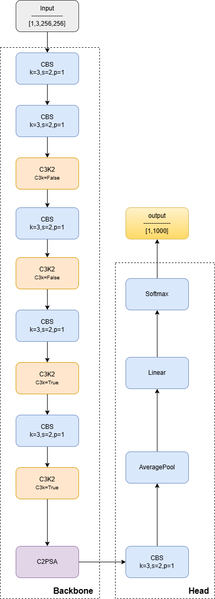

# Yolov11_cls

## Code Source
```
link: https://github.com/ultralytics/ultralytics
branch: main
commit: d17b305786ba1055c642b5e5e820749ca66f132e
```

## Model Arch




### pre-processing

yolov11_cls系列网络的预处理操作是：先对图片进行resize至288的尺寸，然后利用`CenterCrop`算子crop出256的图片对其进行归一化、减均值除方差等操作

### post-processing

yolov11_cls系列网络的后处理操作是对网络输出进行softmax作为每个类别的预测值，然后根据预测值进行排序，选择topk作为输入图片的预测分数以及类别

### backbone

YOLO11采用改进的骨干和颈部架构，增强了特征提取能力，提高了物体检测的精确度和复杂任务的表现。相比较于YOLOv8模型，其将CF2模块改成C3K2，同时在SPPF模块后面添加了一个C2PSA模块，且将YOLOv10的head思想引入到YOLO11的head中，使用深度可分离的方法，减少冗余计算，提高效率。

YOLO11增加了一个C2PSA模块，并且将C2f替换为了C3k2。相比于C2f，当超参数c3k=True时，瓶颈块替换为 C3k，否则还是C2f,而C3k相比于C3则是可以让使用者自定义卷积块大小，更加灵活。C2PSA扩展了C2f，通过引入PSA( Position-Sensitive Attention)，旨在通过多头注意力机制和前馈神经网络来增强特征提取能力。它可以选择性地添加残差结构（shortcut）以优化梯度传播和网络训练效果。同时，使用FFN 可以将输入特征映射到更高维的空间，捕获输入特征的复杂非线性关系，允许模型学习更丰富的特征表示。

</a>
    
### head
yolov11_cls系列网络的head层由一个卷积层、一个global-average-pooling层和一层全连接层组成

## Model Info

### 模型性能

| 模型 | 尺寸<br><sup>(像素) | acc<br><sup>top1 | acc<br><sup>top5 | 速度<br><sup>CPU ONNX<br>(毫秒) | 速度<br><sup>T4 TensorRT10<br>(毫秒) | 参数<br><sup>(百万) | FLOPs<br><sup>(十亿) @ 224 |
| -------------------------------------------------------------------------------------------- | ------------------- | ---------------- | ---------------- | ------------------------------- | ------------------------------------ | ------------------- | -------------------------- |
| [YOLO11n-cls](https://github.com/ultralytics/assets/releases/download/v8.3.0/yolo11n-cls.pt) | 224                 | 70.0             | 89.4             | 5.0 ± 0.3                       | 1.1 ± 0.0                            | 2.8                 | 0.5                        |
| [YOLO11s-cls](https://github.com/ultralytics/assets/releases/download/v8.3.0/yolo11s-cls.pt) | 224                 | 75.4             | 92.7             | 7.9 ± 0.2                       | 1.3 ± 0.0                            | 6.7                 | 1.6                        |
| [YOLO11m-cls](https://github.com/ultralytics/assets/releases/download/v8.3.0/yolo11m-cls.pt) | 224                 | 77.3             | 93.9             | 17.2 ± 0.4                      | 2.0 ± 0.0                            | 11.6                | 4.9                        |
| [YOLO11l-cls](https://github.com/ultralytics/assets/releases/download/v8.3.0/yolo11l-cls.pt) | 224                 | 78.3             | 94.3             | 23.2 ± 0.3                      | 2.8 ± 0.0                            | 14.1                | 6.2                        |
| [YOLO11x-cls](https://github.com/ultralytics/assets/releases/download/v8.3.0/yolo11x-cls.pt) | 224                 | 79.5             | 94.9             | 41.4 ± 0.9                      | 3.8 ± 0.0                            | 29.6                | 13.6                       |

### 测评数据集说明

<div align=center></div>

ImageNet是一个计算机视觉系统识别项目，是目前世界上图像识别最大的数据库。是美国斯坦福的计算机科学家，模拟人类的识别系统建立的。能够从图片中识别物体。ImageNet是一个非常有前景的研究项目，未来用在机器人身上，就可以直接辨认物品和人了。超过1400万的图像URL被ImageNet手动注释，以指示图片中的对象;在至少一百万张图像中，还提供了边界框。ImageNet包含2万多个类别; 一个典型的类别，如“气球”或“草莓”，每个类包含数百张图像。

ImageNet数据是CV领域非常出名的数据集，ISLVRC竞赛使用的数据集是轻量版的ImageNet数据集。ISLVRC2012是非常出名的一个数据集，在很多CV领域的论文，都会使用这个数据集对自己的模型进行测试，在该项目中分类算法用到的测评数据集就是ISLVRC2012数据集的验证集。在一些论文中，也会称这个数据叫成ImageNet 1K或者ISLVRC2012，两者是一样的。“1 K”代表的是1000个类别。

### 评价指标说明

- top1准确率: 测试图片中最佳得分所对应的标签是正确标注类别的样本数除以总的样本数
- top5准确率: 测试图片中正确标签包含在前五个分类概率中的个数除以总的样本数

## Build_In Deploy

### step.1 模型准备

1. 下载模型权重
    ```
    link: https://github.com/ultralytics/ultralytics
    branch: main
    commit: d17b305786ba1055c642b5e5e820749ca66f132e
    ```

2. 模型导出
- 获取原始仓库，按原仓库安装
- 参考[export_onnx.py](./source_code/export_onnx.py)，导出onnx


### step.2 准备数据集
- [校准数据集](https://image-net.org/challenges/LSVRC/2012/index.php)
- [评估数据集](https://image-net.org/challenges/LSVRC/2012/index.php)
- [label_list](../common/label/imagenet.txt)


### step.3 模型转换
1. 根据具体模型,修改模型转换配置文件
    - [official_yolov11_cls_fp16.yaml](./build_in/build/official_yolov11_cls_fp16.yaml)
    - [official_yolov11_cls_int8.yaml](./build_in/build/official_yolov11_cls_int8.yaml)
    
    > - 编译参数`backend.type: tvm_vacc`
    > - fp16精度: 编译参数`backend.dtype: fp16`
    > - int8精度: 编译参数`backend.dtype: int8`，需要配置量化数据集和预处理算子


2. 模型编译
    ```bash
    cd yolov11_cls
    mkdir workspace
    cd workspace
    vamc compile ../build_in/build/official_yolov11_cls_fp16.yaml
    vamc compile ../build_in/build/official_yolov11_cls_int8.yaml
    ```

### step.4 模型推理

1. vsx推理：[classification.py](../common/vsx/classification.py)
    ```bash
    python ../../common/vsx/classification.py \
        --infer_mode sync \
        --file_path path/to/ILSVRC2012_img_val \
        --model_prefix_path ./deploy_weights/official_yolov11n_cls_fp16/mod \
        --vdsp_params_info ../build_in/vdsp_params/ultralytics-yolov11n_cls-vdsp_params.json \
        --label_txt path/to/imagenet.txt \
        --save_dir ./infer_output \
        --save_result_txt result.txt \
        --device 0
    ```

### step.5 精度性能

- 精度评估：[eval_topk.py](../common/eval/eval_topk.py)
    ```
    python ../../common/eval/eval_topk.py ./infer_output/result.txt
    ```

    <details><summary>精度信息</summary>

    ```
    # official_yolov11n_cls 256

    ## fp16
    top1_rate: 70.8 top5_rate: 89.874

    ## int8
    top1_rate: 68.792 top5_rate: 88.708
    ```
    </details>

- 性能评估
    - 配置VDSP参数：[ultralytics-yolov11n_cls-vdsp_params.json](./build_in/vdsp_params/ultralytics-yolov11n_cls-vdsp_params.json)

    ```bash
    vamp -m ./deploy_weights/official_yolov11n_cls_fp16/mod \
    --vdsp_params ../build_in/vdsp_params/ultralytics-yolov11n_cls-vdsp_params.json \
    -i 8 -p 1 -b 2 -s [3,256,256]
    ```

### Tips
- 不同参数量模型，在量化参数上存在差异：
    ```yaml
    quantize:
        calibrate_mode: percentile
        quantize_per_channel: true
        skip_matmul_layers: [0, 1] # yolo11-n/s/m
        # skip_matmul_layers: [0, 1, 2, 3, 4, 5, 6, 7]  # yolo11-l/x
        calibrate_chunk_by: -1
    ```
- yolov11含有Attention模块，GQA计算时，由于硬件限制seqlen需要是128的倍数；即输入分辨率需设置为128的倍数