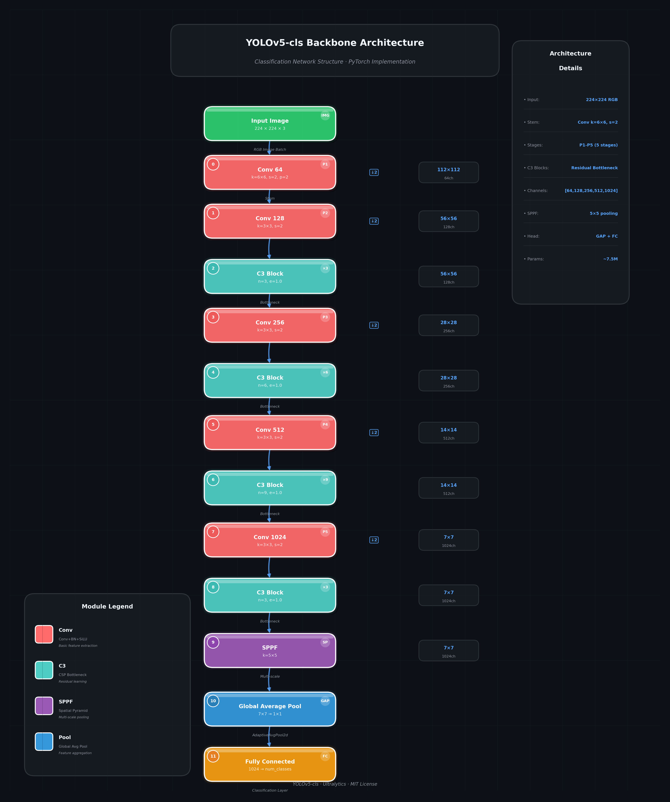
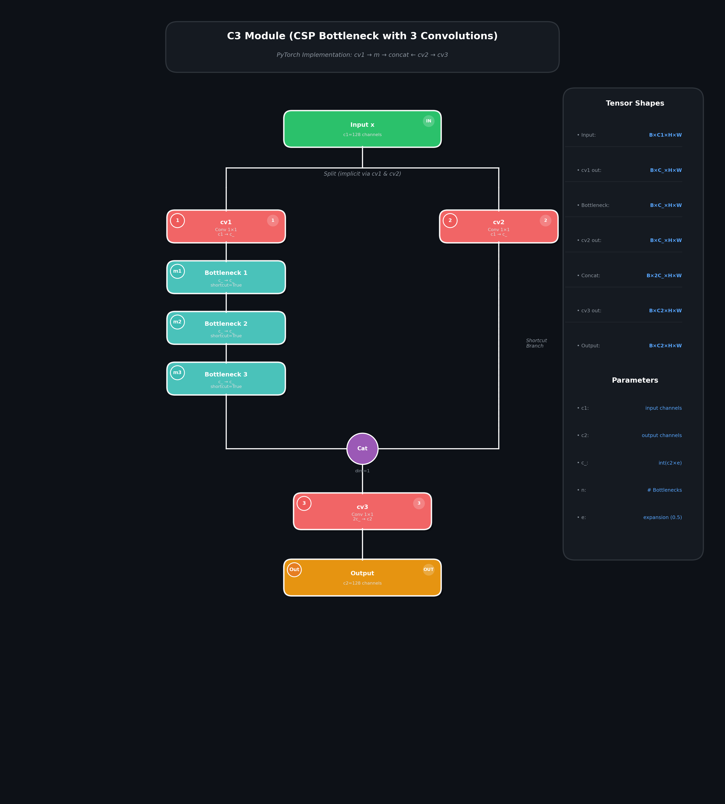

# Yolov5_cls

## Code Source
```
link: https://github.com/ultralytics/yolov5
branch: main
commit: 915bbf294bb74c859f0b41f1c23bc395014ea679
```

## Model Arch
YOLOv5_cls 是 Ultralytics 在 YOLOv5 检测模型基础上改进的分类模型。它继承了 YOLOv5 检测模型的骨干网络（Backbone），并添加了专门设计的分类头（Classification Head）。



### Pre-processing

YOLOv5_cls 系列网络的预处理操作流程如下：

1. **CenterCrop**: 对输入图像进行中心裁剪，取最小边长的正方形区域
2. **Resize**: 将裁剪后的图像 resize 到目标尺寸（默认 224x224）
3. **ToTensor**: 将图像从 HWC 格式转换为 CHW 格式，BGR 转换为 RGB，并归一化到 [0, 1]
4. **Normalize**: 使用 ImageNet 数据集的均值和标准差进行标准化
   - Mean: [0.485, 0.456, 0.406]
   - Std: [0.229, 0.224, 0.225]

### post-processing

YOLOv5_cls 系列网络的后处理操作是对网络输出进行 Softmax 作为每个类别的预测概率，然后根据预测概率进行排序，选择 Top-K（通常为 Top-1 和 Top-5）作为输入图片的预测结果。

### Backbone

YOLOv5_cls 采用 YOLOv5 检测模型的骨干网络作为特征提取器，主要由以下模块组成：

#### 1. C3 模块 (CSP Bottleneck with 3 convolutions)
C3 模块是 YOLOv5 的核心构建块，采用 CSP（Cross Stage Partial）结构：



- 包含两个分支：主分支经过多个 Bottleneck，shortcut 分支直接传递
- 通过通道分割减少计算量，同时保持特征表达能力
- CSP 结构: 减少计算量，增加特征融合
- 残差连接: 提供梯度捷径，缓解梯度消失
- 通道分割: 输入通道C分为两个C/2，降低计算复杂度

#### 2. SPPF 模块 (Spatial Pyramid Pooling - Fast)
SPPF 模块用于多尺度特征融合，是 SPP 的快速版本：
```python
class SPPF(nn.Module):
    # Spatial Pyramid Pooling - Fast (SPPF) layer for YOLOv5 by Glenn Jocher
    def __init__(self, c1, c2, k=5):  # equivalent to SPP(k=(5, 9, 13))
        super().__init__()
        c_ = c1 // 2  # hidden channels
        self.cv1 = Conv(c1, c_, 1, 1)
        self.cv2 = Conv(c_ * 4, c2, 1, 1)
        self.m = nn.MaxPool2d(kernel_size=k, stride=1, padding=k // 2)

    def forward(self, x):
        x = self.cv1(x)
        with warnings.catch_warnings():
            warnings.simplefilter('ignore')  # suppress torch 1.9.0 max_pool2d() warning
            y1 = self.m(x)
            y2 = self.m(y1)
            return self.cv2(torch.cat((x, y1, y2, self.m(y2)), 1))
```
- 使用多个 MaxPool 操作（等效于 5x5, 9x9, 13x13）
- 通过级联池化操作提高计算效率

#### 3. Backbone 结构
```yaml
# YOLOv5 v6.0 backbone
backbone:
  [[-1, 1, Conv, [64, 6, 2, 2]],  # 0-P1/2  下采样到 1/2
   [-1, 1, Conv, [128, 3, 2]],    # 1-P2/4  下采样到 1/4
   [-1, 3, C3, [128]],            # 2       C3 模块
   [-1, 1, Conv, [256, 3, 2]],    # 3-P3/8  下采样到 1/8
   [-1, 6, C3, [256]],            # 4       C3 模块 x6
   [-1, 1, Conv, [512, 3, 2]],    # 5-P4/16 下采样到 1/16
   [-1, 9, C3, [512]],            # 6       C3 模块 x9
   [-1, 1, Conv, [1024, 3, 2]],   # 7-P5/32 下采样到 1/32
   [-1, 3, C3, [1024]],           # 8       C3 模块 x3
   [-1, 1, SPPF, [1024, 5]],      # 9       SPPF 模块
  ]
```

### Head

YOLOv5_cls 的分类头由以下层组成：

```python
class Classify(nn.Module):
    # YOLOv5 classification head
    def __init__(self, c1, c2, k=1, s=1, p=None, g=1):
        super().__init__()
        c_ = 1280  # efficientnet_b0 size
        self.conv = Conv(c1, c_, k, s, autopad(k, p), g)
        self.pool = nn.AdaptiveAvgPool2d(1)  # Global Average Pooling
        self.drop = nn.Dropout(p=0.0, inplace=True)
        self.linear = nn.Linear(c_, c2)  # 全连接层

    def forward(self, x):
        return self.linear(self.drop(self.pool(self.conv(x))).flatten(1))
```

Head 层结构：
1. **Conv 层**: 将骨干网络输出通道数转换为 1280
2. **AdaptiveAvgPool2d**: 全局平均池化，将特征图转换为 1x1
3. **Dropout**: 正则化（默认 p=0.0，即不使用）
4. **Linear 层**: 全连接层，输出类别数（默认 1000，ImageNet）

## Model Info

### 官方性能精度


| Model                                                        | Size<br><sup>(pixels) | Acc<br><sup>top1 | Acc<br><sup>top5 | Speed<br><sup>ONNX CPU<br>(ms) | Speed<br><sup>TensorRT V100<br>(ms) | Params<br><sup>(M) | FLOPs<br><sup>@224 (B) |
| ------------------------------------------------------------ | --------------------- | ---------------- | ---------------- | ------------------------------ | ----------------------------------- | ------------------ | ---------------------- |
| [YOLOv5n-cls](https://github.com/ultralytics/yolov5/releases/download/v7.0/yolov5n-cls.pt) | 224                   | 64.6             | 85.4             | **3.3**                        | **0.5**                             | **2.5**            | **0.5**                |
| [YOLOv5s-cls](https://github.com/ultralytics/yolov5/releases/download/v7.0/yolov5s-cls.pt) | 224                   | 71.5             | 90.2             | 6.6                            | 0.6                                 | 5.4                | 1.4                    |
| [YOLOv5m-cls](https://github.com/ultralytics/yolov5/releases/download/v7.0/yolov5m-cls.pt) | 224                   | 75.9             | 92.9             | 15.5                           | 0.9                                 | 12.9               | 3.9                    |
| [YOLOv5l-cls](https://github.com/ultralytics/yolov5/releases/download/v7.0/yolov5l-cls.pt) | 224                   | 78.0             | 94.0             | 26.9                           | 1.4                                 | 26.5               | 8.5                    |
| [YOLOv5x-cls](https://github.com/ultralytics/yolov5/releases/download/v7.0/yolov5x-cls.pt) | 224                   | **79.0**         | **94.4**         | 54.3                           | 1.8                                 | 48.1               | 15.9                   |

详见：https://github.com/ultralytics/yolov5?tab=readme-ov-file#%EF%B8%8F-classification

### 测评数据集说明

<div align=center></div>

ImageNet是一个计算机视觉系统识别项目，是目前世界上图像识别最大的数据库。是美国斯坦福的计算机科学家，模拟人类的识别系统建立的。能够从图片中识别物体。ImageNet是一个非常有前景的研究项目，未来用在机器人身上，就可以直接辨认物品和人了。超过1400万的图像URL被ImageNet手动注释，以指示图片中的对象;在至少一百万张图像中，还提供了边界框。ImageNet包含2万多个类别; 一个典型的类别，如“气球”或“草莓”，每个类包含数百张图像。

ImageNet数据是CV领域非常出名的数据集，ISLVRC竞赛使用的数据集是轻量版的ImageNet数据集。ISLVRC2012是非常出名的一个数据集，在很多CV领域的论文，都会使用这个数据集对自己的模型进行测试，在该项目中分类算法用到的测评数据集就是ISLVRC2012数据集的验证集。在一些论文中，也会称这个数据叫成ImageNet 1K或者ISLVRC2012，两者是一样的。“1 K”代表的是1000个类别。

### 评价指标说明

- top1准确率: 测试图片中最佳得分所对应的标签是正确标注类别的样本数除以总的样本数
- top5准确率: 测试图片中正确标签包含在前五个分类概率中的个数除以总的样本数

## Build_In Deploy

### step.1 模型准备

1. 下载模型权重
    ```
    link: https://github.com/ultralytics/yolov5
    branch: main
    commit: 915bbf294bb74c859f0b41f1c23bc395014ea679
    ```

2. 模型导出
- 获取原始仓库，按原仓库安装
- 执行以下命令获取 `onnx`/`torchscript` 模型:
    ```bash
    cd /path/to/yolov5
    python export.py --weights /path/to/yolov5m-cls.pt --include onnx torchscript --img 256
    ```
- 在原模型路径下可获取转换后的模型权重


### step.2 准备数据集
- [校准数据集](https://image-net.org/challenges/LSVRC/2012/index.php)
- [评估数据集](https://image-net.org/challenges/LSVRC/2012/index.php)
- [label_list](../common/label/imagenet.txt)


### step.3 模型转换
1. 根据具体模型,修改模型转换配置文件
    - [official_yolov5_cls_fp16.yaml](./build_in/build/official_yolov5_cls_fp16.yaml)
    - [official_yolov5_cls_int8.yaml](./build_in/build/official_yolov5_cls_int8.yaml)
    
    > - 编译参数`backend.type: tvm_vacc`
    > - fp16精度: 编译参数`backend.dtype: fp16`
    > - int8精度: 编译参数`backend.dtype: int8`，需要配置量化数据集和预处理算子


2. 模型编译
    ```bash
    cd yolov5_cls
    mkdir workspace
    cd workspace
    vamc compile ../build_in/build/official_yolov5_cls_fp16.yaml
    vamc compile ../build_in/build/official_yolov5_cls_int8.yaml
    ```

### step.4 模型推理

1. vsx推理：[classification.py](../common/vsx/classification.py)
    ```bash
    python ../../common/vsx/classification.py \
        --infer_mode sync \
        --file_path path/to/ILSVRC2012_img_val \
        --model_prefix_path ./deploy_weights/official_yolov5m_cls_fp16/mod \
        --vdsp_params_info ../build_in/vdsp_params/yolov5m_cls-vdsp_params.json \
        --label_txt path/to/imagenet.txt \
        --save_dir ./infer_output \
        --save_result_txt result.txt \
        --device 0
    ```

### step.5 精度性能

- 精度评估：[eval_topk.py](../common/eval/eval_topk.py)
    ```
    python ../../common/eval/eval_topk.py ./infer_output/result.txt
    ```

    <details><summary>精度信息</summary>

    ```
    # official_yolov5m_cls_fp16 256

    ## fp16
    top1_rate: 75.174 top5_rate: 92.412

    ## int8
    top1_rate: 74.470 top5_rate: 91.929
    ```
    </details>

- 性能评估
    - 配置VDSP参数：[yolov5m_cls-vdsp_params.json](./build_in/vdsp_params/yolov5m_cls-vdsp_params.json)

    ```bash
    vamp -m ./deploy_weights/official_yolov5m_cls_fp16/mod \
    --vdsp_params ../build_in/vdsp_params/yolov5m_cls-vdsp_params.json \
    -i 8 -p 1 -b 2 -s [3,256,256]
    ```