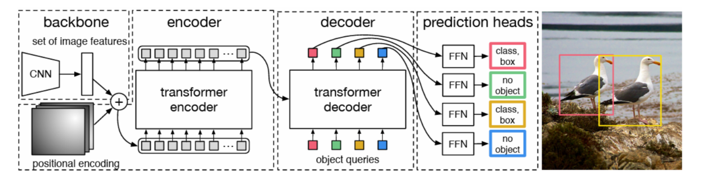

# DETR

[End-to-End Object Detection with Transformers](https://arxiv.org/abs/2005.12872)

## Model Arch

DETR（Detection Transformer）是一种端到端的目标检测模型，由Facebook AI Research（FAIR）于2020年提出。DETR采用了Transformer架构，与传统的基于区域的目标检测方法有所不同，它通过全局上下文来预测图像中的目标，而无需使用先前的候选框或区域建议网络。





整个DETR可以分为四个部分，分别是：backbone、encoder、decoder以及predictionheads。

基本思想是，首先用cnn抽取图像特征，拿到每一个patch对应的向量，并加上位置编码。然后用transformer encoder学习全局特征，帮助后面做检测。接着将encoder的输出作为tranformer deoder的输入，同时还输入了一个对象查询（生成一个查询分量q和前面encoder传进来的k和v做一个交互，生成很多预测框）。然后把预测框和真实框做匹配，询问框内是否包含目标，然后在匹配上的这些框里面计算loss，进而向后传播。接着就是预测头的建立，最后生成预测结果。

### backbone
backbone是DETR的主干特征提取网络，输入的图片首先会在主干网络里面进行特征提取，提取到的特征可以被称作特征层，是输入图片的特征集合。在主干部分，我们获取了一个特征层进行下一步网络的构建，这一个特征层我称它为有效特征层。
- ResNet-50
- ResNet-101
- Swin-Tiny / Swin-Base

### encoder编码网络
encoder是Transformer的编码网络-特征加强，在主干部分获得的一个有效特征层会首先在高宽维度进行平铺，成为一个特征序列，然后会在这一部分继续使用Self-Attension进行加强特征提取，获得一个加强后的有效特征层。它属于Transformer的编码网络，编码的下一步是解码。

### decoder解码网络 
decoder是Transformer的解码网络-特征查询，在encoder部分获得的一个加强后的有效特征层会在这一部分进行解码，解码需要使用到一个非常重要的可学习模块，即上图呈现的object queries。在decoder部分，我们使用一个可学习的查询向量q对加强后的有效特征层进行查询，获得预测结果。

### head
prediction heads是DETR的分类器与回归器，其实就是对decoder获得的预测结果进行全连接，两次全连接分别代表种类和回归参数。

### 匈牙利匹配
DETR 不使用传统 anchor 匹配方式，而是使用 匈牙利算法 找出 predictions 与 GT 的最佳匹配。

### 损失函数计算
DETR 使用组合损失函数：
- 分类损失：BCEWithLogitsLoss；
- 回归损失：L1Loss + GIoULoss；
- 总loss为加权求和；

## 测评数据集说明


[MS COCO](https://cocodataset.org/#download)的全称是Microsoft Common Objects in Context，是微软于2014年出资标注的Microsoft COCO数据集，与ImageNet竞赛一样，被视为是计算机视觉领域最受关注和最权威的比赛数据集之一。

COCO数据集支持目标检测、关键点检测、实例分割、全景分割与图像字幕任务。在图像检测任务中，COCO数据集提供了80个类别，验证集包含5000张图片，上表的结果即在该验证集下测试。

## 评价指标说明

- mAP: mean of Average Precision, 检测任务评价指标，多类别的AP的平均值；AP即平均精度，是Precision-Recall曲线下的面积
- mAP@.5: 即将IoU设为0.5时，计算每一类的所有图片的AP，然后所有类别求平均，即mAP
- mAP@.5:.95: 表示在不同IoU阈值（从0.5到0.95，步长0.05）上的平均mAP


## Build_In Deploy
### step.1 获取模型
- code source
    ```bash
    git clone https://github.com/facebookresearch/detr.git
    branch: main
    commit: 29901c51d7f
    ```

- onnx export
1. modify: 修改hubconf.py line19如下, return_intermediate_dec设置False去掉decoder多余的连接
    ```python
    transformer = Transformer(d_model=hidden_dim, return_intermediate_dec=False)
    ```
2. 执行export_onnx.py导出模型， 参考[export_onnx.py](./source_code/export_onnx.py)
    ```bash
    python ./source_code/export_onnx.py
    ```

### step.2 获取数据集
- [校准数据集](http://images.cocodataset.org/zips/val2017.zip)
- [评估数据集](http://images.cocodataset.org/zips/val2017.zip)
- [gt: instances_val2017.json](http://images.cocodataset.org/annotations/annotations_trainval2017.zip)
- [label: coco.txt](../common/label/coco_91.txt)

### step.3 模型转换
1. 根据具体模型，修改编译配置
    - [official_detr.yaml](./build_in/build/official_detr.yaml)
    - 注意该模型仅支持fp16精度
    
    > - 编译参数`backend.type: tvm_vacc`
    > - fp16精度: 编译参数`backend.dtype: fp16`

2. 模型编译
    - 注意需要先替换yaml文件中校正集数据的路径
    ```bash
    cd detr
    mkdir workspace
    cd workspace
    vamc compile ../build_in/build/official_detr.yaml
    ```

### step.4 模型推理

    - 参考[vsx脚本](./build_in/vsx/python/infer_detr.py)
    ```bash
    python3 ../build_in/vsx/python/infer_detr.py \
        --model_prefix deploy_weights/official_detr_fp16/mod \
        --vdsp_params ../build_in/vdsp_params/official-detr-vdsp_params.json  \
        --device_id 0  \
        --threshold 0.01 \
        --label_file ../../common/label/coco_91.txt \
        --file_path /path/to/coco_val2017 \
        --save_dir ./infer_output
    ```

    - 参考：[eval_map.py](../common/eval/eval_map.py)，精度统计
    ```bash
        python ../../common/eval/eval_map.py --gt path/to/instances_val2017.json --txt ./infer_output
    ```

    ```
    # fp16
    DONE (t=2.45s).
        Average Precision  (AP) @[ IoU=0.50:0.95 | area=   all | maxDets=100 ] = 0.378
        Average Precision  (AP) @[ IoU=0.50      | area=   all | maxDets=100 ] = 0.584
        Average Precision  (AP) @[ IoU=0.75      | area=   all | maxDets=100 ] = 0.394
        Average Precision  (AP) @[ IoU=0.50:0.95 | area= small | maxDets=100 ] = 0.144
        Average Precision  (AP) @[ IoU=0.50:0.95 | area=medium | maxDets=100 ] = 0.412
        Average Precision  (AP) @[ IoU=0.50:0.95 | area= large | maxDets=100 ] = 0.593
        Average Recall     (AR) @[ IoU=0.50:0.95 | area=   all | maxDets=  1 ] = 0.309
        Average Recall     (AR) @[ IoU=0.50:0.95 | area=   all | maxDets= 10 ] = 0.477
        Average Recall     (AR) @[ IoU=0.50:0.95 | area=   all | maxDets=100 ] = 0.506
        Average Recall     (AR) @[ IoU=0.50:0.95 | area= small | maxDets=100 ] = 0.227
        Average Recall     (AR) @[ IoU=0.50:0.95 | area=medium | maxDets=100 ] = 0.555
        Average Recall     (AR) @[ IoU=0.50:0.95 | area= large | maxDets=100 ] = 0.748
        {'bbox_mAP': 0.378, 'bbox_mAP_50': 0.584, 'bbox_mAP_75': 0.394, 'bbox_mAP_s': 0.144, 'bbox_mAP_m': 0.412, 'bbox_mAP_l': 0.593, 'bbox_mAP_copypaste': '0.378 0.584 0.394 0.144 0.412 0.593'}
    ```

### step.5 性能测试
1. 参考[infer_detr_prof.py](./build_in/vsx/python/infer_detr_prof.py)进行性能测试
    ```bash
    python3 ../build_in/vsx/python/infer_detr_prof.py \
        -m deploy_weights/official_detr_fp16/mod \
        --vdsp_params ../build_in/vdsp_params/official-detr-vdsp_params.json  \
        --device_ids [0] \
        --batch_size 1 \
        --instance 1 \
        --iterations 200 \
        --shape "[3,1066,800]" \
        --percentiles "[50,90,95,99]" \
        --input_host 1 \
        --queue_size 1
    ```
