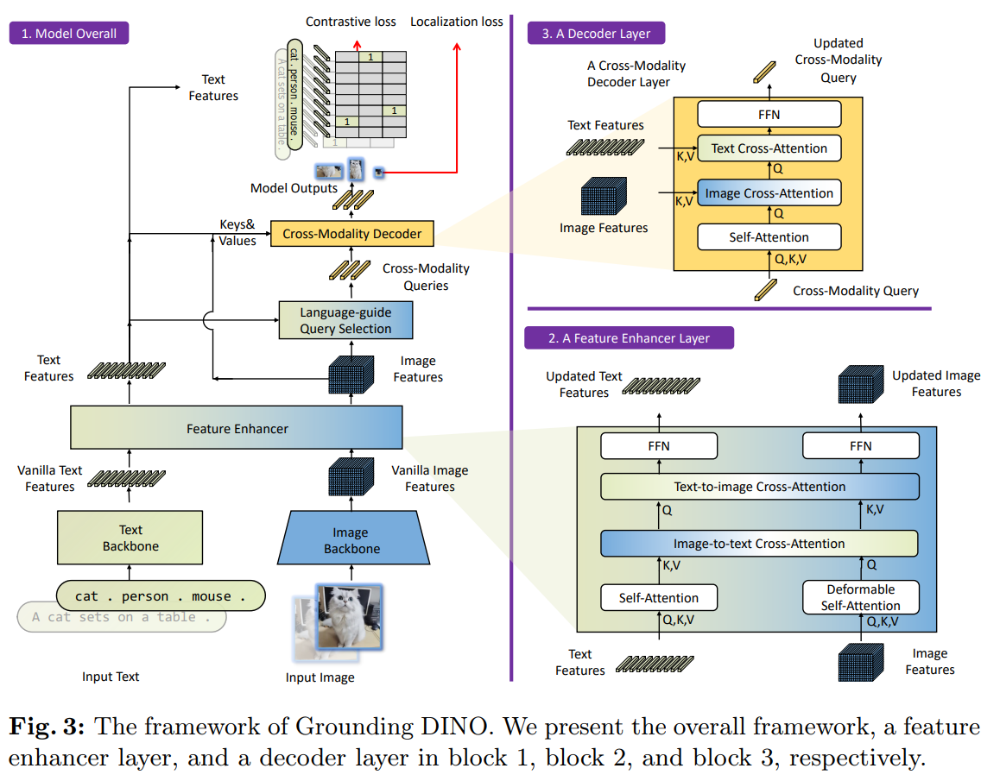

# Grounding DINO

[Grounding DINO: Marrying DINO with Grounded Pre-Training for Open-Set Object Detection](https://arxiv.org/abs/2303.05499)

## Model Arch

<div align=center></div>

完成open-set object detection的关键是将language信息引入到目标的通用特征表示中。例如，GLIP利用对比学习的方式在目标检测和文字短语之间建立起了联系，它在close-set和open-set数据集上都有很好的表现。尽管如此，GLIP是基于传统的one-stage detector结构，因此还有一定的局限性。受很多前期工作的启发（GLIP、DINO等），作者提出了Grounding DINO，它相对于GLIP有以下几点优势：
- Grounding DINO 的transformer结构更接近于NLP模型，因此它更容易同时处理图片和文字；
- Transformer-based detector在处理大型数据集时被证明有优势；
- 作为DETR的变种，DINO能够完成end-to-end的训练，而且不需要NMS等额外的后处理。

Grounding DINO的整体结构如上图所示。Grounding DINO是一个双encoder单decoder结构，它包含了一个image backbone用于提取image feature、一个text backbone用于提取text feature、一个feature enhancer用于融合image和text feature、一个language-guide query selection模块用于query初始化、一个cross-modality decoder用于bbox预测。

- Feature Extraction and Enhancer

    在特征提取方面，作者采取Swin Transformer作为image backbone，BERT作为text backbone。像DETR系列模型中设计的那样，image backbone提取了multi-scale的图像特征。提取完image features和text features后，作者将它们输入到一个feature enhancer中以融合跨。作者分别利用Deformable Self-Attention和Self-Attention来增强image features和text features，然后利用GLIP中的image-to-text 和 text-to-image cross-attention实现特征融合。

- Language-Guided Query Selection

    为了让文字信息更好地指导目标检测，作者设计了一个language-guide query selection模块，用以筛选与输入文字特征相似更高的图像特征用作decoder的qureies。num_query是用作decoder的query数量，一般设置为900

- Cross-Modality Decoder

    是Self-Attention、Image Cross-Attention、Text Cross-Attention的组合，主要使用text和image间的特征交互。

- Loss Function

    Grounding DINO采用L1 loss和GIOU loss用作box regression，计算预测目标和文字token之间的contrastive loss用于分类。

### 预处理

- 输入图像预处理：load rgb, resize, div 255.0，mean/std

    ```python
    def get_image_data(image_file, input_shape=[1,3,800,1333]):
        transform = transforms.Compose([
            transforms.Resize(input_shape[2:]),
            transforms.ToTensor(), #->[0,1]
            transforms.Normalize([0.485, 0.456, 0.406], [0.229, 0.224, 0.225])  # ->[-1,1]
        ])
    
        ori_image = Image.open(image_file)
        ori_image = ori_image.convert('RGB')
        images = transform(ori_image).unsqueeze(0).numpy()
        return np.asarray(ori_image), images
    ```

- 文本预处理：经`bert-base-uncased`提取encoding，position_embedding和mask操作

### 后处理
- 原始模型中scatterND移动至cpu实现，[groundingdino/models/GroundingDINO/utils.py#L265](https://github.com/IDEA-Research/GroundingDINO/blob/main/groundingdino/models/GroundingDINO/utils.py#L265)
- pred_logits进行sigmoid和阈值过滤；标签解析等，参考：[groundingdino/util/inference.py#L70](https://github.com/IDEA-Research/GroundingDINO/blob/main/groundingdino/util/inference.py#L70)


### model_info
- 查看模型算子列表：[op_info.txt](./source_code/official/op_info.txt)
    ```python
    import onnx_tool
    model_path = 'weights/groundingdino_swint_ogc.onnx'
    onnx_tool.model_profile(model_path, save_profile='op_info.txt')
    ```

### 测评数据集说明


[MS COCO](https://cocodataset.org/#download)的全称是Microsoft Common Objects in Context，是微软于2014年出资标注的Microsoft COCO数据集，与ImageNet竞赛一样，被视为是计算机视觉领域最受关注和最权威的比赛数据集之一。 

COCO数据集支持目标检测、关键点检测、实力分割、全景分割与图像字幕任务。在图像检测任务中，COCO数据集提供了80个类别，验证集包含5000张图片，上表的结果即在该验证集下测试。

### 评价指标说明

- mAP: mean of Average Precision, 检测任务评价指标，多类别的AP的平均值；AP即平均精度，是Precision-Recall曲线下的面积
- mAP@.5: 即将IoU设为0.5时，计算每一类的所有图片的AP，然后所有类别求平均，即mAP
- mAP@.5:.95: 表示在不同IoU阈值（从0.5到0.95，步长0.05）上的平均mAP


## Build_In Deploy
- [official_deploy.md](./source_code/official_deploy.md)