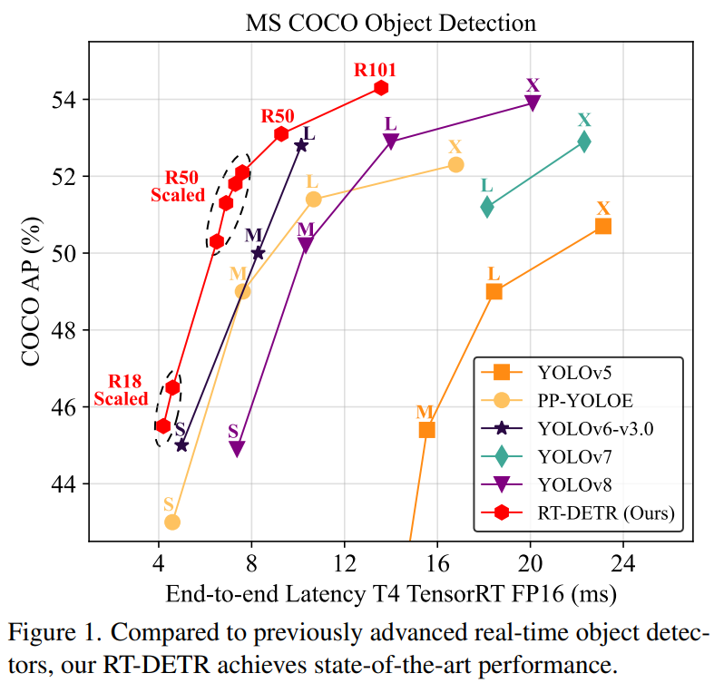
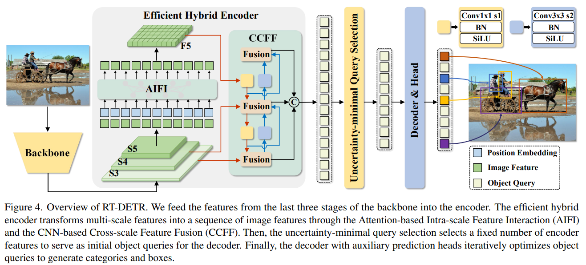
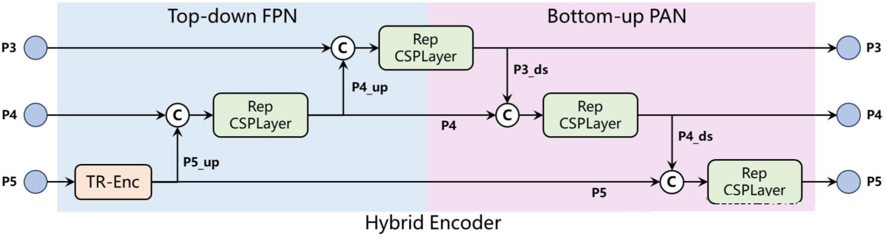

# RT-DETR

[DETRs Beat YOLOs on Real-time Object Detection](https://arxiv.org/abs/2304.08069)

## Model Arch

<div align=center></div>

虽然YOLO检测器在目标检测中表现出色，但它面临一个重要问题，就是需要使用NMS（非极大值抑制）来处理多个重叠的检测框，这会导致速度延迟并且难以进行有效的优化。同时还需要两套参数设置：阈值筛选（Confidence threshold）和非极大值抑制（NMS）。

<div align=center></div>

DETR将检测问题转换为无序的序列输出问题，将原本的密集检测变成了稀疏检测，再配合一些其他的设置，DETR系列的检测器往往是不需要后处理的，即不需要做阈值筛选和NMS，只需对最终的预测结果做一次topk操作即可。

RT-DETR采用CNN网络，如流行的ResNet系列，或者百度自家研发的HGNet。RT-DETR从主干网络中抽取三个尺度的输出，其输出步长分别为8、16和32，对应图中S3、S4、S5

对于颈部网络，RT-DETR采用了一层Transformer的Encoder，只处理主干网络输出的S5特征，即图中所展示的AIFI（Attention-based Intra-scale Feature Interaction）模块。其是一个普通的Transformer的Encoder层，包含标准的MSAH（或者Deformable Attention）和FFN。

随后，接着跨尺度特征融合模块（CCFM） 使用了类似 PANet 的结构，在融合路径上插入了由卷积层组成的 Fusion Block，用于融合相邻尺度的特征。

IoU-Aware Query Selection，通过在训练时约束模型对高 IoU 得分的特征产生高分类得分，对低 IoU 得分的特征产生低分类得分，使得根据分类得分选择的 Top-K 编码器特征（300）同时具有高分类得分和高 IoU 得分。

<div align=center></div>

<details><summary>HybridEncoder</summary>

    ```python

    @register
    class HybridEncoder(nn.Module):
        def __init__(self,
                    in_channels=[512, 1024, 2048],
                    feat_strides=[8, 16, 32],
                    hidden_dim=256,
                    nhead=8,
                    dim_feedforward = 1024,
                    dropout=0.0,
                    enc_act='gelu',
                    use_encoder_idx=[2],
                    num_encoder_layers=1,
                    pe_temperature=10000,
                    expansion=1.0,
                    depth_mult=1.0,
                    act='silu',
                    eval_spatial_size=None):
            super().__init__()
            self.in_channels = in_channels
            self.feat_strides = feat_strides
            self.hidden_dim = hidden_dim
            self.use_encoder_idx = use_encoder_idx
            self.num_encoder_layers = num_encoder_layers
            self.pe_temperature = pe_temperature
            self.eval_spatial_size = eval_spatial_size

            self.out_channels = [hidden_dim for _ in range(len(in_channels))]
            self.out_strides = feat_strides
            
            # channel projection
            self.input_proj = nn.ModuleList()
            for in_channel in in_channels:
                self.input_proj.append(
                    nn.Sequential(
                        nn.Conv2d(in_channel, hidden_dim, kernel_size=1, bias=False),
                        nn.BatchNorm2d(hidden_dim)
                    )
                )

            # encoder transformer
            encoder_layer = TransformerEncoderLayer(
                hidden_dim, 
                nhead=nhead,
                dim_feedforward=dim_feedforward, 
                dropout=dropout,
                activation=enc_act)

            self.encoder = nn.ModuleList([
                TransformerEncoder(copy.deepcopy(encoder_layer), num_encoder_layers) for _ in range(len(use_encoder_idx))
            ])

            # top-down fpn
            self.lateral_convs = nn.ModuleList()
            self.fpn_blocks = nn.ModuleList()
            for _ in range(len(in_channels) - 1, 0, -1):
                self.lateral_convs.append(ConvNormLayer(hidden_dim, hidden_dim, 1, 1, act=act))
                self.fpn_blocks.append(
                    CSPRepLayer(hidden_dim * 2, hidden_dim, round(3 * depth_mult), act=act, expansion=expansion)
                )

            # bottom-up pan
            self.downsample_convs = nn.ModuleList()
            self.pan_blocks = nn.ModuleList()
            for _ in range(len(in_channels) - 1):
                self.downsample_convs.append(
                    ConvNormLayer(hidden_dim, hidden_dim, 3, 2, act=act)
                )
                self.pan_blocks.append(
                    CSPRepLayer(hidden_dim * 2, hidden_dim, round(3 * depth_mult), act=act, expansion=expansion)
                )

            self._reset_parameters()

        def _reset_parameters(self):
            if self.eval_spatial_size:
                for idx in self.use_encoder_idx:
                    stride = self.feat_strides[idx]
                    pos_embed = self.build_2d_sincos_position_embedding(
                        self.eval_spatial_size[1] // stride, self.eval_spatial_size[0] // stride,
                        self.hidden_dim, self.pe_temperature)
                    setattr(self, f'pos_embed{idx}', pos_embed)
                    # self.register_buffer(f'pos_embed{idx}', pos_embed)

        @staticmethod
        def build_2d_sincos_position_embedding(w, h, embed_dim=256, temperature=10000.):
            '''
            '''
            grid_w = torch.arange(int(w), dtype=torch.float32)
            grid_h = torch.arange(int(h), dtype=torch.float32)
            grid_w, grid_h = torch.meshgrid(grid_w, grid_h, indexing='ij')
            assert embed_dim % 4 == 0, \
                'Embed dimension must be divisible by 4 for 2D sin-cos position embedding'
            pos_dim = embed_dim // 4
            omega = torch.arange(pos_dim, dtype=torch.float32) / pos_dim
            omega = 1. / (temperature ** omega)

            out_w = grid_w.flatten()[..., None] @ omega[None]
            out_h = grid_h.flatten()[..., None] @ omega[None]

            return torch.concat([out_w.sin(), out_w.cos(), out_h.sin(), out_h.cos()], dim=1)[None, :, :]

        def forward(self, feats):
            assert len(feats) == len(self.in_channels)
            proj_feats = [self.input_proj[i](feat) for i, feat in enumerate(feats)]
            
            # encoder
            if self.num_encoder_layers > 0:
                for i, enc_ind in enumerate(self.use_encoder_idx):
                    h, w = proj_feats[enc_ind].shape[2:]
                    # flatten [B, C, H, W] to [B, HxW, C]
                    src_flatten = proj_feats[enc_ind].flatten(2).permute(0, 2, 1)
                    if self.training or self.eval_spatial_size is None:
                        pos_embed = self.build_2d_sincos_position_embedding(
                            w, h, self.hidden_dim, self.pe_temperature).to(src_flatten.device)
                    else:
                        pos_embed = getattr(self, f'pos_embed{enc_ind}', None).to(src_flatten.device)

                    memory = self.encoder[i](src_flatten, pos_embed=pos_embed)
                    proj_feats[enc_ind] = memory.permute(0, 2, 1).reshape(-1, self.hidden_dim, h, w).contiguous()
                    # print([x.is_contiguous() for x in proj_feats ])

            # broadcasting and fusion
            inner_outs = [proj_feats[-1]]
            for idx in range(len(self.in_channels) - 1, 0, -1):
                feat_high = inner_outs[0]
                feat_low = proj_feats[idx - 1]
                feat_high = self.lateral_convs[len(self.in_channels) - 1 - idx](feat_high)
                inner_outs[0] = feat_high
                upsample_feat = F.interpolate(feat_high, scale_factor=2., mode='nearest')
                inner_out = self.fpn_blocks[len(self.in_channels)-1-idx](torch.concat([upsample_feat, feat_low], dim=1))
                inner_outs.insert(0, inner_out)

            outs = [inner_outs[0]]
            for idx in range(len(self.in_channels) - 1):
                feat_low = outs[-1]
                feat_high = inner_outs[idx + 1]
                downsample_feat = self.downsample_convs[idx](feat_low)
                out = self.pan_blocks[idx](torch.concat([downsample_feat, feat_high], dim=1))
                outs.append(out)

            return outs

    ```
</details>

### 预处理

- 输入图像预处理：load rgb, resize，totensor

    ```python
        def get_image_data(image_file, input_shapes, dtype=np.float16):
            image = Image.open(image_file)
            if image.mode != 'RGB':
                image = image.convert("RGB")
            
            source_shape = image.size[::-1] # hw
            
            image = image.resize([input_shapes[2], input_shapes[3]], resample=2)
            image_data = np.asarray(image)

            image_data = image_data / 255.0
            image_data = image_data.transpose((2, 0, 1))
            image_data = image_data[np.newaxis, :]

            return image_data.astype(dtype), np.array(image), source_shape
    ```


### 后处理
- 无需经过NMS，直接输出pred_logits和pred_boxes
- 对pred_logits进行sigmoid和topk筛选，获取类别和分数信息
- 对pred_boxes进行坐标映射，变换会原始图像尺寸坐标
- 参考[rtdetr_postprocessor.py#L37](https://github.com/lyuwenyu/RT-DETR/blob/main/rtdetr_pytorch/src/zoo/rtdetr/rtdetr_postprocessor.py#L37)

### model_info
- 查看模型算子列表：[op_info.txt](./source_code/official/op_info.txt)

## Build_In Deploy

- [official_deploy.md](./source_code/official_deploy.md)