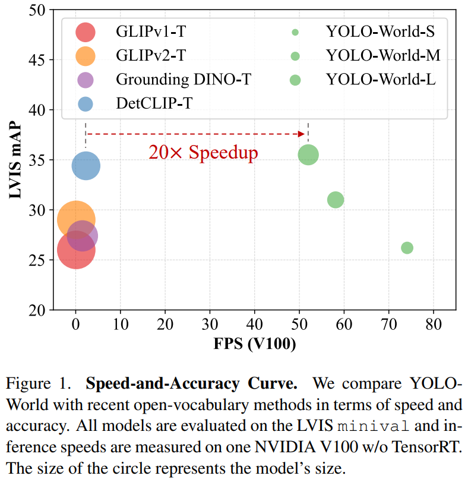
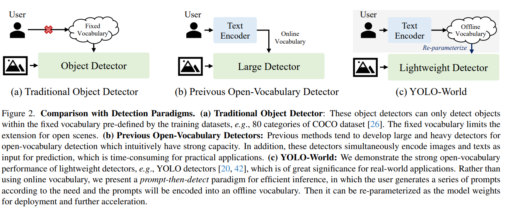
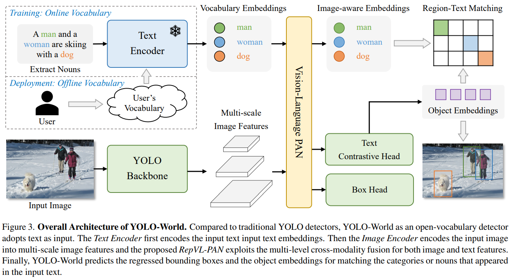
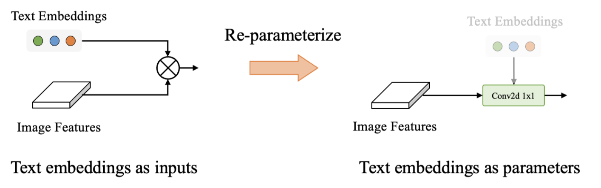
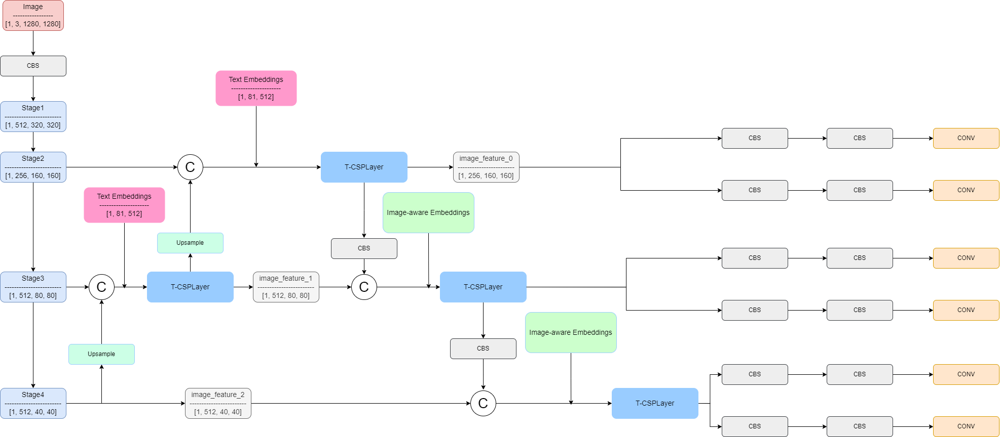
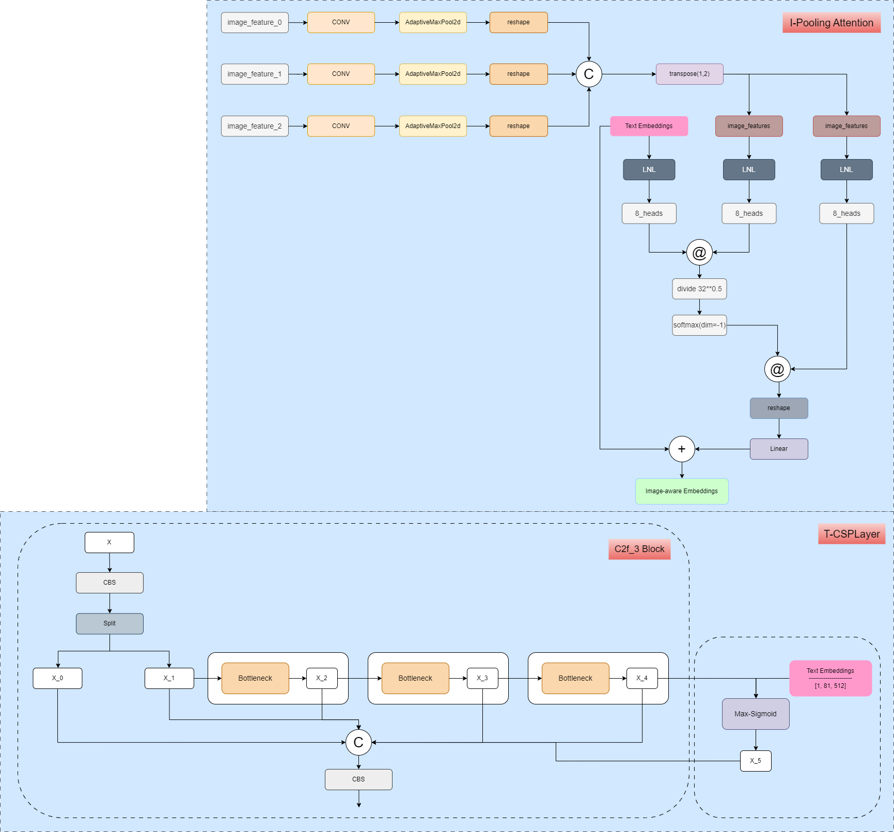

# YOLO-World

[YOLO-World: Real-Time Open-Vocabulary Object Detection](https://arxiv.org/abs/2401.17270)

## Model Arch

<div align=center></div>


<div align=center></div>

<div align=center></div>

YOLO-World的整体架构：与传统的YOLO检测器相比，YOLO-World作为一个开放词汇检测器采用文本作为输入。文本编码器首先对输入文本进行编码。然后，图像编码器将输入图像编码为多尺度图像特征，所提出的RepVL-PAN利用图像和文本特征的多级跨模态融合。最后，YOLO-World预测回归的边界框和对象嵌入，以匹配输入文本中出现的类别或名词。 


YOLO-World的模型架构包括以下三个主要组件：

1) YOLO检测器：基于YOLOv8，包括图像编码器、路径聚合网络和预测头。

2) 文本编码器：使用CLIP预训练的Transformer编码器（openai/clip-vit-base-patch32），将输入文本编码为文本特征。

3) 可重参数化的视觉语言路径聚合网络RepVL-PAN：连接文本特征和图像特征，包括文本引导的CSPLayer和图像池化注意力机制。

- YOLO检测器

YOLO-World是基于YOLOv8开发出来的，它包含了Darknet的backbone作为图像encoder，一个路径聚合网络（PAN）构建多尺度特征金字塔，以及一个输出回归边界框和目标embedding的预测头

- 文本encoder

给定文本T，我们使用预训练CLIP的Transformer text encoder抽取相关的文本embedding, CLIP的text encoder能够提供更好的视觉-语义能力，使得视觉目标和文本相互连接。当输入的文本是标题或者代指表述的时候，我们采用简单的n-gram算法对名词短语进行抽取，然后再将它们投喂进文本encoder。

- 文本对比Head

沿用了YOLOv8的head，使用了两个3*3卷积的解耦头，对边界框和目标embedding进行回归。提出一个文本对比head，以获取目标-文本相似度。

<div align=center></div>

- RepVL-PAN
RepVL-PAN使用的和YOLOv8相似的特征融合结构，包括了自上而下和自下而上的路径，使用了多尺度的图像特征  搭建了特征金字塔。
此外，作者提出了文本引导的CSPLayer（T-CSPLayer）：负责将语言信息注入图像特征中。和图像池化注意力（I-Pooling Attention）：负责将强化，具备了图像意识的text embedding。以进一步增强图像特征与文本特征之间的交互，这可以提高开集能力的视觉语义表示。

- Re-parameterized fine-tuning
在推理阶段，离线的词汇embedding将会进行重参数化，作为参数合并到模型中。例如，在最终的分类层中，文本嵌入（text embedding）被重参数化为简单的 1×1 卷积层。具有以下优势：
    - zero-shot：重参数化后的YOLO-World仍然具有零样本能力（Prompt Finetuning之后就没有zero-shot的能力了）！
    - 效率：重参数化的 YOLO-World 具有简单高效的架构，因为 conv1x1比transpose & matmul 更快。此外，而且还可以进一步优化部署。
    - 准确性：重参数化的YOLO-World支持微调。

<div align=center></div>

- 使用在线词汇进行训练

YOLO-World使用在线词汇进行训练。在训练过程中，为每个包含4张图像的mosaic样本构建一个在线词汇T。具体做法是，从mosaic图像中抽样所有涉及的正面名词，并从相应的数据集中随机抽样一些负面名词。

随后使用离线词汇进行推理。在推理阶段，采用一种"先提示-再检测"的策略，使用离线词汇以提高效率。用户可以定义一系列自定义提示，然后利用文本编码器对这些提示进行编码，并获得离线词汇嵌入。

- 区域-文本对比的损失学习

参照了YOLOv8并且利用任务对齐的标签分配机制，对预测值和真实值标注进行匹配，也对每个正预测分配了一个文本索引作为分类标签；

基于上述的词汇表，利用区域-文本套，设计了区域-文本对比的损失函数，通过计算目标-文本的相似度与实际分配的真实值，来计算交叉熵；

此外，采用了IoU损失函数和distributed focal loss，对回归框进行度量；


- 网络结构图
<div align=center></div>
<div align=center></div>

- v2 update
    - 为提速，去掉了neck部分的`I-PoolingAttention`模块
    - 使用`BatchNorm`替换在head中的`L2-Norm`，该部分包含`reduce`等复杂算子，不利于部署；替换后可与Conv融合，提升性能

<details><summary>YOLOWorldPAFPN</summary>

    ```python

    @MODELS.register_module()
    class YOLOWorldPAFPN(YOLOv8PAFPN):
        """Path Aggregation Network used in YOLO World
        Following YOLOv8 PAFPN, including text to image fusion
        """
        def __init__(self,
                    in_channels: List[int],
                    out_channels: Union[List[int], int],
                    guide_channels: int,
                    embed_channels: List[int],
                    num_heads: List[int],
                    deepen_factor: float = 1.0,
                    widen_factor: float = 1.0,
                    num_csp_blocks: int = 3,
                    freeze_all: bool = False,
                    block_cfg: ConfigType = dict(type='CSPLayerWithTwoConv'), ## MaxSigmoidCSPLayerWithTwoConv
                    norm_cfg: ConfigType = dict(type='BN',
                                                momentum=0.03,
                                                eps=0.001),
                    act_cfg: ConfigType = dict(type='SiLU', inplace=True),
                    init_cfg: OptMultiConfig = None) -> None:
            self.guide_channels = guide_channels
            self.embed_channels = embed_channels
            self.num_heads = num_heads
            self.block_cfg = block_cfg
            super().__init__(in_channels=in_channels,
                            out_channels=out_channels,
                            deepen_factor=deepen_factor,
                            widen_factor=widen_factor,
                            num_csp_blocks=num_csp_blocks,
                            freeze_all=freeze_all,
                            norm_cfg=norm_cfg,
                            act_cfg=act_cfg,
                            init_cfg=init_cfg)

        def build_top_down_layer(self, idx: int) -> nn.Module:
            """build top down layer.

            Args:
                idx (int): layer idx.

            Returns:
                nn.Module: The top down layer.
            """
            block_cfg = copy.deepcopy(self.block_cfg)
            block_cfg.update(
                dict(in_channels=make_divisible(
                    (self.in_channels[idx - 1] + self.in_channels[idx]),
                    self.widen_factor),
                    out_channels=make_divisible(self.out_channels[idx - 1],
                                                self.widen_factor),
                    guide_channels=self.guide_channels,
                    embed_channels=make_round(self.embed_channels[idx - 1],
                                            self.widen_factor),
                    num_heads=make_round(self.num_heads[idx - 1],
                                        self.widen_factor),
                    num_blocks=make_round(self.num_csp_blocks,
                                        self.deepen_factor),
                    add_identity=False,
                    norm_cfg=self.norm_cfg,
                    act_cfg=self.act_cfg))
            return MODELS.build(block_cfg)

        def build_bottom_up_layer(self, idx: int) -> nn.Module:
            """build bottom up layer.

            Args:
                idx (int): layer idx.

            Returns:
                nn.Module: The bottom up layer.
            """
            block_cfg = copy.deepcopy(self.block_cfg)
            block_cfg.update(
                dict(in_channels=make_divisible(
                    (self.out_channels[idx] + self.out_channels[idx + 1]),
                    self.widen_factor),
                    out_channels=make_divisible(self.out_channels[idx + 1],
                                                self.widen_factor),
                    guide_channels=self.guide_channels,
                    embed_channels=make_round(self.embed_channels[idx + 1],
                                            self.widen_factor),
                    num_heads=make_round(self.num_heads[idx + 1],
                                        self.widen_factor),
                    num_blocks=make_round(self.num_csp_blocks,
                                        self.deepen_factor),
                    add_identity=False,
                    norm_cfg=self.norm_cfg,
                    act_cfg=self.act_cfg))
            return MODELS.build(block_cfg)

        def forward(self, img_feats: List[Tensor], txt_feats: Tensor = None) -> tuple:
            """Forward function.
            including multi-level image features, text features: BxLxD
            """
            assert len(img_feats) == len(self.in_channels)
            # reduce layers
            reduce_outs = []
            for idx in range(len(self.in_channels)):
                reduce_outs.append(self.reduce_layers[idx](img_feats[idx]))

            # top-down path
            inner_outs = [reduce_outs[-1]]
            for idx in range(len(self.in_channels) - 1, 0, -1):
                feat_high = inner_outs[0]
                feat_low = reduce_outs[idx - 1]
                upsample_feat = self.upsample_layers[len(self.in_channels) - 1 -
                                                    idx](feat_high)
                if self.upsample_feats_cat_first:
                    top_down_layer_inputs = torch.cat([upsample_feat, feat_low], 1)
                else:
                    top_down_layer_inputs = torch.cat([feat_low, upsample_feat], 1)
                inner_out = self.top_down_layers[len(self.in_channels) - 1 - idx](
                    top_down_layer_inputs, txt_feats)
                inner_outs.insert(0, inner_out)

            # bottom-up path
            outs = [inner_outs[0]]
            for idx in range(len(self.in_channels) - 1):
                feat_low = outs[-1]
                feat_high = inner_outs[idx + 1]
                downsample_feat = self.downsample_layers[idx](feat_low)
                out = self.bottom_up_layers[idx](torch.cat(
                    [downsample_feat, feat_high], 1), txt_feats)
                outs.append(out)

            # out_layers
            results = []
            for idx in range(len(self.in_channels)):
                results.append(self.out_layers[idx](outs[idx]))

            return tuple(results)


    @MODELS.register_module()
    class YOLOWorldDualPAFPN(YOLOWorldPAFPN):
        """Path Aggregation Network used in YOLO World v8."""
        def __init__(self,
                    in_channels: List[int],
                    out_channels: Union[List[int], int],
                    guide_channels: int,
                    embed_channels: List[int],
                    num_heads: List[int],
                    deepen_factor: float = 1.0,
                    widen_factor: float = 1.0,
                    num_csp_blocks: int = 3,
                    freeze_all: bool = False,
                    text_enhancder: ConfigType = dict(
                        type='ImagePoolingAttentionModule',
                        embed_channels=256,
                        num_heads=8,
                        pool_size=3),
                    block_cfg: ConfigType = dict(type='CSPLayerWithTwoConv'),
                    norm_cfg: ConfigType = dict(type='BN',
                                                momentum=0.03,
                                                eps=0.001),
                    act_cfg: ConfigType = dict(type='SiLU', inplace=True),
                    init_cfg: OptMultiConfig = None) -> None:
            super().__init__(in_channels=in_channels,
                            out_channels=out_channels,
                            guide_channels=guide_channels,
                            embed_channels=embed_channels,
                            num_heads=num_heads,
                            deepen_factor=deepen_factor,
                            widen_factor=widen_factor,
                            num_csp_blocks=num_csp_blocks,
                            freeze_all=freeze_all,
                            block_cfg=block_cfg,
                            norm_cfg=norm_cfg,
                            act_cfg=act_cfg,
                            init_cfg=init_cfg)

            text_enhancder.update(
                dict(
                    image_channels=[int(x * widen_factor) for x in out_channels],
                    text_channels=guide_channels,
                    num_feats=len(out_channels),
                ))
            print(text_enhancder)
            self.text_enhancer = MODELS.build(text_enhancder)

        def forward(self, img_feats: List[Tensor], txt_feats: Tensor) -> tuple:
            """Forward function."""
            assert len(img_feats) == len(self.in_channels)
            # reduce layers
            reduce_outs = []
            for idx in range(len(self.in_channels)):
                reduce_outs.append(self.reduce_layers[idx](img_feats[idx]))

            # top-down path
            inner_outs = [reduce_outs[-1]]
            for idx in range(len(self.in_channels) - 1, 0, -1):
                feat_high = inner_outs[0]
                feat_low = reduce_outs[idx - 1]
                upsample_feat = self.upsample_layers[len(self.in_channels) - 1 -
                                                    idx](feat_high)
                if self.upsample_feats_cat_first:
                    top_down_layer_inputs = torch.cat([upsample_feat, feat_low], 1)
                else:
                    top_down_layer_inputs = torch.cat([feat_low, upsample_feat], 1)
                inner_out = self.top_down_layers[len(self.in_channels) - 1 - idx](
                    top_down_layer_inputs, txt_feats)
                inner_outs.insert(0, inner_out)

            txt_feats = self.text_enhancer(txt_feats, inner_outs)
            # bottom-up path
            outs = [inner_outs[0]]
            for idx in range(len(self.in_channels) - 1):
                feat_low = outs[-1]
                feat_high = inner_outs[idx + 1]
                downsample_feat = self.downsample_layers[idx](feat_low)
                out = self.bottom_up_layers[idx](torch.cat(
                    [downsample_feat, feat_high], 1), txt_feats)
                outs.append(out)

            # out_layers
            results = []
            for idx in range(len(self.in_channels)):
                results.append(self.out_layers[idx](outs[idx]))

            return tuple(results)

    @MODELS.register_module()
    class ImagePoolingAttentionModule(nn.Module):

        def __init__(self,
                    image_channels: List[int],
                    text_channels: int,
                    embed_channels: int,
                    with_scale: bool = False,
                    num_feats: int = 3,
                    num_heads: int = 8,
                    pool_size: int = 3,
                    use_einsum: bool = True):
            super().__init__()

            self.text_channels = text_channels
            self.embed_channels = embed_channels
            self.num_heads = num_heads
            self.num_feats = num_feats
            self.head_channels = embed_channels // num_heads
            self.pool_size = pool_size
            self.use_einsum = use_einsum
            if with_scale:
                self.scale = nn.Parameter(torch.tensor([0.]), requires_grad=True)
            else:
                self.scale = 1.0
            self.projections = nn.ModuleList([
                ConvModule(in_channels, embed_channels, 1, act_cfg=None)
                for in_channels in image_channels
            ])
            self.query = nn.Sequential(nn.LayerNorm(text_channels),
                                    Linear(text_channels, embed_channels))
            self.key = nn.Sequential(nn.LayerNorm(embed_channels),
                                    Linear(embed_channels, embed_channels))
            self.value = nn.Sequential(nn.LayerNorm(embed_channels),
                                    Linear(embed_channels, embed_channels))
            self.proj = Linear(embed_channels, text_channels)

            self.image_pools = nn.ModuleList([
                nn.AdaptiveMaxPool2d((pool_size, pool_size))
                for _ in range(num_feats)
            ])

        def forward(self, text_features, image_features):
            B = image_features[0].shape[0]
            assert len(image_features) == self.num_feats
            num_patches = self.pool_size**2
            mlvl_image_features = [
                pool(proj(x)).view(B, -1, num_patches)
                for (x, proj, pool
                    ) in zip(image_features, self.projections, self.image_pools)
            ]
            mlvl_image_features = torch.cat(mlvl_image_features,
                                            dim=-1).transpose(1, 2)
            q = self.query(text_features)
            k = self.key(mlvl_image_features)
            v = self.value(mlvl_image_features)

            q = q.reshape(B, -1, self.num_heads, self.head_channels)
            k = k.reshape(B, -1, self.num_heads, self.head_channels)
            v = v.reshape(B, -1, self.num_heads, self.head_channels)
            if self.use_einsum:
                attn_weight = torch.einsum('bnmc,bkmc->bmnk', q, k)
            else:
                q = q.permute(0, 2, 1, 3)
                k = k.permute(0, 2, 3, 1)
                attn_weight = torch.matmul(q, k)

            attn_weight = attn_weight / (self.head_channels**0.5)
            attn_weight = F.softmax(attn_weight, dim=-1)
            if self.use_einsum:
                x = torch.einsum('bmnk,bkmc->bnmc', attn_weight, v)
            else:
                v = v.permute(0, 2, 1, 3)
                x = torch.matmul(attn_weight, v)
                x = x.permute(0, 2, 1, 3)
            x = self.proj(x.reshape(B, -1, self.embed_channels))
            return x * self.scale + text_features

    ```
</details>


### 预处理

- 输入图像预处理：load rgb, latterbox(1280*1280, border fill 114), div 255.0，no mean/std

    ```python
    def get_preprocess_img(img_path, size=(1280, 1280)):
        def letterbox(im, new_shape=(640, 640), color=(114, 114, 114), auto=True, scaleFill=False, scaleup=True, stride=32):
            # Resize and pad image while meeting stride-multiple constraints
            shape = im.shape[:2]  # current shape [height, width]
            if isinstance(new_shape, int):
                new_shape = (new_shape, new_shape)

            # Scale ratio (new / old)
            r = min(new_shape[0] / shape[0], new_shape[1] / shape[1])
            if not scaleup:  # only scale down, do not scale up (for better val mAP)
                r = min(r, 1.0)

            # Compute padding
            ratio = r, r  # width, height ratios
            new_unpad = int(round(shape[1] * r)), int(round(shape[0] * r))
            dw, dh = new_shape[1] - new_unpad[0], new_shape[0] - new_unpad[1]  # wh padding
            # if auto:  # minimum rectangle
            #     dw, dh = np.mod(dw, stride), np.mod(dh, stride)  # wh padding
            # elif scaleFill:  # stretch
            #     dw, dh = 0.0, 0.0
            #     new_unpad = (new_shape[1], new_shape[0])
            #     ratio = new_shape[1] / shape[1], new_shape[0] / shape[0]  # width, height ratios

            dw /= 2  # divide padding into 2 sides
            dh /= 2

            if shape[::-1] != new_unpad:  # resize
                im = cv2.resize(im, new_unpad, interpolation=cv2.INTER_LINEAR)
            top, bottom = int(round(dh - 0.1)), int(round(dh + 0.1))
            left, right = int(round(dw - 0.1)), int(round(dw + 0.1))
            im = cv2.copyMakeBorder(im, top, bottom, left, right, cv2.BORDER_CONSTANT, value=color)  # add border
            return im, ratio, (dw, dh)

        img = cv2.imread(img_path)
        ori_shape = (img.shape[0], img.shape[1])
        oh, ow = size[1], size[0]
        img, ratio, pad = letterbox(img, (ow, oh))
        img = img[:, :, ::-1].transpose(2, 0, 1)
        img = np.ascontiguousarray(img)
        if len(img) == 3:
            img = np.expand_dims(img, 0)
        img = img.astype("float32")
        img /= 255.0  # 0 - 255 to 0.0 - 1.0
        return img, ori_shape, ratio, pad
    ```

- 文本预处理：经`openai/clip-vit-base-patch32`提取encoding，position_embedding和mask操作

### 后处理
- nms

### model_info
- 查看模型算子列表：[op_info.txt](./source_code/official/op_info.txt)


## Build_In Deploy

- [official_deploy.md](./source_code/official_deploy.md)