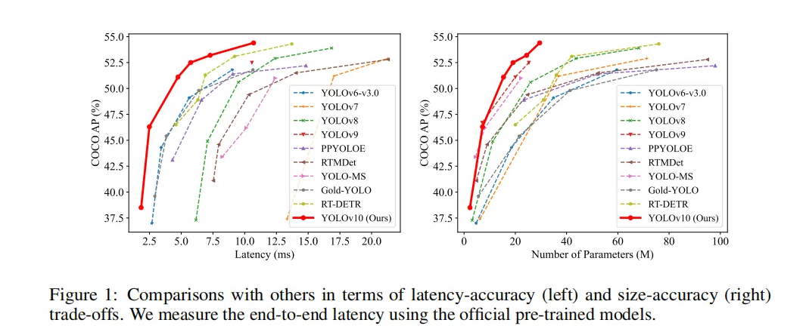

</a>


# YoloV10

## Code Source
```
link: https://github.com/THU-MIG/yolov10.git
branch: main
commit: 6fbaf42b23f6709f4e34a51430587673e70e151d
```

## Model Arch

### pre-processing

yolov10系列的预处理主要是对输入图片利用`letterbox`算子进行resize，然后进行归一化

### post-processing

yolov10系列的后处理无需进行NMS操作

### backbone

- Yolov10骨干网络是在v8的基础上进行优化的，引入改进的SCdown和C2fCIB及PSA模块
    - SCDown（Spatial-channel decoupled downsampling）将空间和通道解耦。先通过 1 × 1的逐点卷积调节通道数，再通过 3 × 3 的深度卷积做空间下采样，在降低计算成本的同时最大限度保留信息
    - 在结构上 C2fCIB 就是用 CIB （compact inverted block）替换了原本 C2f 中的 Bottleneck，CIB 则是将 Bottleneck 中的标准卷积用深度卷积加逐点卷积进行替换
    - PSA是一种高效的局部自注意力模块，它将卷积后的特征一部分输入到由多头自注意力模块MHSA和前馈网络FFN组成的模块中，然后将两部分连接起来并通过卷积进行融合。增强全局建模能力，降低计算复杂度

- Neck总体上还是PaNet结构，只是做了一些简单的模块替换。其中SCDown代替一个CBS，C2fCIB代替了两个C2f

### head

在训练期间，YOLO通常利用TAL为每个实例分配多个正样本。采用一对多分配方式，产生丰富的监控信号，有利于优化，实现卓越的性能。然而，它需要 YOLO 依赖于 NMS 后处理，这会导致部署的推理效率不理想。在这项工作中，研究者提出一种针对 YOLO 的 NMS-free 训练策略，具有双标签分配和一致的匹配指标，实现了高效率和有竞争力的性能。

为 YOLO 引入另一个一对一的头。它保留与原始一对多分支相同的结构并采用相同的优化目标，但利用一对一匹配来获取标签分配。在训练过程中，两个头部与模型共同优化，让骨干和颈部享受一对多任务提供的丰富监督。在推理过程中，丢弃一对多头并利用一对一头进行预测。这使得 YOLO 能够进行端到端部署，而不会产生任何额外的推理成本。此外，在一对一匹配中，采用top one选择，以更少的额外训练时间实现了与匈牙利匹配相同的性能。

</a>


### common

- SCdown
- C2fCIB
- PSA

## Model Info

### 模型性能

> official performance

| Model | Test Size | #Params | FLOPs | AP<sup>val</sup> | Latency |
|:---------------|:----:|:---:|:--:|:--:|:--:|
| [YOLOv10-N](https://huggingface.co/jameslahm/yolov10n) |   640  |     2.3M    |   6.7G   |     38.5%     | 1.84ms |
| [YOLOv10-S](https://huggingface.co/jameslahm/yolov10s) |   640  |     7.2M    |   21.6G  |     46.3%     | 2.49ms |
| [YOLOv10-M](https://huggingface.co/jameslahm/yolov10m) |   640  |     15.4M   |   59.1G  |     51.1%     | 4.74ms |
| [YOLOv10-B](https://huggingface.co/jameslahm/yolov10b) |   640  |     19.1M   |  92.0G |     52.5%     | 5.74ms |
| [YOLOv10-L](https://huggingface.co/jameslahm/yolov10l) |   640  |     24.4M   |  120.3G   |     53.2%     | 7.28ms |
| [YOLOv10-X](https://huggingface.co/jameslahm/yolov10x) |   640  |     29.5M    |   160.4G   |     54.4%     | 10.70ms |

> Note: 数据来自官方模型性能参数

### 测评数据集说明


[MS COCO](https://cocodataset.org/#download)的全称是Microsoft Common Objects in Context，是微软于2014年出资标注的Microsoft COCO数据集，与ImageNet竞赛一样，被视为是计算机视觉领域最受关注和最权威的比赛数据集之一。 

COCO数据集支持目标检测、关键点检测、实力分割、全景分割与图像字幕任务。在图像检测任务中，COCO数据集提供了80个类别，验证集包含5000张图片，上表的结果即在该验证集下测试。

### 评价指标说明

- mAP: mean of Average Precision, 检测任务评价指标，多类别的AP的平均值；AP即平均精度，是Precision-Recall曲线下的面积
- mAP@.5: 即将IoU设为0.5时，计算每一类的所有图片的AP，然后所有类别求平均，即mAP
- mAP@.5:.95: 表示在不同IoU阈值（从0.5到0.95，步长0.05）上的平均mAP

## Build_In Deploy

### step.1 模型准备

```
github: https://github.com/THU-MIG/yolov10.git
commit: 6fbaf42b23f6709f4e34a51430587673e70e151d
```

1. 下载模型权重
    - [yolov10n](https://github.com/THU-MIG/yolov10/releases/tag/v1.1/yolov10n.pt) 
    - [yolov10s](https://github.com/THU-MIG/yolov10/releases/tag/v1.1/yolov10s.pt) 
    - [yolov10m](https://github.com/THU-MIG/yolov10/releases/tag/v1.1/yolov10m.pt) 
    - [yolov10b](https://github.com/THU-MIG/yolov10/releases/tag/v1.1/yolov10b.pt) 
    - [yolov10l](https://github.com/THU-MIG/yolov10/releases/tag/v1.1/yolov10l.pt) 
    - [yolov10x](https://github.com/THU-MIG/yolov10/releases/tag/v1.1/yolov10x.pt) 

2. 模型导出onnx
- 获取原始仓库，按原仓库安装
- 参考[export_onnx.py](./source_code/export_onnx.py)，导出onnx
    - 后处理在ODSP上处理，此处需要对原始onnx进行截断，输出box，score和label三个节点

### step.2 准备数据集
- [校准数据集](http://images.cocodataset.org/zips/val2017.zip)
- [评估数据集](http://images.cocodataset.org/zips/val2017.zip)
- [gt: instances_val2017.json](http://images.cocodataset.org/annotations/annotations_trainval2017.zip)
- [label: coco.txt](../common/label/coco.txt)

### step.3 模型转换
1. 根据具体模型，修改编译配置
    - [official_yolov10.yaml](./build_in/build/official_yolov10.yaml)
    
    > - runstream推理，编译参数`backend.type: tvm_vacc`
    > - fp16精度: 编译参数`backend.dtype: fp16`
    > - int8精度: 编译参数`backend.dtype: int8`，需要配置量化数据集和预处理算子

2. 模型编译

    ```bash
    cd yolov10
    mkdir workspace
    cd workspace
    vamc compile ../build_in/build/official_yolov10.yaml
    ```

### step.4 模型推理
1. runstream推理：[detection.py](../common/vsx/detection.py)
    - 配置模型路径和测试数据路径等参数

    ```
    python ../../common/vsx/detection.py \
        --file_path path/to/coco_val2017 \
        --model_prefix_path deploy_weights/official_yolov10_run_stream_int8/mod \
        --vdsp_params_info ../build_in/vdsp_params/official-yolov10s-vdsp_params.json \
        --label_txt ../../common/label/coco.txt \
        --save_dir ./runstream_output \
        --device 0
    ```

    - 精度评估，参考：[eval_map.py](../common/eval/eval_map.py)
    ```bash
    python ../../common/eval/eval_map.py --gt path/to/instances_val2017.json --txt ./runstream_output
    ```

    <details><summary>点击查看精度测试结果</summary>
    
    ```
    # 模型名：yolov10s-640

    # fp16
    DONE (t=2.22s).
    Average Precision  (AP) @[ IoU=0.50:0.95 | area=   all | maxDets=100 ] = 0.452
    Average Precision  (AP) @[ IoU=0.50      | area=   all | maxDets=100 ] = 0.619
    Average Precision  (AP) @[ IoU=0.75      | area=   all | maxDets=100 ] = 0.491
    Average Precision  (AP) @[ IoU=0.50:0.95 | area= small | maxDets=100 ] = 0.252
    Average Precision  (AP) @[ IoU=0.50:0.95 | area=medium | maxDets=100 ] = 0.498
    Average Precision  (AP) @[ IoU=0.50:0.95 | area= large | maxDets=100 ] = 0.627
    Average Recall     (AR) @[ IoU=0.50:0.95 | area=   all | maxDets=  1 ] = 0.348
    Average Recall     (AR) @[ IoU=0.50:0.95 | area=   all | maxDets= 10 ] = 0.560
    Average Recall     (AR) @[ IoU=0.50:0.95 | area=   all | maxDets=100 ] = 0.598
    Average Recall     (AR) @[ IoU=0.50:0.95 | area= small | maxDets=100 ] = 0.383
    Average Recall     (AR) @[ IoU=0.50:0.95 | area=medium | maxDets=100 ] = 0.648
    Average Recall     (AR) @[ IoU=0.50:0.95 | area= large | maxDets=100 ] = 0.765
    {'bbox_mAP': 0.452, 'bbox_mAP_50': 0.619, 'bbox_mAP_75': 0.491, 'bbox_mAP_s': 0.252, 'bbox_mAP_m': 0.498, 'bbox_mAP_l': 0.627, 'bbox_mAP_copypaste': '0.452 0.619 0.491 0.252 0.498 0.627'}

    # int8
    DONE (t=2.26s).
    Average Precision  (AP) @[ IoU=0.50:0.95 | area=   all | maxDets=100 ] = 0.448
    Average Precision  (AP) @[ IoU=0.50      | area=   all | maxDets=100 ] = 0.616
    Average Precision  (AP) @[ IoU=0.75      | area=   all | maxDets=100 ] = 0.487
    Average Precision  (AP) @[ IoU=0.50:0.95 | area= small | maxDets=100 ] = 0.249
    Average Precision  (AP) @[ IoU=0.50:0.95 | area=medium | maxDets=100 ] = 0.492
    Average Precision  (AP) @[ IoU=0.50:0.95 | area= large | maxDets=100 ] = 0.620
    Average Recall     (AR) @[ IoU=0.50:0.95 | area=   all | maxDets=  1 ] = 0.347
    Average Recall     (AR) @[ IoU=0.50:0.95 | area=   all | maxDets= 10 ] = 0.559
    Average Recall     (AR) @[ IoU=0.50:0.95 | area=   all | maxDets=100 ] = 0.597
    Average Recall     (AR) @[ IoU=0.50:0.95 | area= small | maxDets=100 ] = 0.385
    Average Recall     (AR) @[ IoU=0.50:0.95 | area=medium | maxDets=100 ] = 0.645
    Average Recall     (AR) @[ IoU=0.50:0.95 | area= large | maxDets=100 ] = 0.761
    {'bbox_mAP': 0.448, 'bbox_mAP_50': 0.616, 'bbox_mAP_75': 0.487, 'bbox_mAP_s': 0.249, 'bbox_mAP_m': 0.492, 'bbox_mAP_l': 0.62, 'bbox_mAP_copypaste': '0.448 0.616 0.487 0.249 0.492 0.620'}
    ```

    </details>

### step.5 性能精度测试
1. 性能测试
    - 配置[official-yolov10s-vdsp_params.json](./build_in/vdsp_params/official-yolov10s-vdsp_params.json)
    ```bash
    vamp -m deploy_weights/official_yolov10_run_stream_int8/mod --vdsp_params ../build_in/vdsp_params/official-yolov10s-vdsp_params.json -i 1 p 1 -b 1 -d 0
    ```

2. 精度测试
    > **可选步骤**，通过vamp推理方式获得推理结果，然后解析及评估精度；与前文基于runstream脚本形式评估精度效果一致

    - 数据准备，基于[image2npz.py](../common/utils/image2npz.py)，将评估数据集转换为npz格式，生成对应的`npz_datalist.txt`
    ```bash
    python ../../common/utils/image2npz.py \
        --dataset_path path/to/coco_val2017 \
        --target_path  path/to/coco_val2017_npz \
        --text_path npz_datalist.txt
    ```

    - vamp推理获取npz结果输出
    ```bash
    vamp -m deploy_weights/official_yolov10_run_stream_int8/mod \
        --vdsp_params ../build_in/vdsp_params/official-yolov10s-vdsp_params.json \
        -i 1 p 1 -b 1 \
        --datalist path/to/npz_datalist.txt \
        --path_output npz_output
    ```

    - 解析npz文件，参考：[npz_decode.py](../common/utils/npz_decode.py)
    ```bash
    python ../../common/utils/npz_decode.py \
        --txt result_npz --label_txt ../../common/label/coco.txt \
        --input_image_dir path/to/coco_val2017 \
        --model_size 640 640 \
        --vamp_datalist_path path/to/npz_datalist.txt \
        --vamp_output_dir npz_output
    ```

    - 精度统计，参考：[eval_map.py](../common/eval/eval_map.py)
    ```bash
    python ../../common/eval/eval_map.py \
        --gt path/to/instances_val2017.json \
        --txt path/to/result_npz
    ```

## Tips
- YOLO系列模型中，官方在精度测试和性能测试时，设定了不同的conf和iou参数
- VACC在不同测试任务中，需要分别配置build yaml内的对应参数，分别进行build模型
- `precision mode：--confidence_threshold 0.001 --nms_threshold 0.65`
- `performance mode：--confidence_threshold 0.25 --nms_threshold 0.45`
