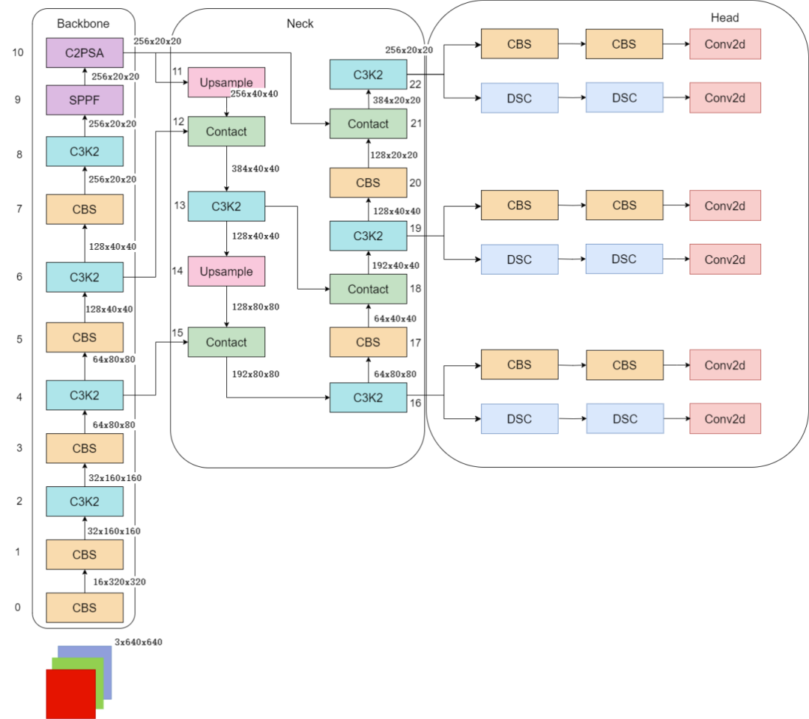

</a>

# YoloV11

## Code Source
```
link: https://github.com/ultralytics/ultralytics
branch: main
commit: d17b305786ba1055c642b5e5e820749ca66f132e
```

## Model Arch

</a>


### pre-processing

yolov11系列的预处理主要是对输入图片利用`letterbox`算子进行resize，然后进行归一化

### post-processing
1. yolov11模型最终输出维度是[1,84, 8000]。这里的84表示实际是80（80个类别置信度）+ 4（坐标）。8000表示实际是三个尺度（80x80，40x40，20x20）的特征图拼接后的维度。
2. 对于目标框的回归非常简单，操作过程如下:
    - 基于特征图网络位置（i，j），计算绝对中心坐标：
    ```
    x = σ(Δx) + j, y = σ(Δy) + i
    其中σ是Sigmoid 函数，确保偏移量在 [0,1] 内
    ```
    - 宽高计算。直接对预测的宽高缩放因子取指数，乘以特征图下采样步幅（如32）：
    ```
    w = Δw × stride, h = Δh × stride
    ```
    - 然后对输出的框进行nms操作即可

### backbone
YOLO11采用改进的骨干和颈部架构，增强了特征提取能力，提高了物体检测的精确度和复杂任务的表现。相比较于YOLOv8模型，其将CF2模块改成C3K2，同时在SPPF模块后面添加了一个C2PSA模块，且将YOLOv10的head思想引入到YOLO11的head中，使用深度可分离的方法，减少冗余计算，提高效率。

YOLO11增加了一个C2PSA模块，并且将C2f替换为了C3k2。相比于C2f，当超参数c3k=True时，瓶颈块替换为 C3k，否则还是C2f,而C3k相比于C3则是可以让使用者自定义卷积块大小，更加灵活。C2PSA扩展了C2f，通过引入PSA( Position-Sensitive Attention)，旨在通过多头注意力机制和前馈神经网络来增强特征提取能力。它可以选择性地添加残差结构（shortcut）以优化梯度传播和网络训练效果。同时，使用FFN 可以将输入特征映射到更高维的空间，捕获输入特征的复杂非线性关系，允许模型学习更丰富的特征表示。

</a>
    
### neck
YOLO11使用PAN结构，并在其中也使用了C3K2模块。这种结构设计有助于聚合来自不同尺度的特征，并优化特征的传递过程。C3K2模块其实就是C2F模块转变出来的，它代码中有一个设置，就是当c3k这个参数为FALSE的时候，C3K2模块就是C2F模块，也就是说它的Bottleneck是普通的Bottleneck；反之当它为true的时候，将Bottleneck模块替换成C3模块。

</a>
    

### head
与早期的YOLO版本类似，YOLOv11使用多尺度预测头来检测不同大小的物体。头部使用由脊柱和颈部生成的特征图输出三种不同尺度（低、中、高）的检测框。

检测头从三个特征图（通常来自P3、P4和P5）输出预测，对应于图像中的不同粒度级别。这种方法确保了小物体被更精细地检测到（P3），而较大的物体被更高级别的特征捕获（P5）。


- 通道分离系数设置为 0.5，在精度损失 <0.3% 条件下计算量减少 38%
- 引入通道洗牌（Channel Shuffle）操作，保持特征多样性
</a>

### common
- Spatial Pyramid Pooling Fast
- Position-Sensitive Attention
- Depthwise Convolution

## Model Info

### 模型性能

> official performance

| Model                                                                                | size<br><sup>(pixels) | mAP<sup>val<br>50-95 | Speed<br><sup>CPU ONNX<br>(ms) | Speed<br><sup>T4 TensorRT10<br>(ms) | params<br><sup>(M) | FLOPs<br><sup>(B) |
| ------------------------------------------------------------------------------------ | --------------------- | -------------------- | ------------------------------ | ----------------------------------- | ------------------ | ----------------- |
| [YOLO11n](https://github.com/ultralytics/assets/releases/download/v8.3.0/yolo11n.pt) | 640                   | 39.5                 | 56.1 ± 0.8                     | 1.5 ± 0.0                           | 2.6                | 6.5               |
| [YOLO11s](https://github.com/ultralytics/assets/releases/download/v8.3.0/yolo11s.pt) | 640                   | 47.0                 | 90.0 ± 1.2                     | 2.5 ± 0.0                           | 9.4                | 21.5              |
| [YOLO11m](https://github.com/ultralytics/assets/releases/download/v8.3.0/yolo11m.pt) | 640                   | 51.5                 | 183.2 ± 2.0                    | 4.7 ± 0.1                           | 20.1               | 68.0              |
| [YOLO11l](https://github.com/ultralytics/assets/releases/download/v8.3.0/yolo11l.pt) | 640                   | 53.4                 | 238.6 ± 1.4                    | 6.2 ± 0.1                           | 25.3               | 86.9              |
| [YOLO11x](https://github.com/ultralytics/assets/releases/download/v8.3.0/yolo11x.pt) | 640                   | 54.7                 | 462.8 ± 6.7                    | 11.3 ± 0.2                          | 56.9               | 194.9             |


### 测评数据集说明


[MS COCO](https://cocodataset.org/#download)的全称是Microsoft Common Objects in Context，是微软于2014年出资标注的Microsoft COCO数据集，与ImageNet竞赛一样，被视为是计算机视觉领域最受关注和最权威的比赛数据集之一。 

COCO数据集支持目标检测、关键点检测、实力分割、全景分割与图像字幕任务。在图像检测任务中，COCO数据集提供了80个类别，验证集包含5000张图片，上表的结果即在该验证集下测试。

### 评价指标说明

- mAP: mean of Average Precision, 检测任务评价指标，多类别的AP的平均值；AP即平均精度，是Precision-Recall曲线下的面积
- mAP@.5: 即将IoU设为0.5时，计算每一类的所有图片的AP，然后所有类别求平均，即mAP
- mAP@.5:.95: 表示在不同IoU阈值（从0.5到0.95，步长0.05）上的平均mAP

## Build_In Deploy

### step.1 获取预训练模型

```
link: https://github.com/ultralytics/ultralytics
branch: main
commit: d17b305786ba1055c642b5e5e820749ca66f132e
```

- 获取原始仓库，按原仓库安装
- 参考[export_onnx.py](./source_code/export_onnx.py)，导出onnx

### step.2 准备数据集
- [校准数据集](http://images.cocodataset.org/zips/val2017.zip)
- [评估数据集](http://images.cocodataset.org/zips/val2017.zip)
- [gt: instances_val2017.json](http://images.cocodataset.org/annotations/annotations_trainval2017.zip)
- [label: coco.txt](../common/label/coco.txt)

### step.3 模型转换
1. 根据具体模型，修改编译配置
    - [official_yolov11.yaml](./build_in/build/official_yolov11.yaml)
    
    > - 编译参数`backend.type: tvm_vacc`
    > - fp16精度: 编译参数`backend.dtype: fp16`
    > - int8精度: 编译参数`backend.dtype: int8`

2. 模型编译
    ```bash
    cd yolov11
    mkdir workspace
    cd workspace
    vamc compile ../build_in/build/official_yolov11.yaml
    ```

### step.4 模型推理

- 参考[yolov11_vsx.py](./build_in/vsx/python/yolov11_vsx.py)生成预测的txt结果

    ```
    python ../build_in/vsx/python/yolov11_vsx.py \
        --file_path path/to/coco_val2017 \
        --model_prefix_path deploy_weights/official_yolov11_fp16/mod \
        --vdsp_params_info ../build_in/vdsp_params/official-yolov11s-vdsp_params.json \
        --label_txt ../../common/label/coco.txt \
        --save_dir ./infer_output \
        --device 0
    ```

- 参考[eval_map.py](../common/eval/eval_map.py)，精度统计
    ```bash
    python ../../common/eval/eval_map.py --gt path/to/instances_val2017.json --txt ./infer_output
    ```

    <details><summary>点击查看精度测试结果</summary>

    ```
    nms_threshold: 0.65
    confidence_threshold: 0.001

    # 官方仓库测评（未指定size，dynamic-shape形式输入）
    yolo val model=yolo11s.onnx detect data=./ultralytics/cfg/datasets/coco.yaml  device=0
    Average Precision  (AP) @[ IoU=0.50:0.95 | area=   all | maxDets=100 ] = 0.466
    Average Precision  (AP) @[ IoU=0.50      | area=   all | maxDets=100 ] = 0.635
    Average Precision  (AP) @[ IoU=0.75      | area=   all | maxDets=100 ] = 0.503
    Average Precision  (AP) @[ IoU=0.50:0.95 | area= small | maxDets=100 ] = 0.292
    Average Precision  (AP) @[ IoU=0.50:0.95 | area=medium | maxDets=100 ] = 0.511
    Average Precision  (AP) @[ IoU=0.50:0.95 | area= large | maxDets=100 ] = 0.638
    Average Recall     (AR) @[ IoU=0.50:0.95 | area=   all | maxDets=  1 ] = 0.362
    Average Recall     (AR) @[ IoU=0.50:0.95 | area=   all | maxDets= 10 ] = 0.598
    Average Recall     (AR) @[ IoU=0.50:0.95 | area=   all | maxDets=100 ] = 0.651
    Average Recall     (AR) @[ IoU=0.50:0.95 | area= small | maxDets=100 ] = 0.472
    Average Recall     (AR) @[ IoU=0.50:0.95 | area=medium | maxDets=100 ] = 0.709
    Average Recall     (AR) @[ IoU=0.50:0.95 | area= large | maxDets=100 ] = 0.813
    
    # 代码参考：https://github.com/ultralytics/ultralytics/blob/main/examples/YOLOv8-ONNXRuntime/main.py
    # 和VACC对齐，letterbox使用[640, 640]形式（**以此为Bench参考**）
    python detection/yolov11/source_code/onnx_eval.py --model yolo11s.onnx --img ./data/COCO2017/det_coco_val --conf-thres 0.001 --iou-thres 0.65 --output_dir onnx_outputs

    Accumulating evaluation results...
    DONE (t=2.91s).
    Average Precision  (AP) @[ IoU=0.50:0.95 | area=   all | maxDets=100 ] = 0.447
    Average Precision  (AP) @[ IoU=0.50      | area=   all | maxDets=100 ] = 0.617
    Average Precision  (AP) @[ IoU=0.75      | area=   all | maxDets=100 ] = 0.470
    Average Precision  (AP) @[ IoU=0.50:0.95 | area= small | maxDets=100 ] = 0.248
    Average Precision  (AP) @[ IoU=0.50:0.95 | area=medium | maxDets=100 ] = 0.483
    Average Precision  (AP) @[ IoU=0.50:0.95 | area= large | maxDets=100 ] = 0.616
    Average Recall     (AR) @[ IoU=0.50:0.95 | area=   all | maxDets=  1 ] = 0.332
    Average Recall     (AR) @[ IoU=0.50:0.95 | area=   all | maxDets= 10 ] = 0.533
    Average Recall     (AR) @[ IoU=0.50:0.95 | area=   all | maxDets=100 ] = 0.574
    Average Recall     (AR) @[ IoU=0.50:0.95 | area= small | maxDets=100 ] = 0.377
    Average Recall     (AR) @[ IoU=0.50:0.95 | area=medium | maxDets=100 ] = 0.632
    Average Recall     (AR) @[ IoU=0.50:0.95 | area= large | maxDets=100 ] = 0.738
    {'bbox_mAP': 0.447, 'bbox_mAP_50': 0.617, 'bbox_mAP_75': 0.47, 'bbox_mAP_s': 0.248, 'bbox_mAP_m': 0.483, 'bbox_mAP_l': 0.616, 'bbox_mAP_copypaste': '0.437 0.617 0.470 0.248 0.483 0.616'}


    # official_yolov11_fp16

    Average Precision  (AP) @[ IoU=0.50:0.95 | area=   all | maxDets=100 ] = 0.452
    Average Precision  (AP) @[ IoU=0.50      | area=   all | maxDets=100 ] = 0.621
    Average Precision  (AP) @[ IoU=0.75      | area=   all | maxDets=100 ] = 0.485
    Average Precision  (AP) @[ IoU=0.50:0.95 | area= small | maxDets=100 ] = 0.271
    Average Precision  (AP) @[ IoU=0.50:0.95 | area=medium | maxDets=100 ] = 0.499
    Average Precision  (AP) @[ IoU=0.50:0.95 | area= large | maxDets=100 ] = 0.629
    Average Recall     (AR) @[ IoU=0.50:0.95 | area=   all | maxDets=  1 ] = 0.345
    Average Recall     (AR) @[ IoU=0.50:0.95 | area=   all | maxDets= 10 ] = 0.552
    Average Recall     (AR) @[ IoU=0.50:0.95 | area=   all | maxDets=100 ] = 0.582
    Average Recall     (AR) @[ IoU=0.50:0.95 | area= small | maxDets=100 ] = 0.376
    Average Recall     (AR) @[ IoU=0.50:0.95 | area=medium | maxDets=100 ] = 0.640
    Average Recall     (AR) @[ IoU=0.50:0.95 | area= large | maxDets=100 ] = 0.761
    {'bbox_mAP': 0.452, 'bbox_mAP_50': 0.621, 'bbox_mAP_75': 0.485, 'bbox_mAP_s': 0.271, 'bbox_mAP_m': 0.499, 'bbox_mAP_l': 0.629, 'bbox_mAP_copypaste': '0.452 0.621 0.485 0.271 0.499 0.629'}


    # official_yolov11_int8-percentile

    Average Precision  (AP) @[ IoU=0.50:0.95 | area=   all | maxDets=100 ] = 0.446
    Average Precision  (AP) @[ IoU=0.50      | area=   all | maxDets=100 ] = 0.616
    Average Precision  (AP) @[ IoU=0.75      | area=   all | maxDets=100 ] = 0.483
    Average Precision  (AP) @[ IoU=0.50:0.95 | area= small | maxDets=100 ] = 0.258
    Average Precision  (AP) @[ IoU=0.50:0.95 | area=medium | maxDets=100 ] = 0.491
    Average Precision  (AP) @[ IoU=0.50:0.95 | area= large | maxDets=100 ] = 0.621
    Average Recall     (AR) @[ IoU=0.50:0.95 | area=   all | maxDets=  1 ] = 0.343
    Average Recall     (AR) @[ IoU=0.50:0.95 | area=   all | maxDets= 10 ] = 0.550
    Average Recall     (AR) @[ IoU=0.50:0.95 | area=   all | maxDets=100 ] = 0.579
    Average Recall     (AR) @[ IoU=0.50:0.95 | area= small | maxDets=100 ] = 0.366
    Average Recall     (AR) @[ IoU=0.50:0.95 | area=medium | maxDets=100 ] = 0.635
    Average Recall     (AR) @[ IoU=0.50:0.95 | area= large | maxDets=100 ] = 0.758
    {'bbox_mAP': 0.446, 'bbox_mAP_50': 0.616, 'bbox_mAP_75': 0.483, 'bbox_mAP_s': 0.258, 'bbox_mAP_m': 0.491, 'bbox_mAP_l': 0.621, 'bbox_mAP_copypaste': '0.448 0.616 0.483 0.258 0.491 0.621'}

    ```

    </details>


### step.5 性能精度测试
1. 性能测试
    ```bash
    vamp -m ./deploy_weights/official_yolov11_fp16/mod --vdsp_params ../build_in/vdsp_params/official-yolov11s-vdsp_params.json -i 1 -b 1 -d 0 -p 1
    ```

2. 精度测试
    > **可选步骤**，通过vamp推理方式获得推理结果，然后解析及评估精度；

    - 数据准备，基于[image2npz.py](../common/utils/image2npz.py)，将评估数据集转换为npz格式，生成对应的`npz_datalist.txt`
    ```bash
    python ../../common/utils/image2npz.py \
        --dataset_path path/to/coco_val2017 \
        --target_path  path/to/coco_val2017_npz  \
        --text_path npz_datalist.txt
    ```

    - vamp推理，获取npz结果输出
    ```bash
    vamp -m deploy_weights/official_yolov11_fp16/mod \
        --vdsp_params ../build_in/vdsp_params/official-yolov11s-vdsp_params.json \
        -i 1 -b 1 -d 0 -p 1 \
        --datalist path/to/npz_datalist.txt \
        --path_output npz_output
    ```

    - 解析npz文件，参考：[npz_decode.py](../common/utils/npz_decode.py)
        ```bash
        python ../../common/utils/npz_decode.py \
            --txt result_npz --label_txt ../../common/label/coco.txt \
            --input_image_dir path/to/coco_val2017 \
            --model_size 640 640 \
            --vamp_datalist_path path/to/npz_datalist.txt \
            --vamp_output_dir npz_output
        ```
    
    - 参考：[eval_map.py](../common/eval/eval_map.py)，精度统计
    ```bash
    python ../../common/eval/eval_map.py \
        --gt path/to/instances_val2017.json \
        --txt path/to/result_npz
    ```

## Tips
- YOLO系列模型中，官方在精度测试和性能测试时，设定了不同的conf和iou参数
- VACC在不同测试任务中，需要分别配置build yaml内的对应参数，分别进行build模型
- `precision mode：--confidence_threshold 0.001 --nms_threshold 0.65`
- `performance mode：--confidence_threshold 0.25 --nms_threshold 0.45`
- 不同参数量模型，在量化参数上存在差异：
```
quantize:
    calibrate_mode: percentile
    quantize_per_channel: true
    skip_matmul_layers: [0, 1] # yolo11-n/s/m
    # skip_matmul_layers: [0, 1, 2, 3, 4, 5, 6, 7]  # yolo11-l/x
    calibrate_chunk_by: -1
```
- yolov11含有Attention模块，GQA计算时，由于硬件限制seqlen需要是128的倍数；即输入分辨率需设置为128的倍数

