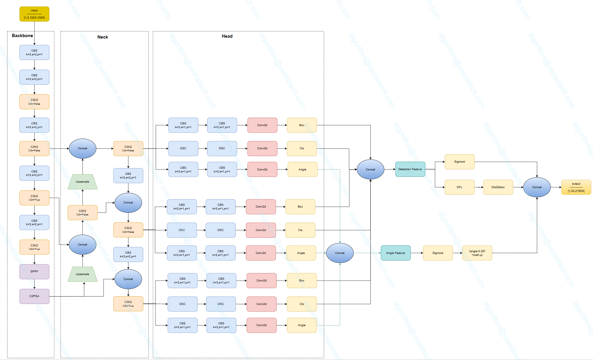
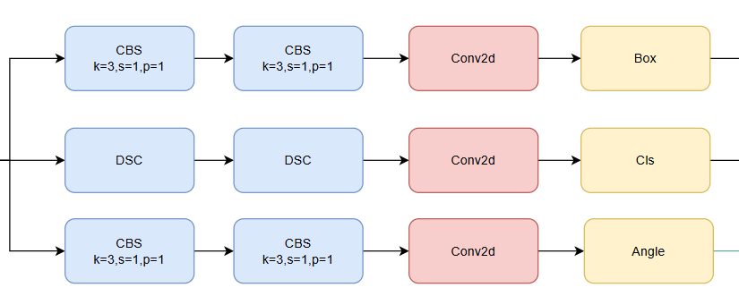

</a>

# YoloV11-OBB

## Code Source
```
link: https://github.com/ultralytics/ultralytics
branch: main
commit: d17b305786ba1055c642b5e5e820749ca66f132e
```

## Model Arch

</a>


### pre-processing

yolo11-obb系列的预处理主要是对输入图片利用`letterbox`算子进行resize，然后进行归一化

### post-processing
yolo11-obb系列网络的后处理操作是进行box decode之后进行nms, 然后对预测的旋转边界框进行规范化处理，确保角度在有效范围内（通常为[-π/2, π/2]）；最后将将归一化的边界框坐标从模型输入尺度映射回原始图像尺度，保持检测结果的几何一致性。

### backbone
YOLO11采用改进的骨干和颈部架构，增强了特征提取能力，提高了物体检测的精确度和复杂任务的表现。相比较于YOLOv8模型，其将CF2模块改成C3K2，同时在SPPF模块后面添加了一个C2PSA模块，且将YOLOv10的head思想引入到YOLO11的head中，使用深度可分离的方法，减少冗余计算，提高效率。

YOLO11增加了一个C2PSA模块，并且将C2f替换为了C3k2。相比于C2f，当超参数c3k=True时，瓶颈块替换为 C3k，否则还是C2f,而C3k相比于C3则是可以让使用者自定义卷积块大小，更加灵活。C2PSA扩展了C2f，通过引入PSA( Position-Sensitive Attention)，旨在通过多头注意力机制和前馈神经网络来增强特征提取能力。它可以选择性地添加残差结构（shortcut）以优化梯度传播和网络训练效果。同时，使用FFN 可以将输入特征映射到更高维的空间，捕获输入特征的复杂非线性关系，允许模型学习更丰富的特征表示。

</a>
    
### neck
YOLO11使用PAN结构，并在其中也使用了C3K2模块。这种结构设计有助于聚合来自不同尺度的特征，并优化特征的传递过程。C3K2模块其实就是C2F模块转变出来的，它代码中有一个设置，就是当c3k这个参数为FALSE的时候，C3K2模块就是C2F模块，也就是说它的Bottleneck是普通的Bottleneck；反之当它为true的时候，将Bottleneck模块替换成C3模块。

</a>
    

### head
YOLO11-OBB旋转目标检测头部扩展了检测头，增加了一个旋转角度预测分支，最终预测出带有旋转角度的定向边界框。
</a>

### common
- Spatial Pyramid Pooling Fast
- Position-Sensitive Attention
- Depthwise Convolution

## Model Info

### 模型性能

> official performance

| Model                                                                                        | size<br><sup>(pixels) | mAP<sup>test<br>50 | Speed<br><sup>CPU ONNX<br>(ms) | Speed<br><sup>T4 TensorRT10<br>(ms) | params<br><sup>(M) | FLOPs<br><sup>(B) |
| -------------------------------------------------------------------------------------------- | --------------------- | ------------------ | ------------------------------ | ----------------------------------- | ------------------ | ----------------- |
| [YOLO11n-obb](https://github.com/ultralytics/assets/releases/download/v8.3.0/yolo11n-obb.pt) | 1024                  | 78.4               | 117.6 ± 0.8                    | 4.4 ± 0.0                           | 2.7                | 16.8              |
| [YOLO11s-obb](https://github.com/ultralytics/assets/releases/download/v8.3.0/yolo11s-obb.pt) | 1024                  | 79.5               | 219.4 ± 4.0                    | 5.1 ± 0.0                           | 9.7                | 57.1              |
| [YOLO11m-obb](https://github.com/ultralytics/assets/releases/download/v8.3.0/yolo11m-obb.pt) | 1024                  | 80.9               | 562.8 ± 2.9                    | 10.1 ± 0.4                          | 20.9               | 182.8             |
| [YOLO11l-obb](https://github.com/ultralytics/assets/releases/download/v8.3.0/yolo11l-obb.pt) | 1024                  | 81.0               | 712.5 ± 5.0                    | 13.5 ± 0.6                          | 26.1               | 231.2             |
| [YOLO11x-obb](https://github.com/ultralytics/assets/releases/download/v8.3.0/yolo11x-obb.pt) | 1024                  | 81.3               | 1408.6 ± 7.7                   | 28.6 ± 1.0                          | 58.8               | 519.1             |


### 测评数据集说明


[DOTA](https://captain-whu.github.io/DOTA/index.html) 作为一个专门的数据集，强调航空图像中的目标检测。它源自 DOTA 系列数据集，提供带注释的图像，这些图像使用旋转框检测 (OBB)捕获各种航空场景。

DOTA 展示了一个为 OBB 目标检测挑战量身定制的结构化布局：
- 图像：大量高分辨率航空图像，捕捉了不同的地形和结构。
- 定向边界框：以旋转矩形形式存在的标注，封装了目标，不受其方向的影响，非常适合捕捉飞机、船舶和建筑物等目标。

### 评价指标说明

- mAP: mean of Average Precision, 检测任务评价指标，多类别的AP的平均值；AP即平均精度，是Precision-Recall曲线下的面积
- mAP@.5: 即将IoU设为0.5时，计算每一类的所有图片的AP，然后所有类别求平均，即mAP
- mAP@.5:.95: 表示在不同IoU阈值（从0.5到0.95，步长0.05）上的平均mAP

## Build_In Deploy

### step.1 获取预训练模型

```
link: https://github.com/ultralytics/ultralytics
branch: main
commit: d17b305786ba1055c642b5e5e820749ca66f132e
```

- 获取原始仓库
- 为适配VACC和导出onnx文件，需进行适当修改源码。
    - 目前Compiler暂不支持四维softmax算子，yolov11中DFL模块包含四维softmax算子，但是由于其后的卷积层不参与训练，因此可以将该算子后的处理截断写在host侧。综上，转换模型时可以修改[Detect](https://github.com/ultralytics/ultralytics/blob/d17b305786ba1055c642b5e5e820749ca66f132e/ultralytics/nn/modules/head.py#L114)类的forward函数，替换成如下内容：
    ```python
    def forward(self, x: list[torch.Tensor], task_type="Detect") -> list[torch.Tensor] | tuple:
        """Concatenate and return predicted bounding boxes and class probabilities."""
        if task_type in ['Pose', 'Obb']:
            print("task_type is Pose or OBB, do not use Detect head")
            y = []
            for i in range(self.nl):
                cv2_output = self.cv2[i](x[i])  # 第一个分支
                cv3_output = self.cv3[i](x[i])  # 第二个分支
                # 返回未cat的各个分支
                y.append([cv2_output, cv3_output])
            return y  
         
        if self.end2end:
            return self.forward_end2end(x)

        for i in range(self.nl):
            x[i] = torch.cat((self.cv2[i](x[i]), self.cv3[i](x[i])), 1)
        if self.training:  # Training path
            return x
        y = self._inference(x)
        return y if self.export else (y, x)
    ```
    - obb中angle计算在build时存在问题，因此也需要放在host侧进行处理，需要修改[OBB](https://github.com/ultralytics/ultralytics/blob/d17b305786ba1055c642b5e5e820749ca66f132e/ultralytics/nn/modules/head.py#L322)类的forward函数，替换成如下内容：
    ```python
    def forward(self, x: list[torch.Tensor]) -> torch.Tensor | tuple:
        """Concatenate and return predicted bounding boxes and class probabilities."""
        bs = x[0].shape[0]  # batch size
        # angle = torch.cat([self.cv4[i](x[i]).view(bs, self.ne, -1) for i in range(self.nl)], 2)  # OBB theta logits
        # # NOTE: set `angle` as an attribute so that `decode_bboxes` could use it.
        # angle = (angle.sigmoid() - 0.25) * math.pi  # [-pi/4, 3pi/4]
        # # angle = angle.sigmoid() * math.pi / 2  # [0, pi/2]
        # if not self.training:
        #     self.angle = angle
        # x = Detect.forward(self, x)
        # if self.training:
        #     return x, angle
        # return torch.cat([x, angle], 1) if self.export else (torch.cat([x[0], angle], 1), (x[1], angle))
        angle_before_reshape = [self.cv4[i](x[i]) for i in range(self.nl)]
 
        if self.export :
            x = Detect.forward(self, x, "Obb")
            return [x, angle_before_reshape]  # 返回未reshape的原始角度logits
    ```
- 按原仓库安装环境
- 参考[export_onnx.py](./source_code/export_onnx.py)，导出onnx。onnx文件不包含后处理部分，输出有9个feature map。

### step.2 准备数据集
- [校准数据集](https://github.com/ultralytics/assets/releases/download/v0.0.0/DOTAv1.zip)
- [评估数据集](https://github.com/ultralytics/assets/releases/download/v0.0.0/DOTAv1.zip)

### step.3 模型转换
1. 根据具体模型，修改编译配置
    - [official_yolov11_obb_fp16.yaml](./build_in/build/official_yolov11_obb_fp16.yaml)
    - [official_yolov11_obb_int8.yaml](./build_in/build/official_yolov11_obb_int8.yaml)
    
    > - 编译参数`backend.type: tvm_vacc`
    > - fp16精度: 编译参数`backend.dtype: fp16`
    > - int8精度: 编译参数`backend.dtype: int8`

2. 模型编译
    ```bash
    cd yolov11_obb
    mkdir workspace
    cd workspace
    vamc compile ../build_in/build/official_yolov11_obb_fp16.yaml
    vamc compile ../build_in/build/official_yolov11_obb_int8.yaml
    ```

### step.4 模型推理

- 参考[yolov11_obb_vsx.py](./build_in/vsx/python/yolov11_obb_vsx.py)生成预测的结果

    ```
    python ../build_in/vsx/python/yolov11_obb_vsx.py \
        --file_path path/to/DOTAv1/images/test \
        --model_prefix_path ./deploy_weights/ultralytics_yolo11n_obb_fp16/mod \
        --vdsp_params_info ../build_in/vdsp_params/official-yolov11n-vdsp_params.json \
        --save_dir ./infer_output \
        --device 0

    ```

### step.5 性能测试
```bash
vamp -m ./deploy_weights/ultralytics_yolo11n_obb_fp16/mod \
--vdsp_params ../build_in/vdsp_params/official-yolov11n-vdsp_params.json \
-i 1 -b 1 -d 0 -p 1
```

## Tips
- YOLO系列模型中，官方在精度测试和性能测试时，设定了不同的conf和iou参数
- VACC在不同测试任务中，需要分别配置build yaml内的对应参数，分别进行build模型
- `precision mode：--confidence_threshold 0.001 --nms_threshold 0.65`
- `performance mode：--confidence_threshold 0.25 --nms_threshold 0.45`
- 不同参数量模型，在量化参数上存在差异：
```
quantize:
    calibrate_mode: percentile
    quantize_per_channel: true
    skip_matmul_layers: [0, 1] # yolo11-n/s/m
    # skip_matmul_layers: [0, 1, 2, 3, 4, 5, 6, 7]  # yolo11-l/x
    calibrate_chunk_by: -1
```
- yolov11含有Attention模块，GQA计算时，由于硬件限制seqlen需要是128的倍数；即输入分辨率需设置为128的倍数

