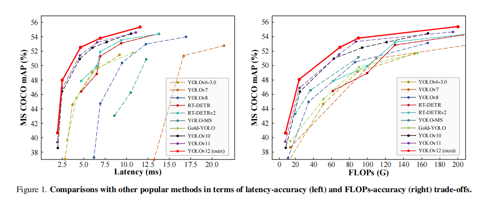
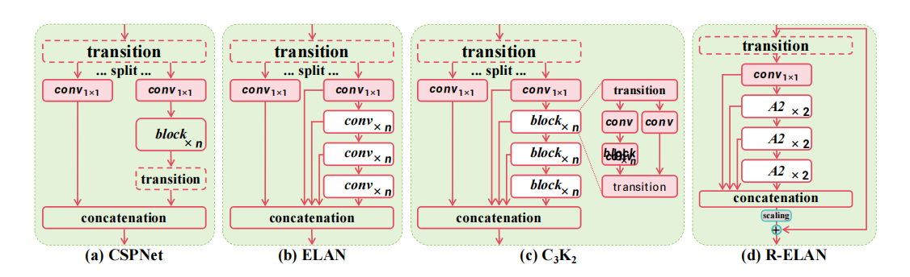
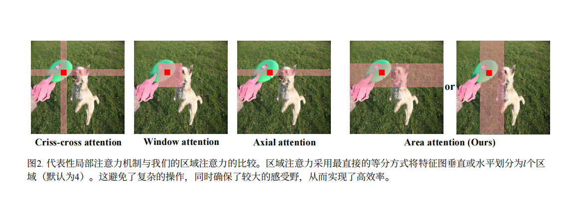

</a>

# YoloV12

## Code Source
```
link: https://github.com/sunsmarterjie/yolov12.git
branch: main
commit: 3a336a4adf3683d280e1a50d03fa24bbe7f24a5b
```

## Model Arch

### pre-processing

yolov12系列的预处理主要是对输入图片利用`letterbox`算子进行resize，然后进行归一化

### post-processing
1. yolov12s模型最终输出维度是[1,84, 8000]。这里的84表示实际是80（80个类别置信度）+ 4（坐标）。8000表示实际是三个尺度（80x80，40x40，20x20）的特征图拼接后的维度。
2. 对于目标框的回归非常简单，操作过程如下:
    - 基于特征图网络位置（i，j），计算绝对中心坐标：
    ```
    x = σ(Δx) + j, y = σ(Δy) + i
    其中σ是Sigmoid 函数，确保偏移量在 [0,1] 内
    ```
    - 宽高计算。直接对预测的宽高缩放因子取指数，乘以特征图下采样步幅（如32）：
    ```
    w = Δw × stride, h = Δh × stride
    ```
    - 然后对输出的框进行nms操作即可

### backbone
- YOLOv12的主干系统对于将原始图像数据转换为多尺度特征图至关重要，它为后续的检测任务提供了基础表征。主干网络的核心是残差高效层聚合网络（R-ELAN），它将更深的卷积层与精心设置的残差连接融合在一起。这种设计解决了梯度瓶颈问题，提高了特征重用率，增强了模型捕捉各种尺寸和形状的复杂物体细节的能力。
</a>
- 除了引入先进的卷积块（R-ELAN），YOLOv12还利用7×7可分离卷积等技术来减轻计算负担。这种方法有效取代了传统的大内核运算或位置编码，以更少的参数保持了空间感知能力。此外，多尺度特征金字塔可确保不同大小的物体，包括小物体或部分遮挡的物体，都能在网络中得到明显的体现。
- YOLOv12中的Neck是骨干和头部之间的通道，用于聚合和细化多尺度特征。其主要创新之一提出区域注意力模块（A2）：采用简单的划分方式将特征图划分为多个区域，避免复杂操作，在保持较大感受野的同时降低注意力计算复杂度。实验表明，使用区域注意力的 YOLOv12 - N/S/X 模型在 GPU 和 CPU 上推理速度显著提升，例如 YOLOv12 - N 在 RTX 3080 上使用 FP32 精度时，推理时间减少 0.7ms 。
</a>
    
### head
YOLOv12的头部将颈部的精细特征图转化为最终预测结果，生成边界框坐标和分类分数。主要改进包括简化了多尺度检测路径，以及更好地平衡定位和分类目标的专用损失函数。
</a>

### common
- R-ELAN
- A2

## Model Info

### 模型性能

> official performance

| Model | Test Size | #Params | FLOPs | AP<sup>val</sup> | Latency |
|:---------------|:----:|:---:|:--:|:--:|:--:|
| [YOLOv12-N](https://github.com/sunsmarterjie/yolov12/releases/download/v1.0/yolov12n.pt) |   640  |     2.6M    |   6.5G     |     40.6%     | 1.64ms |
| [YOLOv12-S](https://github.com/sunsmarterjie/yolov12/releases/download/v1.0/yolov12s.pt) |   640  |     9.3M    |   21.4G    |     48.0%     | 2.61ms |
| [YOLOv12-M](https://github.com/sunsmarterjie/yolov12/releases/download/v1.0/yolov12m.pt) |   640  |     20.2M   |   67.5G    |     52.5%     | 4.86ms |
| [YOLOv12-L](https://github.com/sunsmarterjie/yolov12/releases/download/v1.0/yolov12l.pt) |   640  |     26.4M   |   88.9G    |     53.7%     | 6.77ms |
| [YOLOv12-X](https://github.com/sunsmarterjie/yolov12/releases/download/v1.0/yolov12x.pt) |   640  |     59.1M   |   199.0G   |     55.2%     | 11.79ms |

- 性能测试为NVIDIA T4, TensorRT10，且使用了FlashAttention技术

### 测评数据集说明


[MS COCO](https://cocodataset.org/#download)的全称是Microsoft Common Objects in Context，是微软于2014年出资标注的Microsoft COCO数据集，与ImageNet竞赛一样，被视为是计算机视觉领域最受关注和最权威的比赛数据集之一。 

COCO数据集支持目标检测、关键点检测、实力分割、全景分割与图像字幕任务。在图像检测任务中，COCO数据集提供了80个类别，验证集包含5000张图片，上表的结果即在该验证集下测试。

### 评价指标说明

- mAP: mean of Average Precision, 检测任务评价指标，多类别的AP的平均值；AP即平均精度，是Precision-Recall曲线下的面积
- mAP@.5: 即将IoU设为0.5时，计算每一类的所有图片的AP，然后所有类别求平均，即mAP
- mAP@.5:.95: 表示在不同IoU阈值（从0.5到0.95，步长0.05）上的平均mAP

## Build_In Deploy

### step.1 模型准备
1. 下载模型权重

```
link: https://github.com/sunsmarterjie/yolov12.git
commit: 3a336a4adf3683d280e1a50d03fa24bbe7f24a5b
```

2. 模型导出
- 参考[export_onnx.py](./source_code/export_onnx.py)，导出onnx

### step.2 准备数据集
- [校准数据集](http://images.cocodataset.org/zips/val2017.zip)
- [评估数据集](http://images.cocodataset.org/zips/val2017.zip)
- [gt: instances_val2017.json](http://images.cocodataset.org/annotations/annotations_trainval2017.zip)
- [label: coco.txt](../common/label/coco.txt)

### step.3 模型转换
1. 根据具体模型，修改编译配置
    - [official_yolov12.yaml](./build_in/build/official_yolov12.yaml)
    
    > - runstream推理，编译参数`backend.type: tvm_vacc`
    > - fp16精度: 编译参数`backend.dtype: fp16`

2. 模型编译
    ```bash
    cd yolov12
    mkdir workspace
    cd workspace
    vamc compile ./build_in/build/official_yolov12.yaml
    ```

### step.4 模型推理
1. runstream
    - 参考[yolov12_vsx.py](./build_in/vsx/python/yolov12_vsx.py)生成预测的txt结果

    ```
    python ./build_in/vsx/python/yolov12_vsx.py \
        --file_path path/to/det_coco_val \
        --model_prefix_path deploy_weights/official_yolov12_run_stream_fp16/mod \
        --vdsp_params_info ./build_in/vdsp_params/official-yolov12s-vdsp_params.json \
        --label_txt path/to/coco.txt \
        --save_dir ./runstream_output \
        --device 0
    ```

    - 参考[eval_map.py](../common/eval/eval_map.py)，精度统计
    ```bash
    python ../common/eval/eval_map.py --gt path/to/instances_val2017.json --txt path/to/result
    ```

    <details><summary>点击查看精度测试结果</summary>

    ```
    # 模型名：yolov12s-640

    # fp16
    DONE (t=2.51s).
    Average Precision  (AP) @[ IoU=0.50:0.95 | area=   all | maxDets=100 ] = 0.462
    Average Precision  (AP) @[ IoU=0.50      | area=   all | maxDets=100 ] = 0.628
    Average Precision  (AP) @[ IoU=0.75      | area=   all | maxDets=100 ] = 0.497
    Average Precision  (AP) @[ IoU=0.50:0.95 | area= small | maxDets=100 ] = 0.263
    Average Precision  (AP) @[ IoU=0.50:0.95 | area=medium | maxDets=100 ] = 0.512
    Average Precision  (AP) @[ IoU=0.50:0.95 | area= large | maxDets=100 ] = 0.645
    Average Recall     (AR) @[ IoU=0.50:0.95 | area=   all | maxDets=  1 ] = 0.354
    Average Recall     (AR) @[ IoU=0.50:0.95 | area=   all | maxDets= 10 ] = 0.562
    Average Recall     (AR) @[ IoU=0.50:0.95 | area=   all | maxDets=100 ] = 0.590
    Average Recall     (AR) @[ IoU=0.50:0.95 | area= small | maxDets=100 ] = 0.374
    Average Recall     (AR) @[ IoU=0.50:0.95 | area=medium | maxDets=100 ] = 0.650
    Average Recall     (AR) @[ IoU=0.50:0.95 | area= large | maxDets=100 ] = 0.777
    {'bbox_mAP': 0.462, 'bbox_mAP_50': 0.628, 'bbox_mAP_75': 0.497, 'bbox_mAP_s': 0.263, 'bbox_mAP_m': 0.512, 'bbox_mAP_l': 0.645, 'bbox_mAP_copypaste': '0.462 0.628 0.497 0.263 0.512 0.645'}

    ```

    </details>


### step.5 性能测试
1. 性能测试
    ```bash
    vamp -m deploy_weights/official_yolov12_run_stream_fp16/mod --vdsp_params ./build_in/vdsp_params/official-yolov12s-vdsp_params.json -i 1 -b 1 -d 0 -p 1
    ```

2. 精度测试
    > **可选步骤**，通过vamp推理方式获得推理结果，然后解析及评估精度；与前文基于runstream脚本形式评估精度效果一致

    - 数据准备，基于[image2npz.py](../common/utils/image2npz.py)，将评估数据集转换为npz格式，生成对应的`npz_datalist.txt`
    ```bash
    python ../common/utils/image2npz.py \
        --dataset_path path/to/coco_val2017 \
        --target_path  path/to/coco_val2017_npz  \
        --text_path npz_datalist.txt
    ```

    - vamp推理，获取npz结果输出
    ```bash
    vamp -m deploy_weights/official_yolov12_run_stream_fp16/mod \
        --vdsp_params ./build_in/vdsp_params/official-yolov12s-vdsp_params.json \
        -i 1 -b 1 -d 0 -p 1 \
        --datalist datasets/coco_npz_datalist.txt \
        --path_output npz_output
    ```

    - 解析npz文件，参考：[npz_decode.py](../common/utils/npz_decode.py)
    ```bash
    python ../common/utils/npz_decode.py \
        --txt result_npz --label_txt datasets/coco.txt \
        --input_image_dir datasets/coco_val2017 \
        --model_size 640 640 \
        --vamp_datalist_path datasets/coco_npz_datalist.txt \
        --vamp_output_dir npz_output
    ```
    
    - 参考：[eval_map.py](../common/eval/eval_map.py)，精度统计
    ```bash
    python ../common/eval/eval_map.py \
        --gt path/to/instances_val2017.json \
        --txt path/to/vamp_draw_output
    ```

## Tips
- YOLOv12当前仅提供fp16的模型，后续会提供int8模型
- YOLO系列模型中，官方在精度测试和性能测试时，设定了不同的conf和iou参数
- VACC在不同测试任务中，需要分别配置build yaml内的对应参数，分别进行build模型
- `precision mode：--confidence_threshold 0.001 --nms_threshold 0.65`
- `performance mode：--confidence_threshold 0.25 --nms_threshold 0.45`
