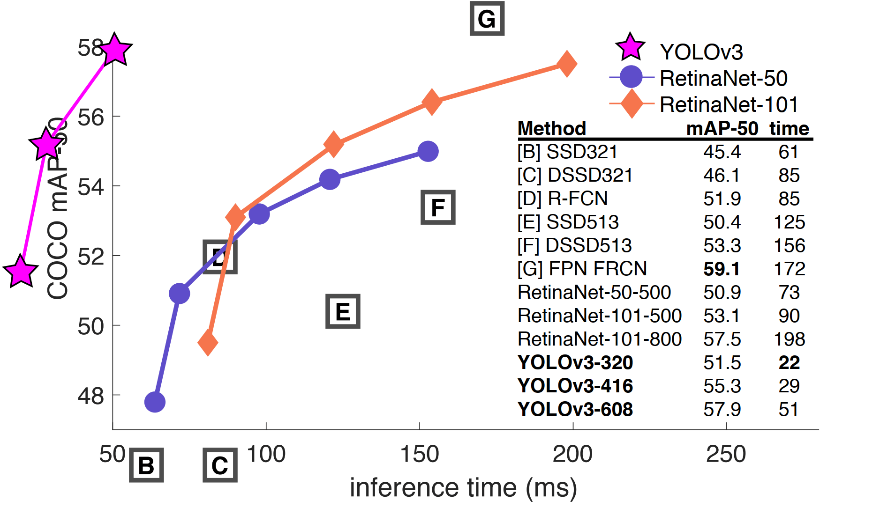

# YoloV3

[YOLOv3: An Incremental Improvement](https://arxiv.org/abs/1804.02767)

## Code Source
```
# ultralytics

link: https://github.com/ultralytics/yolov3/tree/v9.6.0
Tags: v9.6.0
commit: 7eb23e3c1d387cdcefbad266046af369a9f40399

# mmdet

link: https://github.com/open-mmlab/mmdetection/tree/v2.25.0
Tags: v2.25.0
commit: ca11860f4f3c3ca2ce8340e2686eeaec05b29111

# ppdet

link: https://github.com/PaddlePaddle/PaddleDetection
branch: release/2.6
commit: 03421ea460b1d449b6d903cc4b827bc7473ec332

# darknet
link: https://github.com/AlexeyAB/darknet
branch: master
commit: ed59050950b5a890a2a1d1c69547250c436a5968
```

## Model Arch

### pre-processing

yolov3系列的预处理主要是对输入图片利用`letterbox`算子进行resize，然后进行归一化

### post-processing

yolov3系列的后处理操作是利用anchor以及网络预测特征图进行box decode，然后进行nms操作

### backbone

yolov3网络backbone使用了darknet-53的前52层卷积结构，darknet-53网络的特点：

- 使用了大量残差的跳层连接，即表中的Residual块;
- darknet-53为了降低池化带来的梯度负面效果，直接摒弃了Pooling，使用步长为2的卷积来进行下采样

<div  align="center">

</div>

### head

yolov3系列网络head层利用FPN的结构，融合不同维度的特征，其中yolov3/yolov3-spp有三个输出头，分别对应8、16、32的stride，不同stride的输出预测不同尺寸的目标; yolov3-tiny有两个输出头，分别对应16、32的stride

训练时，yolov3在网格上生成相应的anchor框和其对应的cls以及conf。box loss采用了CIOU的方式来进行回归，conf以及cls loss使用BCEWithLogitsLoss

### common

- SPP
- letterbox

## Model Info

### 模型性能

| 模型  | 源码 | mAP@.5 | mAP@.5:.95 | flops(G) | params(M) | input size |
| :---: | :--: | :--: | :--: | :---: | :----: | :--------: |
| yolov3 |[yolov3](https://github.com/ultralytics/yolov3/tree/v9.5.0)|   58.7   |   42.5   |   156.3    |    61.9    |        640    |
| yolov3-spp |[yolov3](https://github.com/ultralytics/yolov3/tree/v9.5.0)|   59.6   |   43.3   |   157.1    |    63.0    |        640    |
| yolov3-tiny |[yolov3](https://github.com/ultralytics/yolov3/tree/v9.5.0)|   29.4  |   15.9   |   13.2    |    8.8    |        640    |
| yolov3 |[yolov3](https://github.com/ultralytics/yolov3/tree/v9.5.0)|   55.6   |   40.0   |   65.9    |    61.9    |        416    |
| yolov3-spp |[yolov3](https://github.com/ultralytics/yolov3/tree/v9.5.0)|   55.8   |   40.2   |   66.3   |    63.0    |        416    |
| yolov3-tiny |[yolov3](https://github.com/ultralytics/yolov3/tree/v9.5.0)|   28.0  |   15.6   |   5.6    |    8.8    |        416    |
| yolov3 |[yolov3](https://github.com/ultralytics/yolov3/tree/v9.5.0)|   52.1   |   36.9   |   39.0    |    61.9    |        320    |
| yolov3-spp |[yolov3](https://github.com/ultralytics/yolov3/tree/v9.5.0)|   51.8   |   36.8   |   39.2    |    63.0    |        320    |
| yolov3-tiny |[yolov3](https://github.com/ultralytics/yolov3/tree/v9.5.0)|   24.8  |   13.8   |   3.3    |    8.8    |        320    |
| yolov3 |[mmdet](https://github.com/open-mmlab/mmdetection/blob/v2.25.0/configs/yolo/README.md)|   -   |   27.9   |   19.55    |    61.95    |        320    |
| yolov3 |[mmdet](https://github.com/open-mmlab/mmdetection/blob/v2.25.0/configs/yolo/README.md)|   -   |   30.9   |   33.05    |    61.95    |        416    |
| yolov3 |[mmdet](https://github.com/open-mmlab/mmdetection/blob/v2.25.0/configs/yolo/README.md)|   -   |   33.7   |   70.59    |    61.95    |        608    |
| yolov3_fp16 |[mmdet](https://github.com/open-mmlab/mmdetection/blob/v2.25.0/configs/yolo/README.md)|   -   |   33.8   |   70.59    |    61.95    |        608    |
| yolov3_mobilenetv2 |[mmdet](https://github.com/open-mmlab/mmdetection/blob/v2.25.0/configs/yolo/README.md)|   -   |   22.2   |   1.69    |    3.74    |        320    |
| yolov3_mobilenetv2 |[mmdet](https://github.com/open-mmlab/mmdetection/blob/v2.25.0/configs/yolo/README.md)|   -   |   23.9   |   2.86    |    3.74    |        416    |
| yolov3_darknet53 |[ppdet](https://github.com/PaddlePaddle/PaddleDetection/blob/release%2F2.5/configs/yolov3/README.md)|   -   |   39.1   |   -    |    -    |        608    |
| yolov3_mobilenetv1 |[ppdet](https://github.com/PaddlePaddle/PaddleDetection/blob/release%2F2.5/configs/yolov3/README.md)|   -   |   29.4   |   -    |    -    |        608    |
| yolov3_mobilenetv1_ssld |[ppdet](https://github.com/PaddlePaddle/PaddleDetection/blob/release%2F2.5/configs/yolov3/README.md)|   -   |   31.0   |   -    |    -    |        608    |
| yolov3_mobilenetv3 |[ppdet](https://github.com/PaddlePaddle/PaddleDetection/blob/release%2F2.5/configs/yolov3/README.md)|   -   |   31.4   |   -    |    -    |        608    |
| yolov3_resnet34 |[ppdet](https://github.com/PaddlePaddle/PaddleDetection/blob/release%2F2.5/configs/yolov3/README.md)|   -   |   36.2   |   -    |    -    |        608    |
| yolov3 |[darknet](https://github.com/AlexeyAB/darknet)|   66.8   |   38.4   |   65.879 BFLOPS    |    49.84    |        416    |
| yolov3_spp |[darknet](https://github.com/AlexeyAB/darknet)|   70.1  |   43.2   |   141.531 BFLOPS    |    106.46    |        608    |
| yolov3_tiny |[darknet](https://github.com/AlexeyAB/darknet)|   19.8   |   9.7  |   5.571 BFLOPS    |    24.92    |        416    |

> Note: 数据来自官方模型性能参数。ppdet库精度所用参数设置为`nms_thresh=0.45; confidence_thresh=0.01`; darknet库精度所用参数设置`nms_thresh=0.5; confidence_thresh=0.001`; 其余为`nms_thresh=0.45; confidence_thresh=0.25`

### 测评数据集说明


[MS COCO](https://cocodataset.org/#download)的全称是Microsoft Common Objects in Context，是微软于2014年出资标注的Microsoft COCO数据集，与ImageNet竞赛一样，被视为是计算机视觉领域最受关注和最权威的比赛数据集之一。

COCO数据集支持目标检测、关键点检测、实力分割、全景分割与图像字幕任务。在图像检测任务中，COCO数据集提供了80个类别，验证集包含5000张图片，上表的结果即在该验证集下测试。

### 评价指标说明

- mAP: mean of Average Precision, 检测任务评价指标，多类别的AP的平均值；AP即平均精度，是Precision-Recall曲线下的面积
- mAP@.5: 即将IoU设为0.5时，计算每一类的所有图片的AP，然后所有类别求平均，即mAP
- mAP@.5:.95: 表示在不同IoU阈值（从0.5到0.95，步长0.05）上的平均mAP

## Build_In Deploy

- [ultralytics_deploy](./source_code/ultralytics_deploy.md)

## Tips
- YOLO系列模型中，官方在精度测试和性能测试时，设定了不同的conf和iou参数
- VACC在不同测试任务中，需要分别配置build yaml内的对应参数，分别进行build模型
- `precision mode：--confidence_threshold 0.001 --nms_threshold 0.65`
- `performance mode：--confidence_threshold 0.25 --nms_threshold 0.45`