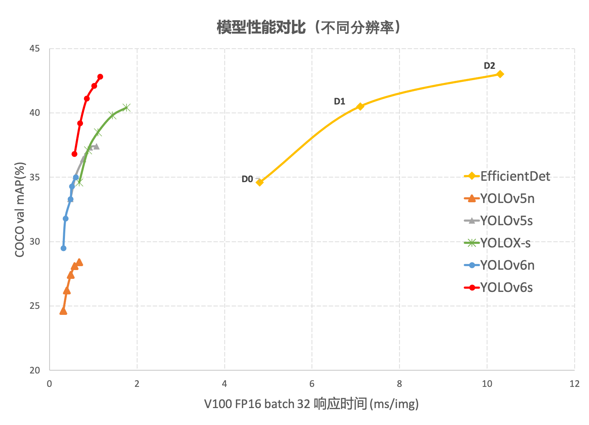
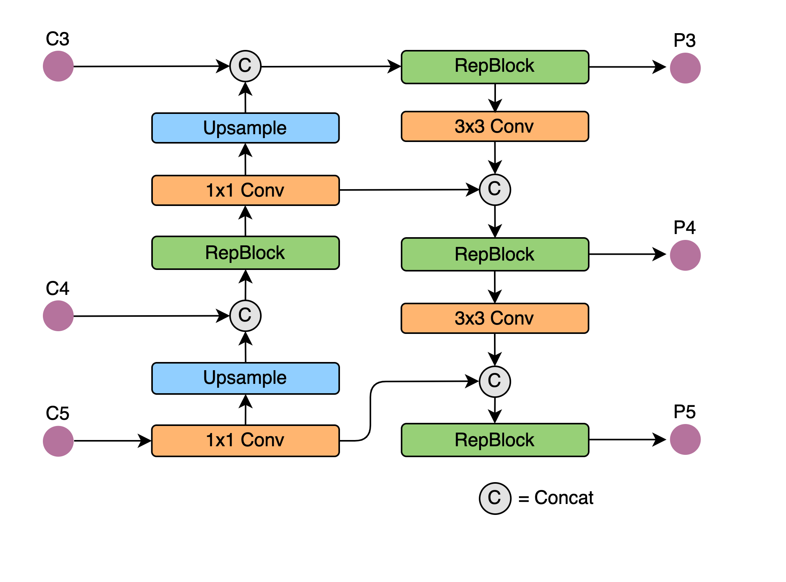
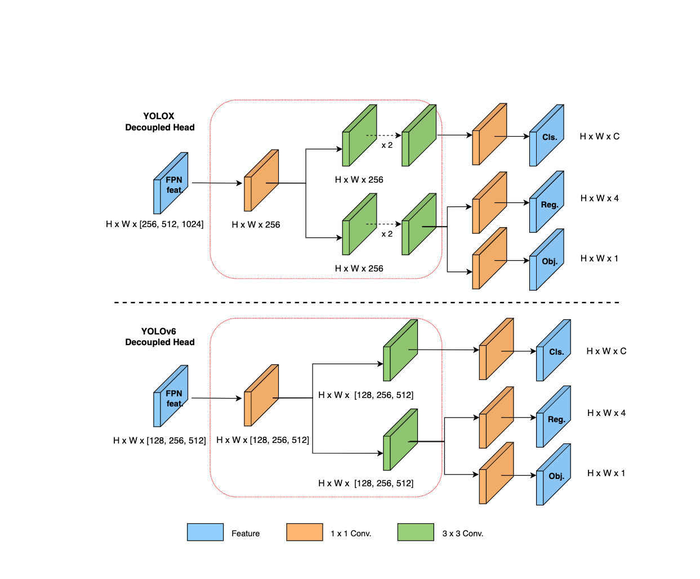

# YOLOv6

- [offical code](https://github.com/meituan/YOLOv6)

## Code Source
```
# official
link: https://github.com/meituan/YOLOv6
branch: main
commit: 07dd2561009c5e0affa767ecf0d612ea971cf101
```

## Model Arch

### pre-processing

`yolov6`系列的预处理主要是对输入图片利用`letterbox`算子进行resize，然后送入网络forward即可，该过程和`yolov5`一致

### post-processing

`yolov6`系列的后处理操作是利用网络预测特征图进行box decode，然后进行nms操作

### backbone

YOLOv6在BackBone、Neck以及训练策略等方面进行了诸多的改进：

- 设计了更高效的Backbone和Neck：受到硬件感知神经网络设计思想的启发，基于RepVGG style设计了可重参数化、更高效的骨干网络EfficientRep Backbone和Rep-PAN Neck。
- 在训练策略上，我们采用Anchor-free 无锚范式，同时辅以SimOTA标签分配策略以及SIoU边界框回归损失来进一步提高检测精度。

EfficientRep Backbone：在 Backbone 设计方面，基于Rep算子设计了一个高效的Backbone。相比于YOLOv5采用的CSP-Backbone，该Backbone能够高效利用硬件（如 GPU）算力的同时，还具有较强的表征能力。

下图为EfficientRep Backbone具体设计结构图，将Backbone中stride=2的普通Conv层替换成了stride=2的 RepConv层。同时，将原始的CSP-Block都重新设计为RepBlock，其中RepBlock的第一个RepConv会做channel维度的变换和对齐。另外，还将原始的SPPF优化设计为更加高效的SimSPPF。


Rep-PAN：在Neck设计方面，为了让其在硬件上推理更加高效，以达到更好的精度与速度的平衡，基于硬件感知神经网络设计思想，为YOLOv6设计了一个更有效的特征融合网络结构。

Rep-PAN基于PAN拓扑方式，用RepBlock替换了YOLOv5中使用的CSP-Block，同时对整体Neck中的算子进行了调整，目的是在硬件上达到高效推理的同时，保持较好的多尺度特征融合能力（Rep-PAN结构图如下图所示）



### head
在 YOLOv6 中，采用了解耦检测头（Decoupled Head）结构，并对其进行了精简设计。原始YOLOv5的检测头是通过分类和回归分支融合共享的方式来实现的，而YOLOX的检测头则是将分类和回归分支进行解耦，同时新增了两个额外的3x3的卷积层，虽然提升了检测精度，但一定程度上增加了网络延时。

因此，yolov6对解耦头进行了精简设计，同时综合考虑到相关算子表征能力和硬件上计算开销这两者的平衡，采用Hybrid Channels策略重新设计了一个更高效的解耦头结构，在维持精度的同时降低了延时，缓解了解耦头中3x3卷积带来的额外延时开销。通过在nano尺寸模型上进行消融实验，对比相同通道数的解耦头结构，精度提升0.2% AP的同时，速度提升6.8%



### common

- letterbox
- RepBlock
- Rep-PAN
- Decoupled Head
- SimSPPF

## Model Info

### 模型性能

| 模型  | 源码 | mAP@.5:.95 | flops(G) | params(M) | input size |
| :---: | :--:  | :--: | :---: | :----: | :--------: |
| yolov6-n |[official](https://github.com/meituan/YOLOv6)|   35.0   | 11.1 |    4.3    |    640    |
| yolov6-tiny |[official](https://github.com/meituan/YOLOv6)  |    41.3    | 36.7| 15.0 | 640 |
| yolov6-s |[official](https://github.com/meituan/YOLOv6)  |    43.1    | 44.2 | 17.2 | 640 |

> Note: 数据来自官方模型性能参数

### 测评数据集说明


[MS COCO](https://cocodataset.org/#download)的全称是Microsoft Common Objects in Context，是微软于2014年出资标注的Microsoft COCO数据集，与ImageNet竞赛一样，被视为是计算机视觉领域最受关注和最权威的比赛数据集之一。

COCO数据集支持目标检测、关键点检测、实例分割、全景分割与图像字幕任务。在图像检测任务中，COCO数据集提供了80个类别，验证集包含5000张图片，上表的结果即在该验证集下测试。

### 评价指标说明

- mAP: mean of Average Precision, 检测任务评价指标，多类别的AP的平均值；AP即平均精度，是Precision-Recall曲线下的面积
- mAP@.5: 即将IoU设为0.5时，计算每一类的所有图片的AP，然后所有类别求平均，即mAP
- mAP@.5:.95: 表示在不同IoU阈值（从0.5到0.95，步长0.05）上的平均mAP

## Build_In Deploy

### step.1 获取预训练模型
1. 将`yolov6/models/effidehead.py`中`Detect`类替换成如下代码

    <details><summary>点击查看代码细节</summary>

    ```python
    class Detect(nn.Module):
    '''Efficient Decoupled Head
    With hardware-aware degisn, the decoupled head is optimized with
    hybridchannels methods.
    '''
    def __init__(self, num_classes=80, anchors=1, num_layers=3, inplace=True, head_layers=None):  # detection layer
        super().__init__()
        assert head_layers is not None
        self.nc = num_classes  # number of classes
        self.no = num_classes + 5  # number of outputs per anchor
        self.nl = num_layers  # number of detection layers
        if isinstance(anchors, (list, tuple)):
            self.na = len(anchors[0]) // 2
        else:
            self.na = anchors
        self.anchors = anchors
        self.grid = [torch.zeros(1)] * num_layers
        self.prior_prob = 1e-2
        self.inplace = inplace
        stride = [8, 16, 32]  # strides computed during build
        self.stride = torch.tensor(stride)

        # Init decouple head
        self.cls_convs = nn.ModuleList()
        self.reg_convs = nn.ModuleList()
        self.cls_preds = nn.ModuleList()
        self.reg_preds = nn.ModuleList()
        self.obj_preds = nn.ModuleList()
        self.stems = nn.ModuleList()

        # Efficient decoupled head layers
        for i in range(num_layers):
            idx = i*6
            self.stems.append(head_layers[idx])
            self.cls_convs.append(head_layers[idx+1])
            self.reg_convs.append(head_layers[idx+2])
            self.cls_preds.append(head_layers[idx+3])
            self.reg_preds.append(head_layers[idx+4])
            self.obj_preds.append(head_layers[idx+5])

    def initialize_biases(self):
        for conv in self.cls_preds:
            b = conv.bias.view(self.na, -1)
            b.data.fill_(-math.log((1 - self.prior_prob) / self.prior_prob))
            conv.bias = torch.nn.Parameter(b.view(-1), requires_grad=True)
        for conv in self.obj_preds:
            b = conv.bias.view(self.na, -1)
            b.data.fill_(-math.log((1 - self.prior_prob) / self.prior_prob))
            conv.bias = torch.nn.Parameter(b.view(-1), requires_grad=True)

    def forward(self, x):
        z = []
        out = []
        for i in range(self.nl):
            x[i] = self.stems[i](x[i])
            cls_x = x[i]
            reg_x = x[i]
            cls_feat = self.cls_convs[i](cls_x)
            cls_output = self.cls_preds[i](cls_feat)
            reg_feat = self.reg_convs[i](reg_x)
            reg_output = self.reg_preds[i](reg_feat)
            obj_output = self.obj_preds[i](reg_feat)
            out.append([reg_output, obj_output, cls_output])
        return out[0][0], out[0][1], out[0][2], out[1][0], out[1][1], out[1][2], out[2][0], out[2][1], out[2][2]

    ```

    </details>

2. 执行`export`

    ```bash
    python deploy/ONNX/export_onnx.py --weights weights/yolov6s.pt
    ```
    - 注意这个export_onnx.py位于[export_onnx.py](https://github.com/meituan/YOLOv6/blob/main/deploy/ONNX/export_onnx.py6)


### step.2 准备数据集
- [校准数据集](http://images.cocodataset.org/zips/val2017.zip)
- [评估数据集](http://images.cocodataset.org/zips/val2017.zip)
- [gt: instances_val2017.json](http://images.cocodataset.org/annotations/annotations_trainval2017.zip)
- [label: coco.txt](../common/label/coco.txt)


## step.3 模型转换
1. 参考瀚博训推软件生态链文档，获取模型转换工具: [vamc v3.0+](../../../docs/vastai_software.md)

2. 根据具体模型，修改编译配置
    - [official_yolov6.yaml](./build_in/build/official_yolov6.yaml)

    > - runstream推理，编译参数`backend.type: tvm_vacc`
    > - fp16精度: 编译参数`backend.dtype: fp16`
    > - int8精度: 编译参数`backend.dtype: int8`，需要配置量化数据集和预处理算子

3. 模型编译

    ```bash
    cd yolov6
    mkdir workspace
    cd workspace
    vamc compile ../build_in/build/official_yolov6.yaml
    ```

### step.4 模型推理

1. 参考瀚博训推软件生态链文档，获取模型推理工具：[vaststreamx v2.8+](../../../docs/vastai_software.md)
2. runstream推理：[detection.py](./build_in/vsx/yolov6_detection.py)
    - 配置模型路径和测试数据路径等参数

    ```
    python ../build_in/vsx/yolov6_detection.py \
        --file_path path/to/det_coco_val \
        --model_prefix_path deploy_weights/official_yolov6_run_stream_fp16/mod \
        --vdsp_params_info ../build_in/vdsp_params/official-yolov6_n-vdsp_params.json \
        --label_txt path/to/coco.txt \
        --save_dir ./runstream_output \
        --device 0
    ```

    - 精度评估，参考：[eval_map.py](../common/eval/eval_map.py)
    ```bash
    python ../../common/eval/eval_map.py --gt path/to/instances_val2017.json --txt ./runstream_output
    ```

    <details><summary>点击查看精度测试结果</summary>
    
    ```
    # 模型名：yolov6_n-640

    # fp16
    DONE (t=3.05s).
    Average Precision  (AP) @[ IoU=0.50:0.95 | area=   all | maxDets=100 ] = 0.343
    Average Precision  (AP) @[ IoU=0.50      | area=   all | maxDets=100 ] = 0.519
    Average Precision  (AP) @[ IoU=0.75      | area=   all | maxDets=100 ] = 0.364
    Average Precision  (AP) @[ IoU=0.50:0.95 | area= small | maxDets=100 ] = 0.157
    Average Precision  (AP) @[ IoU=0.50:0.95 | area=medium | maxDets=100 ] = 0.375
    Average Precision  (AP) @[ IoU=0.50:0.95 | area= large | maxDets=100 ] = 0.480
    Average Recall     (AR) @[ IoU=0.50:0.95 | area=   all | maxDets=  1 ] = 0.288
    Average Recall     (AR) @[ IoU=0.50:0.95 | area=   all | maxDets= 10 ] = 0.456
    Average Recall     (AR) @[ IoU=0.50:0.95 | area=   all | maxDets=100 ] = 0.487
    Average Recall     (AR) @[ IoU=0.50:0.95 | area= small | maxDets=100 ] = 0.260
    Average Recall     (AR) @[ IoU=0.50:0.95 | area=medium | maxDets=100 ] = 0.533
    Average Recall     (AR) @[ IoU=0.50:0.95 | area= large | maxDets=100 ] = 0.658
    {'bbox_mAP': 0.343, 'bbox_mAP_50': 0.519, 'bbox_mAP_75': 0.364, 'bbox_mAP_s': 0.157, 'bbox_mAP_m': 0.375, 'bbox_mAP_l': 0.48, 'bbox_mAP_copypaste': '0.343 0.519 0.364 0.157 0.375 0.480'}

    # int8
    DONE (t=3.28s).
    Average Precision  (AP) @[ IoU=0.50:0.95 | area=   all | maxDets=100 ] = 0.288
    Average Precision  (AP) @[ IoU=0.50      | area=   all | maxDets=100 ] = 0.477
    Average Precision  (AP) @[ IoU=0.75      | area=   all | maxDets=100 ] = 0.300
    Average Precision  (AP) @[ IoU=0.50:0.95 | area= small | maxDets=100 ] = 0.119
    Average Precision  (AP) @[ IoU=0.50:0.95 | area=medium | maxDets=100 ] = 0.300
    Average Precision  (AP) @[ IoU=0.50:0.95 | area= large | maxDets=100 ] = 0.411
    Average Recall     (AR) @[ IoU=0.50:0.95 | area=   all | maxDets=  1 ] = 0.253
    Average Recall     (AR) @[ IoU=0.50:0.95 | area=   all | maxDets= 10 ] = 0.402
    Average Recall     (AR) @[ IoU=0.50:0.95 | area=   all | maxDets=100 ] = 0.434
    Average Recall     (AR) @[ IoU=0.50:0.95 | area= small | maxDets=100 ] = 0.220
    Average Recall     (AR) @[ IoU=0.50:0.95 | area=medium | maxDets=100 ] = 0.464
    Average Recall     (AR) @[ IoU=0.50:0.95 | area= large | maxDets=100 ] = 0.587
    {'bbox_mAP': 0.288, 'bbox_mAP_50': 0.477, 'bbox_mAP_75': 0.3, 'bbox_mAP_s': 0.119, 'bbox_mAP_m': 0.3, 'bbox_mAP_l': 0.411, 'bbox_mAP_copypaste': '0.288 0.477 0.300 0.119 0.300 0.411'}
    ```

    </details>

### step.5 性能精度
1. 参考瀚博训推软件生态链文档，获取模型性能测试工具：[vamp v2.4+](../../../docs/vastai_software.md)

2. 性能测试
    - 配置[official-yolov6_n-vdsp_params.json](./build_in/vdsp_params/official-yolov6_n-vdsp_params.json)
    ```bash
    vamp -m deploy_weights/official_yolov6_run_stream_fp16/mod --vdsp_params ../build_in/vdsp_params/official-yolov6_n-vdsp_params.json -i 1 p 1 -b 1 -d 0
    ```

3. 精度测试
    > **可选步骤**，通过vamp推理方式获得推理结果，然后解析及评估精度；与前文基于runstream脚本形式评估精度效果一致

    - 数据准备，基于[image2npz.py](../common/utils/image2npz.py)，将评估数据集转换为npz格式，生成对应的`npz_datalist.txt`
    ```bash
    python ../../common/utils/image2npz.py \
        --dataset_path path/to/coco_val2017 \
        --target_path  path/to/coco_val2017_npz \
        --text_path npz_datalist.txt
    ```

    - vamp推理获取npz结果输出
    ```bash
    vamp -m deploy_weights/official_yolov6_run_stream_fp16/mod \
        --vdsp_params ../build_in/vdsp_params/official-yolov6_n-vdsp_params.json \
        -i 1 p 1 -b 1 \
        --datalist datasets/coco_npz_datalist.txt \
        --path_output npz_output
    ```

    - 解析npz文件，参考：[npz_decode.py](../common/utils/npz_decode.py)
    ```bash
    python ../../common/utils/npz_decode.py \
        --txt result_npz --label_txt datasets/coco.txt \
        --input_image_dir datasets/coco_val2017 \
        --model_size 640 640 \
        --vamp_datalist_path datasets/coco_npz_datalist.txt \
        --vamp_output_dir npz_output
    ```

    - 精度统计，参考：[eval_map.py](../common/eval/eval_map.py)
    ```bash
    python ../../common/eval/eval_map.py \
        --gt path/to/instances_val2017.json \
        --txt path/to/vamp_draw_output
    ```

## Tips
- YOLO系列模型中，官方在精度测试和性能测试时，设定了不同的conf和iou参数
- VACC在不同测试任务中，需要分别配置build yaml内的对应参数，分别进行build模型
- `precision mode：--confidence_threshold 0.001 --nms_threshold 0.65`
- `performance mode：--confidence_threshold 0.25 --nms_threshold 0.45`