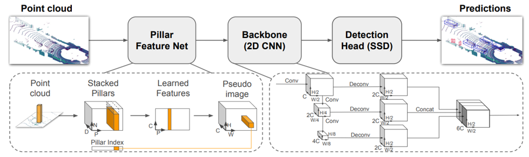
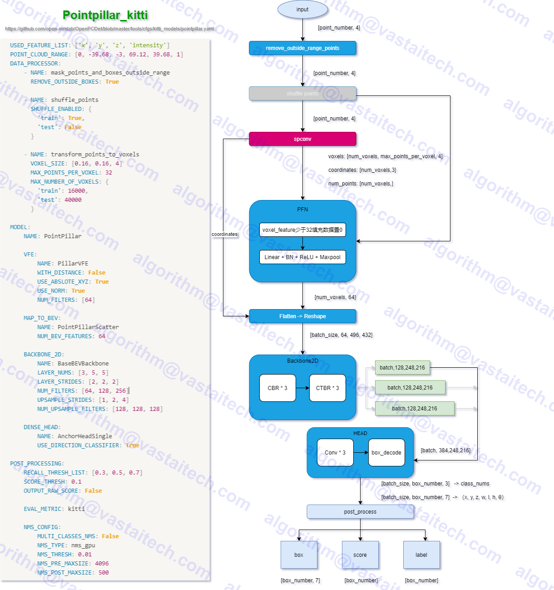
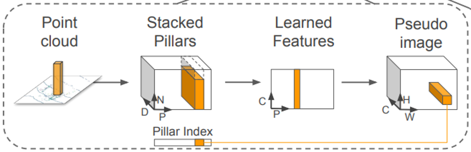
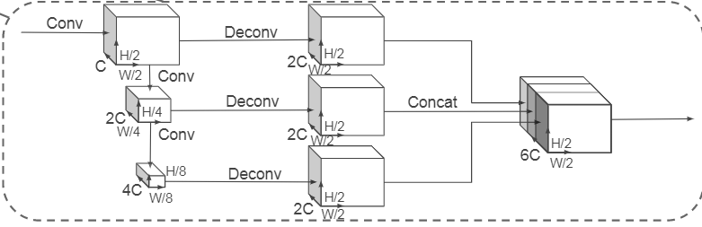

# PointPillars

- [PointPillars: Fast Encoders for Object Detection from Point Clouds](https://arxiv.org/abs/1812.05784)
- [official code](https://github.com/nutonomy/second.pytorch)

## Model Arch

### data flow

### pre-processing

1. 按照点云数据所在的X，Y轴（不考虑Z轴）将点云数据划分为**一个个的网格**，凡是落入到一个网格的点云数据被视为其处在**一个pillar**里，或者理解为它们构成了一个Pillar；
    - 每个点云用一个`D = 9` 维的向量表示，分别为`(x,y,z,r,x_c,y_c,z_c,x_p,y_p)`，其中`x,y,z,r`为该点云的 真实坐标信息（三维）和反射强度`r`（毫米波中可以是速度）；`x_c,y_c,z_c`为该点云所处Pillar中所有点的几何中心；`x_p,y_p`为`x - x_c,y- y_c`反应了该点与几何中心的相对位置；
    - 假设每个样本中有`P`（max 12000）个非空的pillars，每个pillars中有`N`（max 100）个点云数据，那么这个样本就可以用一个`(D,P,N)`张量表示，此处同VoxelNet中grouping 概念；
    - 如果每个pillar中的点云数据数据超过`N`个，那么我们就随机采样至`N`个；如果每个pillar中的点云数据数据少于`N`个，少于的部分我们就填充为0；
2. 实现张量化后，作者利用简化版本的PointNet对张量化的点云数据进行处理和**特征提取。**
    - 将点的维度使用**CBR**升维：`[9，P，N] → [64，P，N]`
3. 接着，我们按照Pillar所在维度进行**Max Pooling**操作，将每个pillar内的**点数压缩成1**，通过最大池化只取具有代表性的点即获得了`（C,P）`维度的特征图
4. 为了获得伪图片特征，作者将`P`转化为`（H,W）`，即`P→H*W`，至此就获得了形如`（C,H,W）`的伪图片了。

### backbone

伪图片作为2D CNN的输入，进一步提取图片的特征，从图中可以看出，该2D CNN采用了两个网络：
1. 一个网络**不断缩小特征图的分辨率**，同时提升特征图的维度，因此获得了**三个**不同分辨率的特征图
2. 另一个网络对三个特征图进行**上采样至相同大小**然后进行concatenation

### head

在本文中，作者使用 Single Shot Detector (SSD) 来设置来执行 3D 对象检测。与 SSD 类似，使用 2D 中的 IoU 将先验框与真实框进行匹配，根据类别设定不同大小和长宽比的anchor。计算anchor和gt的匹配程度（IOU）。大于阈值的被认为是positive，否则为negative。anchor生成这里默认每个区域预测**3个类别，每个类别2个anchor**。预测头的输出有三种数据：

- **类别预测**：[batch , 18 , H , W]，每个区域**6个anchor**，每个anchor的类别概率是一个**3维**度的数据，所以是**18**
- **框预测**：[batch , 42 , H , W]，每个框是7维的值，具体为：代表中心点的`xyz`，代表长宽高的`hwl`，旋转角`r`
- **方向预测**：由于框预测中的旋转角损失用了`sin`，所以无法区分正负朝向的框，所以使用`softmax`预测离散的旋转角（朝向）类别

### post-processing

此处对所有的预测结果进行了无类别的nms操作，得到了最终的预测结果，

在PointPillars的最终结果中，我们得到了特征图上的每个anchor和每个anchor预测7个回归参数、一个类别、一个方向分类这三个结果。其中7回归参数 (x, y, z, w, l, h, θ)；x, y,  z预测了目标中心点到该anchor左上顶点的偏移数值， w，l，h预测了基于该anchor长宽高的调整系数，θ预测了box的旋转角度、方向类别预测了box的朝向，两个方向关系如下(与雷达坐标系下的x轴偏差45度)
- `final_boxes: torch.Size([box_number, 7])`
- `final_scores: torch.Size([box_number])`
- `final_labels: torch.Size([box_number])`

### common
- transform_points_to_voxels (spconv)

## Deploy

- [OpenPCDet](./source_code/deploy.md)

