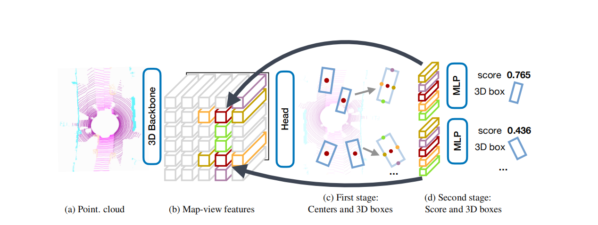
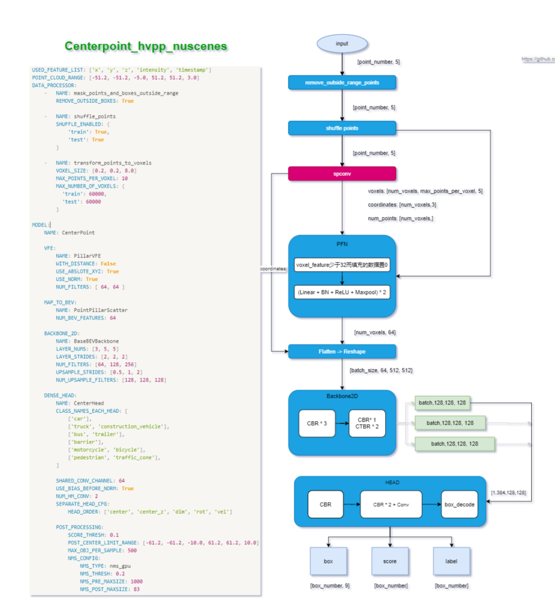
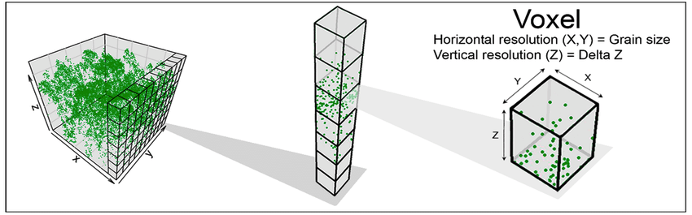
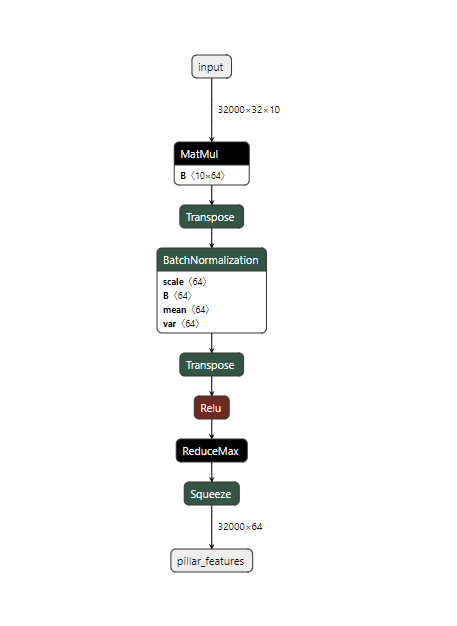
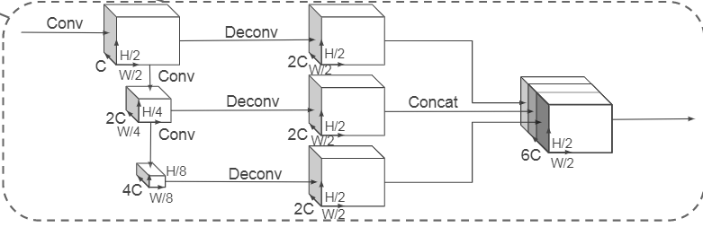
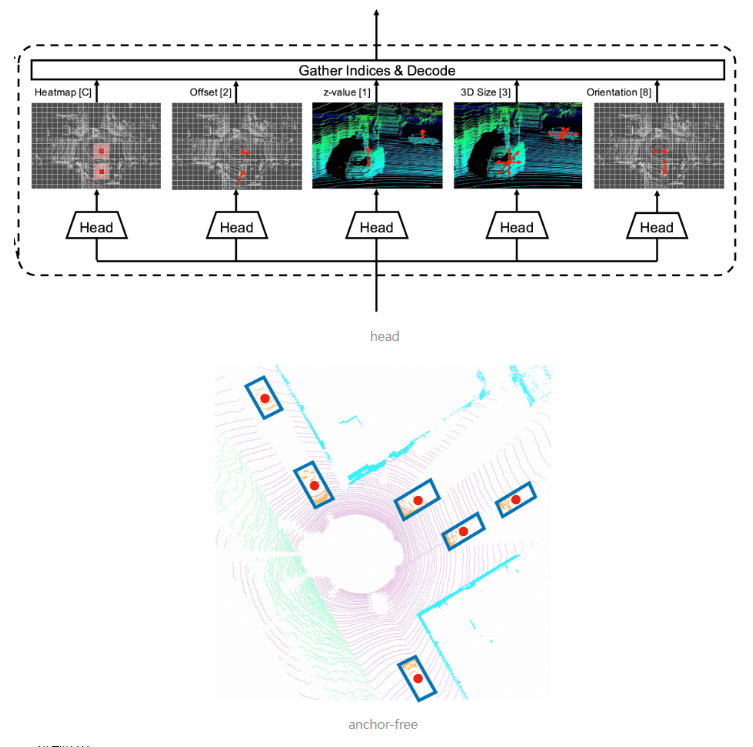

# CenterPoint

- paper: [CenterPoint: Center-based 3D Object Detection and Tracking](https://arxiv.org/abs/2006.11275)
- github: [open-mmlab/OpenPCDet](https://github.com/open-mmlab/OpenPCDet)(commit:8cacccec11db6f59bf6934600c9a175dae254806)

## Model Arch

### data flow

### pre-processing

1. 首先，需要对点云进行过滤处理，根据X，Y，Z轴的坐标范围，将点云数据限制在一个立方体中，并剔除掉超出这个立方体的点云数据。
2. 接着，对点云数据进行shuffle处理。
3. 然后，按照点云数据所在的X，Y轴，Z轴将点云数据划分为**一个个的体素voxel**，凡是落入到一个网格的点云数据被视为其处在**一个体素voxel**里，或者理解为它们构成了一个Voxel
    - 每个点云用一个`D = 10` 维的向量表示，分别为`(x,y,z,r,x_c,y_c,z_c,x_p,y_p,z_p)`，其中`x,y,z,r`为该点云的 真实坐标信息（三维）和反射强度`r`（毫米波中可以是速度）；`x_c,y_c,z_c`为该点云相当于所处Voxel中所有点的几何中心（该Voxel中所有点的坐标均值）的偏移量；`x_p,y_p,z_p`为该点与该Voxel的中心坐标（Voxel所在的三维框的中心）的相对位置；
    - 假设每个样本中有`P`（max 32000）个非空的Voxel，每个pillars中有`N`（max 32）个点云数据，那么这个样本就可以用一个`(P,N,D)`张量表示；
    - 如果每个pillar中的点云数据数据超过`N`个，就随机采样至`N`个；如果每个Voxel中的点云数据数据少于`N`个，少于的部分就填充为0；
4. 实现张量化后，使用PillarVFE来对Voxel做**特征提取**

    - 将点的维度使用**MLP**升维：`[P，N，10] → [P，N，64]`
    - 接着，按照Voxel所在维度进行**ReduceMax**操作，将每个Voxel内的**点数压缩成1**，只取具有代表性的点；再使用Squeeze操作，得到`（C,P）`维度的特征图（C代表特征图的Channle，这里就是指64）
5. 接着，使用MAP_TO_BEV的方法将VFE后的特征编码，投射到Bev视图中，从而获得伪图像，选择的方法为PointPillarScatter。
    - VFE输出的编码维度为[P,64]，PointPillarScatter会将`P`转化为`（H,W）`，即`P→H*W`，至此就获得了形如`（C,H,W）`的伪图片了。

### backbone

伪图片作为2D CNN的输入，进一步提取图片的特征，从图中可以看出，该2D CNN采用了两个网络：
1. 一个网络**不断缩小特征图的分辨率**，同时提升特征图的维度，因此获得了**三个**不同分辨率的特征图
2. 另一个网络对三个特征图进行**上采样至相同大小**然后进行concatenation

### head

在本文中，作者使用 CenterHead 来设置来执行 3D 对象检测。它采用anchor-free的预测方式，直接预测目标的center位置。每个不同的类别使用不同head进行预测。预测内容包括：
- 目标中心位置 heatmap
- 目标中心和所在像素左上角的偏移量 offset
- 目标的长宽高 dim
- 目标center在激光雷达坐标系中的高度坐标 z
- 目标在激光雷达坐标系中的旋转角 rot

### post-processing

### common
- transform_points_to_voxels (spconv)

## Deploy

- [openpcdet_customer_deploy](./source_code/openpcdet_customer_deploy.md)
    - 此模型使用私有数据训练。下采样参数为[2,2,2]，在VastAI硬件上性能更优
- [openpcdet_official_deploy](./source_code/openpcdet_official_deploy.md)
    - 此模型使用kitti数据集训练。下采样参数为[1,2,2]，在VastAI硬件上性能较差（主要用作与customer模型做比较）

