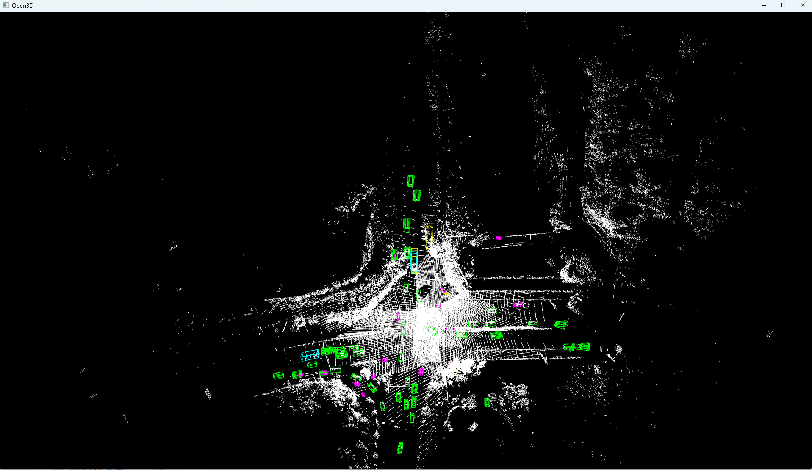

# self train center_point deploy

|                                     model                                     | Car AP@0.7, 0.5, 0.5 | Truck AP@0.7, 0.5, 0.5 | Van AP @0.7, 0.5, 0.5 | Cyclist AP@0.7, 0.5, 0.5 | Predestrian AP@0.7, 0.5, 0.5 |                                                      weight                                                       |
| :---------------------------------------------------------------------------: | :------------------: | :--------------------: | :-------------------: | :----------------------: | :--------------------------: | :---------------------------------------------------------------------------------------------------------------: |
| [center_point pytorch 3d](./config/model_centerpoint_pp_stride222_model.yaml) |       92.1700        |        86.4216         |        79.5659        |         80.9741          |           66.8830            | [centerpoint-epoch_120.pth](https://drive.google.com/drive/folders/1jAoosTnFXV-_R5fS3HMRZfQJZI2GeE8-?usp=sharing) |
|   [vacc runstream(int8) 3d](../vacc_code/build/customer_center_point.yaml)    |       89.3401        |        85.7809         |        79.1967        |         80.3146          |           65.4852            |                                                         /                                                         |

## 特别提示

- 本模型是私有数据训练的，没有使用公开数据集
- 本模型结构相较于原始模型，在2D CNN模型结构上有所修改
  - 具体来说，原版模型的下采样参数为[1,2,2]，本模型修改为[2,2,2]（在vastai卡上性能更优）
  - 具体修改：[model_centerpoint_pp_stride222_model.yaml](./config/model_centerpoint_pp_stride222_model.yaml)，LAYER_STRIDES: [2, 2, 2]
- 运行本实例需要准备三个环境
  - `OpenPCDet环境`：用于精度验证、导出合并onnx模型和pytorch推理。需要cuda的环境，建议单独准备一个cuda环境，避免和vacc环境冲突。精度测试一般把vacc测试结果拷贝到pcdet环境中去操作的

  - `VACC环境`：用于模型转换和在`瀚博VACC硬件`推理，参考`部署软件整包`中的VAMC文档安装

  - `桌面环境`：主要通过`open3d`包来展示点云和检测结果。请使用`pip install open3d`来安装`open3d`模块，并注意代码中有torch的依赖，可以安装cpu版本的torch

  - 需要在`OpenPCDet环境`和 `VACC环境`都下载本工程源码。并都在center_point/workspace目录下载好测试数据集和模型
- 后续文档的操作，都是基于center_point/workspace目录为工作目录。建议提前建好workspace目录

## step.1 安装OpenPCDet环境

- 安装OpenPCDet环境，需有CUDA环境机器，具体参考官方安装步骤：[docs/INSTALL.md](https://github.com/open-mmlab/OpenPCDet/blob/master/docs/INSTALL.md)
  ```bash
  git clone https://github.com/open-mmlab/OpenPCDet.git
  cd OpenPCDet
  git checkout 8caccce

  conda create -n openpcdet python=3.10
  conda activate openpcdet
  # pip3 install torch torchvision
  pip install torch==2.6.0 torchvision==0.21.0 torchaudio==2.6.0 --index-url https://download.pytorch.org/whl/cu124

  pip install spconv-cu124
  python setup.py develop

  # https://github.com/open-mmlab/OpenPCDet/issues/1583
  pip install setuptools==58 av2 kornia==0.5.8 onnxsim
  pip install -r requirements.txt
  ```

## step.2 源码修改和onnx导出

> 注意此操作在`OpenPCDet环境`下进行

- 为适配VACC和导出onnx文件，需进行适当修改源码，详见：[modify_detail.md](./modify_detail.md)
  > - 注意所有带"#export onnx"的注释，都代表该部分代码修改仅仅是为了在导出onnx模型时使用
  > - 导出onnx模型后，如果需要对原始的pth模型进行推理，需要把注释去掉，并还原回原来的代码，否则pth模型推理会出现错误

| weight                                                                                                            | tips                                  |
| :---------------------------------------------------------------------------------------------------------------- | :------------------------------------ |
| [centerpoint-epoch_120.pth](https://drive.google.com/drive/folders/1jAoosTnFXV-_R5fS3HMRZfQJZI2GeE8-?usp=sharing) | 详见前述`特别提示`，训练获得torch权重 |
| [centerpoint.onnx](https://drive.google.com/drive/folders/1jAoosTnFXV-_R5fS3HMRZfQJZI2GeE8-?usp=sharing)          | 最终onnx                              |

## step.3 准备数据集

1. custom数据集

- 校准数据集：[generate_qdata.py](./generate_qdata.py)

  > 已生成示例校准数据：[qdata](https://drive.google.com/drive/folders/1A3-58Fo5baR-z-l-K5G5G8FJ3tsnxqiu?usp=sharing)

  ```bash
  python generate_qdata.py \
  --kitti_data /path/to/custom_points/ \
  --save_path ./qdata \
  --quant_num 50 \
  --max_voxel_num 32000 \
  --voxel_size 0.32,0.32,4.2 \
  --coors_range -50,-103.6,-0.1,103.6,50,4.1
  ```

- 其它custom相关数据集，**暂不提供**

## step.4 模型转换

> 注意此操作在`VACC环境`中执行

1. 在`部署软件整包`中获取安装VAMC模型转换工具

2. 模型转换配置文件

   - [customer_center_point.yaml](../vacc_code/build/customer_center_point.yaml)
   - 由于硬件的限制，当前只支持int8量化模型，不支持fp16量化模型
   - 转换后将在当前目录下生成`deploy_weights/centerpoint_run_stream_int8`文件夹，其中包含转换后的模型文件

   ```bash
   cd center_point
   mkdir workspace
   cd workspace
   vamc compile ../vacc_code/build/customer_center_point.yaml
   ```

   > 此处告警`PointPillarScatterFunction`算子是正常的，此算子非onnx标准算子

## step.5 模型推理&评估

1. 参考[center_point_runstream.py](../vacc_code/vsx/center_point_runstream.py)，生成推理的txt结果

   ```bash
   python3  ../vacc_code/vsx/center_point_runstream.py \
       -m "[/path/to/centerpoint_run_stream_int8/mod]" \
       --elf_file /opt/vastai/vaststream/lib/op/ext_op/pointpillar_ext_op \
       --max_voxel_num [32000] \
       --voxel_size [0.32,0.32,4.2] \
       --coors_range [-50,-103.6,-0.1,103.6,50,4.1] \
       --backbone_input_shape 1,64,480,480 \
       --shuffle_enabled 1 \
       --normalize_enabled 1 \
       --max_points_num 12000000 \
       --dataset_root  /path/to/workspace/points \
       --dataset_output_folder runstream_output
   ```

2. 精度评估

   > 注意此操作在`OpenPCDet环境`中执行

   - 这里需要注意，这个时候要进入到pcdet的环境。并将vacc环境运行的runmodel_output文件夹拷贝到pcdet环境中的相同路径下
   - 需要先修改[model_centerpoint_pp_stride222_dataset.yaml](../source_code/config/model_centerpoint_pp_stride222_dataset.yaml)文件中的数据集路径DATA_PATH，其路径为/path/to/workspace。这里需要注意确保workspace下存在points/labels/ImageSets文件夹以及custom_infos_train.pkl、custom_infos_train.pkl、custom_dbinfos_train.pkl这几个文件
   - 评估测评：[eval.py](../source_code/eval.py)
     ```bash
     python ../source_code/eval.py \
         --dataset_yaml ../source_code/config/model_centerpoint_pp_stride222_dataset.yaml \
         --result_npz ./runstream_output/ \
         --class_names car,truck,bus,non_motor_vehicleslist,pedestrians
     ```

   <details>
    <summary><b>查看runstream_int8精度</b></summary>

   ```
   Car AP@0.70, 0.70, 0.70:
   bbox AP:93.7454, 93.7454, 93.7454
   bev  AP:87.6421, 87.6421, 87.6421
   3d   AP:76.8562, 76.8562, 76.8562
   aos  AP:63.09, 63.09, 63.09
   Car AP_R40@0.70, 0.70, 0.70:
   bbox AP:97.8350, 97.8350, 97.8350
   bev  AP:90.7754, 90.7754, 90.7754
   3d   AP:79.0229, 79.0229, 79.0229
   aos  AP:65.69, 65.69, 65.69
   Car AP@0.70, 0.50, 0.50:
   bbox AP:93.7454, 93.7454, 93.7454
   bev  AP:92.3291, 92.3291, 92.3291
   3d   AP:89.3962, 89.3962, 89.3962
   aos  AP:63.09, 63.09, 63.09
   Car AP_R40@0.70, 0.50, 0.50:
   bbox AP:97.8350, 97.8350, 97.8350
   bev  AP:94.8764, 94.8764, 94.8764
   3d   AP:93.2588, 93.2588, 93.2588
   aos  AP:65.69, 65.69, 65.69
   Truck AP@0.70, 0.70, 0.70:
   bbox AP:91.3323, 91.3323, 91.3323
   bev  AP:78.5879, 78.5879, 78.5879
   3d   AP:70.2170, 70.2170, 70.2170
   aos  AP:65.75, 65.75, 65.75
   Truck AP_R40@0.70, 0.70, 0.70:
   bbox AP:95.0396, 95.0396, 95.0396
   bev  AP:80.2640, 80.2640, 80.2640
   3d   AP:70.9894, 70.9894, 70.9894
   aos  AP:68.44, 68.44, 68.44
   Truck AP@0.50, 0.50, 0.50:
   bbox AP:91.3323, 91.3323, 91.3323
   bev  AP:86.1658, 86.1658, 86.1658
   3d   AP:85.2950, 85.2950, 85.2950
   aos  AP:65.75, 65.75, 65.75
   Truck AP_R40@0.50, 0.50, 0.50:
   bbox AP:95.0396, 95.0396, 95.0396
   bev  AP:88.2850, 88.2850, 88.2850
   3d   AP:86.9615, 86.9615, 86.9615
   aos  AP:68.44, 68.44, 68.44
   Van AP@0.70, 0.70, 0.70:
   bbox AP:78.9738, 78.9738, 78.9738
   bev  AP:75.1945, 75.1945, 75.1945
   3d   AP:74.3599, 74.3599, 74.3599
   aos  AP:72.34, 72.34, 72.34
   Van AP_R40@0.70, 0.70, 0.70:
   bbox AP:81.3134, 81.3134, 81.3134
   bev  AP:78.1690, 78.1690, 78.1690
   3d   AP:76.4143, 76.4143, 76.4143
   aos  AP:73.67, 73.67, 73.67
   Van AP@0.70, 0.50, 0.50:
   bbox AP:78.9738, 78.9738, 78.9738
   bev  AP:79.3860, 79.3860, 79.3860
   3d   AP:79.3860, 79.3860, 79.3860
   aos  AP:72.34, 72.34, 72.34
   Van AP_R40@0.70, 0.50, 0.50:
   bbox AP:81.3134, 81.3134, 81.3134
   bev  AP:79.8556, 79.8556, 79.8556
   3d   AP:79.8556, 79.8556, 79.8556
   aos  AP:73.67, 73.67, 73.67
   Cyclist AP@0.50, 0.50, 0.50:
   bbox AP:90.9672, 90.9672, 90.9672
   bev  AP:83.2429, 83.2429, 83.2429
   3d   AP:80.4308, 80.4308, 80.4308
   aos  AP:63.07, 63.07, 63.07
   Cyclist AP_R40@0.50, 0.50, 0.50:
   bbox AP:95.1574, 95.1574, 95.1574
   bev  AP:84.6731, 84.6731, 84.6731
   3d   AP:81.6080, 81.6080, 81.6080
   aos  AP:62.91, 62.91, 62.91
   Cyclist AP@0.50, 0.25, 0.25:
   bbox AP:90.9672, 90.9672, 90.9672
   bev  AP:87.2104, 87.2104, 87.2104
   3d   AP:87.1330, 87.1330, 87.1330
   aos  AP:63.07, 63.07, 63.07
   Cyclist AP_R40@0.50, 0.25, 0.25:
   bbox AP:95.1574, 95.1574, 95.1574
   bev  AP:89.7172, 89.7172, 89.7172
   3d   AP:89.5345, 89.5345, 89.5345
   aos  AP:62.91, 62.91, 62.91
   Pedestrian AP@0.50, 0.50, 0.50:
   bbox AP:84.9170, 84.9170, 84.9170
   bev  AP:69.0046, 69.0046, 69.0046
   3d   AP:65.4002, 65.4002, 65.4002
   aos  AP:68.03, 68.03, 68.03
   Pedestrian AP_R40@0.50, 0.50, 0.50:
   bbox AP:87.7778, 87.7778, 87.7778
   bev  AP:69.7219, 69.7219, 69.7219
   3d   AP:65.1948, 65.1948, 65.1948
   aos  AP:68.56, 68.56, 68.56
   Pedestrian AP@0.50, 0.25, 0.25:
   bbox AP:84.9170, 84.9170, 84.9170
   bev  AP:77.9583, 77.9583, 77.9583
   3d   AP:77.5113, 77.5113, 77.5113
   aos  AP:68.03, 68.03, 68.03
   Pedestrian AP_R40@0.50, 0.25, 0.25:
   bbox AP:87.7778, 87.7778, 87.7778
   bev  AP:79.0062, 79.0062, 79.0062
   3d   AP:78.4228, 78.4228, 78.4228
   aos  AP:68.56, 68.56, 68.56
   ```

   </details>

3. 可视化

   - 这里需要进入桌面环境，否则无法显示图片
     ```bash
     python ../source_code/visual/visual.py \
     --task box3d \
     --points_file /path/to/0_1.bin \
     --result_file path/to/runmodel_out/0_1.npz
     ```
     > points_file表示原始点云文件；result_file表示推理结果文件
   - 命令执行后按空格键即可看到点云和检测结果

## step.6 模型推理性能评估

1. 测试最大吞吐

   - 参考[center_point_prof.py](../vacc_code/vsx/center_point_prof.py)，测试最大吞吐

   ```bash
   python3 ../vacc_code/vsx/center_point_prof.py \
       -m "[/path/to/centerpoint_run_stream_int8/mod]" \
       --elf_file /opt/vastai/vaststream/lib/op/ext_op/pointpillar_ext_op \
       --max_voxel_num [32000] \
       --max_points_num 2000000 \
       --voxel_size [0.32,0.32,4.2] \
       --coors_range [-50,-103.6,-0.1,103.6,50,4.1] \
       --shuffle_enabled 1 \
       --normalize_enabled 1 \
       --device_ids [0] \
       --shape [40000] \
       --batch_size 1 \
       --instance 1 \
       --iterations 1500 \
       --input_host 1 \
       --queue_size 1
   ```

2. 测试最小时延

   - 参考[center_point_prof.py](../vacc_code/vsx/center_point_prof.py)，测试最小时延

   ```bash
   python3 ../vacc_code/vsx/center_point_prof.py \
       -m "[/path/to/centerpoint_run_stream_int8/mod]" \
       --elf_file /opt/vastai/vaststream/lib/op/ext_op/pointpillar_ext_op \
       --max_voxel_num [32000] \
       --max_points_num 2000000 \
       --voxel_size [0.32,0.32,4.2] \
       --coors_range [-50,-103.6,-0.1,103.6,50,4.1] \
       --shuffle_enabled 1 \
       --normalize_enabled 1 \
       --device_ids [0] \
       --shape [40000] \
       --batch_size 1 \
       --instance 1 \
       --iterations 1000 \
       --input_host 1 \
       --queue_size 0
   ```

## Appending

1. 如需对照原始pytorch测评

   > 注意此操作在`OpenPCDet环境`中执行

   - 需要把step.1中所有"#export onnx"的注释去掉，还原为之前的代码，然后执行以下命令进行推理。

   ```bash
   cd OpenPCDet/tools
   python test.py \
       --cfg_file /path/to/model_centerpoint_pp_stride222_model.yaml \
       --root_path /path/to/workspace \
       --batch_size 8 \
       --ckpt path/to/centerpoint-epoch_120.pth
   ```

2. 结果可视化
   

## Tips

1. 运行时backbone_input_shape参数计算公式

   ```
   伪图尺寸 = 点云各维度range / voxel_size(对应维度)
   伪图尺寸W = (103.6 - (-50)) / 0.32 * 2 = 480
   伪图尺寸H = (50 - (-103.6)) / 0.32 * 2 = 480
   ```

2. 由于点云数据预处理也使用dsp算子进行计算，所以对于最大voxel的数量有一定的限制，需要小于16M

   ```
   最大体素数(max_voxel_num) * 各体素最大点数(max_points_per_voxel) * 数据类型所占字节
   ```

3. 由于VACC部署center_point模型需要把bevfusion后的伪图放到SSRAM中。伪图所占用的空间限制需小于40M

   ```
   伪图宽 x 伪图高 x 通道数 x 数据类型所占字节
   ```
