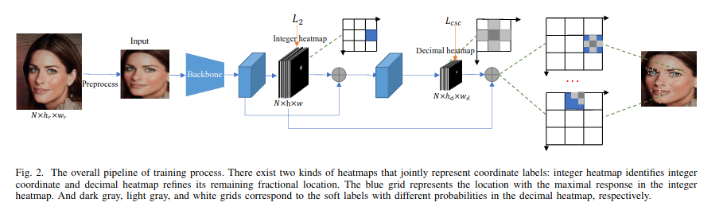

# HRNet-Face-Alignment

- [paper](https://arxiv.org/abs/2104.03100)
- [offical code](https://github.com/starhiking/HeatmapInHeatmap)


## Code Source
```
# official
link: https://github.com/starhiking/HeatmapInHeatmap
branch: main
commit: 7174ea28ebf5846d1406d06c665fc09f06630022
```

## Model Arch



### pre-processing

`HIH`模型的预处理主要是基于人脸检测模型检测到的人脸外扩1.25倍crop后resize至256尺寸，然后进行归一化减均值操作，送入网络forward，均值方差的设置如下

```python
mean = np.array([0.485, 0.456, 0.406], dtype=np.float32)
std = np.array([0.229, 0.224, 0.225], dtype=np.float32)
```

### post-processing

`HIH`模型的后处理操作是利用网络预测特征图进行decode即可

### backbone

`HIH`模型的backbone是Hourglass，为每个关键点生成热力图， 是典型的编码器解码器结构， 通过多种分辨率处理特征图， 以提高关键点检测的准确率。


### head

`HIH`模型的head部分有两个， 一个直接预测关键点坐标另外一个将转化为decimal的热图块预测landmark的偏移

### common
- Hourglass block
- Decimal heatmap


## Model Info

### 模型性能

| Models  | Code_Source | WFLW NME | WFLW FR | flops(G) | params(M) | Shape |
| :---: | :--: | :--: | :---: | :---: | :---: | :--------: |
|  hih_wflw_s    |  [official](https://github.com/starhiking/HeatmapInHeatmap)     |  0.0413   |  0.0263 | 10.38  | 14.47  |     256       | 
|  hih_wflw_b    |  [official](https://github.com/starhiking/HeatmapInHeatmap)     |  0.0408   |   - | 17.15  | 22.68  |     256       |


### 测评数据集说明

#### WFLW

- https://wywu.github.io/projects/LAB/WFLW.html


WFLW全称Wider Facial Landmark in the Wild，加入了不同的限制条件用以训练测试，包括姿势、表情、照明、化妆、遮挡和模糊等，其中7500张数据集图片用于训练，2500张图片用于测试。WFLW数据集对人脸共计标注了68个关键点，对应信息如下图


### 评价指标说明

- NME: Normalization Mean Error，是人脸关键点的常用评价指标，计算公式如下图


- IPN: Inter-pupil Normalization

- ION: Inter-Ocular Normalization，计算公式与IPN一致，如下图。其中d表示两眼中心间距离，归一化该因素是为了消除因脸部尺寸不统一带来的不合理变化，当然也可以用两外眼角间距离、人脸shape外接矩形对角线长度代替


- FR: Failure rate，mean error和单个点的误差、mean error>10%(5%) as a failure

## Build_In Deploy

- [official-deploy](./source_code/official_deploy.md)
