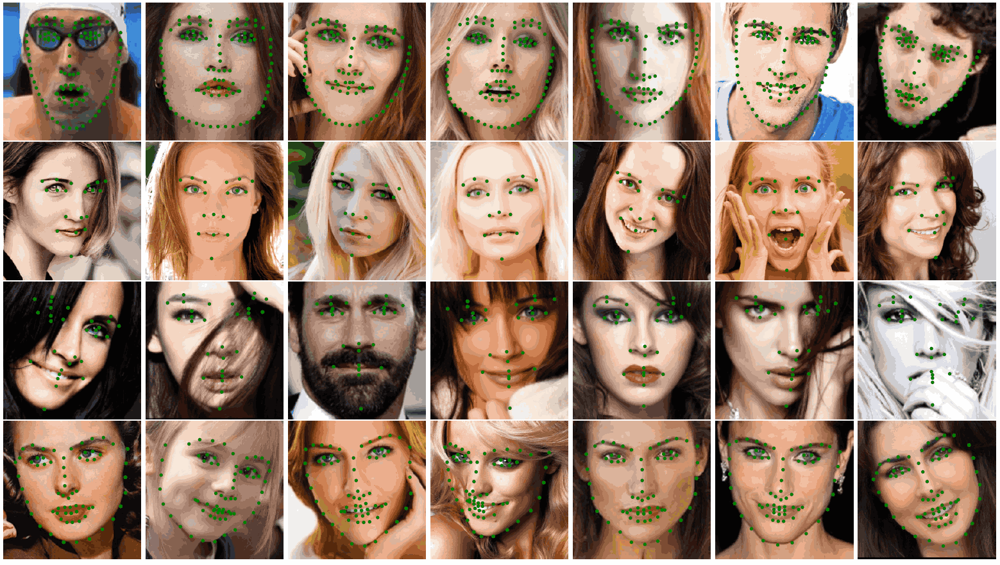
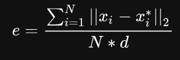

# HRNet-Face-Alignment

- [paper](https://arxiv.org/pdf/1908.07919.pdf)
- [offical code](https://github.com/HRNet/HRNet-Facial-Landmark-Detection)


## Code Source
```
# official
link: https://github.com/HRNet/HRNet-Facial-Landmark-Detection
branch: master
commit: f776dbe8eb6fec831774a47209dae5547ae2cda5
```

## Model Arch


### pre-processing

`HRNet-Face-Alignment`模型的预处理主要是基于人脸检测模型检测到的人脸外扩1.25倍crop后resize至256尺寸，然后进行归一化减均值操作，送入网络forward，均值方差的设置如下

```python
mean = np.array([0.485, 0.456, 0.406], dtype=np.float32)
std = np.array([0.229, 0.224, 0.225], dtype=np.float32)
```

### post-processing

`HRNet-Face-Alignment`模型的后处理操作是利用网络预测特征图进行decode即可

### backbone

`HRNet-Face-Alignment`模型的backbone是HRNet，是将不同分辨率的feature map进行并联，在并联的基础上添加不同分辨率feature map之间的融合，具体融合的方法可以分为4种：

- 同分辨率的层直接复制
- 需要升分辨率的使用bilinear upsample + 1x1卷积将channel数统一
- 需要降分辨率的使用stride为2的3x3 卷积
- 三个feature map融合的方式是相加

通过上述规则生成了一系列特征层的组合，face alignment算法是将所有分辨率的feature map(小的特征图进行upsample)进行concate，主要用于语义分割和面部关键点检测

### head

`HRNet-Face-Alignment`模型的head部分由2层卷积层组成，对上述融合特征进一步处理

### common
- hrnet block
- bilinear upsample


## Model Info

### 模型性能

#### COFW

The model is trained on COFW *train* and evaluated on COFW *test*.

| Model | NME | FR<sub>0.1</sub>|flops(G)|params(M)|
|:--:|:--:|:--:|:--:|:--:|
|HRNetV2-W18  | 3.45 | 0.20 | 10.433 | 9.644|


#### AFLW
The model is trained on AFLW *train* and evaluated on AFLW *full* and *frontal*.

| Model | NME<sub>*full*</sub> | NME<sub>*frontal*</sub> | flops(G)|params(M)|
|:--:|:--:|:--:|:--:|:--:|
|HRNetV2-W18 | 1.57 | 1.46 | 10.408|9.641 |

#### WFLW

| NME |  *test* | *pose* | *illumination* | *occlution* | *blur* | *makeup* | *expression* | flops(G)|params(M)|
|:--:|:--:|:--:|:--:|:--:|:--:|:--:|:--:|:--:|:--:|
|HRNetV2-W18 | 4.60 | 7.86 | 4.57 | 5.42 | 5.36 | 4.26 | 4.78 | 10.602 |9.663|


#### 300W

| NME | *common*| *challenge* | *full* | *test*| flops(G)|params(M)|
|:--:|:--:|:--:|:--:|:--:|:--:|:--:|
|HRNetV2-W18 | 2.91 | 5.11 | 3.34 | 3.85 | 10.529 | 9.654|


### 测评数据集说明

#### 300W

- https://ibug.doc.ic.ac.uk/resources/300-W/


300W数据集是一个非常通用的人脸对齐数据集。该数据集共计3148张训练集与689张测试集图片，每个图像上包含不止一张人脸，但是对于每张图像只标注一张人脸，每个人脸标注了68个关键点，目前在paper上分为两种归一化方法：Inter-pupil Normalisation(IPN) 和 Inter-ocular Normalisation(ION)，呈现三种指标：Common Subset(helen test 330 + lfpw test 224)，Challenging Subset(ibug 135)，Fullset(Common + Challenging = 689)

#### COFW

- https://data.caltech.edu/records/bc0bf-nc666

COFW全称Caltech Occluded Faces in the Wild，是一个基于真实世界条件下的人脸数据集。该数据集包含1,007张人脸，共1,852张图像，其中训练集1,345张图像，测试集507张图像。由于姿势、表情、太阳镜和帽子等配件的使用以及与物体的互动（如：食物、手、麦克风等）的不同，人脸在形状和遮挡方面表现出很大的变化。所有图像都使用了与LFPW数据集相同的29个landmark进行了手动标注。landmark位置以及它们的遮挡/不遮挡状态也都被标注了。

#### WFLW

- https://wywu.github.io/projects/LAB/WFLW.html


WFLW全称Wider Facial Landmark in the Wild，加入了不同的限制条件用以训练测试，包括姿势、表情、照明、化妆、遮挡和模糊等，其中7500张数据集图片用于训练，2500张图片用于测试。WFLW数据集对人脸共计标注了68个关键点，对应信息如下图


#### AFLW

- https://www.tugraz.at/institute/icg/research/team-bischof/lrs/downloads/aflw/

Annotated Facial Landmarks in the Wild（AFLW）提供了从网络收集的大量标注的面部图像，表现出各种各样的外观（例如姿势，表情，种族，年龄，性别）以及一般成像和环境条件。每张图片总共约25k张标注了最多21个landmarks

### 评价指标说明

- NME: Normalization Mean Error，是人脸关键点的常用评价指标，计算公式如下图



- IPN: Inter-pupil Normalization

- ION: Inter-Ocular Normalization，计算公式与IPN一致，如下图。其中d表示两眼中心间距离，归一化该因素是为了消除因脸部尺寸不统一带来的不合理变化，当然也可以用两外眼角间距离、人脸shape外接矩形对角线长度代替


- FR: Failure rate，mean error和单个点的误差、mean error>10%(5%) as a failure

## Build_In Deploy

- [official-deploy](./source_code/official-deploy.md)
