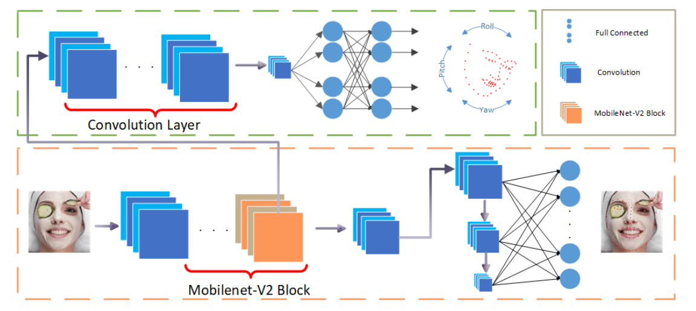

# PFLD

[PFLD: A Practical Facial Landmark Detector](https://arxiv.org/abs/1902.10859)

## Code Source
```
# pytorch
link: https://github.com/polarisZhao/PFLD-pytorch
branch: master
commit: b00750c37
```

## Model Arch

<div align=center></div>

### pre-processing

因输入数据是已经裁剪过后的图片， PFLD的预处理操作只有ToTensor操作

```python
img = cv2.imread(img_file)
transform = transforms.Compose([transforms.ToTensor()])
img = transforms(img)

```
### post-processing

模型直接预测98个关键点的x， y坐标， 再经过reshape之后与groundtruth的坐标对比计算NME等值。

### backbone

主干网络用来预测关键点，采用了Mobilenetv2 InvertedResidual模块。辅助网络用来预测人脸姿态， 使得关键点位置更加稳定和鲁棒性更好。

### head

PFLD网络的head层使multi-scale和全连接层扩展感受野， 直接定位人脸的特征点

### common
- InvertedResidual
- AuxiliaryNet

## Model Info

### 模型性能

| Models  | Code_Source | WFLW NME | WFLW FR | flops(G) | params(M) | Shape |
| :---: | :--: | :--: | :---: | :---: | :---: | :--------: |
|  pfld    |  [pytorch](https://github.com/polarisZhao/PFLD-pytorch)     |  0.0697   |   0.156 | 0.891  | 1.265  |     112       | 


### 测评数据集说明

<div align=center></div>

[Wider Facial Landmarks in-the-wild (WFLW)](https://wywu.github.io/projects/LAB/WFLW.html)是由清华大学和商汤推出的数据集，包含 10000 张面孔（7500 张用于训练，2500 张用于测试）和 98 个完全手动注释的人脸特征点。除了人脸特征点标注外，新数据集还包括丰富的属性标注，即遮挡、姿势、化妆、光照、模糊和表达，用于对现有算法进行综合分析。与之前的数据集相比，该数据集中的人脸在表情、姿势和遮挡方面有很大的变化，旨在帮助学界更有针对性的评估关键点算法在各种条件下的鲁棒性。


### 评价指标说明
人脸关键点的评价指标一般包含NME、FR、CED-AUC。

NME：Normalized Mean Error， 归一化平均误差。公式如下，d是数据集的归一化系数， N表示的是每张图片中关键点数量。

<div align=center></div>

FR： Failure Rate， 表示NME高于10%阈值的图像数量。指标值越低越好。

CED-AUC: Cumulative Error Distribution – Area Under Curve， 累计误差分布-曲线下面积。绘制出NME小于或等于X轴上NME值的图像的比例， 然后计算出曲线下的面积。通常，NME的范围是[0： 10%]。计算出的CED-AUC值在[0：1]范围内进行缩放。计量值越大越好。


## Build_In Deploy

### step.1 获取预训练模型
1. 使用repo提供的pytorch2onnx脚本得到onnx模型， 由于使用的torch版本是1.8， 源码参考[pytorch2onnx.py](./source_code/pytorch2onnx.py)

    ```bash
    cd PFLD-pytorch
    python pytorch2onnx.py
    ```

### step.2 准备数据集
- [校准数据集](https://wywu.github.io/projects/LAB/WFLW.html)
- [评估数据集](https://wywu.github.io/projects/LAB/WFLW.html)
    - 需要自己生成预处理后的数据，进入[工程](https://github.com/jhb86253817/PIPNet.git)，按如下步骤操作：
    ```bash
    cd lib
    python preprocess.py WFLW
    ```

### step.3 模型转换
1. 根据具体模型，修改编译配置
    - [official_pfld.yaml](./build_in/build/official_pfld.yaml)
    
    > - runstream推理，编译参数`backend.type: tvm_vacc`
    > - fp16精度: 编译参数`backend.dtype: fp16`
    > - int8精度: 编译参数`backend.dtype: int8`，需要配置量化数据集和预处理算子

2. 模型编译

    ```bash
    cd pfld
    mkdir workspace
    cd workspace
    vamc compile ./build_in/build/official_pfld.yaml
    ```

### step.4 模型推理
1. runstream
    - 参考：[vsx_infer.py](./build_in/vsx/python/vsx_infer.py)
    ```bash
    python ./build_in/vsx/python/vsx_infer.py \
        --data_dir  /path/to/face/wflw/keypoint/test_data/imgs  \
        --model_prefix_path deploy_weights/official_pfld_run_stream_fp16/mod \
        --vdsp_params_info ./build_in/vdsp_params/pytorch-pfld-vdsp_params.json \
        --gt /path/to/wflw/keypoint/test_data/list.txt \
        --save_dir ./runstream_output \
        --device 0
    ```

    ```
    # fp16
    nme: 0.0697
    auc @ 0.4 failureThreshold: 0.1000
    failure_rate: 0.15639999999999998

    # int8
    nme: 0.0713
    auc @ 0.4 failureThreshold: 0.1000
    failure_rate: 0.1632
    ```

### step.5 性能精度测试
1. 性能测试
    配置[pytorch-pfld-vdsp_params.json](./build_in/vdsp_params/pytorch-pfld-vdsp_params.json)
    ```bash
    vamp -m deploy_weights/official_pfld_run_stream_fp16/mod --vdsp_params ./build_in/vdsp_params/pytorch-pfld-vdsp_params.json -i 2 p 2 -b 2
    ```

2. 精度测试
    > **可选步骤**，通过vamp推理方式获得推理结果，然后解析及评估精度；与前文基于runstream脚本形式评估精度效果一致

    - 数据准备，基于[image2npz.py](../common/utils/image2npz.py)，将评估数据集转换为npz格式，生成对应的`npz_datalist.txt`
    
    ```bash
    python ../common/utils/image2npz.py \
        --dataset_path test_data \
        --target_path  path/to/vamp_test_data  \
        --text_path npz_datalist.txt
    ```

    - vamp推理获取npz结果
    ```bash
    vamp -m deploy_weights/official_pfld_run_stream_fp16/mod \
        --vdsp_params ./build_in/vdsp_params/pytorch-pfld-vdsp_params.json \
        -i 1 p 1 -b 1 \
        --datalist npz_datalist.txt \
        --path_output npz_output
    ```

    - 精度校验，[npz_decode.py](./source_code/npz_decode.py)
    ```bash
    python ./source_code/npz_decode.py  \
        --result vamp_out \
        --gt ../data/test_data/list.txt \
        -npz-txt npz_datalist.txt \
        --vamp-output npz_output
    ```


