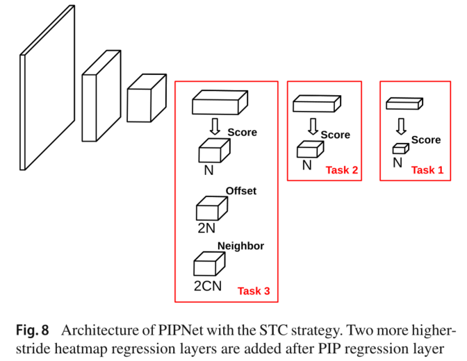

# FaceNet

[Pixel-in-Pixel Net: Towards Efficient Facial Landmark Detection in the Wild](https://arxiv.org/abs/2003.03771)

## Code Source
```
# pytorch
link: https://github.com/jhb86253817/PIPNet.git
branch: master
commit: b9eab5881643
```

## Model Arch

<div align=center></div>

### pre-processing

pipnet的预处理如下操作

```python
image = Image.open(image_file).convert('RGB')
image = image.resize((256, 256))
mean = [0.485,0.456,0.406]
std = [0.229,0.224,0.225]
img = np.ascontiguousarray(image)
img = img.astype(np.float32)
img /= 255
img -= np.array(mean)
img /= np.array(std)
img = img.transpose((2, 0, 1))
img = np.expand_dims(img, axis=0)
```

### backbone

主干网络用来提取特征， pipnet选用多个backbone， 包括resnet以及mobilenet系列。

### head


pipnet 回归基于热图， 首先获取每个关键点在热力图上最可能的点， 为了更准确的预测位置，pipnet在热力图x和y轴上预测偏移量。更进一步， 作者提出近邻回归模型（neighbor regression module，NRM）， 即除了预测偏移量，每个关键点还同时预测其C个近邻的偏移量

### post-processing
如上图所示pipnet输出有五个head， 包括预测关键点， 预测x和y偏移， 以及预测近邻模块的xy偏移量的head， 其中近邻点是平均脸型上用欧式距离计算得到，使用超参数C来控制每块区域预测近邻点数量， 最终预测结果是所有预测点结果取平均

### common
- NRM
- Multi-head

## Model Info

### 模型性能

| Models  | Code_Source | WFLW NME | WFLW FR | flops(G) | params(M) | Shape |
| :---: | :--: | :--: | :---: | :---: | :---: | :--------: |
|  pipnet_resnet18    |  [official](https://github.com/jhb86253817/PIPNet)     |  0.0457   |   - | 5.457  | 12.333  |     256       | 
|  pipnet_resnet101    |  [official](https://github.com/jhb86253817/PIPNet)     |  0.0431   |   - | 23.483  | 47.119  |     256       |
|  pipnet_mobilenet_v2    |  [official](https://github.com/jhb86253817/PIPNet)     |  0.0479   |   - | 1.357  | 5.111  |     256       |
|  pipnet_mobilenet_v3    |  [official](https://github.com/jhb86253817/PIPNet)     |  0.0465   |   - | 0.981  | 5.138  |     256       |

### 测评数据集说明

<div align=center></div>

[Wider Facial Landmarks in-the-wild (WFLW)](https://wywu.github.io/projects/LAB/WFLW.html)是由清华大学和商汤推出的数据集，包含 10000 张面孔（7500 张用于训练，2500 张用于测试）和 98 个完全手动注释的人脸特征点。除了人脸特征点标注外，新数据集还包括丰富的属性标注，即遮挡、姿势、化妆、光照、模糊和表达，用于对现有算法进行综合分析。与之前的数据集相比，该数据集中的人脸在表情、姿势和遮挡方面有很大的变化，旨在帮助学界更有针对性的评估关键点算法在各种条件下的鲁棒性。


### 评价指标说明
人脸关键点的评价指标一般包含NME、FR、CED-AUC。

NME：Normalized Mean Error， 归一化平均误差。公式如下，d是数据集的归一化系数， N表示的是每张图片中关键点数量。

<div align=center></div>

FR： Failure Rate， 表示NME高于10%阈值的图像数量。指标值越低越好。

CED-AUC: Cumulative Error Distribution – Area Under Curve， 累计误差分布-曲线下面积。绘制出NME小于或等于X轴上NME值的图像的比例， 然后计算出曲线下的面积。通常，NME的范围是[0： 10%]。计算出的CED-AUC值在[0：1]范围内进行缩放。计量值越大越好。


## Build_In Deploy

### step.1 模型准备
1. 导出onnx模型。将源repo中的`demo.py`替换成source_code中相应的脚本[demo.py](./source_code/demo.py)， 执行下面的命令
    ```bash
    cd PIPNET
    sh run_demo.sh
    ```

### step.2 准备数据集
- [校准数据集](https://wywu.github.io/projects/LAB/WFLW.html)
- [测试数据集](https://wywu.github.io/projects/LAB/WFLW.html)
    - 需要自己生成预处理后的数据，进入[官方工程](https://github.com/jhb86253817/PIPNet.git)，按如下步骤操作：
    ```bash
    cd lib
    python preprocess.py WFLW
    ```

### step.3 模型转换

1. 根据具体模型，修改编译配置
    - [official_pipnet.yaml](./build_in/build/official_pipnet.yaml)
    
    > - runstream推理，编译参数`backend.type: tvm_vacc`
    > - fp16精度: 编译参数`backend.dtype: fp16`
    > - int8精度: 编译参数`backend.dtype: int8`，需要配置量化数据集和预处理算子

2. 模型编译

    ```bash
    cd pipnet
    mkdir workspace
    cd workspace
    vamc compile ./build_in/build/official_pipnet.yaml
    ```

### step.4 模型推理

1. runstream
    - 参考：[vsx_infer.py](./build_in/vsx/python/vsx_infer.py)
    ```bash
    python ./build_in/vsx/python/vsx_infer.py \
        --data_dir  /path/to/face/face_alignment/wflw/WFLW \
        --model_prefix_path deploy_weights/official_pipnet_run_stream_fp16/mod \
        --vdsp_params_info ./build_in/vdsp_params/official-pip_resnet18-vdsp_params.json \
        --save_dir runstream_output \
        --meanface_txt ./source_code/meanface.txt \
        --device 0
    ```

    ```
    # fp16
    nme: 0.04529910186405488
    fr: 0.04239999999999999
    auc: 0.5748485333333333

    # int8
    nme: 0.04534812201653364
    fr: 0.04279999999999995
    auc: 0.5741772
    ```


### step.5 性能测试
1. 性能测试
    - 配置[official-pip_resnet18-vdsp_params.json](./build_in/vdsp_params/official-pip_resnet18-vdsp_params.json)
    ```bash
    vamp -m deploy_weights/official_pipnet_run_stream_int8/mod --vdsp_params ./build_in/vdsp_params/official-pip_resnet18-vdsp_params.json -i 2 p 2 -b 2
    ```

2. 精度测试
    > **可选步骤**，通过vamp推理方式获得推理结果，然后解析及评估精度；与前文基于runstream脚本形式评估精度效果一致

    - 数据准备，基于[image2npz.py](../common/utils/image2npz.py)，将评估数据集转换为npz格式，生成对应的`npz_datalist.txt`
    ```bash
    python ../common/utils/image2npz.py --dataset_path data/WFLW/images_test --target_path  path/to/vamp_test_data  --text_path npz_datalist.txt
    ```

    - vamp推理获取npz结果
    ```bash
    vamp -m deploy_weights/official_pipnet_run_stream_int8/mod \
        --vdsp_params ./build_in/vdsp_params/official-pip_resnet18-vdsp_params.json \
        -i 1 p 1 -b 1 \
        --datalist npz_datalist.txt --path_output npz_output
    ```

    - 解析vamp输出的npz文件，并得到精度结果，参考：[npz_decode.py](../common/eval/npz_decode.py)
    ```bash
    python ../common/eval/npz_decode.py  -input_npz_path npz_datalist.txt \
        --out_npz_dir outputs/ \
        --input_shape 256 256 \
        --vamp_flag
    ```
