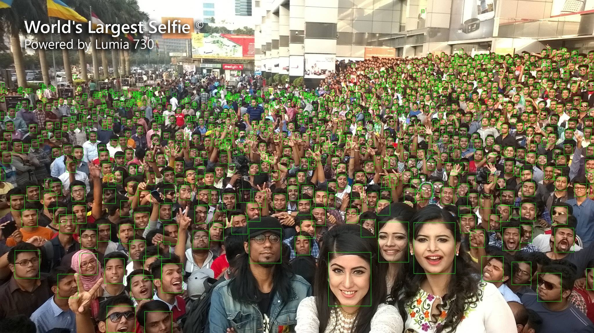
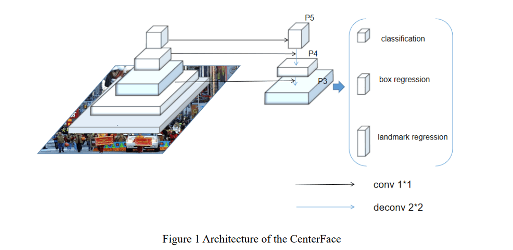

# CenterFace

[CenterFace: Joint Face Detection and Alignment Using Face as Point](https://arxiv.org/abs/1911.03599)

## Model Arch

### pre-processing

centerface人脸检测算法无需任何预处理操作，只需传入图片即可，原则上可以支持任意尺度输入图片（BGR）

### post-processing

centerface算法的输出包括heatmap(用于判断人脸置信度)、中心点偏移、宽高偏移量以及landmarks输出。得到这些输出后，就可以根据heatmap的输出，选择大于一定阈值的坐标点(即判断当前坐标点存在人脸)，然后再根据选择的坐标点取对应的中心点偏移、宽高偏移量以及landmarks输出进一步decode出box以及landmark，最后再经过nms操作即为算法最终输出

### backbone

Centerface网络整体结构采用MobileNetV2结构，MobileNetV2进行了5次下采样，特征提取部分变为输入的1/32

### head

CenterFace在MobileNetV2的最后一层，利用ConvTranspose算子增加了3个上采样层，并进行FPN特征融合，最终输出维度为原图的1/4，网络最终由四个分支输出，包括heatmap(用于判断人脸置信度)、中心点偏移、宽高偏移量以及landmarks输出

### common

- ConvTranspose
- MobileNetV2

## Model Info

### 模型性能

| 模型  | 源码 | easy | medium | hard | input size |
| :---: | :--: | :--: | :--: | :---: | :--------: |
|   centerface-ori    |  [onnx](https://github.com/Star-Clouds/CenterFace)    | 93.5%   | 92.4%     |   87.5%  |         640       | 
|   centerface-vacc-int8    |  [onnx](https://github.com/Star-Clouds/CenterFace)   | 90.3%   |  86.8%     |   56.6%  |         640       | 

### 测评数据集说明

Wider Face数据集最早是在2015年公开的，该数据集的图片来源是WIDER数据集，从中挑选出了32,203图片并进行了人脸标注，总共标注了393,703个人脸数据，并且对于每张人脸都附带有更加详细的信息，包扩blur(模糊程度)、expression(表情), illumination(光照), occlusion(遮挡), pose(姿态)。

widerface数据集根据事件场景的类型分为了61个类，接着根据每个类别按照40%、10%、50%的比例划分到训练集、验证集以及测试集中，该项目下face detection算法所用到的测评数据集就是来自于widerface数据集中的验证集。同样地，不同事件通常对应着不同的场景，涵盖现实场景中的大量场景。为了评估事件对人脸检测的影响，用三个因素对每个事件进行描述：尺度、遮挡和姿态。对于每个因素，我们计算特定事件类型的检测率，然后进行排序，将事件分成三部分：easy、medium、hard。

### 评价指标说明

人脸检测任务的评价指标和通用目标检测任务一样，也是用mAP来衡量算法模型的性能优劣。基于widerface数据集，分别对easy、medium、hard三个类别分别统计mAP。

- mAP: mean of Average Precision, 检测任务评价指标，多类别的AP的平均值；AP即平均精度，是Precision-Recall曲线下的面积

## Build_In Deploy

- [star_clouds_deploy](./source_code/star_clouds_deploy.md)