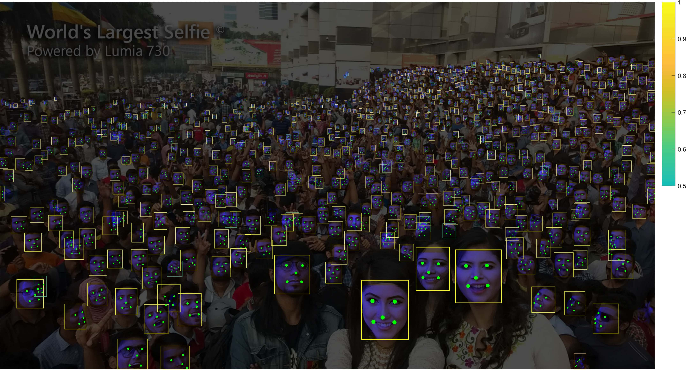

# RetinaFace

[RetinaFace: Single-stage Dense Face Localisation in the Wild](https://arxiv.org/abs/1905.00641)

## Code Source

```
link: https://github.com/biubug6/Pytorch_Retinaface
branch: master
commit: b984b4b775b2c4dced95c1eadd195a5c7d32a60b
```

## Model Arch

<div  align="center">

</div>

### pre-processing

retinaface的预处理比较简单，原则上可以支持任意尺度输入图片（BGR），预处理只需要减均值即可

> 均值: (104, 117, 123)

### post-processing

retinaface算法的输出有三部分，包括landmark输出、bbox输出以及置信度输出。得到这三个输出后，需要根据anchor信息以及bbox输出decode出输入图片中的预测框，然后选择置信度大于设定值的预测框以及landmark，同时对选择的预测框做nms后处理即可。

### backbone

retinaface系列包括基于ResNet50版本能提供更好的精度，以及基于mobilenet(0.25)的轻量版本mnet，检测速度更快。对应地，backbone也分为了resnet50以及mobilenet-0.25两种结构，分别在尺度缩放8、16、32倍特征层生成3个不同尺度上的检测框，每个尺度上又引入了不同尺寸的anchor大小，保证可以检测到不同大小的物体。

### head

retinaface使用了SSH检测网络的检测模块(SSH detection module)，SSH检测模块由SSH上下文模块(SSH context module)组成。同时，在使用SSH检测模块的同时实现了多任务学习，即在分类和回归的基础上加入了关键点的回归。

### common

- SSH context module

<div  align="center">

</div>

## Model Info

### 模型性能

| 模型  | 源码 | easy | medium | hard | flops | params | input size |
| :---: | :--: | :--: | :--: | :---: | :---: | :----: | :--------: |
|   retinaface-resnet50    |  [pytorch](https://github.com/biubug6/Pytorch_Retinaface)    | 87.07%   |  74.33%     |   34.31%  |    11.117G    |   27.294M    |     320       | 
|   retinaface-resnet50    |  [pytorch](https://github.com/biubug6/Pytorch_Retinaface)   | 90.79%   |  83.27%     |   44.97%  |    18.787G    |   27.294M    |     416       | 
|   retinaface-resnet50    |  [pytorch](https://github.com/biubug6/Pytorch_Retinaface)   | 92.92%   |  87.67%     |   54.94%  |  28.459G      |    27.294M   |     512       | 
|   retinaface-resnet50    |  [pytorch](https://github.com/biubug6/Pytorch_Retinaface)   | 94.02%   |  90.07%     |   63.63%  |  40.131G      |   27.294M    |     608       | 
|   retinaface-resnet50    |  [pytorch](https://github.com/biubug6/Pytorch_Retinaface)   | 94.33%   |  90.90%     |   66.40%  |  44.466G       |  27.294M     |     640       | 
|   retinaface-mobilenet0.25    |[pytorch](https://github.com/biubug6/Pytorch_Retinaface)     |  76.38%     |  61.15%      |  27.25%   |  254.330M      |  426.608K     |     320       | 
|   retinaface-mobilenet0.25    | [pytorch](https://github.com/biubug6/Pytorch_Retinaface)    |  83.00%     |  72.31%      |  36.11%   |  429.817M      |  426.608K     |     416       | 
|   retinaface-mobilenet0.25    | [pytorch](https://github.com/biubug6/Pytorch_Retinaface)    |  86.41%     |  78.27%      |  44.29%   |  651.084M      |  426.608K     |     512       | 
|   retinaface-mobilenet0.25    | [pytorch](https://github.com/biubug6/Pytorch_Retinaface)    |  88.55%     |  81.88%      |  51.97%   |  918.130M      |  426.608K     |     608       | 
|   retinaface-mobilenet0.25    | [pytorch](https://github.com/biubug6/Pytorch_Retinaface)    |  89.10%     |   83.03%     |  54.37%   |  1.017G      |  426.608K     |     640       | 

### 测评数据集说明

<div align=center></div>

Wider Face数据集最早是在2015年公开的，该数据集的图片来源是WIDER数据集，从中挑选出了32,203图片并进行了人脸标注，总共标注了393,703个人脸数据，并且对于每张人脸都附带有更加详细的信息，包扩blur(模糊程度)、expression(表情), illumination(光照), occlusion(遮挡), pose(姿态)。

widerface数据集根据事件场景的类型分为了61个类，接着根据每个类别按照40%、10%、50%的比例划分到训练集、验证集以及测试集中，该项目下face detection算法所用到的测评数据集就是来自于widerface数据集中的验证集。同样地，不同事件通常对应着不同的场景，涵盖现实场景中的大量场景。为了评估事件对人脸检测的影响，用三个因素对每个事件进行描述：尺度、遮挡和姿态。对于每个因素，我们计算特定事件类型的检测率，然后进行排序，将事件分成三部分：easy、medium、hard。

### 评价指标说明

人脸检测任务的评价指标和通用目标检测任务一样，也是用mAP来衡量算法模型的性能优劣。基于widerface数据集，分别对easy、medium、hard三个类别分别统计mAP。

- mAP: mean of Average Precision, 检测任务评价指标，多类别的AP的平均值；AP即平均精度，是Precision-Recall曲线下的面积

## Build_In Deploy

### step.1 模型准备

基于[脚本](./source_code/export.py)可以实现模型转换至torchscript与onnx格式，转换时可以指定模型路径以及shape列表，运行命令如下：

```
cd source_code
python export.py --model_name Resnet50/mobilenet0.25 --weight_path /path/to/Resnet50_Final.pth --size 640 512 320
```

- model_name: 模型列表，可选['mobilenet0.25', 'Resnet50']
- weight_path: 对应模型路径
- size: 模型shape，可以指定单个shape，也可指定多个shape进行转换

### step.2 准备数据集
- [校准数据集](https://huggingface.co/datasets/wider_face/blob/main/data/WIDER_val.zip)
- [评估数据集](https://huggingface.co/datasets/wider_face/blob/main/data/WIDER_val.zip)


### step.3 模型转换
1. 根据具体模型,修改编译配置文件
    - [official_retinaface.yaml](./build_in/build/official_retinaface.yaml)
    
    > - runstream推理，编译参数`backend.type: tvm_vacc`
    > - fp16精度: 编译参数`backend.dtype: fp16`
    > - int8精度: 编译参数`backend.dtype: int8`，需要配置量化数据集和预处理算子

2. 模型编译
    - 注意需要先替换yaml文件中校正集数据的路径
    ```bash
    mkdir workspace
    cd workspace
    vamc compile ./build_in/build/official_retinaface.yaml
    ```
    - 转换后将在当前目录下生成`deploy_weights/official_retinaface_run_stream_int8`文件夹，其中包含转换后的模型文件。

### step.4 模型推理
1. 参考[vsx脚本](./build_in/vsx/python/vsx.py)，修改参数并运行如下脚本
    ```bash
    python ./build_in/vsx/python/vsx.py \
        --file_path  /path/to/widerface/val/ \
        --model_prefix_path deploy_weights/official_retinaface_run_stream_int8/mod \
        --vdsp_params_info ./build_in/vdsp_params/official-retinaface_resnet50-vdsp_params.json \
        --save_dir ./runstream_output \
        --device 0
    ```
    - 注意替换命令行中--file_path为实际路径

2. [evaluation.py](../common/eval/evaluation.py)，精度统计，指定gt路径和上步骤中的txt保存路径，即可获得精度指标
    - 注意需要先执行以下命令安装依赖库
    ```
    cd ../common/eval/;
    python3 setup.py build_ext --inplace;
    ```
    - 然后切换到之前的workspace目录进行精度验证
    ```bash
    python ../common/eval/evaluation.py -p runmodel_output/ -g ../common/eval/ground_truth
    ```
    - 测试精度如下：
    ```
    ==================== Results ====================
    Easy   Val AP: 0.9415239245904868
    Medium Val AP: 0.9023174850313685
    Hard   Val AP: 0.6169884188781706
    =================================================

    ```

### step.5 性能精度测试
1. 基于[image2npz.py](../common/utils/image2npz.py)，将评估数据集转换为npz格式，生成对应的`widerface_npz_list.txt`
    ```bash
    python ../common/utils/image2npz.py --dataset_path widerface/val/images/ --target_path datasets/widerface_npz --text_path datasets/widerface_npz_list.txt
    ```

2. 性能测试
    ```bash
    vamp -m deploy_weights/official_retinaface_run_stream_int8/mod --vdsp_params ./build_in/vdsp_params/official-retinaface_resnet50-vdsp_params.json -i 2 p 2 -b 1
    ```

3. npz结果输出
    ```bash
    vamp -m deploy_weights/official_retinaface_run_stream_int8/mod --vdsp_params ./build_in/vdsp_params/official-retinaface_resnet50-vdsp_params.json -i 2 p 2 -b 1 --datalist datasets/widerface_npz_list.txt --path_output result
    ```

4. [npz_decode.py](../common/utils/npz_decode.py)，解析vamp输出的npz文件，进行绘图和保存txt结果
    ```bash
    python ../common/utils/npz_decode.py --txt result_npz  --input_image_dir datasets/widerface/val/images --model_size 640 640 --vamp_datalist_path datasets/widerface_npz_list.txt --vamp_output_dir result
    ```

5. [evaluation.py](../common/eval/evaluation.py)，精度统计，指定上步骤中的txt保存路径，即可获得mAP评估指标（先安装[评估包](../common/eval/)）
   ```bash
    # 安装评估包
    cd ../common/eval/
    python setup.py build_ext --inplace
    # 评估
    python ../common/eval/evaluation.py -p result_npz
   ```
