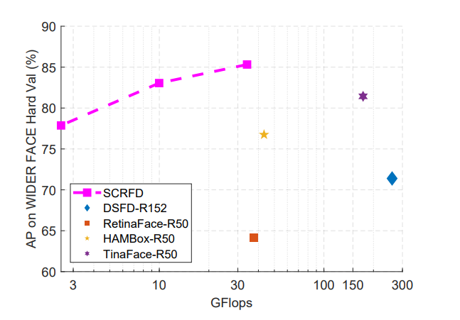
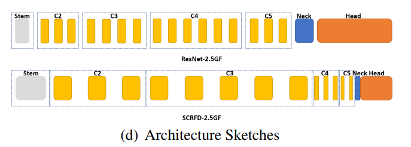

<div  align="center">

</div>


# SCRFD

[Sample and Computation Redistribution for Efficient Face Detection](https://arxiv.org/abs/2105.04714)

## Code Source

```
link: https://github.com/deepinsight/insightface/tree/master/detection/scrfd
branch: master
commit: 80e20d868f25344051ae30729257953ed4d3bc43
```

## Model Arch

<div  align="center">

</div>

### pre-processing

scrfd的预处理比较简单，原则上可以支持任意尺度输入图片（RGB），预处理只需要减均值归一化即可
- 预处理参考[scrfd.py](https://github.com/deepinsight/insightface/blob/master/detection/scrfd/tools/scrfd.py#L142)
```python
mean = (127.5, 127.5, 127.5)
std = (128, 128, 128)
```

### post-processing

scrfd算法大体分为两种，一种是输出包含landmark关键点输出，另一种则是不包含landmark关键点输出。除了landmark外，还要bbox输出以及置信度输出。得到这些输出后，需要根据anchor信息以及bbox输出decode出输入图片中的预测框，然后选择置信度大于设定值的预测框以及landmark，同时对选择的预测框做nms后处理即可。

### network

scrfd网络结构是利用搜索得到，backbone的搜索范围在resnet与mobilenet网络结构，neck的搜索范围为PAFPN，而head的搜索范围为3x3卷积的组合。搜索时，首先固定neck和head只搜索backbone,根据mAP得到比较优的backbone的channel比例。随后随机全部搜索，但是过滤掉不符合backbone的channel的网络结构配置。


### common

- ResNet
- MobileNet
- PAFPN

## Model Info

### 模型性能

| 模型  | 源码 | easy | medium | hard | flops | params | input size |
| :---: | :--: | :--: | :--: | :---: | :---: | :----: | :--------: |
|   scrfd_500m   |  [insightface](https://github.com/deepinsight/insightface/tree/master/detection/scrfd)    | 90.57%   |  88.12%     |   68.51%  |    500M    |   0.57M    |     640       | 
|   scrfd_500m_bnkps   |  [insightface](https://github.com/deepinsight/insightface/tree/master/detection/scrfd)    | 90.97%   |  88.44%     |   69.49%  |    500M    |   0.57M    |     640       | 
|   scrfd_1g   |  [insightface](https://github.com/deepinsight/insightface/tree/master/detection/scrfd)    | 92.38%   |  90.57%     |   74.80%  |    1G    |   0.64M    |     640       | 
|   scrfd_2.5g   |  [insightface](https://github.com/deepinsight/insightface/tree/master/detection/scrfd)    | 93.78%   |  92.16%     |   77.87%  |    2.5G    |   0.67M    |     640       | 
|   scrfd_2.5g_bnkps   |  [insightface](https://github.com/deepinsight/insightface/tree/master/detection/scrfd)    | 93.80%   |  92.02%     |   77.13%  |    2.5G    |   0.82M    |     640       | 
|   scrfd_10g   |  [insightface](https://github.com/deepinsight/insightface/tree/master/detection/scrfd)    | 95.16%   |  93.87%     |   83.05%  |    10G    |   3.86M    |     640       | 
|   scrfd_10g_bnkps   |  [insightface](https://github.com/deepinsight/insightface/tree/master/detection/scrfd)    | 95.40%   |  94.01%     |   82.80%  |    10G    |   4.23M    |     640       | 
|   scrfd_34g   |  [insightface](https://github.com/deepinsight/insightface/tree/master/detection/scrfd)    | 96.06%   |  94.92%     |   85.29%  |    34G    |   9.80M    |     640       | 

### 测评数据集说明

<div align=center></div>

Wider Face数据集最早是在2015年公开的，该数据集的图片来源是WIDER数据集，从中挑选出了32,203图片并进行了人脸标注，总共标注了393,703个人脸数据，并且对于每张人脸都附带有更加详细的信息，包扩blur(模糊程度)、expression(表情), illumination(光照), occlusion(遮挡), pose(姿态)。

widerface数据集根据事件场景的类型分为了61个类，接着根据每个类别按照40%、10%、50%的比例划分到训练集、验证集以及测试集中，该项目下face detection算法所用到的测评数据集就是来自于widerface数据集中的验证集。同样地，不同事件通常对应着不同的场景，涵盖现实场景中的大量场景。为了评估事件对人脸检测的影响，用三个因素对每个事件进行描述：尺度、遮挡和姿态。对于每个因素，我们计算特定事件类型的检测率，然后进行排序，将事件分成三部分：easy、medium、hard。

### 评价指标说明

人脸检测任务的评价指标和通用目标检测任务一样，也是用mAP来衡量算法模型的性能优劣。基于widerface数据集，分别对easy、medium、hard三个类别分别统计mAP。

- mAP: mean of Average Precision, 检测任务评价指标，多类别的AP的平均值；AP即平均精度，是Precision-Recall曲线下的面积

## Build_In Deploy

### step.1 获取预训练模型
基于insightface原始仓库可以将模型转为onnx格式，转换前，需要修改`insightface/detection/scrfd/mmdet/models/dense_heads/scrfd_head.py`文件中`forward_single`函数，即注释L335-L337即可，如下
```python
# cls_score = cls_score.permute(0, 2, 3, 1).reshape(batch_size, -1, self.cls_out_channels).sigmoid()
# bbox_pred = bbox_pred.permute(0, 2, 3, 1).reshape(batch_size, -1, 4)
# kps_pred = kps_pred.permute(0, 2, 3, 1).reshape(batch_size, -1, 10)
```

转换脚本如下:

```bash
python tools/scrfd2onnx.py configs/scrfd/scrfd_500m.py weights/scrfd_500m.pth --input-img /path/to/face.jpg
```

### step.2 准备数据集
- [校准数据集](https://huggingface.co/datasets/wider_face/blob/main/data/WIDER_val.zip)
- [评估数据集](https://huggingface.co/datasets/wider_face/blob/main/data/WIDER_val.zip)

### step.3 模型转换
1. 根据具体模型，修改编译配置
    - [official_scrfd.yaml](./build_in/build/official_scrfd.yaml)
    
    > - 编译参数`backend.type: tvm_vacc`
    > - fp16精度: 编译参数`backend.dtype: fp16`
    > - int8精度: 编译参数`backend.dtype: int8`，需要配置量化数据集和预处理算子

2. 模型编译

    ```bash
    cd scrfd
    mkdir workspace
    cd workspace
    vamc compile ../build_in/build/official_scrfd.yaml

### step.4 模型推理

- 参考：[scrfd_vsx.py](./build_in/vsx/python/scrfd_vsx.py)
    ```bash
    python ../build_in/vsx/python/scrfd_vsx.py \
        --file_path  /path/to/widerface/val/images \
        --model_prefix_path deploy_weights/official_scrfd_int8/mod \
        --vdsp_params_info ../build_in/vdsp_params/insightface-scrfd_500m-vdsp_params.json \
        --save_dir ./infer_output \
        --device 0
    ```

- 参考：[evaluation.py](../common/eval/evaluation.py)，精度统计
    ```
    cd ../../common/eval/
    python3 setup.py build_ext --inplace
    cd ../../scrfd/workspace/
    python ../../common/eval/evaluation.py -p infer_output/ -g ../../common/eval/ground_truth
    ```

    ```
    # fp16
    ==================== Results ====================
    Easy   Val AP: 0.847899987304472
    Medium Val AP: 0.7882024574870119
    Hard   Val AP: 0.48162919273493177
    =================================================

    # int8
    ==================== Results ====================
    Easy   Val AP: 0.8350581318165516
    Medium Val AP: 0.7732634458243307
    Hard   Val AP: 0.4612960274840821
    =================================================
    ```

### step.5 性能精度测试
1. 性能测试
    - 配置[insightface-scrfd_500m-vdsp_params.json](./build_in/vdsp_params/insightface-scrfd_500m-vdsp_params.json)
    ```
    vamp -m deploy_weights/official_scrfd_int8/mod --vdsp_params ../build_in/vdsp_params/insightface-scrfd_500m-vdsp_params.json  -i 1 -p 1 -b 1 -s [3,640,640]
    ```

2. 精度测试

    - 数据准备，参考：[image2npz.py](../common/utils/image2npz.py)，生成推理数据`npz`以及对应的`dataset.txt`
    ```bash
    python ../../common/utils/image2npz.py \
        --dataset_path widerface/val/images \
        --target_path  input_npz  \
        --text_path widerface_npz_list.txt
    ```

    - vamp推理获取npz文件
    ```bash
    vamp -m deploy_weights/official_scrfd_int8/mod \
        --vdsp_params ../build_in/vdsp_params/insightface-scrfd_500m-vdsp_params.json  \
        -i 1 -p 1 -b 1 -s [3,640,640] \
        --datalist widerface_npz_list.txt \
        --path_output output
    ```

    - 解析npz文件，参考[npz_decode.py](./build_in/vdsp_params/npz_decode.py)
    ```
    python ../build_in/vdsp_params/npz_decode.py --txt result_npz \
        --input_image_dir widerface/val/images \
        --model_size 640 640 \
        --vamp_datalist_path widerface_npz_list.txt \
        --vamp_output_dir output
    ```

    - 精度评估，参考：[evaluation.py](../common/eval/evaluation.py)
    ```bash
    python ../../common/eval/evaluation.py -p result_npz -g ../../common/eval/ground_truth
    ```

