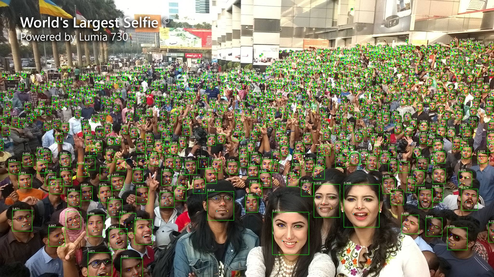
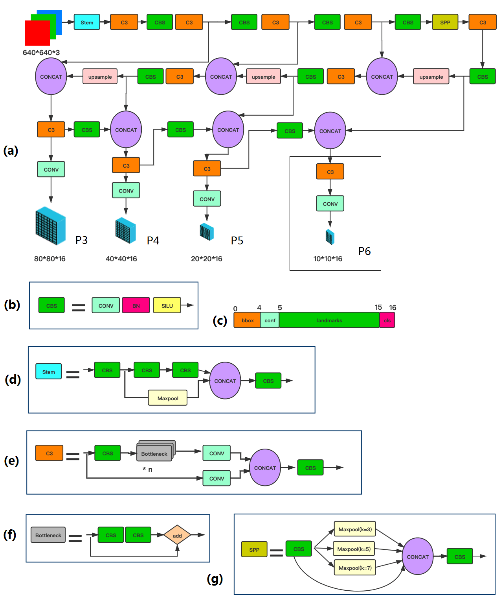

# YOLO5Face

[YOLO5Face: Why Reinventing a Face Detector](https://arxiv.org/abs/2105.12931)

## Code Source

```
link: https://github.com/deepcam-cn/yolov5-face
branch: master
commit: 894044ef53e7443c616a2cbf7de607863a858b2a
```

## Model Arch



### pre-processing

YOLO5Face算法的预处理与Yolov5检测算法一致，主要是对输入图片利用letterbox算子进行resize，然后进行归一化

### post-processing

YOLO5Face的后处理与yolov5系列算法基本一致，都是利用anchor以及网络预测特征图进行box decode，然后进行nms操作；除此之外，YOLO5Face在YOLOv5的基础上添加了一个 5-Point Landmark Regression Head（关键点回归），并对Landmark Regression Head使用了Wing loss进行约束


### backbone

YOLOv5Face是以YOLOv5作为Baseline来进行改进和再设计以适应人脸检测，整体框架如上图(a)所示，输入图片经过一系列特征提取，输出三个特征层用于检测，分别为P3、P4、P5。其中，
- CBS模块定义如图(b)所示，表示由conv+bn+silu组成；
- 输出层包含16个通道，由4个通道组成box输出，1个通道组成conf输出，10个通道组成关键点输出，剩余1个为cls类别输出
- 图(d)为stem结构，它用于取代YOLOv5中原来的Focus层。在YOLOv5中引入Stem块用于人脸检测是YOLOv5Face的创新之一
- 图(e)中，显示了一个CSP Block(C3)。CSP Block的设计灵感来自于DenseNet。但是，不是在一些CNN层之后添加完整的输入和输出，输入被分成 2 部分。其中一半通过一个CBS Block，即一些Bottleneck Blocks，另一半是经过Conv层进行计算

### head

YOLOv5Face网络head层与Yolov5基本一致，只是在输出特征层的基础上添加了landmark回归输出

### common

- SiLU激活函数
- SPP

## Model Info

### 模型性能

| 模型  | 源码 | easy | medium | hard | flops | params | input size |
| :---: | :--: | :--: | :--: | :---: | :---: | :----: | :--------: |
|   yolov5n0.5_face    |  [pytorch](https://github.com/deepcam-cn/yolov5-face)    | 90.76   |  88.12     |   73.82  |    0.571    |   0.447    |     640       | 
|   yolov5n_face   |  [pytorch](https://github.com/deepcam-cn/yolov5-face)   | 93.61   |  91.52     |   80.53  |    2.111    |   1.726    |     640       | 
|   yolov5s_face    |  [pytorch](https://github.com/deepcam-cn/yolov5-face)   | 94.33   |  92.61     |   83.15  |  5.751      |    7.075   |     640       | 
|   yolov5m_face    |  [pytorch](https://github.com/deepcam-cn/yolov5-face)   | 95.30   | 93.76     |   85.28 |  18.146      |   21.063    |     640       | 
|   yolov5l_face    |  [pytorch](https://github.com/deepcam-cn/yolov5-face)   | 95.78   |  94.30     |   86.13  |  41.607       |  46.627     |     640       | 


### 测评数据集说明

<div align=center></div>

Wider Face数据集最早是在2015年公开的，该数据集的图片来源是WIDER数据集，从中挑选出了32,203图片并进行了人脸标注，总共标注了393,703个人脸数据，并且对于每张人脸都附带有更加详细的信息，包扩blur(模糊程度)、expression(表情), illumination(光照), occlusion(遮挡), pose(姿态)。

widerface数据集根据事件场景的类型分为了61个类，接着根据每个类别按照40%、10%、50%的比例划分到训练集、验证集以及测试集中，该项目下face detection算法所用到的测评数据集就是来自于widerface数据集中的验证集。同样地，不同事件通常对应着不同的场景，涵盖现实场景中的大量场景。为了评估事件对人脸检测的影响，用三个因素对每个事件进行描述：尺度、遮挡和姿态。对于每个因素，我们计算特定事件类型的检测率，然后进行排序，将事件分成三部分：easy、medium、hard。

### 评价指标说明

人脸检测任务的评价指标和通用目标检测任务一样，也是用mAP来衡量算法模型的性能优劣。基于widerface数据集，分别对easy、medium、hard三个类别分别统计mAP。

- mAP: mean of Average Precision, 检测任务评价指标，多类别的AP的平均值；AP即平均精度，是Precision-Recall曲线下的面积

## Build_In Deploy

- [pytorch_deploy](./source_code/official_yolov5_face.md)