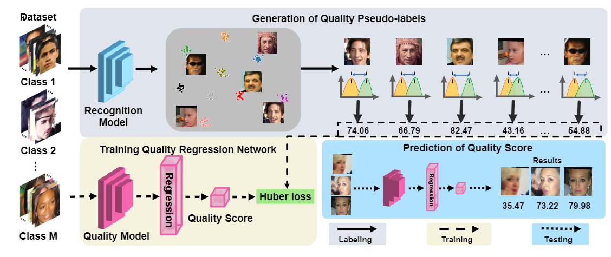

# SDD-FIQA

- [SDD-FIQA: Unsupervised Face Image Quality Assessment with Similarity Distribution Distance](https://arxiv.org/abs/2103.05977)
- [code](https://github.com/Tencent/TFace/tree/quality)

## Model Arch

<div align=center></div>

### pre-processing
```python
def read_img(imgPath):     # read image & data pre-process
    data = torch.randn(1, 3, 112, 112)
    transform = T.Compose([
        T.Resize((112, 112)),
        T.ToTensor(),
        T.Normalize(mean=[0.5, 0.5, 0.5], std=[0.5, 0.5, 0.5]),
    ])
    img = Image.open(imgPath).convert("RGB")
    data[0, :, :, :] = transform(img)
    return data
```
### post-processing
该模型无后处理操作，模型输出即为最终结果

### backbone
该网络的backbone结构是由[ResNet](../../classification/resnet/README.md)构成

### head

```python
Sequential(Flatten(),
        PReLU(512 * 7 * 7),
        Dropout(0.5, inplace=False),
        Linear(512 * 7 * 7, 1)
    )
```

### common

- Resblock
- PReLU

## Model Info

### 测评数据集说明
<div align=center></div>

[MS-Celeb-1M: Challenge of Recognizing One Million Celebrities in the Real World - Microsoft Research](https://www.microsoft.com/en-us/research/project/ms-celeb-1m-challenge-recognizing-one-million-celebrities-real-world/) 100K人的共100M图片，来自搜索引擎。这个数据集非常大，没有清洗过，噪声很大。可以使用[iBUG清洗过的数据集](https://link.zhihu.com/?target=https%3A//pan.baidu.com/s/1nxmSCch)

📝**NOTE**：用于人脸质量评估时暂无具体指标


## Build_In Deploy

### step.1 获取模型
```bash
git clone -b quality https://github.com/Tencent/TFace.git
mv ./source_code/demo.py ./TFace/quality/
python demo.py
```

### step.2 获取数据集
- [example](https://link.zhihu.com/?target=https%3A//pan.baidu.com/s/1nxmSCch)

### step.3 模型转换
1. 根据具体模型，修改编译配置
    - [sdd_fiqa.yaml](./build_in/build/sdd_fiqa.yaml)
    
    > - 编译参数`backend.type: tvm_vacc`
    > - fp16精度: 编译参数`backend.dtype: fp16`
    > - int8精度: 编译参数`backend.dtype: int8`，需要配置量化数据集和预处理算子

2. 模型编译
    ```bash
    cd sdd_fiqa
    mkdir workspace
    cd workspace
    vamc compile ../build_in/build/sdd_fiqa.yaml
    ```

### step.4 模型推理

- 参考：[sdd_fiqa_vsx.py](./build_in/vsx/python/sdd_fiqa_vsx.py)
    ```bash
    python ../build_in/vsx/python/sdd_fiqa_vsx.py \
        --image_dir  /path/to/ms1m/ms1m_example/ \
        --model_prefix_path deploy_weights/sdd_fiqa_fp16/mod \
        --vdsp_params_info ../build_in/vdsp_params/tface-sdd_fiqa-vdsp_params.json \
        --save_dir ./infer_output \
        --device 0
    ```

### step.5 性能精度测试
1. 性能测试
    - 配置[tface-sdd_fiqa-vdsp_params.json](./build_in/vdsp_params/tface-sdd_fiqa-vdsp_params.json)
    ```bash
    vamp -m deploy_weights/sdd_fiqa_fp16/mod --vdsp_params ../build_in/vdsp_params/tface-sdd_fiqa-vdsp_params.json  -i 1 -p 1 -b 1
    ```

2. 精度测试
    > **可选步骤**，通过vamp推理方式获得推理结果，然后解析及评估精度；
    
    - 数据准备，基于[image2npz.py](../common/utils/image2npz.py)，将评估数据集转换为npz格式，生成对应的`npz_datalist.txt`
    ```bash
    python ../../common/utils/image2npz.py --dataset_path /path/to/ms1m/ms1m_example/ --target_path  /path/to/output_npz --text_path npz_datalist.txt
    ```

    - vamp推理获取npz文件
    ```bash
    vamp -m deploy_weights/sdd_fiqa_fp16/mod --vdsp_params ../build_in/vdsp_params/sdd_fiqa_vdsp_params.json  -i 1 -p 1 -b 1 --datalist npz_datalist.txt ms1m_example_npz.txt --path_output result
    ```
    
    - npz结果解析并统计精度
    ```bash
    cd ../build_in/decode
    python decode_vamp.py ../../npz_datalist.txt ../../result
    ```

