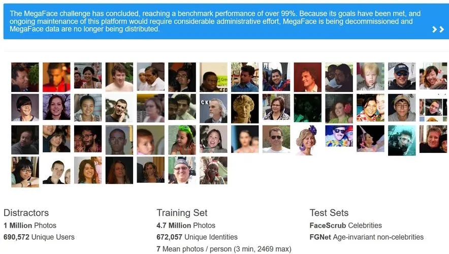

# FaceNet

[FaceNet: A Unified Embedding for Face Recognition and Clustering](https://arxiv.org/abs/1503.03832)

## Code Source
```
# tf
link: https://github.com/davidsandberg/facenet
branch: master
commit: 096ed770f163957c1e56efa7feeb194773920f6e
```
```
# pytorch
link: https://github.com/timesler/facenet-pytorch
branch: master
commit: 555aa4bec20ca3e7c2ead14e7e39d5bbce203e4b
```

## Model Arch

### pre-processing

FaceNet模型一般用在人脸检测模型后。FaceNet的预处理操作可以按照如下步骤进行，即先对图片进行resize至160的图片对其进行归一化、减均值除方差等操作：

```python
input_size = 160
ori_image = Image.open(image_file)
resize_image = ori_image.resize((input_size, input_size), Image.NEAREST)
image = np.array(resize_image).astype(np.float32)
image = image.transpose((2, 0, 1))
image = (image - 127.5) / 128.0
input_image = np.expand_dims(image, axis=0).astype(np.float32)
```

### post-processing

模型输出为512维人脸特征向量，后由平方距离L2阈值是用来确定相同和不同的分类。

通过端到端的深度学习结构将人脸映射到同一个欧式空间中，使得在映射后欧式空间中彼此之间是可度量的。


### backbone

最早的FaceNet采用两种深度卷积网络：经典Zeiler&Fergus架构和Google的Inception v1。最新的FaceNet进行了改进，主体模型采用一个极深度网络Inception_ResNet v2，由3个带有残差连接的Inception模块和1个Inception v4模块组成。


### head

FaceNet的网络结构与传统的深度学习模型非常相似，不同的是在FaceNet中去掉了分类模型中中Softmax，取而代之的是L2归一化，通过L2归一化得到人脸的特征表示，直接将人脸的图像x映射到d维的欧式空间中。其中L2归一化的目的是去使得认脸的向量在同一量纲下。

### common
- L2 Normalizer
- Triplet Loss


## Model Info

### 模型性能

| Models  | Code_Source | LFW Accuracy | AUC| EER | Shape |
| :---: | :--: | :--: | :---: | :--------: | :--------: |
|  facenet_vggface2    |  [tensorflow](https://github.com/davidsandberg/facenet)    |  0.9965   |  0.9997  |   0.0050  |     160       | 
|  facenet_vggface2 **vacc_int8_percentile**    |  -    |  0.9943   |  0.9996  |   0.0050  |     160       | 
|  facenet_vggface2 **vacc_fp16**    |  -    |  0.9956   |  0.9997  |   0.0048  |     160       | 
|  facenet_casia_webface    |  [tensorflow](https://github.com/davidsandberg/facenet)    |  0.9905   |  -  |   -  |     160       | 
|  facenet_casia_webface **vacc_int8_percentile**    |  -    |  0.9865   |  0.9987  |   0.0134  |     160       | 
|  facenet_casia_webface **vacc_fp16**    |  -    |  0.9882   |  0.9987  |   0.0123  |     160       | 
|  facenet_vggface2    |  [pytorch](https://github.com/timesler/facenet-pytorch)     |  0.9965   |  0.9997  |   0.0050  |     160       | 
|  facenet_vggface2 **vacc_int8_percentile**    |  -   |  0.9945   |  0.9997  |   0.0051  |     160       | 
|  facenet_vggface2 **vacc_fp16**    |  -    |  0.9951   |  0.9997  |   0.0050  |     160       | 
|  facenet_casia_webface    |  [pytorch](https://github.com/timesler/facenet-pytorch)    |  0.9905   |  -  |   -  |     160       | 
|  facenet_casia_webface **vacc_int8_percentile**    | -    |  0.9931   |  0.9996  |   0.0060  |     160       | 
|  facenet_casia_webface **vacc_fp16**    |  -   |  0.9881   |  0.9987  |   0.0123  |     160       | 

> Tips
> 
> 两个来源，精度评估数据集均为[lfw_mtcnnpy_160](https://github.com/davidsandberg/facenet/wiki/Validate-on-lfw)
> 
> 两个来源，均有vggface2和casia_webface两种数据集训练而来的预训练模型
> 
### 测评数据集说明

<div align=center></div>

[LFW (Labeled Faces in the Wild)](http://vis-www.cs.umass.edu/lfw/)人脸数据库是由美国马萨诸塞州立大学阿默斯特分校计算机视觉实验室整理完成的数据库，主要用来研究非受限情况下的人脸识别问题。LFW 数据库主要是从互联网上搜集图像，而不是实验室，一共含有13000 多张人脸图像，每张图像都被标识出对应的人的名字，其中有1680 人对应不只一张图像，即大约1680个人包含两个以上的人脸。

LFW人脸数据集是目前人脸识别的常用测试集，其中提供的人脸图片均来源于生活中的自然场景，因此识别难度会增大，尤其由于多姿态、光照、表情、年龄、遮挡等因素影响导致即使同一人的照片差别也很大。并且有些照片中可能不止一个人脸出现，对这些多人脸图像仅选择中心坐标的人脸作为目标，其他区域的视为背景干扰。LFW数据集共有13233张人脸图像，每张图像均给出对应的人名，共有5749人，且绝大部分人仅有一张图片。每张图片的尺寸为250X250，绝大部分为彩色图像，但也存在少许黑白人脸图片。

LFW数据集主要测试人脸识别的准确率，该数据库从中随机选择了6000对人脸组成了人脸辨识图片对，其中3000对属于同一个人2张人脸照片，3000对属于不同的人每人1张人脸照片。测试过程LFW给出一对照片，询问测试中的系统两张照片是不是同一个人，系统给出“是”或“否”的答案。通过6000对人脸测试结果的系统答案与真实答案的比值可以得到人脸识别准确率。


### 评价指标说明

人脸识别一般分为Indentification和Verification（人脸验证），当进行人脸验证时，一般考虑以下指标：

- 误识率(False Accept Rate，FAR)：将其他人误作指定人员的概率；

- 拒识率(False Reject Rate，FRR)：将指定人员误作其它人员的概率。

- 等错误率 (Equal Error Rate，EER) ：取一组0到1之间的等差数列，分别作为识别模型的判别界限，既坐标x轴，画出FFR和FAR的坐标图，交点就是EER值。

    一般，FAR=0.001时，FRR的值作为参考。值越小，性能越好。计算机在判别时采用的阈值不同，这两个指标也不同。一般情况下，误识率FAR 随阈值的减小（放宽条件）而增大，拒识率FRR随阈值的减小而减小。因此，可以采用等错误率（Equal Error Rate, ERR）作为性能指标，即通过调节阈值，使这FAR和FRR两个指标相等时的FAR 或 FRR。


- ROC曲线：受试者工作特征曲线：receiver operating characteritic curve，又称为感受性曲线（sensitivity curve），表示敏感性和特异性之间的相互关系。横坐标为FPR，纵坐标为TPR，如下图所示，ROC曲线上的每一个点对应一个threshold。

- AUC：ROC曲线下方的面积，area under the ROC curve。另一种评价模型性能的方式，如果模型是完美的，则AUC=1，如果模型是随机猜测模型，则AUC=0.5，模型性能越好，则面积越大。

## Build_In Deploy

- [pytorch_deploy](./source_code/pytorch_deploy.md)
- [tensorflow_deploy](./source_code/tensorflow_deploy.md)


## Tips
- 两个来源的模型，预处理和后处理均一致