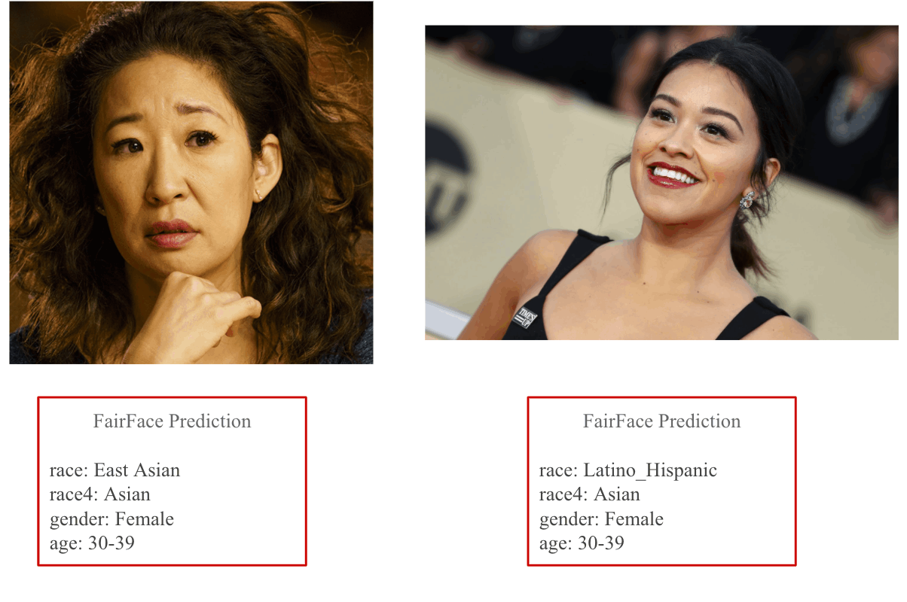
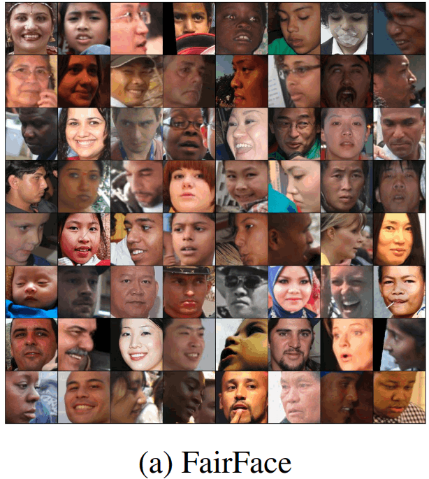

# FairFace

[FairFace: Face Attribute Dataset for Balanced Race, Gender, and Age](https://openaccess.thecvf.com/content/WACV2021/papers/Karkkainen_FairFace_Face_Attribute_Dataset_for_Balanced_Race_Gender_and_Age_WACV_2021_paper.pdf)

## Code Source
```
link: https://github.com/dchen236/FairFace
branches: master
```

## Model Arch

<div align=center></div>

### pre-processing

FairFace系列网络基于torchvision.models.resnet34训练而来，所以预处理和torchvision类似：

```python
[
    torchvision.transforms.Resize(224),
    torchvision.transforms.ToTensor(),
    torchvision.transforms.Normalize(mean=[0.485, 0.456, 0.406], std=[0.229, 0.224, 0.225],),
]
```

### post-processing

FairFace系列网络由于是多标签任务，不在网络内部做后处理，而是在host侧作分段argmax。

### backbone

FairFace系列网络由torchvision.models.resnet34训练而来。

### head

FairFace系列网络的head层由global-average-pooling层和一层全连接层组成

### common

- residual layer

## Model Info

### 模型性能

| models  | code_source | race | gender | age | flops(G) | params(M) | input size |
| :---: | :--: | :--: | :--: | :---: | :---: |:----: | :--------: |
| fairface_res34 |[FairFace](https://github.com/dchen236/FairFace)   |   72.04   |  94.36  | 60.52  | 8.157    |    21.294      |      1,3,224,224     |
| fairface_res34 **vacc fp16** |-   |   72.00   |  94.39  | 60.49  | -    |    -      |      1,3,224,224     |
| fairface_res34 **vacc int8 percentile** |-  |   72.15   |  94.40  | 60.29  | -    |    -      |      1,3,224,224     |

> 均为top1精度

```python
# 类别
race, 7 classes：[White, Black, Latino_Hispanic, East, Southeast Asian, Indian, Middle Eastern]
gender, 2 classes: [Male, Female]
age, 9 classes: [0-2, 3-9, 10-19, 20-29, 30-39, 40-49, 50-59, 60-69, 70+]
```

### 测评数据集说明

<div align=center></div>

[FairFace](https://github.com/dchen236/FairFace)，缓解种族偏见人脸数据集，包含 108,501 张图像，强调数据集中种族构成的均衡。定义了 7 个种族组：白人、黑人、印度人、东亚人、东南亚人、中东人和拉丁人，图像是从YFCC-100M Flickr数据集中收集的，并标注了种族、性别和年龄组。


### 评价指标说明

- top1准确率: 测试图片中最佳得分所对应的标签是正确标注类别的样本数除以总的样本数
- top5准确率: 测试图片中正确标签包含在前五个分类概率中的个数除以总的样本数

## Build_In Deploy

### step.1 准备模型
- [export.py](./source_code/export.py)内提供了onnx/torchscript导出功能。
- 配置数据集路径（需已人脸对齐的图像）
- 配置权重路径

### step.2 准备数据集
[FairFace](https://github.com/dchen236/FairFace)仓库内提供的数据集，有两种形式（Padding=0.25, Padding=1.25），分别对应人脸位置向外padding的大小，此处使用Padding=0.25的数据集
- [校准数据集](https://drive.google.com/file/d/1Z1RqRo0_JiavaZw2yzZG6WETdZQ8qX86/view)
- [评估数据集](https://drive.google.com/file/d/1Z1RqRo0_JiavaZw2yzZG6WETdZQ8qX86/view)
- [评估数据集label](https://drive.google.com/file/d/1wOdja-ezstMEp81tX1a-EYkFebev4h7D/view)
- 通过[image2npz.py](../common/utils/image2npz.py)，将评估数据集转换为npz格式，并生成npz_datalist.txt文件

### step.3 模型转换
1. 根据具体模型，修改编译配置
    - [official_fairface.yaml](./build_in/build/official_fairface.yaml)
    
    > - 编译参数`backend.type: tvm_vacc`
    > - fp16精度: 编译参数`backend.dtype: fp16`
    > - int8精度: 编译参数`backend.dtype: int8`，需要配置量化数据集和预处理算子

2. 模型编译
    ```bash
    cd fairface
    mkdir workspace
    cd workspace
    vamc compile ../build_in/build/official_fairface.yaml
    ```

### step.4 模型推理

- 参考：[vsx_inference.py](./build_in/vsx/python/vsx_inference.py)
    ```bash
    python ../build_in/vsx/python/vsx_inference.py \
        --file_path  /path/to/face/fairface/val/ \
        --model_prefix_path deploy_weights/official_fairface_fp16/mod \
        --vdsp_params_info ../build_in/vdsp_params/official-fairface_res34-vdsp_params.json \
        --save_file ./infer_predict.csv \
        --device 0
    ```

- 精度验证
    ```
    python ../source_code/eval.py --val_label_path /path/to/fairface_label_val.csv --val_pred_path /path/to/infer_predict.csv
    ```

    <details><summary>点击查看int8精度</summary>

    ```
    precision        recall    f1-score   support
    0-2              0.7612    0.7688     0.7650       199
    3-9              0.8076    0.8326     0.8199       1356
    10-19            0.5821    0.4682     0.5190       1181
    20-29            0.6543    0.7376     0.6934       3300
    30-39            0.5101    0.4966     0.5033       2330
    40-49            0.4936    0.4575     0.4749       1353
    50-59            0.5188    0.5038     0.5112       796
    60-69            0.4852    0.4611     0.4728       321
    70+              0.6118    0.4407     0.5123       118
    accuracy                              0.6067       10954
    macro avg        0.6027    0.5741     0.5858       10954
    weighted avg     0.6017    0.6067     0.6025       10954

    precision        recall    f1-score   support
    Male             0.9486    0.9437     0.9462       5792
    Female           0.9372    0.9427     0.9399       5162
    accuracy                              0.9432       10954
    macro avg        0.9429    0.9432     0.9430       10954
    weighted avg     0.9432    0.9432     0.9432       10954

    precision        recall    f1-score   support
    White            0.7650    0.7746     0.7698      2085
    Black            0.8802    0.8638     0.8719      1556
    Latino_Hispanic  0.5626    0.5730     0.5678      1623
    East Asian       0.7344    0.7884     0.7604      1550
    Southeast Asian  0.6578    0.6304     0.6438      1415
    Indian           0.7655    0.7322     0.7485      1516
    Middle Eastern   0.6505    0.6419     0.6461      1209
    accuracy                              0.7202     10954
    macro avg        0.7166    0.7149     0.7155     10954
    weighted avg     0.7206    0.7202     0.7202     10954
    ```
    </details>

    <details><summary>点击查看fp16精度</summary>

    ```
    precision        recall    f1-score   support
    0-2              0.7550    0.7588     0.7569       199
    3-9              0.8063    0.8319     0.8189      1356
    10-19            0.5812    0.4759     0.5233      1181
    20-29            0.6567    0.7309     0.6918      3300
    30-39            0.5052    0.5013     0.5032      2330
    40-49            0.4924    0.4531     0.4719      1353
    50-59            0.5170    0.4962     0.5064       796
    60-69            0.4760    0.4642     0.4700       321
    70+              0.5926    0.4068     0.4824       118
    accuracy                              0.6049     10954
    macro avg        0.5980    0.5688     0.5805     10954
    weighted avg     0.6002    0.6049     0.6011     10954

    precision        recall    f1-score   support
    Male             0.9496    0.9439     0.9467      5792
    Female           0.9375    0.9438     0.9406      5162
    accuracy                              0.9439     10954
    macro avg        0.9435    0.9439     0.9437     10954
    weighted avg     0.9439    0.9439     0.9439     10954

    precision        recall    f1-score   support
    White            0.7667    0.7722     0.7694      2085
    Black            0.8783    0.8625     0.8703      1556
    Latino_Hispanic  0.5630    0.5810     0.5719      1623
    East Asian       0.7373    0.7839     0.7598      1550
    Southeast Asian  0.6549    0.6424     0.6486      1415
    Indian           0.7718    0.7230     0.7466      1516
    Middle Eastern   0.6460    0.6385     0.6423      1209
    accuracy                              0.7200     10954
    macro avg        0.7168    0.7148     0.7156     10954
    weighted avg     0.7211    0.7200     0.7203     10954

    ```
    </details>

### step.5 性能精度测试
1. 性能测试
    - 参考配置文件[official-fairface_res34-vdsp_params.json](./build_in/vdsp_params/official-fairface_res34-vdsp_params.json )
    ```bash
    vamp -m deploy_weights/official_fairface_fp16/mod --vdsp_params ../build_in/vdsp_params/official-fairface_res34-vdsp_params.json -i 1 p 1 -b 1
    ```

2. 精度测试
    > **可选步骤**，通过vamp推理方式获得推理结果，然后解析及评估精度；

   - 数据准备，基于[image2npz.py](../common/utils/image2npz.py)，将评估数据集转换为npz格式，得到`npz_datalist.txt`文件列表

   - vamp推理获取npz结果，指定`--datalist`输入文件路径，推理结果以npz格式保存于`--path_output`文件夹内
        ```bash
        vamp -m deploy_weights/official_fairface_fp16/mod \
        --vdsp_params ../build_in/vdsp_params/official-fairface_res34-vdsp_params.json -i 1 p 1 -b 1 -s [3,224,224] \
        --datalist /path/to/npz_datalist.txt --path_output ./outputs
        ```
    - 解析npz结果，获取预测结果, 基于[vamp_decode.py](./build_in/vdsp_params/vamp_decode.py)

    - 基于[eval.py](./source_code/eval.py)，配置验证集标签csv和预测结果csv，即可获得精度指标


