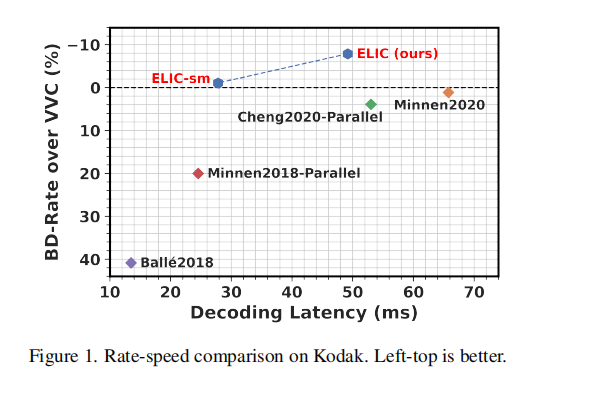
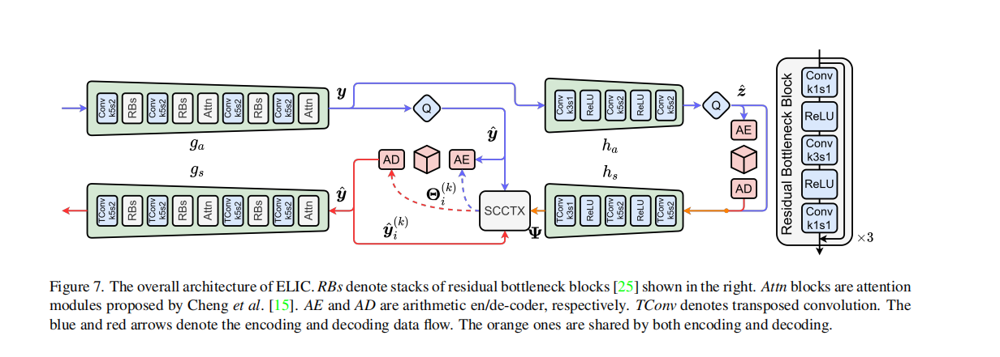
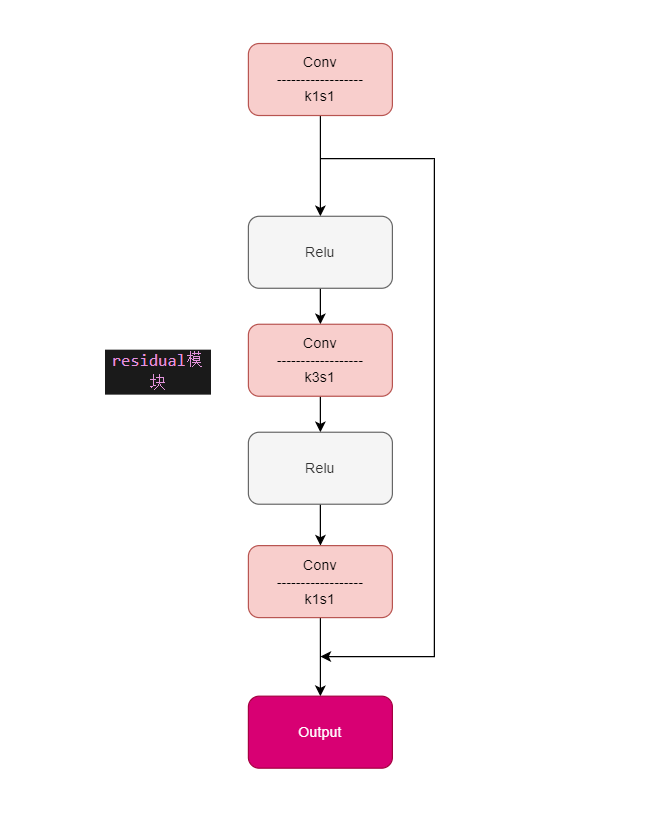

# ELIC

[ELIC: Efficient Learned Image Compression with Unevenly Grouped Space-Channel Contextual Adaptive Coding](https://arxiv.org/abs/2203.10886)

## Code Source
```
link: https://github.com/JiangWeibeta/ELIC.git
branch: main
commit: b240a4ca3163a82f9e4c6cce403229d7534d3263
```

### Model Arch
该模型通过不均匀通道条件自适应编码和空间通道上下文自适应编码相结合的方法，在保证速度的同时提高了编码性能，实现最先进的速度和压缩能力。该模型还支持极快的预览解码和渐进解码，使得基于学习的图像压缩的应用更具前景。

<div align=center></div>

#### 模块构成
ELIC包含以下核心模块:
- **分析变换** (AnalysisTransform)，简称Ga模块
- **合成变换** (SynthesisTransform)，简称Gs模块
- **超分析** (HyperAnalysis)，简称Ha模块
- **超合成** (HyperSynthesis)，简称Hs模块

这些模块协同工作以实现图像的压缩和解压缩功能。


### pre-processing

elic网络的预处理操作，可以参考如下步骤进行：

```python
  from torchvision import transforms as pth_transforms
  transform = pth_transforms.Compose([
      pth_transforms.Resize([512, 512]),
      pth_transforms.ToTensor(),
  ])
```

### post-processing

elic网络的预处理操作，可以按照如下步骤进行：
```python
torchvision.utils.save_image(decom_out["x_hat"], args.output_file, nrow=1)
```
这里torchvision.utils.save_image接口会将自动处理tensor到图像的转换

### backbone

ELIC并非一个端到端的模型，而是包含各种压缩编码/解码等模块的算法pipeline。在这个算法pipeline中GA/HA/HS/GS等模块是使用深度神经网络模型实现的。在这几个神经网络模型中，主要使用的模型结构为Residual模块。
<div align=center></div>

### common

### 测评数据集说明

Kodak-24数据集是图像质量评估领域中一个经典且广泛使用的数据集。其名称来源于最初的24张用于评估的彩色图片，这些图片由Eastman Kodak Company提供，最初旨在测试扫描仪和打印机设备的性能。随着数字图像处理技术的发展，Kodak-24数据集也成为了评价图像质量评估算法的标准数据集之一。

Kodak-24数据集首次公开于上世纪90年代末期，它的创建目的是为了提供一组标准化的图片，以便在不同的图像处理系统上进行公平比较。该数据集包含24张不同场景和主题的高质量彩色图像，原始图像分辨率一般在2000到3000像素之间。由于这些图片在质量上具有一定的代表性，它们成为了图像质量分析和评估方法的一个基准。

Kodak-24数据集不仅包括原始高质量的图片，还提供了一系列经过处理的图片版本，其中包括了不同类型的失真，如模糊、噪声、色彩偏差等。这些失真版本的图片用于测试和评估图像质量评估算法在不同失真类型下的性能和准确性。每一幅原始图像都有若干幅对应的失真图像，每一种失真类型都经过精心设计以模拟现实世界中可能出现的各种图像损伤。

### 指标说明
- 峰值信噪比(Peak Signal-to-Noise Ratio, PSNR)，PSNR是信号的最大功率和信号噪声功率之比，测量重构图像的质量，通常以分贝（dB）来表示。PSNR指标越高，说明图像质量越好


## Build_In Deploy

- [elic_deploy.md](./source_code/elic_deploy.md)
- [elic_dynamic_deploy.md](./source_code/elic_dynamic_deploy.md)
- [elic_no_entropy_deploy.md](./source_code/elic_no_entropy_deploy.md)
    - elic_no_entropy表示去掉了熵编码的过程，直接端到端输出。
