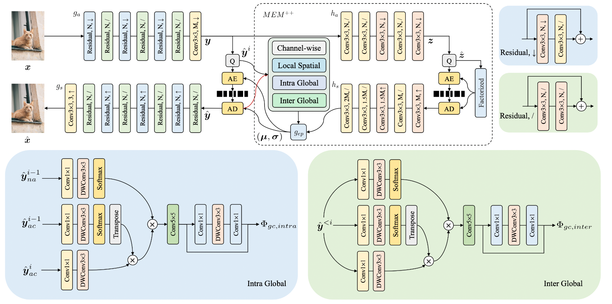
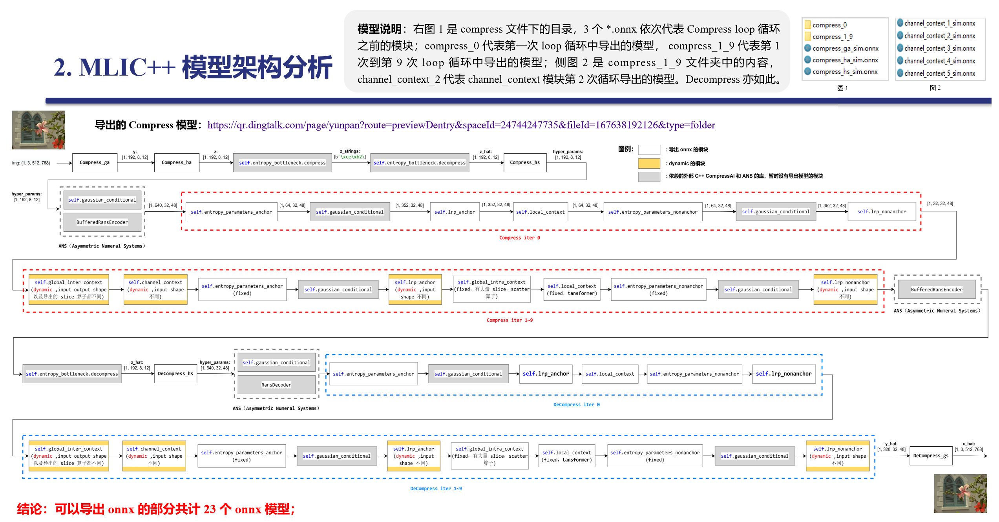
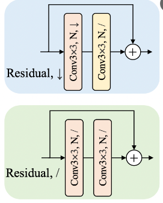

# Mlic++

[MLIC: Multi-Reference Entropy Model for Learned Image Compression](https://arxiv.org/abs/2211.07273)

## Code Source
```
link: https://github.com/JiangWeibeta/MLIC.git
branch: main
commit: d001ea434d05b3e160b951ceafa6d9556b207326
```

### Model Arch

<div align=center></div>

#### 模块构成
MLIC包含以下核心模块:
- **分析变换** (AnalysisTransform)
- **合成变换** (SynthesisTransform) 
- **超分析** (HyperAnalysis)
- **超合成** (HyperSynthesis)

这些模块协同工作以实现图像的压缩和解压缩功能。

#### 编码数据流说明
参考当前特征的上下文信息、相邻特征以及从超分析模块得到的高层次特征等。通过综合这些参考信息，熵模型能够更准确地捕捉潜在特征的统计规律，从而实现更高效的编码

#### 解码数据流说明
- 超合成（HyperSynthesis）：与超分析模块相对应，超合成模块的作用是将经过熵解码后的高层次特征恢复为适合合成变换的形式。
- 合成变换（Synthesis Transform）：由一系列反卷积层或转置卷积层组成，用于将潜在特征从特征空间转换回像素空间，从而重建原始图像。这些反卷积层逐步增加图像的空间分辨率，同时减少通道数，最终输出与输入图像尺寸相同的重建图像。

#### 数据流符号说明
- `x`: 输入图像
- `^x`: 重建图像
- `↓`: 下采样操作
- `↑`: 上采样操作
- `/`: 步幅等于1
- 红线: 表示解码过程中的数据流

#### 特征处理
在解码过程中,系统会参考:
- 当前特征的上下文信息
- 相邻特征
- 从超分析模块得到的高层次特征

通过综合这些参考信息,熵模型能够更准确地捕捉潜在特征的统计规律，从而实现更高效的编码

### pre-processing

mlicpp网络的预处理操作，可以参考如下步骤进行：

```python
  from torchvision import transforms as pth_transforms
  transform = pth_transforms.Compose([
      pth_transforms.Resize([512, 768]),
      pth_transforms.ToTensor(),
  ])
```

### post-processing

mlicpp网络的预处理操作，可以按照如下步骤进行：
```python
torchvision.utils.save_image(decom_out["x_hat"], args.output_file, nrow=1)
```
这里torchvision.utils.save_image接口会将自动处理tensor到图像的转换

### backbone

<div align=center></div>

MLICPP并不是一个端到端的模型，而是包含各种压缩编码/解码等模块的算法pipeline。在这个算法pipeline中GA/HA/HS/GS等模块是使用深度神经网络模型实现的。在这几个神经网络模型中，主要使用的模型结构为Residual模块。
<div align=center></div>

### common

### 测评数据集说明

Kodak-24数据集是图像质量评估领域中一个经典且广泛使用的数据集。其名称来源于最初的24张用于评估的彩色图片，这些图片由Eastman Kodak Company提供，最初旨在测试扫描仪和打印机设备的性能。随着数字图像处理技术的发展，Kodak-24数据集也成为了评价图像质量评估算法的标准数据集之一。

Kodak-24数据集首次公开于上世纪90年代末期，它的创建目的是为了提供一组标准化的图片，以便在不同的图像处理系统上进行公平比较。该数据集包含24张不同场景和主题的高质量彩色图像，原始图像分辨率一般在2000到3000像素之间。由于这些图片在质量上具有一定的代表性，它们成为了图像质量分析和评估方法的一个基准。

Kodak-24数据集不仅包括原始高质量的图片，还提供了一系列经过处理的图片版本，其中包括了不同类型的失真，如模糊、噪声、色彩偏差等。这些失真版本的图片用于测试和评估图像质量评估算法在不同失真类型下的性能和准确性。每一幅原始图像都有若干幅对应的失真图像，每一种失真类型都经过精心设计以模拟现实世界中可能出现的各种图像损伤。

### 指标说明
- 峰值信噪比(Peak Signal-to-Noise Ratio, PSNR)，PSNR是信号的最大功率和信号噪声功率之比，测量重构图像的质量，通常以分贝（dB）来表示。PSNR指标越高，说明图像质量越好


## Build_In Deploy

- [official_deploy.md](./source_code/official_deploy.md)
