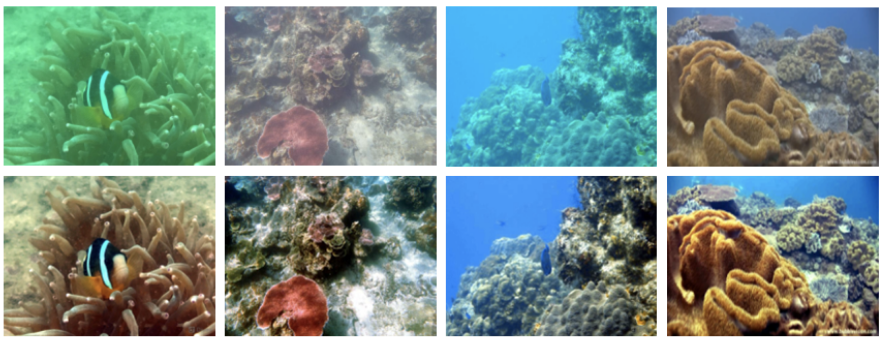
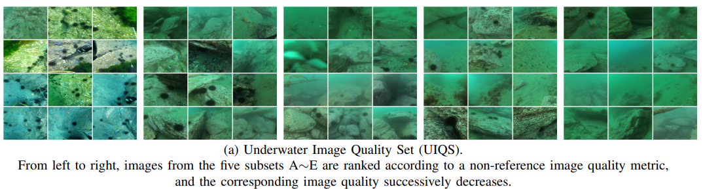

# USUIR

[Unsupervised Underwater Image Restoration: From a Homology Perspective](https://ojs.aaai.org/index.php/AAAI/article/view/19944)

## Code Source
```
# official
link: https://github.com/zhenqifu/USUIR
branch: main
commit: 33683d54bb0c7617e584546257f1bdd73630aa41
```

## Model Arch

<div align=center></div>

### pre-processing

USUIR系列网络的预处理操作，可以按照如下步骤进（不同子模型使用不同数据集，尺寸可能不一样）

```python
def get_image_data(image_file, input_shape = [1, 3, 720, 1280]):
    size = input_shape[2:][::-1]

    image = cv2.imread(image_file)
    img = cv2.resize(image, size) # , interpolation=cv2.INTER_AREA
    img = cv2.cvtColor(img, cv2.COLOR_BGR2RGB)

    img = np.ascontiguousarray(np.transpose(img, (2, 0, 1))) # HWC to CHW
    img /= 255.0
    img = np.expand_dims(img, axis=0)

    return np.array(img)
```

### post-processing

USUIR系列网络的后处理操作，可以按照如下步骤进行：

```python
heatmap = vacc_model.get_output(name, 0, 0).asnumpy().astype("float32")

output = np.squeeze(heatmap)
output = np.transpose(output[[2, 1, 0], :, :], (1, 2, 0))  # HWC, BGR
output = np.clip(output * 255, 0, 255)
```

### backbone

本文针对水下退化图像难以获取相应的干净图像以构建监督学习模型，以及水下应用对低功耗轻量级模型的需求，创新性提出一种面向水下图像复原的自监督深度学习方法。论文首先提出一种同源退化图像构建方法，并基于此创新性地提出一种同源一致性先验约束，解决对比自监督学习方法难以应用于low-level视觉问题的难题。在相关水下图像复原数据集上的实验结果表明，所提方法具有明显的性能优势。

### common

- InstanceNorm2d
- ReflectionPad2d

## Model Info

### 模型性能

| Models  |  Code Source |Flops(G) | Params(M) | PSNR(dB) | SSIM | Shape(chw) |
| :---: | :--: |:--: | :--: | :---: | :----: | :--------: |
| uieb | [Official](https://github.com/zhenqifu/USUIR) |  461.910  |  0.226  |  20.489 | 0.856 | 3x720x1280 |
| uieb **vacc fp16** |  -  |  -  |  -  |  20.403 |  0.856 |  3x720x1280  |
| uieb **vacc kl_divergence int8** |  -  |  -  |  -  |  20.382 |  0.846 |  3x720x1280  |
| ruie | [Official](https://github.com/zhenqifu/USUIR) |  60.145  |  0.226  |  - | - | 3x300x400 |
| ruie **vacc fp16** |  -  |  -  |  -  |  - |  - |  3x300x400  |
| ruie **vacc kl_divergence int8** |  -  |  -  |  -  |  - |  - |  3x300x400  |


> Tips
> - 有两个子模型，模型结构是一样得，但训练数据集不一样
> - 其中，ruie子模型，基于ruie数据集，没有标签图片，无法计算精度信息


### 测评数据集说明

[UIEB](https://drive.google.com/file/d/1DBCXCa5GWJPB7S6xO7f0N562FqXhsV6c/view?usp=sharing)，该数据集包括 950 张真实水下图像，其中 890 张具有相应的参考图像。并将其余60幅无法获得满意参考图像的水下图像视为具有挑战性的数据。

<div  align="center">

</div>

[RUIE](https://drive.google.com/file/d/1DBCXCa5GWJPB7S6xO7f0N562FqXhsV6c/view?usp=sharing)，大连理工大学的自制数据集，该数据集有海胆和海参的水下图像共计300张图片。

<div  align="center">

</div>

### 评价指标说明
- 峰值信噪比(Peak Signal-to-Noise Ratio, PSNR)，PSNR是信号的最大功率和信号噪声功率之比，测量重构图像的质量，通常以分贝（dB）来表示。PSNR指标越高，说明图像质量越好
- 结构相似性评价(Structure Similarity Index, SSIM)，SSIM是衡量两幅图像相似度的指标，其取值范围为[0,1]，SSIM的值越大，表示图像失真程度越小，说明图像质量越好
- Fréchet Inception Distance，FID是衡量两个多元正态分布的距离，反映了生成图片和真实图片的距离，数据越小越好


## Build_In Deploy

- [official.md](./source_code/official.md)
