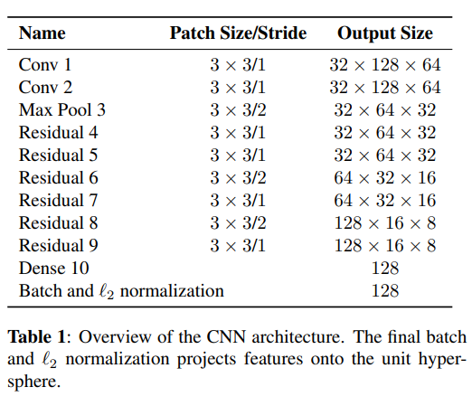

<div align=center></div>

# deep sort

[Simple Online and Realtime Tracking with a Deep Association Metric](https://arxiv.org/abs/1703.07402)

## Code Source
```
link: https://github.com/ZQPei/deep_sort_pytorch/tree/master
branch: master
commit: 8cfe2467a4b1f4421ebf9fcbc157921144ffe7cf
```

## Model Arch

deepsort算法对每一帧的处理流程如下：

> 检测器得到bbox → 生成detections进行特征提取 → 卡尔曼滤波预测 → 使用匈牙利算法将预测后的tracks和当前帧中的detecions进行匹配（级联匹配和IOU匹配） → 卡尔曼滤波更新

> Frame 0：检测器检测到了3个detections，当前没有任何tracks，将这3个detections初始化为tracks

> Frame 1：检测器又检测到了3个detections，对于Frame 0中的tracks，先进行预测得到新的tracks，然后使用匈牙利算法将新的tracks与detections进行匹配，得到(track, detection)匹配对，最后用每对中的detection更新对应的track

其中，检测器可以选用任意检测算法，这一部分在该文档中不做详细说明，主要介绍特征提取模型模块，模型结构如下

<div align=center></div>

### pre-processing

deep sort算法中特征提取网络的预处理操作可以按照如下步骤进行，即先对图片进行resize至128*64的尺寸，然后对其进行归一化、减均值除方差等操作

```python
[
    torchvision.transforms.ToTensor(),
    torchvision.transforms.Normalize(mean=[0.485, 0.456, 0.406], std=[0.229, 0.224, 0.225],),
]
```

### post-processing

deep sort算法中特征提取网络并没有什么后处理操作，网络输出即为检测框的特征向量

### backbone

deep sort算法中特征提取网络结构是由几层Residual层组成，最后接L2Norm层

### common

- L2norm

## Build_In Deploy

`DeepSort`跟踪算法中部署主要是对reid模型进行转换以及部署

### step.1 获取预训练模型
基于[DeepSort](https://github.com/ZQPei/deep_sort_pytorch/tree/master)项目对reid模型转换至onnx格式以及torchscript格式，可基于脚本[export.py](./source_code/export.py)进行转换

```
python export.py
```
- `export.py`文件放置于`deepsort/deep_sort_pytorch/deep_sort/deep`目录下

### step.2 准备数据集
- [校准数据集](https://motchallenge.net/)

### step.3 模型转换
1. 根据具体模型，修改编译配置
    - [official_deepsort.yaml](./build_in/build/official_deepsort.yaml)
    
    > - runstream推理，编译参数`backend.type: tvm_vacc`
    > - fp16精度: 编译参数`backend.dtype: fp16`
    > - int8精度: 编译参数`backend.dtype: int8`，需要配置量化数据集和预处理算子

2. 模型编译

    ```bash
    cd deep_sort
    mkdir workspace
    cd workspace
    vamc compile ./build_in/build/official_deepsort.yaml
    ```

### step.4 模型推理
1. runstream
    - 参考：[vsx.py](./build_in/vsx/python/vsx.py)
    ```bash
    python ./build_in/vsx/python/vsx.py \
        --image_dir  /path/to/MOT17/test/MOT17-01-FRCNN/img1/  \
        --model_prefix_path deploy_weights/official_deepsort_run_stream_int8/mod \
        --vdsp_params_info ./build_in/vdsp_params/official-deepsort-vdsp_params.json \
        --device 0
    ```

### step.5 性能测试
**Note:** 基于`tracking by detection`的多目标跟踪算法包括检测、track两个流程，modelzoo只提供reid算法模型的性能测试，整体pipeline需结合检测、跟踪模块进行测试

1. 性能测试
    ```bash
    vamp -m deploy_weights/official_deepsort_run_stream_int8/mod --vdsp_params ./build_in/vdsp_params/official-deepsort-vdsp_params.json -i 1 -b 1 -d 0 -p 1
    ```

### Tips
- 本示例仅对deepsort跟踪算法的REID部分进行了模型转换/vacc推理等操作，在实际使用时还需要结合检测、跟踪模块进行测试。

